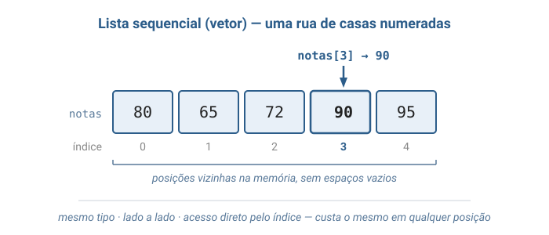
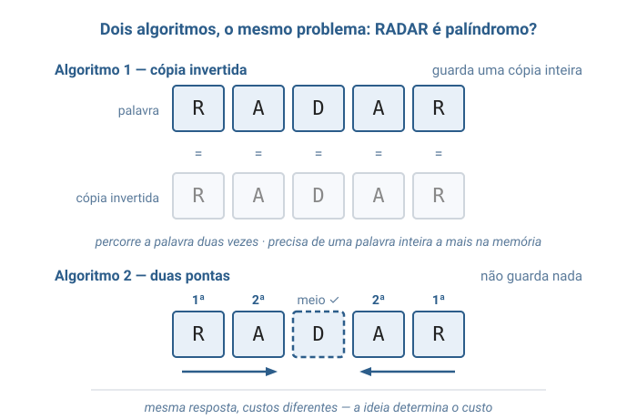
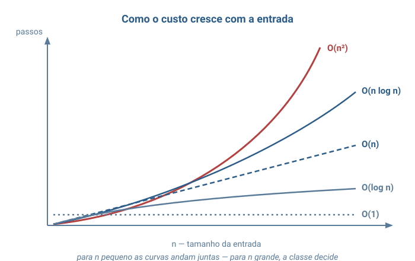

# Aula 01 — Conceitos de Algoritmos, Estruturas de Dados e Complexidade

> **Tipo desta aula**: conceitual. Esta é a aula de abertura da disciplina: ela apresenta as três ideias — algoritmo, estrutura de dados e complexidade — que servirão de vocabulário para **todas** as aulas seguintes, e as duas bases práticas sobre as quais tudo será construído: a **linguagem C** e a **lista sequencial (vetor)**. Não há programa completo em C aqui — apenas trechos curtos; a notação necessária aos exercícios é apresentada na própria aula.

---

## 1. Conceito — Aprofundamento Progressivo

### Camada 1 — Introdução

Imagine que você precisa ensinar alguém a preparar um café — mas essa pessoa segue instruções **ao pé da letra** e não improvisa absolutamente nada. Se você disser "coloque água quente no pó", ela vai perguntar: quanta água? Quente quanto? Em que recipiente? Você seria obrigado a escrever uma sequência de passos tão clara, tão completa e tão sem ambiguidade que **qualquer pessoa** (ou qualquer máquina) chegaria ao mesmo café no final. A humanidade escreve instruções assim há milênios: receitas de cozinha, partituras musicais, manuais de montagem, moldes de costura. Em todas elas há uma mesma ideia escondida: **a inteligência está na instrução, não no executor**. O executor só precisa seguir os passos — e é exatamente isso que um computador faz.

### Camada 2 — Definição informal com vocabulário básico

Essa ideia milenar tem nome: **algoritmo** (*algorithm*) — uma sequência **finita** de passos **não ambíguos** que transforma **entradas** em **saídas**. A palavra vem do nome de **al-Khwarizmi**, matemático persa do século IX cujos livros de aritmética e álgebra chegaram à Europa medieval; do título de uma de suas obras também herdamos a palavra "álgebra". Mas a ideia é ainda mais antiga: o algoritmo de **Euclides** para calcular o máximo divisor comum de dois números aparece nos *Elementos*, por volta de 300 a.C., e funciona até hoje, inalterado. Em 1843, **Ada Lovelace** publicou, em suas notas sobre a Máquina Analítica de Charles Babbage, o que é frequentemente considerado o primeiro algoritmo escrito para ser executado por uma máquina — antes mesmo de existir uma máquina capaz de executá-lo.

O salto filosófico decisivo veio em 1936, quando **Alan Turing** publicou o artigo *On Computable Numbers*. Turing propôs uma máquina imaginária de uma simplicidade radical — uma fita, um cabeçote de leitura e escrita, e uma tabela de regras — e mostrou que **tudo o que pode ser calculado por um procedimento mecânico pode ser calculado por essa máquina**. Com isso, "computar" deixou de ser uma noção vaga e ganhou definição matemática precisa: computar é executar um algoritmo. Todo computador que você já usou — do celular ao supercomputador — é, em essência, uma encarnação física dessa máquina de Turing. Décadas depois, **Alan Kay** — criador do Smalltalk, pioneiro da programação orientada a objetos e das interfaces gráficas modernas, Prêmio Turing de 2003 — resumiu o espírito dessa área com a frase que lhe é atribuída: *"a melhor maneira de prever o futuro é inventá-lo"*. Para Kay, o computador não é uma calculadora grande: é um **meio de expressão**, como o papel ou o filme — e o algoritmo é a linguagem desse meio.

Falta a segunda metade da história. Um algoritmo opera sobre dados, e dados precisam estar **organizados** de alguma forma: essa organização é a **estrutura de dados** (*data structure*) — um arranjo dos dados na memória, junto com as operações permitidas sobre eles, projetado para tornar certos acessos e modificações baratos (ver o capítulo introdutório de Backes; Veloso & Pereira desenvolvem a mesma ideia no capítulo de abertura). A relação entre as duas coisas é tão íntima que **Niklaus Wirth** — criador da linguagem Pascal — batizou seu livro clássico, presente na bibliografia desta disciplina, com uma equação: ***Algoritmos + Estruturas de Dados = Programas***. Por fim, para comparar algoritmos entre si usamos a **análise de complexidade** (*complexity analysis*): a medida de quanto **tempo** (número de passos) e quanto **espaço** (memória adicional) um algoritmo consome à medida que a entrada cresce (Toscani & Veloso, capítulos iniciais). A ferramenta que dará corpo a tudo isso será a **linguagem C**, apresentada logo adiante nesta mesma aula.

Note o que um algoritmo **não** é:

- **Não é código-fonte.** O algoritmo existe antes de qualquer linguagem de programação — o de Euclides tem 2.300 anos; C tem cerca de 50. Código é a *escrita* de um algoritmo numa linguagem específica.
- **Não aceita ambiguidade.** "Tempere a gosto" serve numa receita para humanos, mas não é passo de algoritmo — cada passo precisa ter exatamente uma interpretação.
- **Não pode rodar para sempre.** Uma sequência de passos que nunca termina para alguma entrada válida não é um algoritmo — é um procedimento que falha na propriedade de finitude.

### Camada 3 — Propriedades e comportamento

#### As cinco propriedades de um algoritmo

A literatura clássica enumera cinco propriedades que uma sequência de passos precisa ter para merecer o nome de algoritmo:

- **Finitude** — termina após um número finito de passos, para toda entrada válida.
- **Definitude** — cada passo é definido com precisão, sem dupla interpretação.
- **Entradas** — zero ou mais valores fornecidos antes ou durante a execução.
- **Saídas** — um ou mais resultados produzidos ao final, com relação definida com as entradas.
- **Efetividade** — cada passo é básico o suficiente para ser executado mecanicamente, sem criatividade ou julgamento.

Repare que a máquina de café da Camada 1 testava exatamente isso: quando a instrução falha em definitude ("água quente" — quente quanto?), o executor literal trava. É por isso que programar é, antes de tudo, um exercício de **precisão de pensamento** — o computador não completa lacunas.

#### A ferramenta da disciplina: a linguagem C

Para escrever algoritmos que um computador execute, precisamos de uma linguagem. A desta disciplina é a **linguagem C**, criada por **Dennis Ritchie** nos Laboratórios Bell, no início dos anos 1970, para escrever o sistema operacional **UNIX**. Meio século depois, C continua em toda parte: o núcleo do Linux, o interpretador do Python e boa parte da infraestrutura que roda o mundo são escritos em C. É uma linguagem pequena e explícita — cada passo aparece no código, sem atalhos escondidos —, o que a torna ideal para **enxergar o custo** dos algoritmos (Schildt, *C Completo e Total*; Damas, *Linguagem C*).

Quatro peças bastam para começar. A primeira: **tipos básicos** — em C, todo dado tem um tipo declarado, que diz o que ele guarda:

```c
int    idade  = 20;      /* numero inteiro                */
float  altura = 1.75;    /* numero com casas decimais     */
double preco  = 19.90;   /* decimal com mais precisao     */
char   letra  = 'A';     /* um unico caractere            */
```

A segunda: **funções** (*functions*) — blocos nomeados que recebem entradas e devolvem uma saída. Repare: é exatamente a cara de um algoritmo.

```c
int soma(int a, int b) {
    return a + b;
}
```

Lê-se: `soma` recebe dois inteiros, `a` e `b`, e devolve (`return`) um resultado; o tipo à esquerda do nome (`int`) é o tipo da resposta.

A terceira: **condicionais** — escolher entre caminhos conforme uma condição. (`printf` é a função que escreve na tela.)

```c
if (idade >= 18) {
    printf("maior de idade");
} else {
    printf("menor de idade");
}
```

A quarta: **laços de repetição** — repetir passos enquanto uma condição valer. O `while` repete enquanto a condição for verdadeira; o `for` empacota início, condição e avanço em uma única linha:

```c
int i = 0;
while (i < 5) {           /* repete com i = 0, 1, 2, 3, 4 */
    printf("%d ", i);
    i = i + 1;
}

for (int i = 0; i < 5; i = i + 1) {   /* o mesmo, em uma linha */
    printf("%d ", i);
}
```

É deliberadamente só o essencial — cada recurso será aprofundado nas aulas de implementação, quando os algoritmos ganharem código completo.

#### A primeira estrutura de dados: a lista sequencial (vetor)

Nosso primeiro jeito de organizar dados é o mais direto que existe: a **lista sequencial**, que em C toma a forma do **vetor** (*array*) — uma fileira de elementos **do mesmo tipo**, guardados **lado a lado** na memória, cada um com um número de posição chamado **índice** (*index*). Em Backes, ver o capítulo de vetores; Veloso & Pereira tratam a mesma ideia como lista sequencial.

```c
int notas[5];       /* lista sequencial com 5 posicoes          */
notas[0] = 80;      /* primeira posicao — indices comecam em 0! */
notas[4] = 95;      /* ultima posicao valida (0 a 4)            */

char palavra[] = "radar";   /* uma palavra e um vetor de caracteres */
```

Pense numa rua de casas numeradas: sabendo o número, você vai direto à casa certa, sem bater de porta em porta. No vetor é igual — acessar `notas[3]` custa o mesmo com 5 posições ou com 5 milhões, porque a posição é **calculada** a partir do índice, não procurada. Esse **acesso direto** é o superpoder da lista sequencial, e o motivo de ela ser a estrutura dos nossos primeiros algoritmos.

Há um preço. O tamanho é **fixo**, definido na criação; todos os elementos são do mesmo tipo; e inserir um elemento no meio obriga a empurrar todos os seguintes uma posição para o lado — a fileira não tem espaços vazios. Guardem essa limitação: é ela que motivará as **listas encadeadas**, algumas aulas adiante.

#### Definição formal e o que separa o array de C

Podemos agora dizer com precisão o que é um vetor. Um **array** de tamanho `n` é uma coleção de `n` elementos **do mesmo tipo**, numerados de `0` a `n − 1`, guardados em posições **consecutivas** da memória. As três exigências não são decoração — cada uma tem uma função: **mesmo tipo** garante que toda posição ocupe exatamente o mesmo espaço; posições **consecutivas** garantem que não haja buracos entre um elemento e o seguinte; e a **numeração a partir de 0** é o que amarra cada índice a uma posição (a próxima seção mostra por que começa em zero).

É aqui que o array de C se separa do que linguagens como **Python** e **JavaScript** também chamam de "array" ou "lista". Nelas, você pode misturar tipos numa mesma coleção (`[1, "dois", 3.0]`), crescer e encolher a qualquer momento, e o interpretador cuida de tudo por baixo dos panos. Essa comodidade tem custo: por dentro, essas estruturas guardam informação extra de controle e, com frequência, uma fileira de **referências** — endereços que apontam para os valores espalhados pela memória — em vez dos valores realmente lado a lado.

O array de C é o osso nu por baixo dessa comodidade: **tamanho fixo**, **um único tipo**, valores **de fato consecutivos** na memória e **sem rede de proteção** — se você pedir `notas[7]` num vetor de 5 posições, C não reclama; simplesmente lê o que estiver naquele endereço. É justamente essa crueza que faz o array de C mapear direto na memória do computador, e é por isso que ele é o ponto de partida ideal para enxergar o custo real das operações. As estruturas "espertas" de Python e JavaScript são construídas **em cima** de arrays simples como este.

#### Do índice ao endereço: a conta que o computador faz

Prometemos que acessar `notas[3]` custa o mesmo que acessar `notas[0]`, por maior que seja o vetor. Agora dá para ver por quê. Pense na memória RAM como uma **tabela gigante de gavetas numeradas**: cada gaveta tem um **endereço** (o seu número) e guarda uma quantidade **fixa** de bytes — o *byte* é a unidade básica em que a memória é medida. Um `int`, por exemplo, ocupa tipicamente 4 bytes; um `char`, 1 byte.

Quando você declara `int notas[5]`, o computador reserva 5 blocos consecutivos e guarda **um** valor de referência: o **endereço-base**, onde o vetor começa. Digamos que seja o endereço 1000. Como cada `int` ocupa 4 bytes, os elementos caem assim:

| Elemento   | Conta          | Endereço |
|------------|----------------|----------|
| `notas[0]` | 1000 + 0 × 4   | 1000     |
| `notas[1]` | 1000 + 1 × 4   | 1004     |
| `notas[2]` | 1000 + 2 × 4   | 1008     |
| `notas[3]` | 1000 + 3 × 4   | 1012     |
| `notas[4]` | 1000 + 4 × 4   | 1016     |

A regra é uma fórmula só:

```
endereço de notas[i]  =  endereço-base  +  i × tamanho do tipo
```

Para chegar em `notas[3]`, o computador **não** percorre `notas[0]`, `notas[1]`, `notas[2]` — ele faz **uma** multiplicação e **uma** soma e vai direto à gaveta 1012. Essa conta tem o mesmo custo para `i = 3` ou `i = 3.000.000`: sempre uma multiplicação e uma soma. Eis, enfim, a origem do **O(1)** que a lista sequencial oferece — e também a razão de os índices começarem em **0**: o primeiro elemento fica exatamente no endereço-base, sem deslocamento (`base + 0 × tamanho`).

#### O mesmo problema, vários algoritmos

Com a linguagem e a primeira estrutura na mão, considere um problema simples: decidir se uma palavra — guardada num vetor de caracteres — é um **palíndromo** (*palindrome*): uma palavra que se lê igual da esquerda para a direita e da direita para a esquerda, como *arara*, *radar* e *ovo*. Dois algoritmos diferentes resolvem:

- **Algoritmo da cópia invertida**: construir uma segunda palavra com as letras na ordem inversa e, ao final, comparar as duas, letra por letra. Percorre a palavra duas vezes e precisa de memória para guardar a cópia inteira.
- **Algoritmo das duas pontas**: comparar a primeira letra com a última; se forem iguais, avançar uma posição de cada lado e repetir, caminhando das pontas para o centro. Se chegar ao meio sem encontrar diferença, é palíndromo. Faz metade das comparações e não guarda cópia nenhuma — apenas duas posições.

Mesma pergunta, mesma entrada, mesma resposta — custos diferentes. E repare: nenhum dos dois é "o certo" em absoluto. O das duas pontas ganha em memória e em comparações; o da cópia é mais fácil de escrever e de conferir. Escolher algoritmo é **comparar custos** — e é exatamente para isso que serve a análise de complexidade que vem adiante.

#### Dois lados da mesma moeda

O algoritmo das duas pontas esconde uma dependência importante: ele **só funciona porque a palavra está guardada numa estrutura que dá acesso direto à última posição** (um vetor de caracteres). Se as letras chegassem uma a uma, como numa transmissão, não haveria "última letra" para consultar — seria preciso armazenar tudo antes de começar. A estrutura de dados escolhida determina quais algoritmos são viáveis — e a que custo. **Não existe organização perfeita: existe a organização certa para o padrão de uso.** Essa troca (*trade-off*) é o fio condutor da disciplina inteira: cada estrutura que estudaremos — lista, pilha, fila, árvore, tabela hash — é uma resposta diferente à pergunta "o que você quer que seja barato?".

#### Propriedades que sempre valem

- ✅ Um algoritmo correto produz a saída especificada para **toda** entrada válida — não só para as entradas fáceis.
- ✅ O custo de um algoritmo é uma propriedade do **algoritmo**, não da máquina: trocar de computador muda o tempo em segundos, mas não muda o número de passos.
- ✅ A escolha da estrutura de dados **precede** a escolha do algoritmo: dados desorganizados limitam o que qualquer algoritmo consegue fazer.

### Camada 4 — Definição formal e notação

#### O algoritmo como objeto matemático

Formalmente, um algoritmo é um procedimento efetivo que computa uma **função**: para cada entrada válida $x$, ele produz em tempo finito a saída $f(x)$ especificada pelo problema. O modelo de Turing dá o rigor: descrições diferentes do que significa "procedimento mecânico" acabam abrangendo exatamente o mesmo conjunto de problemas calculáveis — é o que sustenta a chamada **Tese de Church-Turing**. Para esta disciplina, o que importa é a consequência prática: podemos contar **passos** de um algoritmo sem nos preocupar com a máquina que vai executá-lo.

#### A notação Big O

Contar passos exatos é frágil (depende de detalhes de escrita do algoritmo), então a análise de complexidade usa uma lente deliberadamente desfocada: a **notação assintótica Big O** (*Big O notation*), que captura o **ritmo de crescimento** do custo quando a entrada cresce (Toscani & Veloso, capítulos iniciais). A definição formal:

```
Definição (Big O)

Sejam f e g funções de n (tamanho da entrada) em números não negativos.

  f(n) = O(g(n))

se, e somente se, existem constantes c > 0 e n0 >= 1 tais que:

  f(n) <= c * g(n)    para todo n >= n0

Leitura: "a partir de certo tamanho de entrada (n0), f nunca cresce
mais rápido que g, a menos de uma constante multiplicativa (c)".
```

Exemplo concreto: se um algoritmo executa $f(n) = 3n + 5$ passos, então $f(n) = O(n)$. Prova: escolha $c = 4$ e $n_0 = 5$; para todo $n \ge 5$ vale $3n + 5 \le 4n$. As constantes e os termos menores desaparecem de propósito — Big O responde apenas "**como o custo escala?**": dobrar a entrada dobra o trabalho? Quadruplica? Não muda nada?

A mesma notação mede duas grandezas independentes:

- **Complexidade de tempo** — quantos passos o algoritmo executa em função de $n$.
- **Complexidade de espaço** — quanta memória **adicional** (além da própria entrada) ele usa em função de $n$.

Um algoritmo pode ser rápido e gastar muita memória, ou econômico em memória e lento — mais um *trade-off*, o mesmo tema da Camada 3 em outra escala.

### Camada 5 — Análise de complexidade

As classes de crescimento mais comuns, ordenadas da mais lenta para a mais explosiva — com o número aproximado de passos para uma entrada de $n = 1.000$:

| Classe       | Nome usual    | Passos para n = 1.000 | Exemplo típico                            |
|--------------|---------------|------------------------|--------------------------------------------|
| O(1)         | constante     | 1                      | acessar uma posição de um vetor            |
| O(log n)     | logarítmica   | ~10                    | descartar metade dos candidatos a cada passo |
| O(n)         | linear        | 1.000                  | verificar um palíndromo; percorrer uma lista |
| O(n log n)   | linearítmica  | ~10.000                | bons algoritmos de ordenação               |
| O(n²)        | quadrática    | 1.000.000              | comparar todos os pares; laços aninhados   |
| O(2ⁿ)        | exponencial   | ~10³⁰¹                 | testar todos os subconjuntos               |

A tabela explica por que a análise assintótica importa mais do que a velocidade do computador. Suponha uma máquina que executa 100 milhões de passos por segundo e uma entrada de $n = 1.000.000$: um algoritmo $O(n \log n)$ termina em cerca de **0,2 segundo**; um $O(n^2)$, na mesma máquina, leva cerca de **10.000 segundos — quase 3 horas**. Nenhum hardware compra de volta essa diferença: contra um crescimento quadrático, um computador 10 vezes mais rápido apenas adia o problema para uma entrada 3 vezes maior.

O espaço segue o mesmo raciocínio — e o palíndromo da Camada 3 já mostrou o contraste: o algoritmo da cópia invertida gasta $O(n)$ de memória adicional (a cópia inteira); o das duas pontas gasta $O(1)$ (duas posições, qualquer que seja o tamanho da palavra). Ambos são $O(n)$ em tempo; a diferença aparece só na segunda medida, e é ela que decide qual algoritmo cabe na memória quando a entrada é grande.

### Camada 6 — Conexões e variantes

Este vocabulário — algoritmo, estrutura, custo — reaparece em **todas** as aulas da disciplina:

- **Listas encadeadas**: inserir no início custa O(1); buscar custa O(n).
- **Pilhas e filas**: estruturas onde todas as operações principais custam O(1) — a restrição de acesso é o preço da velocidade.
- **Algoritmos de busca** (linear e binária): tema de capítulo próprio adiante — lá o "descartar metade a cada passo" da tabela ganha nome e código.
- **Árvores de busca**: encontram um valor descartando metade dos candidatos a cada passo — O(log n).
- **Tabelas hash**: buscam em O(1) no caso médio, apostando em espalhamento.
- **Ordenação**: o caminho de O(n²) para O(n log n) é uma das histórias mais bonitas da área.
- **Inteligência artificial**: uma IA como as atuais **não é um algoritmo — é uma composição de muitos**. Gerar uma única palavra de resposta encadeia algoritmos de tokenização (fatiar o texto), multiplicações de matrizes, atenção (decidir que trechos do texto pesam mais) e amostragem (escolher a próxima palavra) — e a complexidade de cada elo decide se a resposta chega em segundos. A fronteira da computação hoje continua sendo, no fundo, o assunto desta aula: fazer o mesmo trabalho com menos passos.

Há variantes da própria análise que apenas sinalizamos aqui: além do **pior caso** (o padrão nesta disciplina), analisam-se o **caso médio** e o **melhor caso**; e além do teto O(·) existem notações para piso (Ω) e para ritmo exato (Θ) — Toscani & Veloso as desenvolvem com rigor. Elas aparecerão naturalmente quando compararmos algoritmos de ordenação.

---

## 2. Visualização Gráfica

Seis diagramas constroem o mapa conceitual da aula: o algoritmo como transformador, a equação de Wirth, a lista sequencial, o índice virando endereço na memória, dois algoritmos para o mesmo problema e as curvas de crescimento.

### Passo 1: O algoritmo como transformador


Entradas à esquerda, saídas à direita, e no meio uma sequência finita e ordenada de passos — a imagem mental mínima que vale para o algoritmo de Euclides e para uma IA.

### Passo 2: A equação de Wirth


Um programa é a soma das duas metades da disciplina: a receita (algoritmo) e a organização dos ingredientes (estrutura de dados). Nenhuma das metades funciona sozinha.

### Passo 3: A lista sequencial



A rua de casas numeradas: elementos do mesmo tipo, lado a lado, cada um com seu índice. A seta mostra o acesso direto — `notas[3]` chega à casa certa sem passar pelas anteriores.

### Passo 4: Do índice ao endereço

![Memória RAM como gavetas numeradas, com o cálculo do endereço de notas[3]](img/04_indice_para_endereco.svg)

A memória vista como gavetas de endereço fixo, cada `int` ocupando 4 bytes. A conta `endereço-base + i × tamanho` leva direto à gaveta certa — a origem concreta do O(1) do acesso por índice.

### Passo 5: Dois algoritmos, um problema



A mesma palavra, dois caminhos: a cópia invertida percorre tudo duas vezes e guarda uma palavra inteira a mais; as duas pontas caminham para o centro sem guardar nada. Contar comparações e memória de cada lado é ver a complexidade a olho nu.

### Passo 6: As curvas de crescimento



As classes da tabela da Camada 5 desenhadas no mesmo plano: para n pequeno as curvas andam juntas; conforme n cresce, elas se separam — e a quadrática dispara. O eixo horizontal é o tamanho da entrada; o vertical, o número de passos.

---

## 3. Problema Motivador

> *"Como uma IA como o ChatGPT gera cada palavra da resposta em fração de segundo, se para isso ela precisa executar bilhões de operações?"*

Não há mágica: há engenharia de algoritmos em cada camada. Quando você envia uma pergunta, o texto é fatiado em pedaços por um algoritmo de tokenização; esses pedaços viram números guardados lado a lado na memória, em vetores como o que você acabou de conhecer; bilhões de multiplicações são executadas por algoritmos de álgebra linear obsessivamente otimizados; um algoritmo de atenção decide quais trechos da conversa importam para a próxima palavra; e um algoritmo de amostragem escolhe, entre dezenas de milhares de candidatas, a palavra seguinte. Esse ciclo inteiro se repete **para cada palavra da resposta**. Se qualquer elo dessa corrente tivesse complexidade descontrolada, a resposta não chegaria em segundos — não chegaria nunca.

E a complexidade não é só bastidor: ela moldou o produto que você usa. Os algoritmos de atenção originais custam tempo **quadrático** no tamanho do texto — dobrar a conversa quadruplica o trabalho —, e por isso as primeiras versões dessas IAs tinham memória curta, esquecendo o início de conversas longas. Anos de pesquisa em algoritmos de atenção mais eficientes é que alargaram esse limite. A lição da disciplina inteira está aqui: **quem entende o custo dos algoritmos entende por que a tecnologia tem a forma que tem**.

O mesmo raciocínio explica tecnologias mais antigas e igualmente cotidianas: um buscador encontra uma página entre bilhões em décimos de segundo porque **não procura** — consulta estruturas de índice construídas com antecedência, trocando espaço por tempo; e o GPS do seu celular calcula a melhor rota entre milhões de cruzamentos porque usa algoritmos de caminho mínimo que descartam, com garantia matemática, quase todos os caminhos possíveis sem examiná-los.

---

## 4. Analogias

**1. A receita e a despensa.** Um algoritmo é uma receita: passos finitos, ordenados e precisos que transformam ingredientes em prato. A estrutura de dados é a despensa: a **mesma** receita executada numa cozinha com despensa organizada (cada ingrediente etiquetado no seu lugar) sai em metade do tempo da executada numa cozinha onde é preciso revirar caixas para achar o sal. A receita não mudou — a organização dos dados mudou o custo. E despensas diferentes servem a cozinhas diferentes: a organização ideal de uma cozinha de restaurante (acesso rápido ao que se usa a cada minuto) não é a de um estoque de mercado (inserção barata de carga nova).

**2. A partitura e a orquestra.** Uma partitura é um algoritmo: qualquer orquestra do mundo, seguindo-a fielmente, produz a mesma sinfonia — a inteligência está na escrita, não na execução, exatamente como na máquina de Turing. Mas repare no que a partitura exige do executor: as instruções precisam ser **efetivas** (um músico consegue tocar uma nota; "toque algo emocionante" não é instrução) e **definidas** (a mesma marca sempre significa a mesma coisa). Quando Beethoven compôs sinfonias já surdo, provou sem querer o princípio de Turing com um século de antecedência: quem escreve o procedimento não precisa executá-lo — e o procedimento sobrevive ao seu autor.

---

## 5. Exercícios Práticos

**Exercício 1 — Palíndromo na mão.**
Considere a palavra `RADAR` (posições 0 a 4). Execute o algoritmo das duas pontas passo a passo: em cada passo, anote a posição da esquerda (`i`), a posição da direita (`j`), as letras comparadas e a decisão tomada. Ao final, responda: quantas comparações o algoritmo fez? E quantas faria, no máximo, para uma palavra de 1.000 letras?

*Critério de aceitação*: tabela com as posições, as letras e a decisão de cada passo; as duas contagens finais.

> **Resposta mínima aceitável**
>
> | Passo | i | j | Letras | Decisão |
> |-------|---|---|--------|---------|
> | 1     | 0 | 4 | R = R  | iguais → avança: `i = 1`, `j = 3` |
> | 2     | 1 | 3 | A = A  | iguais → avança: `i = 2`, `j = 2` |
> | —     | 2 | 2 | —      | `i` e `j` se encontraram no meio → **é palíndromo** |
>
> Foram **2 comparações** (metade de 5, descartando a letra do meio, que não precisa de par). Para 1.000 letras: no máximo **500 comparações** — sempre metade do tamanho, e o ritmo continua O(n).

**Exercício 2 — Desafio: Two Sum (a soma de dois).**
Um problema clássico da computação: dado um vetor de números e um valor **alvo**, encontrar **duas posições** cujos valores, somados, dão o alvo. O algoritmo mais direto testa todos os pares com os dois laços aninhados que você acabou de conhecer:

```c
for (int i = 0; i < n; i = i + 1) {
    for (int j = i + 1; j < n; j = j + 1) {
        if (lista[i] + lista[j] == alvo) {
            printf("posicoes %d e %d", i, j);
            return 0;
        }
    }
}
```

Para o vetor `[4, 2, 7, 5]` e `alvo = 9`, execute o algoritmo na mão: liste os pares testados, na ordem, até encontrar a resposta. Depois responda: qual é a complexidade de **tempo** no pior caso? E por que **não** dá para usar o truque das duas pontas do palíndromo aqui?

*Critério de aceitação*: a lista ordenada dos pares testados até a resposta; a classe Big O do tempo; e a justificativa sobre as duas pontas.

> **Resposta mínima aceitável**
>
> | Par testado                    | Soma | Decisão                          |
> |--------------------------------|------|-----------------------------------|
> | `lista[0] + lista[1]` = 4 + 2  | 6    | ≠ 9                               |
> | `lista[0] + lista[2]` = 4 + 7  | 11   | ≠ 9                               |
> | `lista[0] + lista[3]` = 4 + 5  | 9    | **= 9 → posições 0 e 3**          |
>
> **Tempo: O(n²)** — no pior caso, os dois laços aninhados testam todos os pares (n·(n−1)/2).
> As **duas pontas não servem** aqui porque o vetor **não está ordenado**: se a soma das pontas dá diferente do alvo, não há como saber qual ponta mover para chegar mais perto. O truque do palíndromo funcionava por **posição** (comparar letras espelhadas), não por **valor**.

---

## 6. Referências

- **Backes, A. R.** — *Algoritmos e Estruturas de Dados em Linguagem C*. Rio de Janeiro: LTC, 2023. Capítulo introdutório — apresenta algoritmos e estruturas de dados no contexto da linguagem C que usaremos em todas as aulas de implementação.
- **Veloso, P.; Pereira, S. do L.** — *Estruturas de Dados em C — Uma Abordagem Didática*. São Paulo: Saraiva, 2016. Capítulo de abertura — a relação entre algoritmos, estruturas de dados e abstração, no mesmo espírito didático desta aula.
- **Toscani, L. V.; Veloso, P. A. S.** — *Complexidade de Algoritmos*. Porto Alegre: Bookman, 2012. Capítulos iniciais — a fonte de rigor para a notação assintótica (Big O, Ω, Θ) apresentada nas Camadas 4 e 5.
- **Schildt, H.** — *C Completo e Total*. São Paulo: Makron Books, 1997. Capítulos iniciais — tipos, funções, condicionais, laços e vetores da linguagem C apresentados nesta aula.

**Leituras complementares**:

- **Wirth, N.** — *Algoritmos e Estruturas de Dados*. Rio de Janeiro: LTC, 1999. O livro cuja equação-título — *Algoritmos + Estruturas de Dados = Programas* — resume esta aula.
- **Damas, L.** — *Linguagem C*. 10ª ed. Rio de Janeiro: LTC, 2023. Aprofundamento na linguagem C, no mesmo espírito introdutório.
- **Turing, A. M.** — *On Computable Numbers, with an Application to the Entscheidungsproblem* (1936). O artigo que deu à computação sua definição matemática — leitura histórica para os curiosos.
