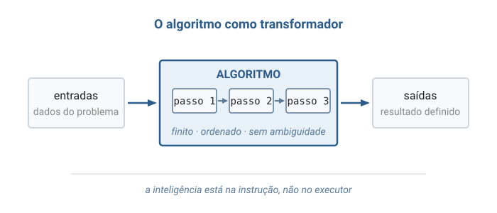
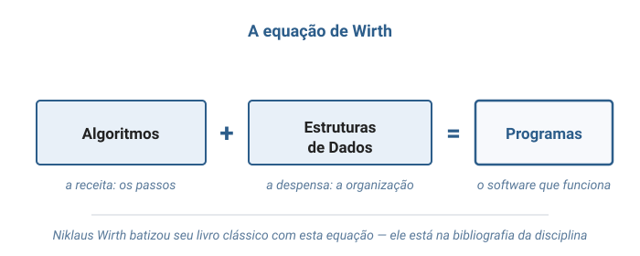
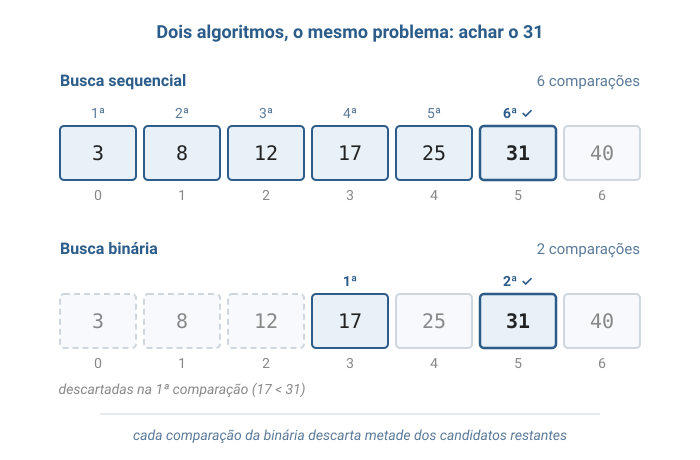

# Aula 01 — Conceitos de Algoritmos, Estruturas de Dados e Complexidade

> **Tipo desta aula**: conceitual. Esta é a aula de abertura da disciplina: ela apresenta as três ideias — algoritmo, estrutura de dados e complexidade — que servirão de vocabulário para **todas** as aulas seguintes. Não há código C aqui; a notação necessária aos exercícios é apresentada na própria aula.

---

## 1. Conceito — Aprofundamento Progressivo

### Camada 1 — Introdução

Imagine que você precisa ensinar alguém a preparar um café — mas essa pessoa segue instruções **ao pé da letra** e não improvisa absolutamente nada. Se você disser "coloque água quente no pó", ela vai perguntar: quanta água? Quente quanto? Em que recipiente? Você seria obrigado a escrever uma sequência de passos tão clara, tão completa e tão sem ambiguidade que **qualquer pessoa** (ou qualquer máquina) chegaria ao mesmo café no final. A humanidade escreve instruções assim há milênios: receitas de cozinha, partituras musicais, manuais de montagem, moldes de costura. Em todas elas há uma mesma ideia escondida: **a inteligência está na instrução, não no executor**. O executor só precisa seguir os passos — e é exatamente isso que um computador faz.

### Camada 2 — Definição informal com vocabulário básico

Essa ideia milenar tem nome: **algoritmo** (*algorithm*) — uma sequência **finita** de passos **não ambíguos** que transforma **entradas** em **saídas**. A palavra vem do nome de **al-Khwarizmi**, matemático persa do século IX cujos livros de aritmética e álgebra chegaram à Europa medieval; do título de uma de suas obras também herdamos a palavra "álgebra". Mas a ideia é ainda mais antiga: o algoritmo de **Euclides** para calcular o máximo divisor comum de dois números aparece nos *Elementos*, por volta de 300 a.C., e funciona até hoje, inalterado. Em 1843, **Ada Lovelace** publicou, em suas notas sobre a Máquina Analítica de Charles Babbage, o que é frequentemente considerado o primeiro algoritmo escrito para ser executado por uma máquina — antes mesmo de existir uma máquina capaz de executá-lo.

O salto filosófico decisivo veio em 1936, quando **Alan Turing** publicou o artigo *On Computable Numbers*. Turing propôs uma máquina imaginária de uma simplicidade radical — uma fita, um cabeçote de leitura e escrita, e uma tabela de regras — e mostrou que **tudo o que pode ser calculado por um procedimento mecânico pode ser calculado por essa máquina**. Com isso, "computar" deixou de ser uma noção vaga e ganhou definição matemática precisa: computar é executar um algoritmo. Todo computador que você já usou — do celular ao supercomputador — é, em essência, uma encarnação física dessa máquina de Turing. Décadas depois, **Alan Kay** — criador do Smalltalk, pioneiro da programação orientada a objetos e das interfaces gráficas modernas, Prêmio Turing de 2003 — resumiu o espírito dessa área com a frase que lhe é atribuída: *"a melhor maneira de prever o futuro é inventá-lo"*. Para Kay, o computador não é uma calculadora grande: é um **meio de expressão**, como o papel ou o filme — e o algoritmo é a linguagem desse meio.

Falta a segunda metade da história. Um algoritmo opera sobre dados, e dados precisam estar **organizados** de alguma forma: essa organização é a **estrutura de dados** (*data structure*) — um arranjo dos dados na memória, junto com as operações permitidas sobre eles, projetado para tornar certos acessos e modificações baratos (ver o capítulo introdutório de Backes; Veloso & Pereira desenvolvem a mesma ideia no capítulo de abertura). A relação entre as duas coisas é tão íntima que **Niklaus Wirth** — criador da linguagem Pascal — batizou seu livro clássico, presente na bibliografia desta disciplina, com uma equação: ***Algoritmos + Estruturas de Dados = Programas***. Por fim, para comparar algoritmos entre si usamos a **análise de complexidade** (*complexity analysis*): a medida de quanto **tempo** (número de passos) e quanto **espaço** (memória adicional) um algoritmo consome à medida que a entrada cresce (Toscani & Veloso, capítulos iniciais).

Note o que um algoritmo **não** é:

- **Não é código-fonte.** O algoritmo existe antes de qualquer linguagem de programação — o de Euclides tem 2.300 anos; C tem cerca de 50. Código é a *escrita* de um algoritmo numa linguagem específica.
- **Não aceita ambiguidade.** "Tempere a gosto" serve numa receita para humanos, mas não é passo de algoritmo — cada passo precisa ter exatamente uma interpretação.
- **Não pode rodar para sempre.** Uma sequência de passos que nunca termina para alguma entrada válida não é um algoritmo — é um procedimento que falha na propriedade de finitude.

### Camada 3 — Propriedades e comportamento

#### As cinco propriedades de um algoritmo

A literatura clássica enumera cinco propriedades que uma sequência de passos precisa ter para merecer o nome de algoritmo:

- **Finitude** — termina após um número finito de passos, para toda entrada válida.
- **Definitude** — cada passo é definido com precisão, sem dupla interpretação.
- **Entradas** — zero ou mais valores fornecidos antes ou durante a execução.
- **Saídas** — um ou mais resultados produzidos ao final, com relação definida com as entradas.
- **Efetividade** — cada passo é básico o suficiente para ser executado mecanicamente, sem criatividade ou julgamento.

Repare que a máquina de café da Camada 1 testava exatamente isso: quando a instrução falha em definitude ("água quente" — quente quanto?), o executor literal trava. É por isso que programar é, antes de tudo, um exercício de **precisão de pensamento** — o computador não completa lacunas.

#### O mesmo problema, vários algoritmos

Um mesmo problema quase sempre admite **mais de um** algoritmo, e a diferença entre eles pode ser brutal. Considere procurar um nome numa lista com 1.000.000 de entradas:

- **Busca sequencial**: examinar a lista do início ao fim, um nome por vez. No pior caso, 1.000.000 de comparações.
- **Busca binária** (exige a lista **ordenada**): olhar o nome do meio; se o procurado vem antes, descartar a metade de trás; se vem depois, descartar a metade da frente; repetir. Cada passo elimina metade do que resta — bastam cerca de **20 comparações** para 1.000.000 de nomes.

Mesmo problema, mesma entrada, mesma resposta — e uma diferença de 50.000 vezes no trabalho realizado. Essa diferença não vem de um computador mais rápido: vem de uma **ideia melhor**.

#### Dois lados da mesma moeda

O exemplo acima esconde uma dependência importante: a busca binária **só é possível porque a lista está ordenada**. A estrutura de dados escolhida determina quais algoritmos são viáveis — e a que custo. Guardar os dados sem ordem torna a inserção barata e a busca cara; mantê-los ordenados encarece a inserção e barateia a busca. **Não existe organização perfeita: existe a organização certa para o padrão de uso.** Essa troca (*trade-off*) é o fio condutor da disciplina inteira: cada estrutura que estudaremos — lista, pilha, fila, árvore, tabela hash — é uma resposta diferente à pergunta "o que você quer que seja barato?".

#### Propriedades que sempre valem

- ✅ Um algoritmo correto produz a saída especificada para **toda** entrada válida — não só para as entradas fáceis.
- ✅ O custo de um algoritmo é uma propriedade do **algoritmo**, não da máquina: trocar de computador muda o tempo em segundos, mas não muda o número de passos.
- ✅ A escolha da estrutura de dados **precede** a escolha do algoritmo: dados desorganizados limitam o que qualquer algoritmo consegue fazer.

### Camada 4 — Definição formal e notação

#### O algoritmo como objeto matemático

Formalmente, um algoritmo é um procedimento efetivo que computa uma **função**: para cada entrada válida $x$, ele produz em tempo finito a saída $f(x)$ especificada pelo problema. O modelo de Turing dá o rigor: qualquer formalização razoável de "procedimento mecânico" (máquinas de Turing, funções recursivas, cálculo lambda) computa exatamente a mesma classe de funções — evidência que sustenta a chamada **Tese de Church-Turing**. Para esta disciplina, o que importa é a consequência prática: podemos contar **passos** de um algoritmo sem nos preocupar com a máquina que vai executá-lo.

#### A notação Big O

Contar passos exatos é frágil (depende de detalhes de escrita do algoritmo), então a análise de complexidade usa uma lente deliberadamente desfocada: a **notação assintótica Big O** (*Big O notation*), que captura o **ritmo de crescimento** do custo quando a entrada cresce (Toscani & Veloso, capítulos iniciais). A definição formal:

```
Definição (Big O)

Sejam f e g funções de n (tamanho da entrada) em números não negativos.

  f(n) = O(g(n))

se, e somente se, existem constantes c > 0 e n0 >= 1 tais que:

  f(n) <= c * g(n)    para todo n >= n0

Leitura: "a partir de certo tamanho de entrada (n0), f nunca cresce
mais rápido que g, a menos de uma constante multiplicativa (c)".
```

Exemplo concreto: se um algoritmo executa $f(n) = 3n + 5$ passos, então $f(n) = O(n)$. Prova: escolha $c = 4$ e $n_0 = 5$; para todo $n \ge 5$ vale $3n + 5 \le 4n$. As constantes e os termos menores desaparecem de propósito — Big O responde apenas "**como o custo escala?**": dobrar a entrada dobra o trabalho? Quadruplica? Não muda nada?

A mesma notação mede duas grandezas independentes:

- **Complexidade de tempo** — quantos passos o algoritmo executa em função de $n$.
- **Complexidade de espaço** — quanta memória **adicional** (além da própria entrada) ele usa em função de $n$.

Um algoritmo pode ser rápido e gastar muita memória, ou econômico em memória e lento — mais um *trade-off*, o mesmo tema da Camada 3 em outra escala.

### Camada 5 — Análise de complexidade

As classes de crescimento mais comuns, ordenadas da mais lenta para a mais explosiva — com o número aproximado de passos para uma entrada de $n = 1.000$:

| Classe       | Nome usual    | Passos para n = 1.000 | Exemplo típico                          |
|--------------|---------------|------------------------|------------------------------------------|
| O(1)         | constante     | 1                      | acessar uma posição de um vetor          |
| O(log n)     | logarítmica   | ~10                    | busca binária em lista ordenada          |
| O(n)         | linear        | 1.000                  | busca sequencial                         |
| O(n log n)   | linearítmica  | ~10.000                | bons algoritmos de ordenação             |
| O(n²)        | quadrática    | 1.000.000              | comparar todos os pares; laços aninhados |
| O(2ⁿ)        | exponencial   | ~10³⁰¹                 | testar todos os subconjuntos             |

A tabela explica por que a análise assintótica importa mais do que a velocidade do computador. Suponha uma máquina que executa 100 milhões de passos por segundo e uma entrada de $n = 1.000.000$: um algoritmo $O(n \log n)$ termina em cerca de **0,2 segundo**; um $O(n^2)$, na mesma máquina, leva cerca de **10.000 segundos — quase 3 horas**. Nenhum hardware compra de volta essa diferença: contra um crescimento quadrático, um computador 10 vezes mais rápido apenas adia o problema para uma entrada 3 vezes maior.

O espaço segue o mesmo raciocínio. Para inverter um vetor de $n$ elementos, um algoritmo pode criar uma cópia invertida — custo $O(n)$ de memória adicional — ou trocar os elementos das pontas em direção ao centro, usando apenas uma variável auxiliar — custo $O(1)$. Ambos são $O(n)$ em tempo; a diferença aparece só na segunda medida, e é ela que decide qual cabe na memória quando $n$ é grande.

### Camada 6 — Conexões e variantes

Este vocabulário — algoritmo, estrutura, custo — reaparece em **todas** as aulas da disciplina:

- **Listas encadeadas**: inserir no início custa O(1); buscar custa O(n).
- **Pilhas e filas**: estruturas onde todas as operações principais custam O(1) — a restrição de acesso é o preço da velocidade.
- **Árvores de busca**: reduzem a busca a O(log n) — a busca binária transformada em estrutura permanente.
- **Tabelas hash**: buscam em O(1) no caso médio, apostando em espalhamento.
- **Ordenação**: o caminho de O(n²) para O(n log n) é uma das histórias mais bonitas da área.
- **Inteligência artificial**: uma IA como as atuais **não é um algoritmo — é uma composição de muitos**. Gerar uma única palavra de resposta encadeia algoritmos de tokenização (fatiar o texto), bilhões de multiplicações de matrizes, algoritmos de atenção (decidir que trechos do texto pesam mais) e de amostragem (escolher a próxima palavra). E a complexidade governa até o produto: os algoritmos de atenção originais custam tempo quadrático no tamanho do texto — eis por que as primeiras versões dessas IAs só conseguiam "ler" textos curtos de uma vez. A fronteira da computação em 2026 continua sendo, no fundo, o assunto desta aula: fazer o mesmo trabalho com menos passos.

Há variantes da própria análise que apenas sinalizamos aqui: além do **pior caso** (o padrão nesta disciplina), analisam-se o **caso médio** e o **melhor caso**; e além do teto O(·) existem notações para piso (Ω) e para ritmo exato (Θ) — Toscani & Veloso as desenvolvem com rigor. Elas aparecerão naturalmente quando compararmos algoritmos de ordenação.

---

## 2. Visualização Gráfica

Quatro diagramas constroem o mapa conceitual da aula: o algoritmo como transformador, a equação de Wirth, dois algoritmos para o mesmo problema e as curvas de crescimento.

### Passo 1: O algoritmo como transformador



Entradas à esquerda, saídas à direita, e no meio uma sequência finita e ordenada de passos — a imagem mental mínima que vale para o algoritmo de Euclides e para uma IA.

### Passo 2: A equação de Wirth



Um programa é a soma das duas metades da disciplina: a receita (algoritmo) e a organização dos ingredientes (estrutura de dados). Nenhuma das metades funciona sozinha.

### Passo 3: Dois algoritmos, um problema



O mesmo vetor ordenado, o mesmo alvo: a busca sequencial visita elemento por elemento; a binária descarta metade do que resta a cada comparação. Contar os passos de cada lado é ver a complexidade a olho nu.

### Passo 4: As curvas de crescimento


As classes da tabela da Camada 5 desenhadas no mesmo plano: para n pequeno as curvas andam juntas; conforme n cresce, elas se separam — e a quadrática dispara. O eixo horizontal é o tamanho da entrada; o vertical, o número de passos.

---

## 3. Problema Motivador

> *"Como uma IA como o ChatGPT gera cada palavra da resposta em fração de segundo, se para isso ela precisa executar bilhões de operações?"*

Não há mágica: há engenharia de algoritmos em cada camada. Quando você envia uma pergunta, o texto é fatiado em pedaços por um algoritmo de tokenização; esses pedaços viram números organizados em estruturas contíguas na memória; bilhões de multiplicações são executadas por algoritmos de álgebra linear obsessivamente otimizados; um algoritmo de atenção decide quais trechos da conversa importam para a próxima palavra; e um algoritmo de amostragem escolhe, entre dezenas de milhares de candidatas, a palavra seguinte. Esse ciclo inteiro se repete **para cada palavra da resposta**. Se qualquer elo dessa corrente tivesse complexidade descontrolada, a resposta não chegaria em segundos — não chegaria nunca.

E a complexidade não é só bastidor: ela moldou o produto que você usa. Os algoritmos de atenção originais custam tempo **quadrático** no tamanho do texto — dobrar a conversa quadruplica o trabalho —, e por isso as primeiras versões dessas IAs tinham memória curta, esquecendo o início de conversas longas. Anos de pesquisa em algoritmos de atenção mais eficientes é que alargaram esse limite. A lição da disciplina inteira está aqui: **quem entende o custo dos algoritmos entende por que a tecnologia tem a forma que tem**.

O mesmo raciocínio explica tecnologias mais antigas e igualmente cotidianas: um buscador encontra uma página entre bilhões em décimos de segundo porque **não procura** — consulta estruturas de índice construídas com antecedência, trocando espaço por tempo; e o GPS do seu celular calcula a melhor rota entre milhões de cruzamentos porque usa algoritmos de caminho mínimo que descartam, com garantia matemática, quase todos os caminhos possíveis sem examiná-los.

---

## 4. Analogias

**1. A receita e a despensa.** Um algoritmo é uma receita: passos finitos, ordenados e precisos que transformam ingredientes em prato. A estrutura de dados é a despensa: a **mesma** receita executada numa cozinha com despensa organizada (cada ingrediente etiquetado no seu lugar) sai em metade do tempo da executada numa cozinha onde é preciso revirar caixas para achar o sal. A receita não mudou — a organização dos dados mudou o custo. E despensas diferentes servem a cozinhas diferentes: a organização ideal de uma cozinha de restaurante (acesso rápido ao que se usa a cada minuto) não é a de um estoque de mercado (inserção barata de carga nova).

**2. A partitura e a orquestra.** Uma partitura é um algoritmo: qualquer orquestra do mundo, seguindo-a fielmente, produz a mesma sinfonia — a inteligência está na escrita, não na execução, exatamente como na máquina de Turing. Mas repare no que a partitura exige do executor: as instruções precisam ser **efetivas** (um músico consegue tocar uma nota; "toque algo emocionante" não é instrução) e **definidas** (a mesma marca sempre significa a mesma coisa). Quando Beethoven compôs sinfonias já surdo, provou sem querer o princípio de Turing com um século de antecedência: quem escreve o procedimento não precisa executá-lo — e o procedimento sobrevive ao seu autor.

---

## 5. Exercícios Práticos

**Exercício 1 — Algoritmo ou não?**
Para cada descrição abaixo, diga se ela é um algoritmo. Quando **não** for, aponte **qual das cinco propriedades** (finitude, definitude, entradas, saídas, efetividade) foi violada.

1. "Receba um número; enquanto ele for diferente de 1, some 1 a ele." *(entrada: um inteiro positivo)*
2. "Receba uma lista de números; percorra-a somando cada elemento a um total iniciado em zero; ao final, informe o total."
3. "Receba uma foto; escolha o filtro que deixar a foto mais bonita; aplique-o."
4. "Receba dois números; devolva o maior deles; se forem iguais, devolva qualquer um dos dois."

*Critério de aceitação*: classificação correta das quatro descrições, com a propriedade violada nomeada nos casos negativos.

> **Resposta mínima aceitável**
>
> | # | É algoritmo? | Justificativa |
> |---|--------------|---------------|
> | 1 | Não | Viola a **finitude**: somar 1 a um positivo nunca alcança 1 — o laço não termina. |
> | 2 | Sim | Passos finitos, precisos e executáveis; entrada e saída definidas. |
> | 3 | Não | Viola a **definitude** (e a efetividade): "mais bonita" não tem interpretação única nem teste mecânico. |
> | 4 | Sim | "Devolva qualquer um dos dois" ainda é preciso: ambas as escolhas satisfazem a especificação (o maior valor). |

**Exercício 2 — Busca binária na mão.**
Considere o vetor ordenado `[3, 8, 12, 17, 25, 31, 40]` (posições 0 a 6). Execute a busca binária procurando o valor **31**, passo a passo. Em cada passo, anote: os limites `inicio` e `fim`, a posição do meio (`meio = (inicio + fim) / 2`, descartando fração), o valor examinado e a decisão tomada. Ao final, compare: quantas comparações a busca binária fez, e quantas a busca sequencial faria para o mesmo alvo?

*Critério de aceitação*: tabela com os limites, o meio e a decisão de cada passo; contagem final das comparações dos dois algoritmos.

> **Resposta mínima aceitável**
>
> | Passo | inicio | fim | meio | valor examinado | Decisão |
> |-------|--------|-----|------|------------------|---------|
> | 1     | 0      | 6   | 3    | 17               | 17 < 31 → descarta metade esquerda; `inicio = 4` |
> | 2     | 4      | 6   | 5    | 31               | **encontrado** na posição 5 |
>
> Busca binária: **2 comparações**. Busca sequencial: **6 comparações** (o 31 é o 6º elemento). Cada passo da binária eliminou metade dos candidatos restantes.

**Exercício 3 — Classificando um trecho.**
O trecho de pseudocódigo abaixo verifica se uma lista de $n$ números contém algum valor repetido:

```
para i de 0 até n-1:
    para j de i+1 até n-1:
        se lista[i] = lista[j]:
            responda "tem repetido" e pare
responda "não tem repetido"
```

Determine a complexidade de **tempo** no pior caso e a complexidade de **espaço adicional**, justificando cada uma em uma frase.

*Critério de aceitação*: as duas classes corretas em notação Big O, cada uma com justificativa.

> **Resposta mínima aceitável**
>
> **Tempo: O(n²)** — no pior caso (nenhum repetido), os laços aninhados comparam todos os pares: n·(n−1)/2 comparações, e n²/2 = O(n²).
> **Espaço adicional: O(1)** — o algoritmo usa apenas as variáveis `i` e `j`, independentemente do tamanho da lista.

**Exercício 4 — O computador mais rápido do mundo perde.**
Uma equipe tem dois algoritmos para o mesmo problema: o algoritmo A custa $n^2$ passos e o algoritmo B custa $100 \cdot n \cdot \log_2 n$ passos. Preencha a tabela de passos para os três tamanhos de entrada e responda: a partir de qual ordem de grandeza B passa a valer a pena? (Use $\log_2 1.000 \approx 10$, $\log_2 1.000.000 \approx 20$.)

| n         | A: n² | B: 100·n·log₂ n |
|-----------|-------|------------------|
| 100       |       |                  |
| 1.000     |       |                  |
| 1.000.000 |       |                  |

*Critério de aceitação*: tabela preenchida e conclusão correta sobre o ponto de virada.

> **Resposta mínima aceitável**
>
> | n         | A: n²           | B: 100·n·log₂ n   |
> |-----------|-----------------|--------------------|
> | 100       | 10.000          | ~70.000            |
> | 1.000     | 1.000.000       | ~1.000.000         |
> | 1.000.000 | 10¹²            | ~2 × 10⁹           |
>
> Para n pequeno, A vence (constante 100 pesa contra B). O empate ocorre por volta de n = 1.000; a partir daí B dispara na frente — em n = 1.000.000 é cerca de **500 vezes mais rápido**. Moral: constantes decidem para entradas pequenas, mas a **classe de crescimento** decide para entradas grandes.

**Exercício 5 — Desafio: provando com a definição.**
Usando a definição formal de Big O (encontrar constantes $c > 0$ e $n_0 \ge 1$ tais que $f(n) \le c \cdot g(n)$ para todo $n \ge n_0$):

1. Prove que $f(n) = 5n + 20$ é $O(n)$, exibindo um par $(c, n_0)$ válido e verificando a desigualdade.
2. Argumente por que $f(n) = n^2$ **não** é $O(n)$ — mostre que nenhum par $(c, n_0)$ pode funcionar.

*Critério de aceitação*: item 1 com constantes explícitas e verificação; item 2 com argumento que vale para **qualquer** escolha de $c$.

> **Resposta mínima aceitável**
>
> **1.** Escolha $c = 6$ e $n_0 = 20$. Para todo $n \ge 20$: $5n + 20 \le 5n + n = 6n$. Logo $5n + 20 \le 6 \cdot n$, e $f(n) = O(n)$. ✓
>
> **2.** Suponha que existissem $c$ e $n_0$ com $n^2 \le c \cdot n$ para todo $n \ge n_0$. Dividindo por $n$ (positivo): $n \le c$ para todo $n \ge n_0$ — impossível, pois $n$ cresce sem limite e $c$ é uma constante fixa. Qualquer $c$ escolhido é ultrapassado quando $n > c$; logo $n^2 \ne O(n)$.

---

## 6. Referências

- **Backes, A. R.** — *Algoritmos e Estruturas de Dados em Linguagem C*. Rio de Janeiro: LTC, 2023. Capítulo introdutório — apresenta algoritmos e estruturas de dados no contexto da linguagem C que usaremos em todas as aulas de implementação.
- **Veloso, P.; Pereira, S. do L.** — *Estruturas de Dados em C — Uma Abordagem Didática*. São Paulo: Saraiva, 2016. Capítulo de abertura — a relação entre algoritmos, estruturas de dados e abstração, no mesmo espírito didático desta aula.
- **Toscani, L. V.; Veloso, P. A. S.** — *Complexidade de Algoritmos*. Porto Alegre: Bookman, 2012. Capítulos iniciais — a fonte de rigor para a notação assintótica (Big O, Ω, Θ) apresentada nas Camadas 4 e 5.

**Leituras complementares**:

- **Wirth, N.** — *Algoritmos e Estruturas de Dados*. Rio de Janeiro: LTC, 1999. O livro cuja equação-título — *Algoritmos + Estruturas de Dados = Programas* — resume esta aula.
- **Schildt, H.** — *C Completo e Total*. São Paulo: Makron Books, 1997. Preparação para as próximas aulas, quando os algoritmos daqui ganharão corpo em C.
- **Turing, A. M.** — *On Computable Numbers, with an Application to the Entscheidungsproblem* (1936). O artigo que deu à computação sua definição matemática — leitura histórica para os curiosos.
