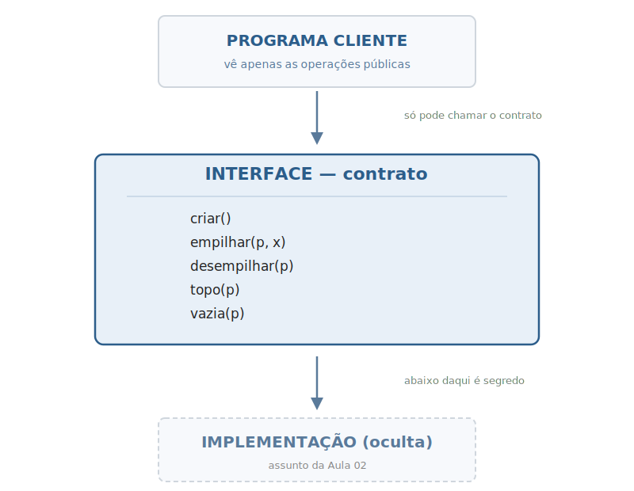
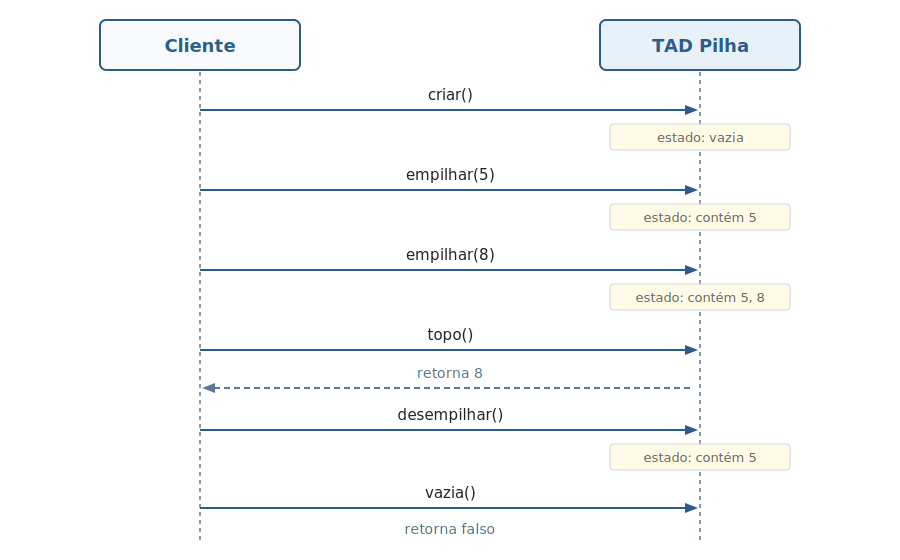
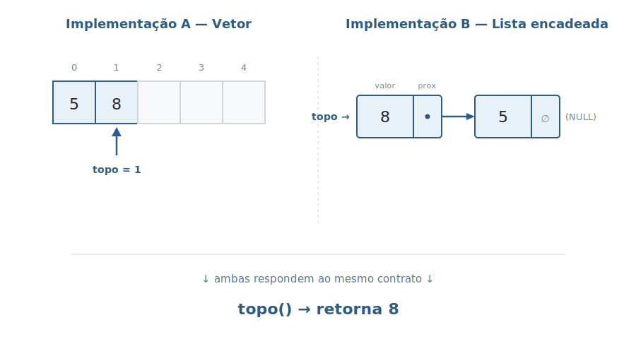

# Aula 01 — Tipos Abstratos de Dados (TAD)

> **Tipo desta aula**: conceitual / meta. Aqui falamos **sobre** estruturas de dados, mas não implementamos nenhuma. As implementações em C começam na Aula 02.

---

## 1. Conceito — Nível Profundo

### O que é um TAD, em uma frase

Um **Tipo Abstrato de Dados (TAD)** é uma forma de descrever um tipo de dado **pelo seu comportamento**, sem dizer como ele é construído por dentro.

A palavra-chave é **abstrato**. Um TAD vive em um plano puramente conceitual: ele responde à pergunta *"o que esse tipo faz?"*, e jamais à pergunta *"como ele faz?"*. Como o tipo é construído por baixo (com vetor, lista encadeada, árvore, ou outra estrutura) é uma decisão **separada**, que pode mudar a qualquer momento sem afetar quem usa.

### Os três ingredientes da definição formal

Em texto técnico, costuma-se dizer que um TAD é uma tripla `T = (V, O, A)`. Cada letra responde a uma pergunta que toda definição de TAD precisa responder:

- **V — Valores**: *quais coisas o tipo pode armazenar?*
  No TAD `Pilha de Inteiros`, `V` é "todas as pilhas possíveis contendo números inteiros, incluindo a pilha vazia".

- **O — Operações**: *o que se pode fazer com esses valores?*
  É a lista de operações disponíveis com suas **assinaturas**, ou seja, o que cada operação **recebe** como entrada e o que ela **devolve** como saída. Exemplo: a operação `empilhar` recebe uma pilha e um inteiro, e devolve uma nova pilha; `topo` recebe uma pilha e devolve um inteiro.

- **A — Axiomas**: *como essas operações se comportam?*
  Um **axioma** é uma regra de igualdade que vale **sempre**, em qualquer implementação. Por exemplo, este axioma define o comportamento essencial da pilha: *"se você empilha o valor `x` e em seguida pergunta qual é o topo, a resposta é `x`"*. Os axiomas são o que **diferencia um TAD de outro**: Pilha e Fila têm operações com nomes parecidos (inserir, remover, buscar), mas axiomas opostos — um devolve o último a entrar (LIFO), o outro devolve o primeiro (FIFO).

### Os três princípios que sustentam a ideia

A definição acima foi formalizada por **Liskov e Zilles em 1974** e ganha valor prático quando entendemos os princípios de engenharia de software que ela operacionaliza:

- **Encapsulamento.** *Fechar a estrutura.* Ninguém de fora pode mexer diretamente nos dados internos do TAD; toda manipulação passa **obrigatoriamente** pelas operações oficiais. Isso impede que um cliente descuidado deixe a estrutura em estado inconsistente (ex.: alterar o "tamanho" de uma pilha sem realmente inserir um elemento).

- **Separação entre interface e implementação.** São dois conceitos distintos:
  - **Interface**: a lista pública de operações que o TAD oferece — o seu contrato com o mundo externo.
  - **Implementação**: o código concreto que de fato cumpre esse contrato.

  Mudar a implementação **não pode** quebrar quem depende da interface. É essa separação que torna possível trocar a representação interna no futuro sem reescrever o sistema inteiro.

- **Information hiding** (Parnas, 1972). *Esconder o que pode mudar.* Decisões de projeto que provavelmente serão revistas — a representação interna escolhida, otimizações, formatos privados — ficam **isoladas dentro do módulo**. Como o cliente nunca enxerga essas decisões, ele também não fica dependente delas.

### Consequência prática

Da escolha de representação interna depende a **eficiência** das operações (quanto tempo e memória cada uma consome), mas **não a identidade** do TAD. Uma `Pilha` continua sendo uma `Pilha` quer seja construída sobre vetor, lista encadeada ou qualquer outra estrutura — desde que respeite os axiomas do seu contrato.

Esta aula trata exclusivamente desse lado da abstração: o **contrato**. A realização concreta em código C começa na Aula 02.

---

## 2. Conceito — Nível Simplificado

TAD é um **contrato**.

Você diz **o que** sua estrutura sabe fazer (suas operações), mas **não** como ela faz por dentro. Quem usa o TAD não sabe — e não precisa saber — se por trás existe um vetor, uma lista encadeada, uma árvore ou mágica.

A grande vantagem: se um dia trocarem a **representação interna** da estrutura (a implementação concreta por baixo), o código de quem usa **não muda uma linha**.

É como pedir um café numa máquina: você aperta o botão "café com leite", sai café com leite. Você não precisa saber se a máquina mistura na hora ou se já tem um cartucho pronto. Se trocarem a máquina por outra de outra marca, **continua saindo café com leite quando você aperta o mesmo botão**.

---

## 3. Visualização Gráfica

Como TAD é meta-conceito, a visualização foca em **três coisas**: a separação cliente/contrato, a "caixa-preta" do ponto de vista de quem usa, e a "intercambialidade" da representação interna.

### Passo 1: as três camadas que o TAD separa



O cliente vê **apenas** a interface — a lista de operações públicas. O que está abaixo (a implementação concreta) fica oculto e pode ser trocado livremente.

### Passo 2: o cliente enxerga uma caixa-preta

O cliente chama operações em sequência e observa apenas o **efeito comportamental** — nunca o estado interno.



O cliente **nunca olha dentro da caixa**. Ele só faz pedidos e observa respostas.

### Passo 3: o mesmo TAD com duas representações internas diferentes

A grande mágica: o **contrato é o mesmo** nas duas representações abaixo. A representação interna muda; o cliente, não.



Na Aula 02 vamos **escolher** uma das duas representações internas e implementar de fato. Mas note: a especificação do TAD é **anterior e independente** da escolha.

---

## 4. Problema Motivador

> *"Por que TAD existe?"*

Imagine que você foi contratado para escrever um sistema de e-commerce. Em algum lugar do sistema, você precisa de uma estrutura que armazena os produtos do carrinho do usuário. Você decide chamar essa estrutura de `Carrinho` e identifica as operações necessárias: adicionar produto, remover produto, listar produtos, calcular total.

Você tem **duas atitudes possíveis**:

**Atitude A — sem TAD**: você vai direto ao código. Espalha pelo sistema chamadas como `carrinho.itens[i]`, `carrinho.tamanho++`, acessando os campos diretamente.

**Atitude B — com TAD**: você primeiro define o **contrato** do `Carrinho` (operações, comportamento esperado), e só depois pensa em como implementar. O resto do sistema usa **apenas** as operações do contrato — nunca acessa campos internos.

Seis meses depois, descobre-se que a estrutura escolhida está lenta para certos cenários e precisa ser trocada.

- Na Atitude A: refatorar é um pesadelo. Há `carrinho.itens[i]` em 200 arquivos.
- Na Atitude B: troca-se **só a implementação**. O contrato permanece. Os 200 arquivos não mudam.

Outro exemplo do dia a dia: o `FILE` da biblioteca padrão de C. Quando você usa `fopen`, `fgetc`, `fclose`, **nunca** acessa campos internos do `FILE`. Linux e Windows têm implementações totalmente diferentes — e seu programa funciona nos dois sem alteração. Por quê? Porque `FILE` é um **TAD**.

TAD não é luxo acadêmico. É o que torna sistemas grandes **manuteníveis**.

---

## 5. Analogias

**1. O controle remoto da TV.**
Você aperta `volume +`, `volume -`, `trocar canal`. Não importa se a TV é Samsung, LG ou TCL — os botões (interface) fazem a mesma coisa. Por dentro, cada fabricante tem um circuito diferente (implementação). Se a TV quebra e você compra outra marca, **o controle universal continua funcionando**, porque ele depende apenas do contrato, não da eletrônica interna.

**2. A cantina da faculdade.**
Você chega no balcão e pede: "um pão de queijo e um café". A atendente entrega. Você **não precisa saber** se o pão de queijo veio de um forno elétrico, a gás, congelado pré-pronto ou feito na hora. A interface do balcão (pedir → receber) abstrai toda a cozinha. Se a cantina trocar de fornecedor amanhã, você continua pedindo do mesmo jeito.

---

## 6. Exercícios Práticos

> Estes exercícios são **conceituais** — não envolvem programar em C. Eles testam se você consegue **identificar**, **ler** e **escrever** especificações de TAD.

**Exercício 1 — Identificando TADs no cotidiano.**
Para cada situação abaixo, identifique qual TAD descreve melhor o comportamento (Pilha, Fila ou outro) e justifique em uma linha:
- a) Botão "desfazer" (Ctrl+Z) de um editor de texto.
- b) Fila de impressão de uma impressora compartilhada do laboratório.
- c) Histórico de páginas visitadas no navegador (botão "voltar").
- d) Atendimento por ordem de chegada na recepção do RU.
- e) Lista de tarefas (to-do) onde você sempre faz a mais antiga primeiro.

*Critério de aceitação*: para cada item, indicar TAD + 1 linha de justificativa baseada **no comportamento** (LIFO, FIFO, etc.).

> **Resposta mínima aceitável**
>
> - a) **Pilha** (LIFO) — o último comando executado é o primeiro a ser desfeito.
> - b) **Fila** (FIFO) — documentos são impressos na ordem em que entraram na fila.
> - c) **Pilha** (LIFO) — a última página visitada é a primeira a aparecer ao clicar em "voltar".
> - d) **Fila** (FIFO) — quem chega primeiro é atendido primeiro.
> - e) **Fila** (FIFO) — a tarefa mais antiga é a próxima a ser feita.

**Exercício 2 — Especificando um TAD do zero.**
Escreva a especificação completa do TAD **AgendaTelefonica**, que armazena pares (nome, telefone). Operações mínimas:
- `criar`
- `adicionar_contato(agenda, nome, telefone)`
- `buscar_telefone(agenda, nome)` — retorna telefone ou erro se não existe
- `remover_contato(agenda, nome)`
- `vazia(agenda)`

Inclua **assinaturas + ao menos 4 axiomas comportamentais** (ex.: o que acontece se buscar logo após adicionar? o que acontece se remover e depois buscar?). Cada axioma é uma igualdade no formato `operação(...) = resultado` (ex.: `vazia(criar()) = verdadeiro`).

*Critério de aceitação*: 5 operações com assinaturas; mínimo 4 axiomas. **Não escrever código em C**.

> **Resposta mínima aceitável**
>
> ```
> TAD AgendaTelefonica
>
>   Tipos:
>     Agenda                                  (a estrutura)
>     Nome, Telefone                          (cadeias de caracteres)
>     Booleano
>
>   Operações:
>     criar()                                       -> Agenda
>     adicionar_contato(Agenda, Nome, Telefone)     -> Agenda
>     buscar_telefone(Agenda, Nome)                 -> Telefone   [erro se não existe]
>     remover_contato(Agenda, Nome)                 -> Agenda
>     vazia(Agenda)                                 -> Booleano
>
>   Axiomas (para qualquer agenda a, nome n, telefone t):
>     A1. vazia(criar())                                  = verdadeiro
>     A2. vazia(adicionar_contato(a, n, t))               = falso
>     A3. buscar_telefone(adicionar_contato(a, n, t), n)  = t
>     A4. buscar_telefone(criar(), n)                     = erro
>     A5. remover_contato(criar(), n)                     = criar()
>     A6. remover_contato(adicionar_contato(a, n, t), n)  = remover_contato(a, n)
> ```
>
> Outras respostas com ≥ 4 axiomas comportamentais coerentes também são aceitas.

---

## 7. Referências

- **Tenenbaum, A. M.; Langsam, Y.; Augenstein, M. J.** — *Estruturas de Dados Usando C*. Capítulo 1, *"Introdução às Estruturas de Dados"*, seção sobre Tipos Abstratos de Dados. Aborda TAD como ponto de partida da disciplina e estabelece a separação interface/implementação.

- **Sedgewick, R.** — *Algoritmos em C*, Parte 1 (Fundamentos). Discussão introdutória sobre tipos abstratos como ferramenta de modularidade.

**Leituras complementares**:
- **CLRS** — *Algoritmos: Teoria e Prática*. A noção de TAD aparece nos preâmbulos dos capítulos de estruturas (cap. 10 — *Estruturas de dados elementares*; cap. 11 — *Tabelas hash*).
- **Liskov, B.; Zilles, S.** (1974) — *"Programming with abstract data types"*. Artigo seminal que formalizou o conceito (referência histórica).
