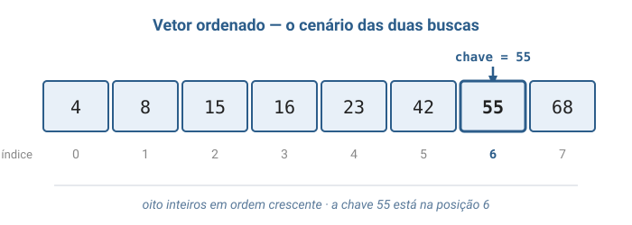
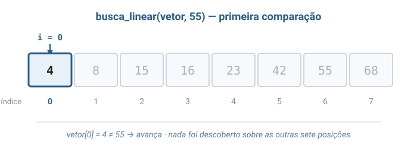
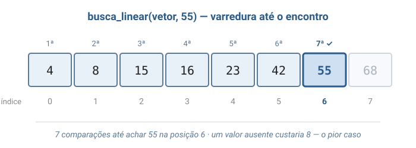
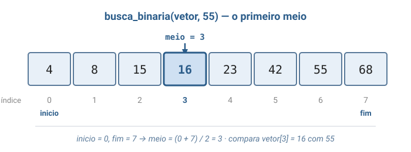
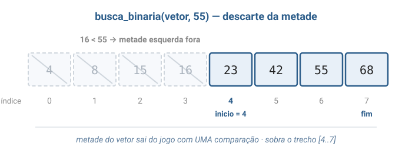
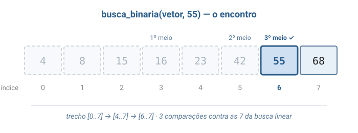
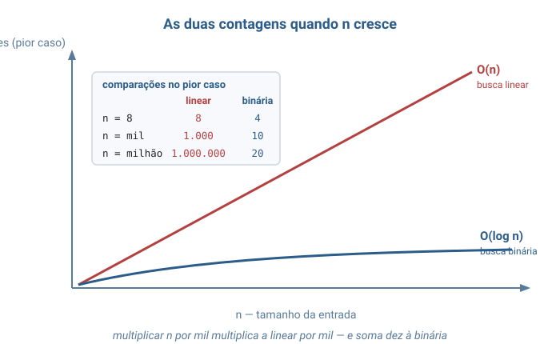

# Aula 02 — Análise de Complexidade na Prática: Busca Linear e Busca Binária

> **Tipo desta aula**: implementação. A Aula 01 apresentou a notação Big O; esta aula a transforma em ferramenta de medição, aplicando-a a dois algoritmos de busca (*search*) sobre a lista sequencial da Aula 01. A estrutura é a mais simples possível — um vetor de inteiros — justamente para que toda a atenção fique no **custo do algoritmo**, e não na estrutura.

---

## 1. Conceito — Aprofundamento Progressivo

### Camada 1 — Introdução

Imagine um dicionário de papel sobre a mesa e a tarefa de encontrar a palavra *maresia*. Uma pessoa começa na primeira página e vira uma a uma até topar com a palavra. Outra abre o livro no meio, vê que caiu no *P*, conclui que *maresia* está antes e ignora, de uma vez só, toda a metade final do dicionário — depois repete a jogada na metade que sobrou. As duas encontram a mesma palavra. A diferença é que a primeira olhou centenas de páginas e a segunda, uma dúzia. E repare no detalhe que torna a segunda estratégia possível: o dicionário está **em ordem alfabética**. Se as palavras estivessem embaralhadas, abrir no meio não diria nada.

### Camada 2 — Definição informal com vocabulário básico

O problema das duas pessoas do dicionário chama-se **busca** (em inglês, *search*): dada uma coleção de elementos e um valor procurado — a **chave de busca** (*search key*) —, determinar se ele está na coleção e, em caso positivo, em que posição. É a operação mais executada da computação, e por isso a mais estudada (Backes, capítulo de métodos de pesquisa; Veloso & Pereira, capítulo de pesquisa em tabelas).

A primeira estratégia é a **busca linear**, também chamada de **busca sequencial** (*linear search*, *sequential search*): percorrer os elementos um a um, do início ao fim, comparando cada um com a chave, e parar assim que houver igualdade — ou chegar ao fim e concluir que a chave não está lá. A segunda é a **busca binária** (*binary search*): examinar o elemento do **meio** do trecho ainda sob suspeita e, com uma única comparação, descartar metade dos candidatos — repetindo até encontrar a chave ou até não sobrar trecho nenhum. Essa estratégia de "resolver um problema reduzindo-o a uma versão menor de si mesmo" tem nome próprio: **divisão e conquista** (*divide and conquer*).

Nas duas, a unidade de trabalho é a mesma: a **comparação** entre a chave de busca e um elemento da coleção. Contar comparações é o que esta aula fará o tempo inteiro, porque é a **operação básica** (*basic operation*) da busca — a operação que se repete tantas vezes que domina o custo total, e cujo número, portanto, resume o algoritmo (Toscani & Veloso, capítulos iniciais).

Note o que a busca binária **exige em troca** da sua velocidade: os elementos precisam estar **ordenados**, e a estrutura precisa oferecer **acesso direto por posição** — aquele `endereço-base + i × tamanho` da Aula 01, que só a lista sequencial (o vetor) dá em O(1). A busca linear não pede nada: funciona sobre qualquer ordem e sobre qualquer estrutura que se consiga percorrer. Cada uma compra velocidade com uma moeda diferente, e a aula inteira é sobre reconhecer o preço.

### Camada 3 — Propriedades e comportamento

#### Ponte com a Aula 01

Toda esta aula trabalha sobre a **lista sequencial** (o vetor) apresentada na Aula 01: elementos do mesmo tipo, guardados lado a lado na memória, cada um alcançável pelo seu índice em O(1). Nada muda nessa estrutura aqui — o que muda é o **algoritmo** que a percorre. É a demonstração mais limpa possível da equação de Wirth: mesma estrutura, mesmos dados, mesma resposta, custos que diferem por um fator de cinquenta mil quando o vetor tem um milhão de elementos.

#### O que exatamente estamos contando

Antes de medir, é preciso decidir **o que** se mede. A análise de complexidade não cronometra segundos: segundos dependem da máquina, do compilador e do que mais estiver rodando. Ela conta **execuções da operação básica** em função do **tamanho da entrada**, que aqui chamamos de $n$ — o número de elementos do vetor. Para os algoritmos de busca, a operação básica é a comparação entre a chave e um elemento.

Duas grandezas independentes saem dessa contagem, e a aula mede as duas:

- **Complexidade de tempo** — quantas comparações o algoritmo executa, em função de $n$.
- **Complexidade de espaço** — quanta memória **adicional** o algoritmo usa, em função de $n$. Adicional significa: além do vetor de entrada, que já existia antes de o algoritmo começar. Contam apenas as variáveis que o algoritmo cria para trabalhar.

#### Melhor caso, pior caso e caso médio

Duas entradas do mesmo tamanho podem custar coisas muito diferentes. Procurar o primeiro elemento do vetor com busca linear custa **uma** comparação; procurar o último, ou um valor ausente, custa $n$. O tamanho é o mesmo — o custo, não. Por isso a análise separa três casos (Toscani & Veloso, capítulo de análise de algoritmos):

- **Melhor caso** (*best case*) — a entrada de tamanho $n$ mais favorável ao algoritmo; o menor custo possível.
- **Pior caso** (*worst case*) — a entrada de tamanho $n$ mais desfavorável; o maior custo possível. É a análise padrão desta disciplina, porque é a única que dá **garantia**: o algoritmo nunca vai custar mais do que isso.
- **Caso médio** (*average case*) — o custo esperado sobre todas as entradas de tamanho $n$, supondo alguma distribuição de probabilidade (em geral, que a chave tem a mesma chance de estar em qualquer posição).

Para a busca linear com sucesso, esses três casos são fáceis de enxergar: melhor caso, a chave está na posição 0, uma comparação; pior caso, a chave está na última posição ou não está no vetor, $n$ comparações; caso médio, a chave está com igual probabilidade em cada uma das $n$ posições, e a média das contagens $1, 2, \ldots, n$ dá $(n+1)/2$ comparações — metade do vetor, aproximadamente.

Atenção a uma confusão comum: **pior caso não é o mesmo que Big O**. Pior, melhor e médio dizem respeito a **qual entrada** estamos considerando; O, Ω e Θ dizem respeito a **como limitamos** a função de custo daquela entrada. Dá para falar em Big O do melhor caso e em Θ do pior caso — são eixos independentes, e a Camada 4 os separa formalmente.

#### As operações em detalhe

- **Busca linear (`busca_linear`)**. Percorre o vetor da posição 0 em diante. A cada posição, compara o elemento com a chave: se forem iguais, devolve a posição e encerra; se não, avança. Chegando ao fim sem igualdade, devolve −1, o valor convencionado para "não encontrado" (a posição −1 não existe em vetor nenhum, o que a torna segura como marca de ausência). Custo de tempo: **O(n)** no pior caso. Espaço adicional: **O(1)** — apenas o índice e o contador.

- **Busca binária (`busca_binaria`)**. Mantém dois índices, `inicio` e `fim`, que delimitam o **trecho ainda sob suspeita** — a parte do vetor onde a chave ainda poderia estar. A cada volta, calcula `meio = (inicio + fim) / 2` e compara `vetor[meio]` com a chave. Se forem iguais, encerra. Se `vetor[meio]` for **menor** que a chave, então — porque o vetor está ordenado — a chave não pode estar em nenhuma posição até `meio`, e o trecho passa a ser `[meio + 1, fim]`. Se for **maior**, pela mesma razão o trecho vira `[inicio, meio - 1]`. Quando `inicio` ultrapassa `fim`, o trecho ficou vazio e a chave não está no vetor. Custo de tempo: **O(log n)** no pior caso. Espaço adicional: **O(1)** — três índices, qualquer que seja o tamanho do vetor.

- **Armadilha da busca binária: o `meio ± 1`**. Escrever `inicio = meio` em vez de `inicio = meio + 1` produz um **laço infinito** — quando o trecho tem dois elementos, a divisão inteira faz o meio cair sempre no primeiro deles, e o trecho nunca encolhe. O `+1` e o `−1` não são detalhe estético: são o que garante que o algoritmo **termina**, já que o elemento do meio acabou de ser comparado e não precisa entrar de novo.

- **Armadilha da busca binária: a pré-condição**. Sobre um vetor desordenado, a busca binária não dá erro nem trava — ela simplesmente **devolve a resposta errada**, dizendo que um valor presente não existe. É a pior espécie de defeito: silencioso. Quem chama a função é responsável por garantir a ordenação; nesta fase da disciplina, essa exigência fica registrada em comentário no código.

#### Invariantes (propriedades que devem sempre valer)

- **Na busca linear**, quando o algoritmo está prestes a examinar a posição `i`, todas as posições de `0` a `i - 1` já foram comparadas e nenhuma delas contém a chave.
- **Na busca binária**, se a chave está no vetor, então ela está dentro do trecho `[inicio, fim]`. Esta é a propriedade que torna o descarte legítimo: jogar fora metade do vetor só é seguro porque a metade descartada, pela ordenação, comprovadamente não contém a chave. Se a propriedade vale no começo (o trecho é o vetor inteiro) e sobrevive a cada volta do laço, então vale no fim — e por isso o algoritmo está correto.
- **Na busca binária**, o trecho `[inicio, fim]` encolhe estritamente a cada volta. É o que garante o término: um trecho que só diminui chega a vazio em algum momento.
- **Em qualquer das duas**, o vetor de entrada não é modificado. Busca é uma operação de leitura.

### Camada 4 — Definição formal e notação

#### A função de custo

O objeto que a análise estuda não é o programa, é uma **função**:

```
Definição (função de custo)

T(n) = número de execuções da operação básica realizadas pelo algoritmo
       para uma entrada de tamanho n.

Quando entradas diferentes de mesmo tamanho custam valores diferentes,
distinguem-se tres funções:

  T_melhor(n) = menor custo entre as entradas de tamanho n
  T_pior(n)   = maior custo entre as entradas de tamanho n
  T_medio(n)  = custo esperado sobre as entradas de tamanho n

Vale sempre:  T_melhor(n) <= T_medio(n) <= T_pior(n)
```

Para a busca linear, essas funções são exatas e sem mistério: $T_{melhor}(n) = 1$, $T_{pior}(n) = n$ e $T_{medio}(n) = (n+1)/2$ para busca com sucesso.

#### As três notações assintóticas

A Aula 01 definiu a notação **Big O**. Ela é apenas uma das três, e cada uma responde a uma pergunta diferente sobre a mesma função de custo (Toscani & Veloso, capítulo de notação assintótica):

```
Sejam f e g funções de n em números não negativos.

  f(n) = O(g(n))    <=>  existem c > 0 e n0 >= 1 tais que
                         f(n) <= c * g(n)   para todo n >= n0
                         "f cresce no maximo tao rapido quanto g"  (teto)

  f(n) = Omega(g(n)) <=> existem c > 0 e n0 >= 1 tais que
                         f(n) >= c * g(n)   para todo n >= n0
                         "f cresce no minimo tao rapido quanto g"  (piso)

  f(n) = Theta(g(n)) <=>  f(n) = O(g(n))  E  f(n) = Omega(g(n))
                         "f cresce exatamente no ritmo de g"       (teto = piso)
```

A distinção deixa de ser preciosismo quando se aplica aos casos. O custo da busca linear no **pior caso** é $T_{pior}(n) = n$: é O(n), é Ω(n) e, portanto, é **Θ(n)** — teto e piso coincidem, o ritmo é exatamente linear. Já o custo da busca linear **considerando todas as entradas** só pode ser limitado por cima: é O(n), mas **não** é Ω(n), porque existem entradas de tamanho $n$ que custam uma única comparação. Dizer "a busca linear é O(n)" é sempre verdade; dizer "a busca linear é Θ(n)" só é verdade se ficar dito que se trata do pior caso.

#### A recorrência da busca binária

O custo da busca binária não sai de uma contagem direta, e sim de uma **relação de recorrência** (*recurrence relation*) — uma equação que define o custo de uma entrada de tamanho $n$ em termos do custo de uma entrada menor:

```
T(1) = 1                    uma comparacao resolve um trecho de 1 elemento
T(n) = T(n / 2) + 1         uma comparacao descarta metade do trecho
```

Desdobrando a segunda linha até chegar à primeira, o tamanho do trecho percorre a sequência

$$n \rightarrow \frac{n}{2} \rightarrow \frac{n}{4} \rightarrow \frac{n}{8} \rightarrow \cdots \rightarrow 1$$

e a pergunta "quantas comparações?" vira "quantas vezes é possível dividir $n$ por 2 até chegar a 1?". Essa quantidade é, por definição, o **logaritmo de $n$ na base 2**: se $n = 2^k$, então são $k = \log_2 n$ divisões. Daí o resultado exato do pior caso:

$$T_{pior}(n) = \lfloor \log_2 n \rfloor + 1 \text{ comparações} \implies T_{pior}(n) = \Theta(\log n)$$

Conferindo com o vetor de 8 elementos que o código desta aula usa: $\lfloor \log_2 8 \rfloor + 1 = 3 + 1 = 4$ comparações no pior caso — e é exatamente esse o número que o programa produz ao procurar o valor 68, o último do vetor.

Uma observação sobre a notação: dentro de um Θ ou de um O, a **base do logaritmo não importa** e por isso costuma ser omitida. Trocar de base multiplica o resultado por uma constante ($\log_2 n = \log_{10} n / \log_{10} 2$), e constantes multiplicativas são justamente o que a notação assintótica descarta. Θ(log n) sem base é a forma canônica.

#### Complexidade de espaço

A mesma máquina de notação mede memória, bastando trocar a função:

```
S(n) = quantidade de memoria ADICIONAL usada pelo algoritmo para uma
       entrada de tamanho n — isto e, sem contar a propria entrada.
```

Pelo critério, a busca linear usa duas variáveis inteiras (o índice e o contador) e a busca binária usa três (`inicio`, `fim`, `meio`), **independentemente de $n$**: um vetor de dez elementos e um de dez milhões exigem exatamente as mesmas variáveis. Ambas são, portanto, **S(n) = O(1)** — espaço constante, também chamado de **algoritmo in-place** (*in-place*, "no lugar", porque trabalha sobre a entrada sem construir uma cópia).

Nem todo algoritmo tem essa sorte, e o bloco de código desta aula traz o contraste: a **tabela de presença**, que gasta memória proporcional ao maior valor possível para responder cada busca com uma única leitura. É a troca **espaço por tempo** (*space-time trade-off*) em sua forma mais crua — a mesma ideia que a Aula 01 mencionou ao explicar por que um buscador encontra uma página entre bilhões sem procurar por ela.

### Camada 5 — Análise de complexidade

O quadro completo dos três algoritmos do bloco de código, com $n$ = número de elementos do vetor e $M$ = maior valor que a tabela precisa comportar:

| Algoritmo             | Melhor caso | Caso médio  | Pior caso   | Espaço adicional | Pré-condição              |
|-----------------------|-------------|-------------|-------------|------------------|---------------------------|
| Busca linear          | O(1)        | O(n)        | **O(n)**    | **O(1)**         | nenhuma                   |
| Busca binária         | O(1)        | O(log n)    | **O(log n)**| **O(1)**         | vetor ordenado            |
| Tabela de presença    | O(1)        | O(1)        | **O(1)**    | **O(M)**         | valores inteiros de 0 a M; montagem prévia de custo O(n + M) |

O que essas classes significam em número de comparações no pior caso, para tamanhos concretos:

| n             | Busca linear  | Busca binária |
|---------------|---------------|---------------|
| 8             | 8             | 4             |
| 1.000         | 1.000         | 10            |
| 1.000.000     | 1.000.000     | 20            |
| 1.000.000.000 | 1.000.000.000 | 30            |

A tabela contém a lição central da análise assintótica: multiplicar o vetor por mil **multiplica por mil** o trabalho da busca linear, e **acrescenta dez comparações** ao da busca binária. Não é uma diferença de velocidade — é uma diferença de natureza. Nenhum computador mais rápido faz uma busca linear em um bilhão de elementos alcançar as 30 comparações da binária.

Isso não torna a busca binária sempre preferível, e é aqui que a análise fica interessante. Ela cobra a ordenação, que não é de graça: os melhores algoritmos de ordenação custam Θ(n log n) — para $n = 1.000.000$, cerca de 20 milhões de passos, o equivalente a **vinte buscas lineares**. Comparando as duas estratégias para $k$ buscas sobre o mesmo vetor de $n$ elementos:

- Buscar linearmente $k$ vezes: $k \cdot n$ comparações.
- Ordenar uma vez e buscar binariamente $k$ vezes: $n \log_2 n + k \cdot \log_2 n$ comparações.

O ponto de equilíbrio fica em torno de $k \approx \log_2 n$ — para um milhão de elementos, aproximadamente **20 buscas**. Abaixo disso, ordenar é desperdício e a busca linear ganha; acima, a busca binária ganha, e ganha cada vez mais. Por isso a decisão de ordenar não pertence ao algoritmo de busca: pertence ao **padrão de uso** do sistema. Um vetor que muda a cada consulta é território da busca linear; um vetor construído uma vez e consultado milhões de vezes é território da busca binária — e, no limite, das estruturas de busca das próximas aulas.

A tabela de presença esclarece a terceira coluna. Ela responde qualquer busca em O(1), melhor que as duas, mas paga **O(M)** de memória — e $M$ é o maior **valor** possível, não o número de elementos. Para 8 valores entre 0 e 100 já são 101 posições; para 8 valores entre 0 e um bilhão, seriam um bilhão de posições para guardar oito números. É o custo do acesso instantâneo pela indexação direta, e a razão pela qual essa ideia, refinada para não desperdiçar memória, dá origem às **tabelas hash**, tema de aula futura.

### Camada 6 — Conexões e variantes

A busca binária, ou a ideia de descartar metade a cada passo, sustenta boa parte da computação prática:

- **`git bisect`** — encontra, entre milhares de versões salvas de um programa, exatamente aquela que introduziu um defeito, testando cerca de uma dúzia.
- **Índices de bancos de dados** — mantêm as chaves ordenadas justamente para que uma consulta não precise ler a tabela inteira.
- **Árvores binárias de busca** — a mesma estratégia de descarte gravada na própria estrutura de dados, em vez de no algoritmo; tema de aula futura.
- **Busca de raiz por bisseção** — em matemática numérica, encontrar onde uma função cruza o zero cortando o intervalo ao meio.
- **Ajuste de parâmetros por tentativa** — descobrir o maior valor que ainda funciona (uma capacidade, um limite de carga) testando o meio do intervalo viável.
- **Correção automática e autocompletar** — dependem de encontrar rapidamente palavras próximas em listas ordenadas de vocabulário.

O próprio algoritmo admite variantes que apenas sinalizamos aqui: a **primeira ocorrência** em vetores com valores repetidos (o exercício-desafio desta aula), o **ponto de inserção** — a posição onde a chave deveria entrar para manter a ordem —, a **busca por interpolação**, que estima onde a chave estaria em vez de cortar sempre no meio, e a **busca exponencial**, para coleções cujo tamanho não se conhece de antemão. E a busca linear, apesar de simples, continua sendo a única opção sobre estruturas que não oferecem acesso direto por índice — as listas encadeadas que estudaremos adiante, por exemplo, onde chegar ao elemento do meio já custa O(n) e destrói inteiramente a vantagem da busca binária.

---

## 2. Visualização Gráfica

Sete diagramas sobre o mesmo vetor ordenado de oito elementos: a varredura completa da busca linear, o descarte progressivo da busca binária e, ao final, o confronto das duas contagens.

### Passo 1: o vetor ordenado



O cenário comum aos dois algoritmos: oito inteiros em ordem crescente, cada um com seu índice de 0 a 7. A chave procurada é **55**, que está na posição 6.

### Passo 2: busca_linear(vetor, 55) — primeira comparação



A busca linear começa onde qualquer varredura começa: na posição 0. Compara 4 com 55, não são iguais, avança. Nenhuma informação sobre as outras sete posições foi obtida com essa comparação.

### Passo 3: busca_linear(vetor, 55) — varredura até o encontro



Posições 0 a 6 examinadas, uma a uma, até a igualdade na posição 6: **7 comparações**. Se a chave fosse 70, ou qualquer valor ausente, seriam 8 — o pior caso, igual ao tamanho do vetor.

### Passo 4: busca_binaria(vetor, 55) — primeiro meio



A busca binária não começa pela ponta: começa pelo meio. Com `inicio = 0` e `fim = 7`, a divisão inteira dá `meio = 3`, e a comparação é contra `vetor[3] = 16`.

### Passo 5: busca_binaria(vetor, 55) — descarte da metade



Como 16 é menor que 55 e o vetor está ordenado, nenhuma das posições de 0 a 3 pode conter a chave. Metade do vetor sai do jogo com **uma única comparação** — e `inicio` passa a valer 4.

### Passo 6: busca_binaria(vetor, 55) — encontro



O mesmo movimento se repete sobre o que sobrou: no trecho `[4..7]` o meio é 5 (`vetor[5] = 42`, menor que 55, descarta de novo); no trecho `[6..7]` o meio é 6, e `vetor[6] = 55` é a chave. Total: **3 comparações**.

### Passo 7: as duas contagens lado a lado



À esquerda, o placar deste vetor: 7 contra 3. À direita, o que acontece quando $n$ cresce — a reta da busca linear sobe junto com a entrada, enquanto a curva logarítmica se achata quase na horizontal. Para um milhão de elementos, um milhão de comparações contra vinte.

---

## 3. Problema Motivador

> *"Como o `git bisect` descobre, entre 10.000 versões salvas de um programa, exatamente aquela que introduziu o defeito — testando apenas 14?"*

O **git** é o sistema que guarda o histórico de um programa: cada vez que alguém salva o trabalho, nasce uma nova versão registrada, chamada **commit**, e o histórico é uma sequência ordenada dessas versões, da mais antiga para a mais recente. Um cenário rotineiro em equipes de software: o programa funcionava há três meses e hoje não funciona mais. Em algum lugar entre as 10.000 versões salvas nesse intervalo existe exatamente uma que quebrou tudo — antes dela funciona, a partir dela não funciona.

A abordagem óbvia é a busca linear: começar pela versão mais antiga, executar o teste, ir para a seguinte, executar de novo, e assim por diante. Como cada teste pode levar minutos — instalar, compilar, executar —, 10.000 versões podem significar semanas de trabalho. A abordagem do `git bisect` é a busca binária: escolher a versão do **meio** do intervalo e testar só ela. Se o defeito já aparece nessa versão, ele foi introduzido em algum ponto da metade **anterior**, e as 5.000 versões seguintes deixam de importar. Se ela ainda funciona, o defeito está na metade **posterior**, e as 5.000 anteriores deixam de importar. Um teste, metade do histórico eliminada.

O que torna a jogada legítima é a mesma pré-condição do dicionário da Camada 1: o histórico está **ordenado no tempo** e a propriedade "estar quebrado" só muda uma vez ao longo dele — antes do commit culpado, tudo funciona; depois, nada funciona. É essa ordenação que permite descartar metade sem examiná-la, exatamente como a ordenação numérica permite à busca binária ignorar metade do vetor. E o número de testes é o que a Camada 4 previu: $\lfloor \log_2 10000 \rfloor + 1 = 14$.

O mesmo raciocínio, com outra roupagem, aparece toda vez que um aplicativo de banco encontra sua conta entre dezenas de milhões em milissegundos: ninguém percorre a lista de correntistas: consulta-se um **índice**, mantido ordenado exatamente para que a busca possa descartar metade dos candidatos a cada passo. A diferença entre O(n) e O(log n) é, literalmente, a diferença entre um sistema que responde e um que não responde.

---

## 4. Analogias

**1. O dicionário e o catálogo bagunçado.** Procurar uma palavra no dicionário é busca binária: abre-se no meio, compara-se, descarta-se metade do livro, repete-se. Ninguém em sã consciência começa pela primeira página — e ninguém precisa ser ensinado a fazer diferente, porque a ordem alfabética torna a estratégia natural. Agora imagine o mesmo dicionário com as palavras impressas em ordem aleatória: abrir no meio não informa nada, e a única saída volta a ser olhar página por página. A ordenação não é um detalhe de apresentação do dicionário: **é a pré-condição que barateia a busca**, e foi paga uma vez, na hora de imprimir, para ser aproveitada por todos os leitores para sempre.

**2. O jogo de adivinhar o número.** Alguém pensa num número de 1 a 100 e só responde "maior" ou "menor" a cada palpite. Chutar 1, 2, 3... é busca linear: até 100 palpites. Chutar 50, depois 25 ou 75, e sempre o meio do intervalo que sobrou, é busca binária: no máximo 7 palpites, porque $\lfloor \log_2 100 \rfloor + 1 = 7$. O detalhe que fecha a analogia é o que acontece quando o intervalo cresce: com 1 a 1.000.000, a estratégia dos chutes em ordem precisaria de até um milhão de palpites, e a do meio precisa de 20. O jogo fica dez mil vezes maior e a boa estratégia fica **treze palpites** mais cara.

---

## 5. Código em C

O programa a seguir implementa os três algoritmos analisados e imprime **cada comparação** que executa. A contagem impressa não faz parte dos algoritmos — é instrumentação didática, para que a análise das camadas anteriores possa ser conferida com os olhos.

> **Sobre a organização do arquivo.** Tudo o que vem a seguir vive em **um único arquivo** chamado `busca.c`: `#include`s, funções e a `main()` demonstrativa. A separação em arquivo de cabeçalho (`busca.h`) e arquivo de implementação é assunto da aula futura sobre **organização de projetos em C**. Por enquanto, manter tudo num lugar só facilita ler de cima a baixo.

### `busca.c` — arquivo único

```c
#include <stdio.h>

/*
 * Aula 02 - Analise de complexidade na pratica.
 *
 * Tres algoritmos resolvem exatamente o mesmo problema: dizer em que
 * posicao de um vetor esta um valor procurado, ou -1 quando ele nao esta
 * la. O que muda de um para o outro e o CUSTO: quantas comparacoes cada
 * um faz (tempo) e quanta memoria adicional cada um gasta (espaco).
 *
 * Os printf de dentro das buscas existem so para esta aula: eles tornam
 * visivel cada comparacao. Um algoritmo de busca de verdade nao imprime
 * nada - apenas devolve a posicao.
 */

/* Maior valor que a tabela de presenca consegue registrar. */
#define LIMITE 100

/*
 * Busca linear: olha os elementos um a um, do inicio para o fim, ate
 * encontrar o valor procurado. Nao exige nada do vetor - funciona com os
 * elementos em qualquer ordem.
 */
int busca_linear(int vetor[], int tamanho, int procurado) {
    int comparacoes = 0;
    int i;

    for (i = 0; i < tamanho; i++) {
        comparacoes++;
        printf("    comparacao %d: vetor[%d] = %d\n", comparacoes, i, vetor[i]);
        if (vetor[i] == procurado) {
            printf("  encontrado na posicao %d com %d comparacoes\n", i, comparacoes);
            return i;
        }
    }

    printf("  nao encontrado; foram %d comparacoes\n", comparacoes);
    return -1;
}

/*
 * Busca binaria: exige o vetor ORDENADO em ordem crescente. A cada volta
 * do laco olha o elemento do meio do trecho que ainda pode conter o valor
 * e descarta a metade que com certeza nao o contem.
 */
int busca_binaria(int vetor[], int tamanho, int procurado) {
    int inicio = 0;
    int fim = tamanho - 1;
    int comparacoes = 0;

    /* Enquanto o trecho [inicio..fim] ainda tem pelo menos um elemento. */
    while (inicio <= fim) {
        /* Divisao inteira: o meio de [0..7] e 3, e o de [0..6] tambem e 3. */
        int meio = (inicio + fim) / 2;

        comparacoes++;
        printf("    comparacao %d: trecho [%d..%d], meio %d, vetor[%d] = %d\n",
               comparacoes, inicio, fim, meio, meio, vetor[meio]);

        if (vetor[meio] == procurado) {
            printf("  encontrado na posicao %d com %d comparacoes\n", meio, comparacoes);
            return meio;
        }

        if (vetor[meio] < procurado) {
            /* O elemento do meio ja foi comparado e nao serve. Comecar o
               novo trecho em meio + 1 (e nao em meio) e o que garante que
               o trecho encolhe de verdade e o laco termina. */
            inicio = meio + 1;
        } else {
            fim = meio - 1;
        }
    }

    printf("  nao encontrado; foram %d comparacoes\n", comparacoes);
    return -1;
}

/*
 * Monta a tabela de presenca: em tabela[v] fica a posicao em que o valor v
 * aparece no vetor, ou -1 se ele nao aparece. Gasta um vetor auxiliar de
 * LIMITE + 1 posicoes e uma passada por cada um dos dois vetores - memoria
 * paga adiantado para que cada busca seguinte custe uma unica leitura.
 * So funciona para valores inteiros de 0 ate LIMITE.
 */
void montar_tabela(int vetor[], int tamanho, int tabela[]) {
    int i;

    for (i = 0; i <= LIMITE; i++) {
        tabela[i] = -1;
    }
    for (i = 0; i < tamanho; i++) {
        tabela[vetor[i]] = i;
    }
}

/*
 * Busca por tabela de presenca: uma unica leitura, sem laco nenhum.
 * Pre-condicao: 0 <= procurado <= LIMITE.
 */
int busca_por_tabela(int tabela[], int procurado) {
    return tabela[procurado];
}

/* Programa demonstrativo: o mesmo vetor, o mesmo alvo, tres custos. */
int main(void) {
    int vetor[] = {4, 8, 15, 16, 23, 42, 55, 68};
    int tamanho = 8;  /* o vetor declarado acima tem 8 elementos */
    int tabela[LIMITE + 1];
    int posicao;

    printf("Vetor ordenado: 4 8 15 16 23 42 55 68   (n = %d)\n\n", tamanho);

    printf("[1] Procurando 55 (existe) com busca linear:\n");
    posicao = busca_linear(vetor, tamanho, 55);
    printf("  posicao devolvida: %d\n\n", posicao);

    printf("[2] Procurando 55 (existe) com busca binaria:\n");
    posicao = busca_binaria(vetor, tamanho, 55);
    printf("  posicao devolvida: %d\n\n", posicao);

    /* O valor ausente e o pior caso das duas buscas: nenhuma delas pode
       parar antes de esgotar o trecho que ainda poderia conte-lo. */
    printf("[3] Procurando 50 (nao existe) com busca linear:\n");
    posicao = busca_linear(vetor, tamanho, 50);
    printf("  posicao devolvida: %d\n\n", posicao);

    printf("[4] Procurando 50 (nao existe) com busca binaria:\n");
    posicao = busca_binaria(vetor, tamanho, 50);
    printf("  posicao devolvida: %d\n\n", posicao);

    printf("[5] Montando a tabela de presenca (%d posicoes de memoria)\n", LIMITE + 1);
    montar_tabela(vetor, tamanho, tabela);
    printf("  procurando 55: posicao %d com 1 leitura\n", busca_por_tabela(tabela, 55));
    printf("  procurando 50: posicao %d com 1 leitura\n", busca_por_tabela(tabela, 50));

    return 0;
}
```

### Compilando e rodando

Como tudo está em um só arquivo, a linha de compilação é direta:

```sh
gcc -Wall -Wextra -o busca_demo busca.c
./busca_demo
```

Saída esperada:

```
Vetor ordenado: 4 8 15 16 23 42 55 68   (n = 8)

[1] Procurando 55 (existe) com busca linear:
    comparacao 1: vetor[0] = 4
    comparacao 2: vetor[1] = 8
    comparacao 3: vetor[2] = 15
    comparacao 4: vetor[3] = 16
    comparacao 5: vetor[4] = 23
    comparacao 6: vetor[5] = 42
    comparacao 7: vetor[6] = 55
  encontrado na posicao 6 com 7 comparacoes
  posicao devolvida: 6

[2] Procurando 55 (existe) com busca binaria:
    comparacao 1: trecho [0..7], meio 3, vetor[3] = 16
    comparacao 2: trecho [4..7], meio 5, vetor[5] = 42
    comparacao 3: trecho [6..7], meio 6, vetor[6] = 55
  encontrado na posicao 6 com 3 comparacoes
  posicao devolvida: 6

[3] Procurando 50 (nao existe) com busca linear:
    comparacao 1: vetor[0] = 4
    comparacao 2: vetor[1] = 8
    comparacao 3: vetor[2] = 15
    comparacao 4: vetor[3] = 16
    comparacao 5: vetor[4] = 23
    comparacao 6: vetor[5] = 42
    comparacao 7: vetor[6] = 55
    comparacao 8: vetor[7] = 68
  nao encontrado; foram 8 comparacoes
  posicao devolvida: -1

[4] Procurando 50 (nao existe) com busca binaria:
    comparacao 1: trecho [0..7], meio 3, vetor[3] = 16
    comparacao 2: trecho [4..7], meio 5, vetor[5] = 42
    comparacao 3: trecho [6..7], meio 6, vetor[6] = 55
  nao encontrado; foram 3 comparacoes
  posicao devolvida: -1

[5] Montando a tabela de presenca (101 posicoes de memoria)
  procurando 55: posicao 6 com 1 leitura
  procurando 50: posicao -1 com 1 leitura
```

A saída é a prova empírica da análise. No bloco `[3]`, a busca linear pelo valor ausente executa exatamente $n = 8$ comparações — o pior caso previsto pela Camada 5. Nos blocos `[2]` e `[4]`, a busca binária gasta 3 comparações tanto para encontrar quanto para não encontrar: para ela, achar e não achar custam praticamente o mesmo, porque em ambos os casos o trabalho é reduzir o trecho até esgotá-lo. E o bloco `[5]` mostra o preço da resposta instantânea: 101 posições de memória alocadas para guardar 8 valores — a busca fica O(1), o espaço deixa de ser.

---

## 6. Exercícios Práticos

**Exercício 1 — Trace na mão.**
Considere o mesmo vetor ordenado do código, `{4, 8, 15, 16, 23, 42, 55, 68}`, e a chave **8**. Execute os dois algoritmos na mão. Para a busca linear, liste as comparações na ordem em que acontecem. Para a busca binária, monte uma tabela com uma linha por volta do laço, contendo `inicio`, `fim`, `meio` e o valor de `vetor[meio]`. Ao final, responda: qual dos dois foi mais rápido **nesta entrada específica**, e isso contradiz a análise da Camada 5?

*Critério de aceitação*: a lista de comparações da busca linear, a tabela da busca binária com uma linha por volta, o número de comparações de cada algoritmo e uma justificativa de uma frase para a última pergunta.

> **Resposta mínima aceitável**
>
> **Busca linear** — 2 comparações: `vetor[0] = 4` (≠ 8), `vetor[1] = 8` (= 8, devolve 1).
>
> **Busca binária** — 2 comparações:
>
> | Volta | `inicio` | `fim` | `meio` | `vetor[meio]` | Decisão                    |
> |-------|----------|-------|--------|----------------|----------------------------|
> | 1     | 0        | 7     | 3      | 16             | 16 > 8 → `fim = 2`         |
> | 2     | 0        | 2     | 1      | 8              | igual → devolve 1          |
>
> **Empate**: 2 comparações de cada lado.
>
> Não há contradição com a Camada 5. A análise assintótica descreve o comportamento **quando $n$ cresce**, e o melhor caso da busca linear (chave no começo do vetor) é O(1). Uma única entrada pequena não confirma nem refuta uma classe de complexidade; o que a Camada 5 garante é o **pior caso**, e nele a busca linear faria 8 comparações contra 4 da binária.

**Exercício 2 — Parada antecipada na busca linear.**
Quando o vetor está ordenado, a busca linear pode desistir mais cedo: ao encontrar um elemento **maior** que a chave, é certo que a chave não aparecerá dali em diante. Adicione ao `busca.c` a função `busca_linear_ordenada`, com a mesma assinatura de `busca_linear`, implementando essa parada. Depois responda: qual passa a ser o custo de procurar o valor **5** (ausente, menor que quase todo o vetor), e a classe de complexidade do **pior caso** muda?

*Critério de aceitação*: a função devolve 6 ao procurar 55 e −1 ao procurar 5 e 50; a contagem impressa para a chave 5 deve ser 2; a resposta sobre o pior caso deve vir com justificativa.

> **Resposta mínima aceitável**
>
> ```c
> int busca_linear_ordenada(int vetor[], int tamanho, int procurado) {
>     int comparacoes = 0;
>     int i;
>
>     for (i = 0; i < tamanho; i++) {
>         comparacoes++;
>         if (vetor[i] == procurado) {
>             printf("  encontrado na posicao %d com %d comparacoes\n", i, comparacoes);
>             return i;
>         }
>         /* O vetor esta ordenado: passando do valor procurado, ele nao
>            pode aparecer em nenhuma posicao seguinte. */
>         if (vetor[i] > procurado) {
>             printf("  nao encontrado; foram %d comparacoes\n", comparacoes);
>             return -1;
>         }
>     }
>
>     printf("  nao encontrado; foram %d comparacoes\n", comparacoes);
>     return -1;
> }
> ```
>
> Procurar 5 custa **2 comparações** (`vetor[0] = 4`, depois `vetor[1] = 8 > 5`, e para).
>
> O pior caso **continua O(n)**: procurar 68 ou 70 percorre o vetor inteiro. A parada antecipada melhora o caso médio (aproximadamente pela metade nas buscas sem sucesso), mas não muda a classe assintótica — melhorar por um fator constante é exatamente o que a notação Big O descarta.

**Exercício 3 — Ordenar compensa?**
Um sistema mantém um vetor de **100.000** cadastros e precisa responder consultas de busca. Ordenar o vetor custa aproximadamente $n \log_2 n$ comparações; depois de ordenado, cada busca binária custa até $\log_2 n$ comparações; sem ordenar, cada busca linear custa até $n$. Use $\log_2 100.000 \approx 17$. Calcule o custo total das duas estratégias para **10 consultas** e para **1.000 consultas**, e diga qual estratégia vence em cada cenário.

*Critério de aceitação*: os quatro totais calculados (duas estratégias × dois cenários) e a indicação do vencedor em cada um.

> **Resposta mínima aceitável**
>
> | Cenário          | Busca linear ($k \cdot n$) | Ordenar + binária ($n \log_2 n + k \log_2 n$) | Vencedor |
> |------------------|-----------------------------|------------------------------------------------|----------|
> | $k = 10$         | 1.000.000                   | 1.700.000 + 170 ≈ 1.700.170                    | linear   |
> | $k = 1.000$      | 100.000.000                 | 1.700.000 + 17.000 ≈ 1.717.000                 | binária  |
>
> Com poucas consultas, o investimento da ordenação não se paga. Com muitas, ele se dilui: a estratégia ordenada fica cerca de **58 vezes** mais barata no segundo cenário — e a vantagem cresce a cada nova consulta.

**Exercício 4 — Ponto de inserção.**
Modifique a busca binária para que, quando a chave **não** estiver no vetor, ela devolva a posição em que a chave **deveria ser inserida** para manter a ordem crescente, em vez de −1. Chame a nova função de `posicao_de_insercao`. Para o vetor `{4, 8, 15, 16, 23, 42, 55, 68}`, procurar 50 deve devolver **6** (entre 42 e 55), procurar 3 deve devolver **0** e procurar 70 deve devolver **8** (depois do último).

*Critério de aceitação*: a função devolve 6, 0 e 8 para as três chaves indicadas, e mantém o custo O(log n).

> **Resposta mínima aceitável**
>
> ```c
> int posicao_de_insercao(int vetor[], int tamanho, int procurado) {
>     int inicio = 0;
>     int fim = tamanho - 1;
>
>     while (inicio <= fim) {
>         int meio = (inicio + fim) / 2;
>
>         if (vetor[meio] == procurado) {
>             return meio;
>         }
>         if (vetor[meio] < procurado) {
>             inicio = meio + 1;
>         } else {
>             fim = meio - 1;
>         }
>     }
>
>     /* Quando o laco termina sem encontrar, inicio parou exatamente na
>        primeira posicao cujo valor e maior que o procurado - que e onde
>        o valor deveria entrar. */
>     return inicio;
> }
> ```
>
> A única mudança é o valor devolvido ao fim do laço: `inicio` no lugar de `−1`. O laço é o mesmo, logo o custo continua O(log n).

**Exercício 5 — Desafio: a primeira ocorrência.**
Vetores ordenados podem ter valores repetidos, como `{2, 5, 5, 5, 5, 8, 9, 9}`. A busca binária desta aula, procurando 5, devolve a posição 3 — uma ocorrência qualquer, decidida pelo acaso da divisão inteira. Escreva `primeira_ocorrencia`, que devolve a posição da **primeira** ocorrência da chave (aqui, 1), ou −1 se ela não existir, mantendo o custo **O(log n)**.

A saída ingênua — encontrar uma ocorrência e caminhar para a esquerda enquanto o valor se repetir — resolve o problema, mas destrói a complexidade: num vetor em que todos os elementos são iguais à chave, esse caminhar custa $n$ passos e o algoritmo vira O(n). O desafio é encontrar a primeira ocorrência **sem** percorrer as repetições. Dica: ao encontrar a chave no meio, ainda pode haver ocorrências à esquerda — mas não à direita.

*Critério de aceitação*: para `{2, 5, 5, 5, 5, 8, 9, 9}`, a função devolve 1 para a chave 5, 0 para 2, 6 para 9 e −1 para 7. Além do código, justificar em uma frase por que o custo continua O(log n).

> **Resposta mínima aceitável**
>
> ```c
> int primeira_ocorrencia(int vetor[], int tamanho, int procurado) {
>     int inicio = 0;
>     int fim = tamanho - 1;
>     int resposta = -1;  /* melhor posicao encontrada ate agora */
>
>     while (inicio <= fim) {
>         int meio = (inicio + fim) / 2;
>
>         if (vetor[meio] == procurado) {
>             /* Achamos uma ocorrencia, mas pode haver outra mais a
>                esquerda: guardamos esta e continuamos procurando la. */
>             resposta = meio;
>             fim = meio - 1;
>         } else if (vetor[meio] < procurado) {
>             inicio = meio + 1;
>         } else {
>             fim = meio - 1;
>         }
>     }
>
>     return resposta;
> }
> ```
>
> O custo continua **O(log n)** porque o laço nunca caminha de uma em uma posição: todo ramo — inclusive o do acerto — descarta metade do trecho restante. O número de voltas é o mesmo da busca binária original, $\lfloor \log_2 n \rfloor + 1$; a diferença é que o algoritmo não para no primeiro acerto, e sim segue até o trecho esvaziar, devolvendo o acerto mais à esquerda que registrou.

---

## 7. Referências

- **Backes, A. R.** — *Algoritmos e Estruturas de Dados em Linguagem C*. Rio de Janeiro: LTC, 2023. Capítulo de métodos de pesquisa — busca sequencial e busca binária sobre vetores, com o código em C na mesma linha didática desta aula.
- **Toscani, L. V.; Veloso, P. A. S.** — *Complexidade de Algoritmos*. Porto Alegre: Bookman, 2012. Capítulos de análise de algoritmos e de notação assintótica — a fonte de rigor para a função de custo, para a distinção entre melhor/médio/pior caso e para as notações O, Ω e Θ das Camadas 3 e 4; o capítulo de recorrências fundamenta o Θ(log n) da busca binária.
- **Veloso, P.; Pereira, S. do L.** — *Estruturas de Dados em C — Uma Abordagem Didática*. São Paulo: Saraiva, 2016. Capítulo de pesquisa — a busca apresentada como operação sobre tabelas, com a mesma ênfase na pré-condição de ordenação.
- **Schildt, H.** — *C Completo e Total*. São Paulo: Makron Books, 1997. Capítulos de vetores, laços e funções — os recursos da linguagem usados no `busca.c` desta aula.

**Leituras complementares**:

- **Wirth, N.** — *Algoritmos e Estruturas de Dados*. Rio de Janeiro: LTC, 1999. Capítulo de pesquisa — a apresentação clássica da busca binária e de sua prova de correção por invariante de laço.
- **Azevedo, P. A. de** — *Tabelas: organização e pesquisa*. Porto Alegre: Sagra-Luzzatto, 2003. O tratado da pesquisa em tabelas — aprofunda a ideia da tabela de presença desta aula e conduz naturalmente às tabelas hash.
- **Damas, L.** — *Linguagem C*. 10ª ed. Rio de Janeiro: LTC, 2023. Aprofundamento em vetores e passagem de vetores para funções.
- **Forouzan, B. A.; Gilbert, R. F.** — *Data Structures: a pseudocode approach with C++*. 2001. Contraste útil: os mesmos algoritmos de busca escritos em pseudocódigo, sem os detalhes da linguagem.
