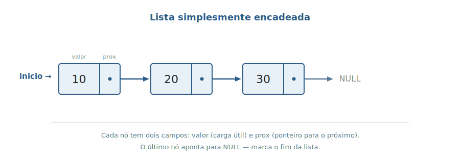
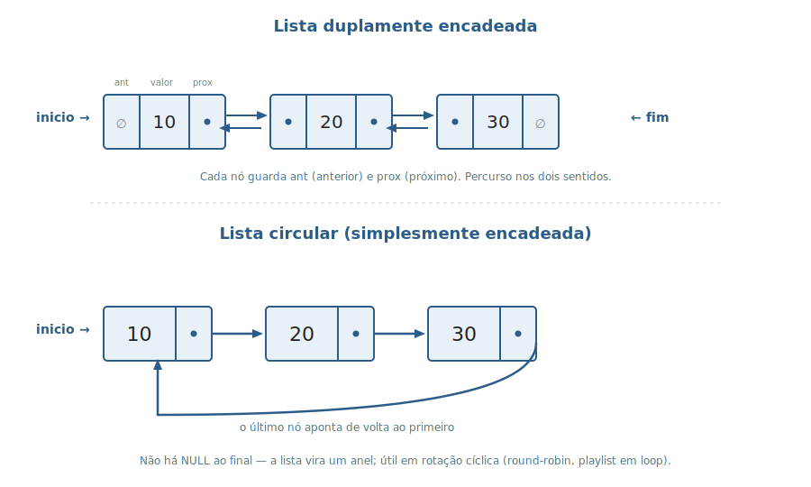
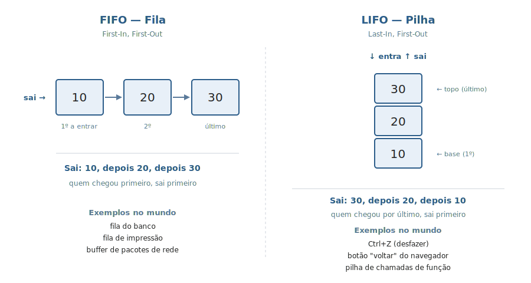

# Aula 02 — Listas Encadeadas, FIFO e LIFO, Duplamente Encadeadas e Circulares

> **Tipo desta aula**: conceitual / meta. Apresentamos a **família** das listas encadeadas e os **padrões de acesso** (FIFO, LIFO) que serão usados pelas estruturas concretas das próximas aulas. Implementação em C começa na Aula 03 (Fila) e segue na Aula 04 (Pilha).

---

## 1. Conceito — Aprofundamento Progressivo

### Camada 1 — A intuição inicial

Imagine que você precisa guardar uma sequência de coisas — nomes de alunos, mensagens recebidas, comandos digitados — e que essa sequência **muda o tempo todo**: às vezes cresce, às vezes encolhe, e você não sabe de antemão quantas coisas vai ter ao final do dia. Você não quer reservar um espaço gigante "por garantia" e desperdiçar memória; você também não quer ficar sem espaço no meio do caminho. A solução intuitiva é guardar **cada coisa em seu próprio lugarzinho separado**, e fazer com que cada lugarzinho **saiba onde está o próximo**. Quando precisar de mais espaço, cria-se mais um lugarzinho; quando algo é descartado, libera-se o lugarzinho dele. É exatamente essa ideia que vira **lista encadeada**.

### Camada 2 — Definição informal com vocabulário básico

Uma **lista encadeada** é uma estrutura de dados **dinâmica** em que os objetos — chamados **nós** — são organizados em uma **ordem linear**. Cada nó guarda no mínimo duas coisas: um **campo de informação** (também chamado **chave** ou **dado** — a carga útil daquele nó) e um **campo de endereço** que aponta para o próximo nó da sequência. Esse campo de endereço, em C, é o que chamamos de **ponteiro** — um número que indica onde, na memória, está o próximo nó. O último nó da sequência guarda no lugar do ponteiro um valor especial, `NULL`, que significa *"não há próximo, a lista acabou aqui"* (Tenenbaum, cap. 5 — *Listas em C*; Cormen et al., *Algoritmos: Teoria e Prática*, cap. 10 — *Estruturas de dados elementares*).

A diferença essencial em relação a um **vetor** está em **como a ordem dos elementos é estabelecida**. No vetor, a ordem é estritamente determinada pelos **índices numéricos sequenciais**: o elemento de índice 1 está sempre logo depois do elemento de índice 0, e essa relação está embutida na própria forma como o vetor é armazenado em memória. Na lista encadeada, a ordem é **explícita** — cada nó "diz" quem é o seu sucessor guardando dentro de si o ponteiro correspondente. Os nós podem estar espalhados pela memória em endereços completamente distintos; o que determina a sequência é apenas o ponteiro de cada um. Esse pequeno deslocamento conceitual — *"a ordem está nas ligações, não na vizinhança"* — é o que dá à lista todas as suas qualidades e todos os seus custos.

Para que o programa consiga **encontrar** o primeiro nó da lista, mantém-se separadamente um **ponteiro externo** chamado **início** (em inglês, *head*) que aponta para o primeiro elemento. Esse ponteiro **não é um nó** — é apenas o "endereço de entrada" da lista. Quando a lista está vazia, `início` vale `NULL`, indicando que não há nenhum nó. Sem esse ponteiro, a lista inteira ficaria perdida na memória — não haveria por onde começar a percorrê-la.

### Camada 3 — Propriedades e comportamento

A partir dessa estrutura básica (nós com chave + ponteiro, acessados por um ponteiro externo `início`), surgem **propriedades essenciais** que valem para qualquer lista encadeada:

- **Estrutura dinâmica**. A lista cresce e encolhe sob demanda. Cada vez que se quer adicionar um elemento, aloca-se um novo nó; cada vez que se descarta, libera-se. Não há capacidade máxima a priori nem espaço reservado e desperdiçado.
- **Sem necessidade de alocação contígua**. Os nós podem estar em qualquer região da memória; basta que cada um saiba onde está o próximo.
- **Sem deslocamento em inserção e remoção**. Inserir ou remover um nó exige apenas o **reajuste de ponteiros locais** — o anterior passa a apontar para o novo, o novo aponta para o seguinte. Os outros nós permanecem exatamente onde estavam. Isso é impossível em vetor: inserir no meio obriga a deslocar todos os elementos seguintes uma posição à frente.
- **Acesso linear, não aleatório**. Para chegar ao k-ésimo elemento, é preciso passar por todos os k−1 anteriores, seguindo os ponteiros um por um. Não existe **acesso aleatório direto** como o vetor oferece pelo índice.

A partir dessa base, surgem **variantes** que mudam pequenas decisões de projeto. Tenenbaum (cap. 5) e Cormen et al. (cap. 10.2) apresentam as principais:

- **Simplesmente encadeada**. Cada nó tem **um** ponteiro, para o sucessor. Percurso unidirecional. O último nó aponta para `NULL`.
- **Duplamente encadeada**. Cada nó tem **dois** ponteiros — um para o sucessor e um para o predecessor. Permite percorrer a lista nos dois sentidos. Inserção e remoção no meio ficam mais simples (o nó alvo já conhece seu antecessor). Custo: um ponteiro extra por nó.
- **Circular**. Em vez de o último nó apontar para `NULL`, ele aponta de volta para o primeiro, formando um anel contínuo. Não há mais "fim" explícito — apenas um ponto inicial. Pode ser circular simples ou circular dupla. Tenenbaum dedica seção própria às listas circulares no cap. 5.
- **Ordenada × não ordenada**. Decisão **ortogonal** às anteriores. Em uma lista **ordenada**, os nós são mantidos classificados pelo valor da chave (cada inserção localiza a posição correta antes de religar). Em uma lista **não ordenada**, os nós entram em ordem arbitrária. A escolha depende de qual operação domina o uso: lista ordenada paga custo na inserção para ganhar custo na busca por proximidade; lista não ordenada faz o oposto.

#### Sentinelas e nós de cabeçalho

Tanto Tenenbaum (caps. 4 e 5) quanto Cormen et al. (cap. 10.2) destacam um truque importante de implementação: incluir na lista um **nó fictício** — chamado **sentinela** ou **nó de cabeçalho** — que **não armazena dados da aplicação**, mas existe para **simplificar o código**. Sem sentinela, o código de inserção e remoção precisa tratar separadamente o caso *"estou mexendo no primeiro nó"* — porque o primeiro nó é apontado pelo ponteiro externo `início`, não por outro nó. Com sentinela, o primeiro nó "real" passa a ser sempre apontado pelo nó de cabeçalho, e os casos limite somem do código. O nó de cabeçalho também pode guardar **informações globais** sobre a lista, como o tamanho atual.

Cormen et al. (cap. 10.2) faz um alerta importante: o uso de sentinelas é uma decisão de **engenharia**, não dogma. Em programas que mantêm **muitas listas pequenas** (centenas ou milhares delas), cada sentinela é um nó que ocupa memória sem armazenar dado útil — o desperdício acumulado pode ser considerável. Em listas grandes ou em quantidade pequena, o ganho de simplicidade compensa.

#### Padrões de acesso — FIFO e LIFO

Há ainda dois padrões que aparecem o tempo todo associados a listas encadeadas — mas que são **políticas de comportamento**, não estruturas:

- **FIFO** (*First-In-First-Out*): o primeiro elemento que entrou é o primeiro que sai. É o comportamento de uma **Fila**. Modela qualquer situação de espera por ordem de chegada.
- **LIFO** (*Last-In-First-Out*): o último elemento que entrou é o primeiro que sai. É o comportamento de uma **Pilha**. Modela qualquer situação que precisa "desfazer na ordem inversa" — chamadas de função, Ctrl+Z, navegação para trás.

A mesma lista encadeada pode servir **tanto** a uma Fila **quanto** a uma Pilha. O que muda é a política — onde se insere, onde se remove. Tenenbaum trata cada padrão em capítulo próprio (cap. 2 — Pilhas, LIFO; cap. 4 — Filas, FIFO), justamente porque o comportamento é o que define a estrutura abstrata.

### Camada 4 — Definição formal e notação

Formalmente, uma lista simplesmente encadeada `L` pode ser descrita pela tupla:

`L = (N, chave, proximo, inicio)`

onde:

- **N** é o conjunto (possivelmente vazio) dos nós que compõem a lista.
- **chave** é uma função `chave: N → V` que associa cada nó a um valor do conjunto `V` dos valores armazenáveis (o *campo de informação*).
- **proximo** é uma função `proximo: N → N ∪ {NULL}` que associa cada nó ou ao próximo nó, ou ao símbolo `NULL` (se for o último).
- **inicio** ∈ `N ∪ {NULL}` é o ponteiro externo: aponta para o primeiro nó, ou vale `NULL` se a lista está vazia.

Sobre essa estrutura definimos as **operações canônicas** com suas pré-condições e pós-condições. Cormen et al. (cap. 10.2) apresenta as operações como `LIST-SEARCH`, `LIST-INSERT` e `LIST-DELETE`; Tenenbaum (cap. 5) usa nomenclatura equivalente em estilo C:

- `criar() → L` — devolve uma lista vazia (`inicio = NULL`, `N = ∅`).
- `inserir_inicio(L, v)` — adiciona um novo nó com chave `v` no início; `inicio` passa a apontar para ele.
- `remover_inicio(L) → V` — pré-condição: lista não vazia. Devolve a chave do primeiro nó e atualiza `inicio` para o segundo (ou `NULL` se só havia um).
- `buscar(L, v) → N ∪ {NULL}` — percorre a lista a partir de `inicio` e devolve o primeiro nó com `chave = v`, ou `NULL` se não houver.
- `vazia(L) → {0, 1}` — devolve `1` se `inicio = NULL`, senão `0`.

Os axiomas que regem a estrutura podem ser enunciados como:

- **A1**. `vazia(criar()) = 1` — uma lista recém-criada está vazia.
- **A2**. `vazia(inserir_inicio(L, v)) = 0` — uma lista que recebeu inserção não está vazia.
- **A3**. `remover_inicio(inserir_inicio(L, v)) = v` — remover o que se acabou de inserir devolve o mesmo valor (a propriedade que caracteriza o comportamento LIFO sobre `inserir_inicio`).

Para a variante **dupla**, acrescenta-se a função `anterior: N → N ∪ {NULL}` e a âncora `fim ∈ N ∪ {NULL}`. Para a variante **circular**, redefine-se `proximo` para que o último nó tenha `proximo(último) = inicio`, eliminando `NULL` como marcador de fim.

Como exemplo concreto, a lista que guarda os valores `[10, 20, 30]` corresponde a `N = {n₁, n₂, n₃}`, `chave(n₁) = 10`, `chave(n₂) = 20`, `chave(n₃) = 30`, `proximo(n₁) = n₂`, `proximo(n₂) = n₃`, `proximo(n₃) = NULL`, `inicio = n₁`.

### Camada 5 — Análise de complexidade

A análise é feita em termos de **n**, o número de elementos da lista, e usa a notação **O(...)** (lê-se *"ordem de"*) — uma forma de indicar como o tempo de execução cresce conforme `n` cresce. **O(1)** significa *"tempo constante, não depende de n"* — a operação demora aproximadamente o mesmo, tendo a lista 10 ou 10 milhões de elementos. **O(n)** significa *"tempo proporcional a n"* — dobrar o tamanho da lista dobra o tempo. A tabela abaixo segue Cormen et al. (CLRS, cap. 10.2) e Tenenbaum (cap. 5):

| Operação                                              | Lista simples | Lista dupla | Vetor (para comparação) |
|-------------------------------------------------------|---------------|-------------|--------------------------|
| Acessar o primeiro elemento                            | O(1)          | O(1)        | O(1)                     |
| Acessar o k-ésimo elemento (qualquer k)               | O(n)          | O(n)        | **O(1)**                 |
| Buscar uma chave (`buscar(L, v)`)                     | O(n)          | O(n)        | O(n)                     |
| Inserir no início                                      | **O(1)**      | **O(1)**    | O(n) (precisa deslocar)  |
| Inserir no fim (com ponteiro `fim`)                   | O(1)          | O(1)        | O(1)*                    |
| Remover o primeiro                                     | **O(1)**      | **O(1)**    | O(n) (precisa deslocar)  |
| Remover um nó dado o **ponteiro** para ele            | O(n)**        | **O(1)**    | O(n)                     |
| Remover um nó dada a **chave** (busca antes de remover)| O(n)         | O(n)        | O(n)                     |

\* amortizado (vetor dinâmico).
\** Na lista simples, ao remover um nó conhecido por ponteiro, é preciso achar o **anterior** percorrendo desde `inicio` — daí o O(n). Na dupla, o anterior já é conhecido pelo próprio nó alvo via ponteiro `anterior`, e a remoção cai para O(1).

A leitura prática é direta: **inserção e remoção podem ser extremamente rápidas** quando o local da operação já é conhecido — basta reajustar ponteiros locais. Quando é preciso **buscar** o elemento antes de operar sobre ele, o tempo da busca **domina** o resultado e a operação cai para O(n). É essa nuance que separa "deletar o primeiro nó" (O(1)) de "deletar o nó cuja chave é 42" (O(n)).

A conclusão clássica: **listas são fortes onde vetores são fracos** (inserir e remover nas extremidades sem custo de deslocamento; tamanho dinâmico) e **fracas onde vetores são fortes** (acesso direto por índice). Existem ainda **custos extras** das listas, que pesam quando o número de nós é muito grande:

- **Espaço *overhead*** por nó. Cada nó precisa armazenar ao menos um ponteiro (8 bytes em sistemas de 64 bits), somado à carga útil. Em listas com milhões de elementos pequenos, esse acréscimo é considerável.
- **Cada nó é uma alocação individual** com `malloc` (e libera-se com `free`). Um vetor faz uma única alocação para todos os elementos. Quanto mais nós, mais chamadas de alocação a lista paga.
- **Sentinelas em excesso**, como já alertado, podem desperdiçar memória em programas que mantêm milhares de listas muito pequenas — cada nó de cabeçalho ocupa espaço sem armazenar dado útil.

### Camada 6 — Conexões e variantes

A família das listas encadeadas é a base sobre a qual várias outras estruturas serão construídas no curso, e admite **implementações alternativas** importantes:

#### Implementação por vetores paralelos

Cormen et al. (cap. 10.3) mostra que listas encadeadas podem ser **sintetizadas usando vetores**, sem alocação dinâmica de memória. Em vez de ponteiros para a memória do sistema, usam-se **índices** de um vetor — cada nó é uma entrada do vetor, e o "ponteiro próximo" passa a ser o índice da próxima entrada. Há duas variantes comuns:

- **Arranjos paralelos**: um vetor `chave[]` para os dados, outro `proximo[]` para os índices, com a mesma posição `i` representando o nó `i`.
- **Arranjo único com deslocamentos**: um único vetor onde cada nó ocupa várias posições consecutivas (ex.: posição `i` para chave, `i+1` para próximo).

A ideia é a mesma da implementação com ponteiros — só muda o **tipo do "endereço"**: índice em vez de endereço de memória. Útil em sistemas embarcados, bancos de dados em arquivo, e qualquer ambiente sem (ou que evite) `malloc`/`free`.

#### Lista livre — gerenciamento dos nós disponíveis

Para gerenciar a criação e destruição de nós sem chamar o sistema operacional o tempo todo, Cormen et al. (cap. 10.3) e Tenenbaum (cap. 5) descrevem a **lista livre** (*free list*): uma estrutura auxiliar que mantém uma reserva de **nós disponíveis** para uso futuro. As operações canônicas são:

- `getnode()` (ou `ALLOCATE-OBJECT` no CLRS) — retira um nó da lista livre e devolve para a aplicação.
- `freenode(p)` (ou `FREE-OBJECT`) — devolve o nó `p` à lista livre, marcando-o como disponível novamente.

Na prática, a lista livre funciona como uma **pilha de blocos de memória reaproveitáveis**, evitando o custo repetido de chamadas a `malloc`/`free`. É um padrão recorrente em alocadores de memória, *pools* de objetos e bancos de dados.

#### Estruturas que reaparecem no curso

- **Pilha** (Aula 04) — implementada sobre lista simples encadeada operada como LIFO; insere e remove sempre pelo início.
- **Fila** (Aula 03) — implementada sobre lista simples encadeada com âncoras `inicio` e `fim`, operada como FIFO; insere no fim, remove do início.
- **Listas duplamente encadeadas** aparecem em editores de texto (cursor que caminha em ambas as direções), histórico de navegação de browsers (botões "voltar" e "avançar") e estruturas mais complexas como árvores que precisam de referência ao pai.
- **Listas circulares** aparecem em escalonadores *round-robin* do sistema operacional, em *playlists* com modo "repetir tudo" e em algoritmos sobre dados intrinsecamente cíclicos (algoritmo de Josephus).

Cada uma dessas estruturas é tema de aulas próprias — esta aula apenas estabelece o vocabulário comum, as variantes, o gerenciamento de memória e os padrões de acesso (FIFO, LIFO) que reaparecerão sistematicamente.

---

## 2. Visualização Gráfica

### Passo 1: o nó e a lista simples encadeada

A unidade básica é o **nó**: uma caixinha com dois campos — `valor` e `proximo`. Vários nós ligados por setas formam a lista; o ponteiro âncora `inicio` aponta para o primeiro; o último aponta para `NULL`.

### Passo 2: variantes — dupla e circular

A lista **duplamente encadeada** acrescenta um ponteiro `anterior` em cada nó, permitindo percorrer nos dois sentidos. A lista **circular** liga o último de volta ao primeiro, formando um anel.

### Passo 3: FIFO e LIFO — dois padrões sobre a mesma estrutura

A mesma lista encadeada pode servir tanto a uma **Fila** (FIFO — sai pela frente, entra atrás) quanto a uma **Pilha** (LIFO — entra e sai pelo mesmo lado). O que muda é a **política de acesso**, não a estrutura.

---

## 3. Problema Motivador

> *"Por que não usar sempre vetor?"*

Um sistema de mensageria precisa armazenar **mensagens em trânsito**: chegam mensagens novas o tempo todo, mensagens antigas são entregues e removidas, e o **número total varia muito** ao longo do dia — de zero, em horários de baixa demanda, a milhares, em picos.

**Tentativa 1 — vetor de tamanho fixo.** Você reserva, na inicialização, um vetor de 10.000 posições. Em horários de pico, lota e o sistema começa a recusar mensagens. Em horários de calmaria, 9.900 posições ficam vazias ocupando memória inútil.

**Tentativa 2 — vetor que cresce dinamicamente** (`realloc` quando enche). Funciona melhor, mas cada `realloc` pode ter de **copiar** todo o conteúdo para uma nova região contígua maior — operação O(n) que congela o sistema por alguns milissegundos quando o vetor está grande. Pior: ao remover mensagens entregues, todas as outras precisam **deslocar** uma posição para preencher o buraco — outro O(n).

**Solução com lista encadeada**: cada mensagem é um **nó** alocado individualmente. Inserir no fim da lista é O(1) (com ponteiro `fim`). Remover da frente é O(1) (avança `inicio`). A memória usada é **exatamente** a necessária, nem mais nem menos. Não há cópias massivas; não há limite estático.

Esse é o padrão **FIFO** — e é exatamente assim que funcionam:
- Filas de impressão.
- *Buffers* de pacotes de rede em roteadores.
- Filas de tarefas em sistemas de mensageria (RabbitMQ, Kafka — na essência conceitual).

Para o padrão **LIFO** (Pilha), o exemplo análogo é a **pilha de chamadas** que toda linguagem de programação mantém para você: cada chamada de função empilha um *frame* com variáveis locais; o `return` desempilha. Como o número de chamadas aninhadas varia, lista encadeada é uma representação natural.

A lição: **estrutura dinâmica** + **acesso só nas extremidades** = lista encadeada brilha.

---

## 4. Analogias

**1. Fila do banco.**
A entrada da fila é o **fim** (último a chegar fica atrás de todos); a saída é o **início** (o próximo a ser atendido). Cada pessoa "aponta" mentalmente para a pessoa da frente — é a sua referência de *"próximo a sair"*. Quando alguém é atendido, ele sai pela frente e a fila **avança**. Quando alguém chega, ele entra pelo fundo. Ninguém precisa "deslocar" fisicamente — cada pessoa só precisa lembrar quem está na sua frente. Isso é uma **lista simplesmente encadeada operada como FIFO** (Fila).

**2. Pilha de provas para corrigir.**
O professor coloca cada prova **em cima** da última. Quando começa a corrigir, **pega a do topo** — que é a última que foi colocada. Não há esforço para chegar à do meio: você não a acessa. A pilha cresce e encolhe pelo mesmo lado. Isso é uma **lista simplesmente encadeada operada como LIFO** (Pilha).

---

## 5. Exercícios Práticos

> Estes exercícios são **conceituais** — não envolvem programar em C. Eles testam se você consegue **identificar a variante** adequada para um problema e **escolher** entre vetor e lista a partir do padrão de uso.

**Exercício 1 — Identificando a variante.**
Para cada situação abaixo, indique a variante de lista encadeada mais adequada (simples, dupla, circular simples, circular dupla) e justifique em uma linha:
- a) Histórico de comandos de um shell em que se navega com setas para cima e para baixo.
- b) Música em uma *playlist* que toca em modo "repetir tudo" sem parar.
- c) Buffer de mensagens em um sistema FIFO em que se insere atrás e remove na frente.
- d) Cursor de um editor de texto que precisa caminhar caractere a caractere para esquerda e direita.
- e) Escalonador *round-robin* de processos: o sistema operacional dá 10 ms para o processo atual e passa para o próximo, voltando ao primeiro após o último.

*Critério de aceitação*: para cada item, indicar a variante + 1 linha de justificativa baseada **na operação dominante** (sentido de navegação, repetição cíclica, padrão de inserção/remoção).

> **Resposta mínima aceitável**
>
> - a) **Lista duplamente encadeada** — navegação em dois sentidos exige ponteiro para o anterior e para o próximo.
> - b) **Lista circular** (simples basta) — o último item retorna ao primeiro, sem fim explícito.
> - c) **Lista simplesmente encadeada** com ponteiros `inicio` e `fim` — inserção atrás e remoção na frente são ambas O(1) sem precisar do anterior.
> - d) **Lista duplamente encadeada** — caminhar para a esquerda exige ponteiro para o anterior.
> - e) **Lista circular** — round-robin é repetição cíclica natural; o ponteiro "atual" avança e ao chegar ao último volta ao primeiro automaticamente.

**Exercício 2 — Escolhendo entre vetor e lista.**
Para cada cenário, decida se a melhor representação é **vetor** ou **lista encadeada**, e justifique em duas linhas baseado em qual operação domina o uso e em qual é a mais cara em cada estrutura.
- a) Tabela de notas dos 50 alunos da disciplina, acessada repetidamente por **número de matrícula** (índice).
- b) Lista de tarefas pendentes que muda muito ao longo do dia, com inserções e remoções frequentes na **frente** e no **fim**, e raros acessos ao meio.
- c) Histórico de operações de um editor para suportar Ctrl+Z (desfazer), com inserção e remoção apenas no **topo**.
- d) Coleção de 10 milhões de pontos `(x, y)` para um cálculo numérico que faz **uma única passada** sequencial sobre todos.

*Critério de aceitação*: indicar vetor ou lista + dois pontos de justificativa (operação dominante e custo da operação cara em cada alternativa).

> **Resposta mínima aceitável**
>
> - a) **Vetor**. Acesso por índice é O(1) em vetor e O(n) em lista; o uso é dominado por acesso aleatório.
> - b) **Lista encadeada** (com ponteiros `inicio` e `fim`). Inserção/remoção nas extremidades é O(1) em lista e O(n) em vetor (deslocamento); o uso é dominado por essas operações.
> - c) **Lista encadeada** (operada como Pilha) — também aceitável vetor dinâmico, pois inserção/remoção só no fim do vetor é O(1) amortizado. Lista tem tamanho exato e evita realocações; vetor é mais simples de implementar e usa apenas uma alocação.
> - d) **Vetor**. 10 M de elementos em lista exigiriam 10 M de chamadas a `malloc` e cerca de 80 MB só de ponteiros (8 bytes × 10 M), além da memória dos próprios pontos. O vetor faz **uma única** alocação para todos os 10 M e armazena somente os pontos. Como o uso é apenas uma passada sequencial, nenhuma vantagem da lista (inserção/remoção rápida) é aproveitada.

---

## 6. Referências

- **Tenenbaum, A. M.; Langsam, Y.; Augenstein, M. J.** — *Estruturas de Dados Usando C*. Capítulo 4 (*"Filas e listas"*) e capítulo 5 (*"Listas em C"*). Apresenta a lista simples, a duplamente encadeada e a circular com o nível de detalhe canônico da disciplina; cobre também sentinelas e nós de cabeçalho.

- **Cormen, T. H.; Leiserson, C. E.; Rivest, R. L.; Stein, C.** — *Algoritmos: Teoria e Prática* (CLRS). Capítulo 10, seções 10.2 (*"Listas ligadas"*) e 10.3 (*"Implementando ponteiros e objetos"*). Trata formalmente as variantes (simples, dupla, circular, ordenada/não ordenada), o uso de sentinelas, a implementação por vetores paralelos e a lista livre (`ALLOCATE-OBJECT`/`FREE-OBJECT`).

- **Sedgewick, R.** — *Algoritmos em C*, Parte 1, capítulo 3 (*"Estruturas de dados elementares"*), seção sobre **listas ligadas**. Discussão sucinta com diagramas excelentes.

**Leitura complementar**:
- **Ziviani, N.** — *Projeto de Algoritmos com Implementações em Pascal e C*. Capítulo sobre estruturas lineares — cobre as variantes em texto em português.
