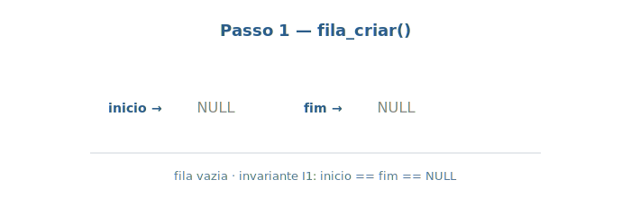
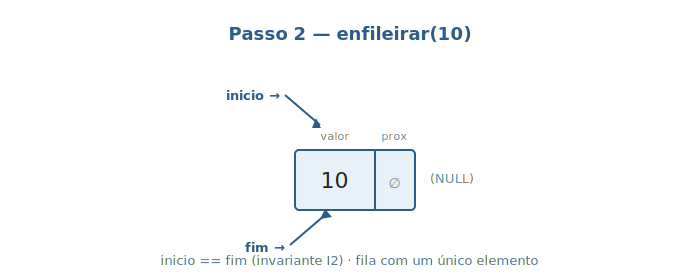
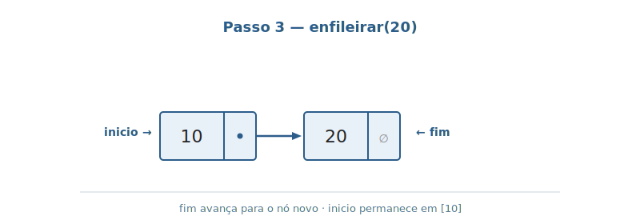
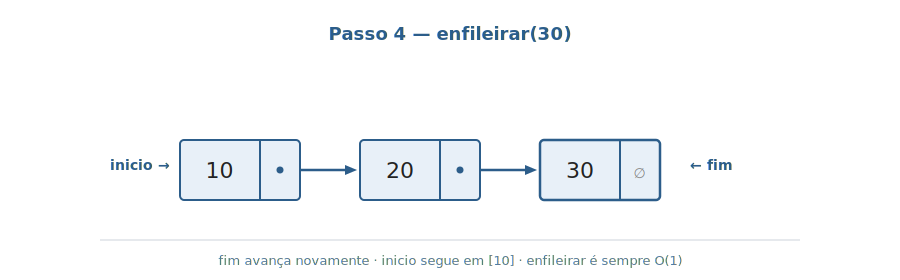
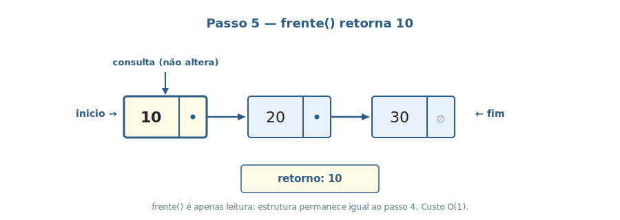
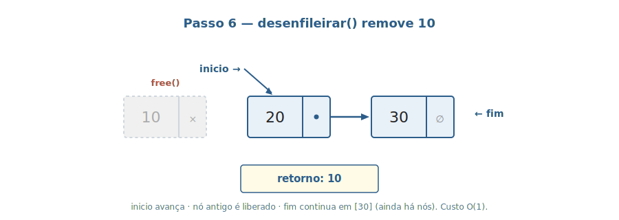
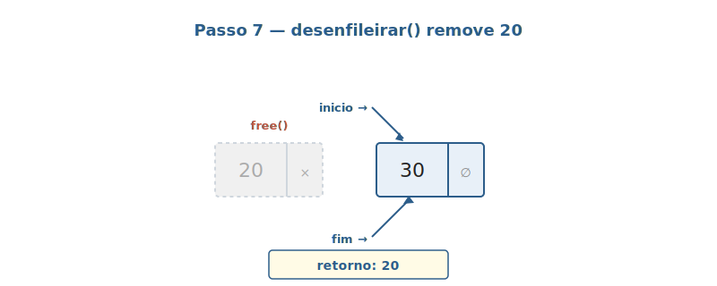

# Aula 03 — Fila (Queue)

> **Tipo desta aula**: implementação. A Fila é a primeira estrutura concreta da disciplina. A representação interna escolhida aqui é **lista simplesmente encadeada com ponteiros para início e fim** — exatamente como a Aula 02 antecipou.

---

## 1. Conceito — Nível Profundo

### Fila, em uma frase

Uma **Fila** é o TAD que representa uma **sequência de elementos com inserção em uma extremidade e remoção na extremidade oposta**, governada pela política **FIFO** (*First-In, First-Out*) — o primeiro elemento que entrou é o primeiro a sair (Tenenbaum, cap. 4 — *"Filas e listas"*; Sedgewick, *Algoritmos em C*, Parte 1, cap. 4 — *"Abstract Data Types"*, seção sobre **FIFO queues**).

A Fila é, ao lado da Pilha, uma das duas estruturas lineares mais usadas da computação. Ela aparece em qualquer situação que precise preservar a **ordem temporal de chegada**: filas de impressão, *buffers* de pacotes em redes, escalonamento de processos por chegada (FCFS), filas de tarefas em sistemas distribuídos.

### Especificação formal — TAD Fila

Reusando a notação da Aula 01:

```
TAD Fila de Inteiros

  Tipos:
    Fila                                        (a estrutura)
    Inteiro
    Booleano

  Operações:
    criar()                       -> Fila
    enfileirar(Fila, Inteiro)     -> Fila
    desenfileirar(Fila)           -> Fila        [erro se vazia]
    frente(Fila)                  -> Inteiro     [erro se vazia]
    vazia(Fila)                   -> Booleano

  Axiomas (para qualquer fila F, inteiro x):
    A1. vazia(criar())                                = verdadeiro
    A2. vazia(enfileirar(F, x))                       = falso
    A3. frente(enfileirar(criar(), x))                = x
    A4. frente(enfileirar(F, x))                      = frente(F)            quando vazia(F) = falso
    A5. desenfileirar(enfileirar(criar(), x))         = criar()
    A6. desenfileirar(enfileirar(F, x))               = enfileirar(desenfileirar(F), x)   quando vazia(F) = falso
    A7. frente(criar())                               = erro
    A8. desenfileirar(criar())                        = erro
```

Os axiomas **A4** e **A6** são o coração do FIFO: eles dizem que, mesmo com novos elementos chegando atrás, a **frente** continua sendo quem entrou antes — só muda quando alguém é desenfileirado de fato. Tenenbaum (cap. 4) discute esse mesmo conjunto de axiomas como definição operacional da Fila.

### Representação interna escolhida

Uma Fila pode ser implementada de várias formas. CLRS (cap. 10, seção 10.1) cobre as três opções abaixo com pseudocódigo claro; Tenenbaum (cap. 4) traz a implementação em C de cada uma:

| Representação | Vantagem | Custo |
|---|---|---|
| Vetor simples com deslocamento | Simples de entender | Remover na frente é O(n) — desloca todos |
| Vetor circular | Tudo em O(1) | Capacidade fixa; aritmética modular sobre os índices |
| **Lista simplesmente encadeada com `inicio` e `fim`** | Tudo em O(1); tamanho dinâmico | Ponteiro extra por nó (8 bytes); cada nó é uma alocação individual com `malloc` |

A escolha desta aula é a **lista simplesmente encadeada com dois ponteiros âncora**: `inicio` aponta para o nó da **frente** (o próximo a sair) e `fim` aponta para o nó do **fundo** (o último a entrar). Sob essa representação:

- `enfileirar(x)` cria um nó com valor `x`, liga o `fim` atual a ele e atualiza `fim`. **O(1).**
- `desenfileirar()` lê o valor do nó apontado por `inicio`, faz `inicio` apontar para o próximo, libera o nó antigo. **O(1).**
- `frente()` retorna o valor do nó apontado por `inicio` sem alterar a estrutura. **O(1).**
- `vazia()` testa se `inicio == NULL`. **O(1).**

Toda operação em **O(1)** — esse é o ganho que motivou a escolha pela lista.

### Propriedades que devem sempre valer

Algumas propriedades têm de continuar verdadeiras antes e depois de cada operação — chamamos isso de **invariantes** da estrutura. Para esta Fila são três:

- **Quando a fila está vazia**, os dois ponteiros (`inicio` e `fim`) são `NULL` ao mesmo tempo. Não pode acontecer de um deles apontar para um nó e o outro ser `NULL`.
- **Quando a fila tem um único elemento**, `inicio` e `fim` apontam para o **mesmo nó** (a frente também é o fim).
- **Quando a fila tem mais de um elemento**, ambos os ponteiros são diferentes de `NULL`, o `proximo` do nó apontado por `fim` é `NULL` (porque o último nó não tem ninguém atrás), e seguindo `inicio` pelos campos `proximo` chega-se ao nó apontado por `fim`.

Cada operação tem de **terminar deixando essas três propriedades válidas**. Em particular, ao desenfileirar o **último** elemento (quando `inicio == fim`), é preciso atualizar **os dois** ponteiros para `NULL` — esquecer disso deixa o `fim` apontando para um nó que acabou de ser liberado, o que causa falhas obscuras nas próximas operações.

---

## 2. Conceito — Nível Simplificado

Pense na **fila do banco**.

- Quem chega entra **atrás** de todo mundo. Esse é o `enfileirar`.
- Quem é atendido sai **pela frente**. Esse é o `desenfileirar`.
- Para saber quem é o próximo a ser atendido sem chamar ainda, basta olhar para a frente da fila. Esse é o `frente`.
- Para saber se há alguém na agência, olha-se a fila inteira. Esse é o `vazia`.

A regra inviolável: **ninguém fura a fila**. Quem chegou primeiro é atendido primeiro. Esse é o **FIFO** — e é literalmente o que a estrutura modela.

A Fila não te deixa olhar o terceiro da fila, nem o último. Ela te deixa ver e mexer **só nas duas pontas**. Essa restrição é o que torna a Fila simples e rápida — e é também o que faz dela uma estrutura **diferente** de uma lista genérica.

---

## 3. Visualização Gráfica

A sequência abaixo mostra o **ciclo de vida completo** de uma Fila vazia: criação, três `enfileirar`, uma consulta `frente`, dois `desenfileirar` até esvaziar de novo. Observe os ponteiros `inicio` e `fim` em cada passo.

### Passo 1: criar_fila()



A fila começa vazia: `inicio = NULL`, `fim = NULL`. Os dois ponteiros são nulos ao mesmo tempo, exatamente como esperado de uma fila vazia.

### Passo 2: enfileirar(10)



Cria-se um nó `[10|NULL]`. Como a fila estava vazia, `inicio` **e** `fim` passam a apontar para esse mesmo nó — quando há um único elemento, frente e fim coincidem.

### Passo 3: enfileirar(20)



Cria-se um nó `[20|NULL]`. O `proximo` do antigo `fim` (nó `[10]`) passa a apontar para o nó novo. `fim` é atualizado para apontar ao novo nó. `inicio` **não muda**.

### Passo 4: enfileirar(30)



Mesma lógica do passo 3. `fim` "avança" para o nó novo; `inicio` continua na frente.

### Passo 5: frente() retorna 10



`frente()` apenas **lê** o valor do nó apontado por `inicio`. **Não altera** a estrutura. Retorna `10`.

### Passo 6: desenfileirar() remove 10



O nó da frente é "destacado": `inicio` passa a apontar para o `proximo` dele (`[20]`), e o nó antigo `[10]` é **liberado** com `free`. Como ainda há nós, `fim` permanece apontando para `[30]`.

### Passo 7: desenfileirar() remove 20



Mesma lógica. Agora resta apenas um nó (`[30]`); novamente `inicio` e `fim` apontam para o mesmo nó. **Atenção**: se desenfileirássemos mais uma vez, precisaríamos atualizar **os dois** ponteiros para `NULL` (caso especial do código).

---

## 4. Problema Motivador

> *"Como uma impressora compartilhada decide quem imprime primeiro?"*

Em um laboratório com dezenas de alunos e uma única impressora, várias requisições chegam ao mesmo tempo. Sem nenhuma estrutura de ordenação, a impressora teria de:

- ou imprimir em ordem aleatória (resultado: o aluno azarado nunca recebe seu trabalho);
- ou imprimir só uma a cada momento e recusar todas as demais (resultado: alunos clicando "imprimir" 50 vezes até dar certo).

A solução padrão dos sistemas operacionais (Linux, Windows, macOS) é: **toda requisição entra em uma Fila**. A impressora processa o primeiro da fila, o remove, e passa para o próximo. Quem chegou primeiro imprime primeiro — **FIFO**.

Esse mesmo padrão aparece em escala muito maior:

- **Buffer de pacotes em roteadores**. Quando um roteador recebe pacotes mais rápido do que consegue encaminhar, os pacotes excedentes vão para uma Fila. Se a fila enche, os novos são **descartados** (parte do controle de congestionamento da Internet).
- **Escalonadores FCFS** (*First-Come, First-Served*) de processos em sistemas operacionais simples: cada processo que pede CPU vai para uma fila; o escalonador atende em ordem.
- **Filas de mensagens distribuídas** (RabbitMQ, AWS SQS, Kafka — em sua essência conceitual). Produtores enfileiram mensagens; consumidores desenfileiram. A fila desacopla quem produz de quem consome.

A Fila é a estrutura natural para qualquer cenário em que **a ordem temporal de chegada precisa ser respeitada** e **nenhum elemento pode ser pulado**.

---

## 5. Analogias

**1. Fila do banco.**
Você chega, vai para o **fim**. Quem está sendo atendido está na **frente**. Você não é atendido fora de ordem (ou ouve reclamação), e ninguém atrás de você é atendido antes. As únicas pontas que importam são `inicio` (próximo a ser atendido) e `fim` (último a chegar). O meio da fila é invisível para a operação — você não interage com ele.

**2. Fila de mensagens do WhatsApp quando você está sem internet.**
Você manda 5 mensagens em sequência sem sinal. Elas ficam **enfileiradas** no aparelho na ordem que foram digitadas. Quando o sinal volta, o WhatsApp envia uma a uma, **na ordem em que foram digitadas** — não a última primeiro, não em ordem aleatória. É FIFO puro.

---

## 6. Código em C

A implementação a seguir segue exatamente a representação descrita na Seção 1: lista simplesmente encadeada com ponteiros `inicio` e `fim`, todas as operações em O(1).

> **Sobre a organização do arquivo.** Tudo o que vem a seguir vive em **um único arquivo** chamado `fila.c`: os `#include`s, as `struct` da fila e do nó, todas as funções da TAD e a `main()` demonstrativa. Numa aula futura sobre **organização de projetos em C**, vamos ver como dividir uma TAD em um arquivo de cabeçalho (`fila.h`) e um arquivo de implementação (`fila.c`), separando *interface* de *implementação* (encapsulamento técnico no nível do compilador). Por enquanto, manter tudo num lugar só facilita ler de cima a baixo.

### `fila.c` — arquivo único

```c
#include <stdio.h>
#include <stdlib.h>

// Cada elemento da fila vira um No com o valor e um
// ponteiro para o proximo No.
typedef struct No {
    int valor;
    struct No* proximo;
} No;

// A fila guarda dois ponteiros: a frente (proximo a sair)
// e o fim (ultimo que entrou).
typedef struct Fila {
    No* inicio;
    No* fim;
} Fila;

// Cria uma fila vazia.
Fila* fila_criar(void) {
    Fila* f = malloc(sizeof(Fila));
    if (f == NULL) {
        printf("erro: memoria insuficiente\n");
        exit(1);
    }
    f->inicio = NULL;
    f->fim = NULL;
    return f;
}

// Verdadeiro (1) se a fila nao tem nenhum elemento.
int fila_vazia(Fila* f) {
    return f->inicio == NULL;
}

// Coloca um valor no fim da fila.
void fila_enfileirar(Fila* f, int valor) {
    No* novo = malloc(sizeof(No));
    if (novo == NULL) {
        printf("erro: memoria insuficiente\n");
        exit(1);
    }
    novo->valor = valor;
    novo->proximo = NULL;

    if (fila_vazia(f)) {
        // Fila estava vazia: o novo no e' tambem a frente.
        f->inicio = novo;
    } else {
        // Liga o no que era o fim ao novo no.
        f->fim->proximo = novo;
    }
    f->fim = novo;
}

// Remove e devolve o valor da frente da fila.
// Pre-requisito: a fila nao pode estar vazia.
int fila_desenfileirar(Fila* f) {
    if (fila_vazia(f)) {
        printf("erro: fila vazia\n");
        exit(1);
    }
    No* removido = f->inicio;
    int valor = removido->valor;

    f->inicio = removido->proximo;  // a frente avanca para o proximo no
    if (f->inicio == NULL) {
        // Tiramos o ultimo elemento: a fila ficou vazia.
        // O fim tambem precisa virar NULL. Se nao zerarmos, ele
        // continuaria apontando para o no que vamos liberar com free()
        // logo abaixo — viraria um ponteiro para memoria invalida.
        f->fim = NULL;
    }
    free(removido);
    return valor;
}

// Devolve o valor da frente sem remover.
int fila_frente(Fila* f) {
    if (fila_vazia(f)) {
        printf("erro: fila vazia\n");
        exit(1);
    }
    return f->inicio->valor;
}

// Libera toda a memoria usada pela fila.
void fila_destruir(Fila* f) {
    No* atual = f->inicio;
    while (atual != NULL) {
        No* proximo = atual->proximo;
        free(atual);
        atual = proximo;
    }
    free(f);
}

// Programa demonstrativo.
int main(void) {
    Fila* f = fila_criar();

    fila_enfileirar(f, 10);
    fila_enfileirar(f, 20);
    fila_enfileirar(f, 30);
    printf("Frente da fila: %d\n", fila_frente(f));

    printf("Desenfileirando: ");
    while (!fila_vazia(f)) {
        printf("%d ", fila_desenfileirar(f));
    }
    printf("\n");

    fila_destruir(f);
    return 0;
}
```

### Compilando e rodando

Como tudo está em um só arquivo, a linha de compilação é direta:

```sh
gcc -Wall -Wextra -o fila_demo fila.c
./fila_demo
```

Saída esperada:

```
Frente da fila: 10
Desenfileirando: 10 20 30
```

A linha `Desenfileirando: 10 20 30` é a **prova empírica** do FIFO: a ordem de saída é exatamente a ordem de entrada. Se algum dia trocarmos a representação interna (vetor circular, por exemplo), essa saída **continuará a mesma** — o contrato é o que importa.

---

## 7. Exercícios Práticos

> Exercícios mistos: alguns conceituais, alguns de codificação. Compile e rode os de código com `gcc -Wall -Wextra`.

**Exercício 1 — Trace na mão.**
Considere uma fila vazia e a seguinte sequência de operações: `enfileirar(7)`, `enfileirar(3)`, `enfileirar(11)`, `desenfileirar`, `enfileirar(5)`, `frente`, `desenfileirar`, `desenfileirar`. Para cada operação, escreva o estado da fila (sequência da frente para o fim) e, quando aplicável, o valor retornado.

*Critério de aceitação*: lista de 8 estados + valores retornados nas operações `desenfileirar` e `frente`. Estado final esperado: fila com `[5]` apenas.

> **Resposta mínima aceitável**
>
> | Operação           | Estado (frente → fim) | Retorno |
> |--------------------|----------------------|---------|
> | `enfileirar(7)`    | `[7]`                | —       |
> | `enfileirar(3)`    | `[7, 3]`             | —       |
> | `enfileirar(11)`   | `[7, 3, 11]`         | —       |
> | `desenfileirar`    | `[3, 11]`            | `7`     |
> | `enfileirar(5)`    | `[3, 11, 5]`         | —       |
> | `frente`           | `[3, 11, 5]`         | `3`     |
> | `desenfileirar`    | `[11, 5]`            | `3`     |
> | `desenfileirar`    | `[5]`                | `11`    |

**Exercício 2 — Função `imprimir`.**
Adicione ao `fila.c` uma função `void fila_imprimir(Fila* f)` que imprime os valores da fila no formato `[10, 20, 30]` da frente para o fim, ou `[]` se vazia. **Não** pode usar `fila_desenfileirar` (a função imprime sem alterar a fila). Acrescente chamadas a essa função na `main()` antes e depois das operações.

*Critério de aceitação*: a função fica no mesmo `fila.c`, junto às outras operações; a `main()` chama antes e depois; saída coincide com o estado esperado.

> **Resposta mínima aceitável**
>
> ```c
> void fila_imprimir(Fila* f) {
>     printf("[");
>     No* atual = f->inicio;
>     while (atual != NULL) {
>         printf("%d", atual->valor);
>         if (atual->proximo != NULL) printf(", ");
>         atual = atual->proximo;
>     }
>     printf("]\n");
> }
> ```
>
> A função percorre a lista lendo `valor` e `proximo` sem modificar nada, então é segura de chamar a qualquer momento.

**Exercício 3 — Fila como buffer de tarefas.**
Escreva um programa que lê inteiros do teclado até o usuário digitar `0`. Cada inteiro positivo deve ser enfileirado; cada inteiro negativo deve **desenfileirar** um elemento e imprimi-lo (ou imprimir `"fila vazia"` se não houver). Ao final (ao digitar `0`), imprima o estado da fila com `fila_imprimir`.

*Critério de aceitação*: programa compila, lê e processa entradas conforme regra; estado final coerente.

> **Resposta mínima aceitável**
>
> ```c
> int main(void) {
>     Fila* f = fila_criar();
>     int x;
>     while (scanf("%d", &x) == 1 && x != 0) {
>         if (x > 0) {
>             fila_enfileirar(f, x);
>         } else {
>             if (fila_vazia(f)) {
>                 printf("fila vazia\n");
>             } else {
>                 printf("%d\n", fila_desenfileirar(f));
>             }
>         }
>     }
>     fila_imprimir(f);
>     fila_destruir(f);
>     return 0;
> }
> ```

**Exercício 4 — Inverter uma fila usando uma pilha.**
Sabendo que uma Pilha é LIFO e uma Fila é FIFO, escreva (em pseudocódigo ou em C) um algoritmo que recebe uma Fila `F` e a **inverte** — ao final, o elemento que era a frente vira o último e vice-versa — usando como estrutura auxiliar uma **Pilha** `P` (e nenhuma outra estrutura). Após o algoritmo, `F` está invertida e `P` está vazia.

*Critério de aceitação*: descrever o algoritmo em duas fases (esvaziar `F` para `P`, depois esvaziar `P` para `F`) e justificar por que a fila final fica invertida.

> **Resposta mínima aceitável**
>
> ```
> 1. Enquanto F nao estiver vazia:
>      x = desenfileirar(F)
>      empilhar(P, x)
> 2. Enquanto P nao estiver vazia:
>      y = desempilhar(P)
>      enfileirar(F, y)
> ```
>
> **Por que inverte**: na fase 1, os elementos saem de `F` na ordem original (frente → fim) e entram em `P` em LIFO. Na fase 2, saem de `P` em ordem **inversa à de entrada** (último-a-entrar-primeiro-a-sair) e voltam para `F` na nova ordem. Resultado: o que era frente ficou no fim. Custo total: **O(n)**.

**Exercício 5 — Fila circular sobre vetor (desafio).**
Reimplemente o mesmo TAD Fila em um **novo arquivo** `fila_vetor.c` (autossuficiente, com sua própria `main`), usando **vetor de tamanho fixo** com aritmética **circular** sobre os índices. **Mantenha as mesmas assinaturas** de função (`fila_criar`, `fila_enfileirar`, `fila_desenfileirar`, `fila_frente`, `fila_vazia`, `fila_destruir`) e a mesma `main` demonstrativa do `fila.c` original — só muda a `struct Fila` e o corpo das funções. Estrutura interna sugerida:

```c
typedef struct Fila {
    int dados[100];    // vetor com capacidade fixa de 100 posicoes
    int frente;        // indice do proximo a sair
    int tras;          // indice da proxima posicao livre
    int tamanho;       // quantidade atual de elementos
} Fila;
```

Ao enfileirar, calcule `tras = (tras + 1) % 100`. Ao desenfileirar, `frente = (frente + 1) % 100`. Quando a fila está cheia (`tamanho == 100`), imprima erro e encerre com `exit(1)` — mesmo padrão usado para "fila vazia" no código da aula.

*Critério de aceitação*: o programa em `fila_vetor.c` compila com `gcc -Wall -Wextra -o fila_vetor fila_vetor.c` e produz **a mesma saída** do `fila.c` original para a sequência de teste — `Desenfileirando: 10 20 30`. Mostra o poder do TAD: trocou a representação interna, o resultado observável não muda.

> **Resposta mínima aceitável**
>
> ```c
> /* fila_vetor.c — Fila (FIFO) sobre vetor circular */
> #include <stdio.h>
> #include <stdlib.h>
>
> #define CAPACIDADE 100
>
> typedef struct Fila {
>     int dados[CAPACIDADE];
>     int frente;
>     int tras;
>     int tamanho;
> } Fila;
>
> Fila* fila_criar(void) {
>     Fila* f = malloc(sizeof(Fila));
>     if (f == NULL) { printf("erro: memoria\n"); exit(1); }
>     f->frente = 0;
>     f->tras = 0;
>     f->tamanho = 0;
>     return f;
> }
>
> int fila_vazia(Fila* f) {
>     return f->tamanho == 0;
> }
>
> void fila_enfileirar(Fila* f, int valor) {
>     if (f->tamanho == CAPACIDADE) { printf("erro: fila cheia\n"); exit(1); }
>     f->dados[f->tras] = valor;
>     f->tras = (f->tras + 1) % CAPACIDADE;   // avanca circularmente
>     f->tamanho++;
> }
>
> int fila_desenfileirar(Fila* f) {
>     if (fila_vazia(f)) { printf("erro: fila vazia\n"); exit(1); }
>     int v = f->dados[f->frente];
>     f->frente = (f->frente + 1) % CAPACIDADE;
>     f->tamanho--;
>     return v;
> }
>
> int fila_frente(Fila* f) {
>     if (fila_vazia(f)) { printf("erro: fila vazia\n"); exit(1); }
>     return f->dados[f->frente];
> }
>
> void fila_destruir(Fila* f) {
>     free(f);
> }
>
> int main(void) {
>     Fila* f = fila_criar();
>     fila_enfileirar(f, 10);
>     fila_enfileirar(f, 20);
>     fila_enfileirar(f, 30);
>     printf("Frente da fila: %d\n", fila_frente(f));
>     printf("Desenfileirando: ");
>     while (!fila_vazia(f)) printf("%d ", fila_desenfileirar(f));
>     printf("\n");
>     fila_destruir(f);
>     return 0;
> }
> ```
>
> A `main` é literalmente a mesma do `fila.c` da aula. Ela compila e produz a mesma saída — porque depende **apenas das assinaturas** das funções, não da representação interna. É o axioma da Aula 01 colhendo frutos: o que muda é só a struct `Fila` e o corpo das funções; o cliente não percebe a diferença.

---

## 8. Referências

- **Tenenbaum, A. M.; Langsam, Y.; Augenstein, M. J.** — *Estruturas de Dados Usando C*. Capítulo 4, *"Filas e listas"*, seções específicas sobre filas, com a discussão de implementação por vetor circular e por lista encadeada.

- **Sedgewick, R.** — *Algoritmos em C*, Parte 1, capítulo 4, *"Abstract Data Types"*, seção sobre **FIFO queues and generalized queues**. Apresenta a fila como TAD e variantes.

**Leituras complementares**:
- **CLRS** — *Algoritmos: Teoria e Prática*. Capítulo 10, seção 10.1 — *"Pilhas e filas"*. Cobre a fila circular sobre vetor com pseudocódigo claro.
- **Ziviani, N.** — *Projeto de Algoritmos com Implementações em Pascal e C*. Seção sobre filas — útil para ver a mesma estrutura em Pascal, o que ajuda a separar a ideia da sintaxe.
