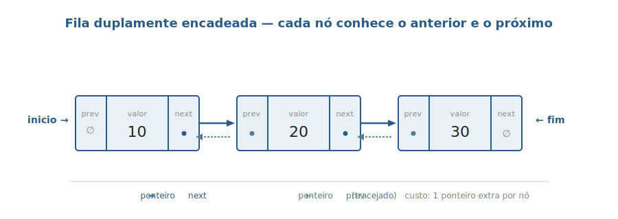
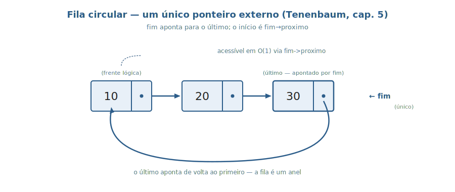

# Aula 03 — Fila (Queue)

> **Tipo desta aula**: implementação. A Fila é a primeira estrutura concreta da disciplina. Apresentamos **três representações encadeadas** lado a lado — simplesmente encadeada (canônica), duplamente encadeada e circular — todas implementadas em C, todas com as mesmas operações observáveis. O TAD não muda; só muda como os ponteiros são organizados internamente.

---

## 1. Conceito — Aprofundamento Progressivo

### Camada 1 — A intuição inicial

Imagine uma **fila do banco**. Quem chega entra atrás de todo mundo; quem é atendido sai pela frente. Ninguém fura, ninguém é atendido fora de ordem. A regra é simples e inviolável: **quem chegou primeiro, sai primeiro**. Toda a estrutura computacional chamada **Fila** existe para modelar exatamente esse comportamento — qualquer cenário em que a ordem temporal de chegada precise ser respeitada e nenhum elemento possa ser pulado.

### Camada 2 — Definição informal com vocabulário básico

Uma **Fila** é uma estrutura linear de elementos com a seguinte restrição de acesso: **insere-se sempre em uma extremidade** (chamada **fim**, ou *rear*) **e remove-se sempre na extremidade oposta** (chamada **frente**, ou *front*). Essa política de acesso recebe o nome **FIFO** (*First-In, First-Out*) — o primeiro elemento que entrou é o primeiro a sair (Tenenbaum, cap. 4 — *Filas e listas*; Cormen et al., *Algoritmos: Teoria e Prática*, cap. 10.1; Sedgewick, *Algoritmos em C*, Parte 1, cap. 4 — seção sobre **FIFO queues**).

Para que essa restrição seja útil em prática, a Fila oferece um conjunto pequeno de operações:

- **enfileirar** (*enqueue*) — coloca um novo elemento no **fim**.
- **desenfileirar** (*dequeue*) — remove e devolve o elemento da **frente**.
- **frente** — apenas **lê** o elemento da frente, sem removê-lo.
- **vazia** — informa se há ou não elementos na fila.

Note o que a Fila **não** oferece: você não pode olhar o terceiro elemento da fila, nem remover o último, nem inserir no meio. Essa **restrição é a feature**, não a limitação — é justamente o que torna a Fila uma estrutura simples, previsível e rápida.

### Camada 3 — Propriedades e comportamento

> A representação interna desta aula é construída sobre o **nó** apresentado na sub-seção *"O nó — unidade de construção das estruturas encadeadas"* da Aula 02. O nó da Fila é exatamente o nó da lista simplesmente encadeada — um campo de valor (a carga útil) e um campo `proximo` (o ponteiro de ligação). O que muda em relação à lista genérica não é o nó: é a **política de acesso** (FIFO) e o estado externo da estrutura (os dois ponteiros âncora `inicio` e `fim`).

#### Os dois ponteiros que tornam tudo eficiente

Para que `enfileirar` (no fim) e `desenfileirar` (na frente) sejam ambos rápidos, a representação interna canônica usa **dois ponteiros externos**, descritos por Tenenbaum (cap. 4) e referenciados como exercício clássico em Cormen et al. (CLRS, cap. 10.2):

- **`inicio`** (*front*) — aponta para o primeiro elemento da fila, de onde os itens serão removidos.
- **`fim`** (*rear*) — aponta para o último elemento da fila, onde os novos itens serão inseridos.

Sem o ponteiro `fim`, cada `enfileirar` precisaria **percorrer a lista inteira** para achar o último nó — operação O(n) que destruiria a eficiência da estrutura. Com `fim` mantido atualizado, `enfileirar` salta direto para o último nó e religa em **O(1)**.

#### As operações em detalhe

- **Inserção (`enfileirar`)**. Aloca-se um novo nó com o valor desejado e seu ponteiro `proximo` é definido como `NULL`. Se a fila estiver vazia, `inicio` passa a apontar para o novo nó. Caso contrário, o `proximo` do nó que estava no fim (`fim->proximo`) é atualizado para apontar ao novo nó. Em ambos os casos, ao final, **`fim` é atualizado** para referenciar o nó recém-criado.

- **Remoção (`desenfileirar`)**. Lê-se o valor do nó apontado por `inicio`, atualiza-se `inicio` para o próximo nó e libera-se o nó antigo. Há um **cuidado fundamental** destacado por Tenenbaum (cap. 4): ao remover o **último elemento restante**, depois de avançar `inicio` ele se torna `NULL`. Nesse caso, `fim` também precisa ser **explicitamente** redefinido como `NULL`. Se o programador esquecer disso, `fim` continuará apontando para um nó que acabou de ser liberado com `free()` — gerando um **ponteiro suspenso** (*dangling pointer*) que causa falhas obscuras na próxima operação.

#### Invariantes (propriedades que devem sempre valer)

Antes e depois de cada operação, três propriedades têm de continuar verdadeiras:

- **Quando a fila está vazia**, `inicio` e `fim` são ambos `NULL` ao mesmo tempo. Não pode acontecer de um deles apontar para um nó e o outro ser `NULL`.
- **Quando a fila tem um único elemento**, `inicio` e `fim` apontam para o **mesmo nó** — a frente também é o fim.
- **Quando a fila tem mais de um elemento**, ambos os ponteiros são diferentes de `NULL`, o `proximo` do nó apontado por `fim` é `NULL` (porque o último não tem ninguém atrás) e, seguindo `inicio` pelos campos `proximo`, chega-se ao nó apontado por `fim`.

Cada operação tem de **terminar deixando essas três propriedades válidas** — em particular o cuidado com o último `desenfileirar`, que zera ambos os ponteiros simultaneamente.

### Camada 4 — Definição formal e notação

#### O TAD Fila

Um **TAD** (Tipo Abstrato de Dados) define uma estrutura pelo seu **contrato observável** — os valores que armazena, as operações que oferece e os axiomas que essas operações satisfazem — sem comprometer-se com nenhuma representação interna específica. Para a Fila, o TAD é:

```
TAD Fila de Inteiros

  Tipos:
    Fila
    Inteiro
    Booleano

  Operações:
    criar()                       -> Fila
    enfileirar(Fila, Inteiro)     -> Fila
    desenfileirar(Fila)           -> Fila        [erro se vazia]
    frente(Fila)                  -> Inteiro     [erro se vazia]
    vazia(Fila)                   -> Booleano

  Axiomas (para qualquer fila F, inteiro x):
    A1. vazia(criar())                                = verdadeiro
    A2. vazia(enfileirar(F, x))                       = falso
    A3. frente(enfileirar(criar(), x))                = x
    A4. frente(enfileirar(F, x))                      = frente(F)            quando vazia(F) = falso
    A5. desenfileirar(enfileirar(criar(), x))         = criar()
    A6. desenfileirar(enfileirar(F, x))               = enfileirar(desenfileirar(F), x)   quando vazia(F) = falso
    A7. frente(criar())                               = erro
    A8. desenfileirar(criar())                        = erro
```

Os axiomas **A4** e **A6** são o coração do FIFO: dizem que, mesmo com novos elementos chegando atrás, a **frente** continua sendo quem entrou antes — só muda quando alguém é desenfileirado de fato. Tenenbaum (cap. 4) discute esse mesmo conjunto de axiomas como definição operacional da Fila.

#### A representação interna como tupla

Para a versão **simplesmente encadeada** com dois ponteiros, a Fila pode ser descrita pela tupla:

`F = (N, valor, proximo, inicio, fim)`

onde:

- **N** é o conjunto (possivelmente vazio) dos nós da fila.
- **valor: N → V** associa cada nó a um inteiro.
- **proximo: N → N ∪ {NULL}** associa cada nó ao seguinte da fila, ou `NULL` se for o último.
- **inicio ∈ N ∪ {NULL}** é o ponteiro externo para a **frente**.
- **fim ∈ N ∪ {NULL}** é o ponteiro externo para o **último elemento**.

A invariante "vazia ⇔ inicio = NULL ∧ fim = NULL" liga formalmente os dois ponteiros e impede estados inconsistentes (exemplo proibido: `inicio = NULL` mas `fim ≠ NULL`).

### Camada 5 — Análise de complexidade

A análise se faz em termos de **n**, o número de elementos na fila. Comparando as representações:

| Operação           | Lista simples (com `inicio`+`fim`) | Lista dupla | Lista circular (só `fim`) | Vetor não-circular | Vetor circular |
|--------------------|------------------------------------|-------------|---------------------------|--------------------|----------------|
| `enfileirar`       | **O(1)**                           | **O(1)**    | **O(1)**                  | O(1)*              | O(1)           |
| `desenfileirar`    | **O(1)**                           | **O(1)**    | **O(1)**                  | O(n) — desloca tudo| O(1)           |
| `frente`           | O(1)                               | O(1)        | O(1)                      | O(1)               | O(1)           |
| `vazia`            | O(1)                               | O(1)        | O(1)                      | O(1)               | O(1)           |
| Tamanho máximo     | dinâmico (memória total)           | dinâmico    | dinâmico                  | fixo               | fixo           |

\* amortizado, se houver `realloc` automático.

Cormen et al. (CLRS, cap. 10.2) propõe como **exercício clássico** mostrar que uma Fila implementada como lista simplesmente ligada (com os dois ponteiros) garante `enqueue` e `dequeue` em tempo constante O(1). É exatamente o que conseguimos com a representação canônica.

A leitura prática: as três representações encadeadas têm o **mesmo perfil de desempenho** — todas as operações principais em O(1). A diferença entre elas está em outros eixos: quantos ponteiros cada nó carrega, qual a complexidade do código que mantém os invariantes, qual a flexibilidade para extensões futuras (por exemplo, um *deque* — fila com inserção/remoção nos dois lados — só fica simples sobre lista dupla).

#### Vantagens e desvantagens das encadeadas em relação ao vetor

**Vantagens.** A principal força das listas encadeadas para Fila está no **tamanho dinâmico**: as filas crescem e diminuem sob demanda, eliminando o problema de *overflow* de uma estrutura individual — enquanto houver memória disponível no sistema, qualquer fila pode crescer. E nunca é preciso **deslocar elementos**, problema obrigatório em vetor não-circular ao remover na frente.

**Desvantagens.** Cada nó da fila consome **espaço extra** (*overhead*) para manter o ponteiro `proximo` (e, na versão dupla, também `anterior`). Em sistemas de 64 bits, são 8 bytes por ponteiro além do valor armazenado. Além disso, a alocação e a liberação dinâmica de cada nó (`malloc`/`free`) exigem **tempo do sistema** — em comparação com a manipulação direta de índices num vetor pré-alocado, esse custo se acumula em filas com milhões de operações.

### Camada 6 — Conexões e variantes

A Fila admite várias representações internas que satisfazem o mesmo TAD; nesta aula vamos implementar três delas em C:

#### Variante 1 — Lista simplesmente encadeada com dois ponteiros (canônica)

A representação descrita nas camadas anteriores: cada nó tem `valor` e `proximo`; a estrutura mantém `inicio` e `fim`. É a versão **mínima** que ainda garante O(1) em tudo. Implementada em `fila.c`.

#### Variante 2 — Lista duplamente encadeada

Cada nó tem **dois** ponteiros (`anterior` e `proximo`), e a estrutura ainda mantém `inicio` e `fim`. Para a Fila pura, a versão dupla **não traz vantagem de complexidade** sobre a simples — todas as operações continuam O(1). Mas a versão dupla é a base natural para o **Deque** (*double-ended queue*), uma generalização da Fila em que se pode inserir e remover em **ambas** as extremidades; sem o ponteiro `anterior`, o `desenfileirar` pelo fim seria O(n). Implementada em `fila_dupla.c`.

#### Variante 3 — Lista circular com um único ponteiro externo

Tenenbaum (cap. 5) apresenta uma simplificação elegante: em vez de manter `inicio` **e** `fim`, mantém-se **apenas um ponteiro externo** que aponta para o **fim** (`rear`). Como a lista é circular — o `proximo` do último aponta para o primeiro, em vez de `NULL` —, o **início** é acessível em O(1) via `fim->proximo`. A estrutura fica com **menos estado externo** (um ponteiro em vez de dois), o que simplifica a definição da Fila e elimina uma classe de bugs (a sincronização de dois ponteiros). Implementada em `fila_circular.c`.

#### Outras variantes (não implementadas nesta aula)

- **Vetor circular** — capacidade fixa, mas sem alocação dinâmica; útil em sistemas embarcados e para *buffers* de tamanho conhecido.
- **Deque** (*double-ended queue*) — generaliza Fila e Pilha; apoia-se naturalmente em lista dupla.
- **Fila de prioridade** — relaxa o FIFO: a saída segue uma chave de prioridade, não a ordem de chegada. Implementação canônica é o **heap binário** (tema de aula futura).

#### Onde a Fila reaparece no curso e além

- **Aula 04 (Pilha)** — mesma representação interna (lista encadeada), comportamento oposto (LIFO em vez de FIFO).
- **BFS (busca em largura) em grafos** — exige Fila por construção; processar vértices "camada a camada" só é possível com FIFO.
- **Escalonadores FCFS** (*First-Come, First-Served*) em sistemas operacionais — versão didática direta de Fila.
- **Filas de mensagens distribuídas** (RabbitMQ, AWS SQS, Apache Kafka — em sua essência conceitual) — produtores enfileiram, consumidores desenfileiram, a fila desacopla quem produz de quem consome.

---

## 2. Visualização Gráfica

A sequência abaixo mostra o **ciclo de vida completo** de uma Fila vazia: criação, três `enfileirar`, uma consulta `frente`, dois `desenfileirar` até esvaziar de novo. Os diagramas usam a representação canônica (lista simples + `inicio` e `fim`); ao final, dois diagramas extras mostram as variantes **dupla** e **circular**.

### Passo 1: criar_fila()


A fila começa vazia: `inicio = NULL`, `fim = NULL`. Os dois ponteiros são nulos ao mesmo tempo, exatamente como esperado de uma fila vazia.

### Passo 2: enfileirar(10)


Cria-se um nó `[10|NULL]`. Como a fila estava vazia, `inicio` **e** `fim` passam a apontar para esse mesmo nó — quando há um único elemento, frente e fim coincidem.

### Passo 3: enfileirar(20)


Cria-se um nó `[20|NULL]`. O `proximo` do antigo `fim` (nó `[10]`) passa a apontar para o nó novo. `fim` é atualizado para apontar ao novo nó. `inicio` **não muda**.

### Passo 4: enfileirar(30)


Mesma lógica do passo 3. `fim` "avança" para o nó novo; `inicio` continua na frente.

### Passo 5: frente() retorna 10


`frente()` apenas **lê** o valor do nó apontado por `inicio`. **Não altera** a estrutura. Retorna `10`.

### Passo 6: desenfileirar() remove 10


O nó da frente é "destacado": `inicio` passa a apontar para o `proximo` dele (`[20]`), e o nó antigo `[10]` é **liberado** com `free`. Como ainda há nós, `fim` permanece apontando para `[30]`.

### Passo 7: desenfileirar() remove 20


Mesma lógica. Agora resta apenas um nó (`[30]`); novamente `inicio` e `fim` apontam para o mesmo nó. **Atenção**: se desenfileirássemos mais uma vez, precisaríamos atualizar **os dois** ponteiros para `NULL` (caso especial do código).

### Variante: lista duplamente encadeada



Cada nó passa a ter **dois ponteiros**: `proximo` (cheio) e `anterior` (tracejado). A estrutura externa ainda mantém `inicio` e `fim`; o ganho está em poder navegar nos dois sentidos, útil para extensões (Deque) e para certas operações de remoção em meio à lista.

### Variante: lista circular com um único ponteiro



O último nó aponta de volta ao primeiro (em vez de `NULL`), formando um **anel**. Mantém-se **apenas um** ponteiro externo (`fim`), e a frente fica acessível em O(1) via `fim->proximo`. A representação tem menos estado externo a manter coerente.

---

## 3. Problema Motivador

> *"Como uma impressora compartilhada decide quem imprime primeiro?"*

Em um laboratório com dezenas de alunos e uma única impressora, várias requisições chegam ao mesmo tempo. Sem nenhuma estrutura de ordenação, a impressora teria de:

- ou imprimir em ordem aleatória (resultado: o aluno azarado nunca recebe seu trabalho);
- ou imprimir só uma a cada momento e recusar todas as demais (resultado: alunos clicando "imprimir" 50 vezes até dar certo).

A solução padrão dos sistemas operacionais (Linux, Windows, macOS) é: **toda requisição entra em uma Fila**. A impressora processa o primeiro da fila, o remove, e passa para o próximo. Quem chegou primeiro imprime primeiro — **FIFO**.

Esse mesmo padrão aparece em escala muito maior:

- **Buffer de pacotes em roteadores**. Quando um roteador recebe pacotes mais rápido do que consegue encaminhar, os pacotes excedentes vão para uma Fila. Se a fila enche, os novos são **descartados** (parte do controle de congestionamento da Internet).
- **Escalonadores FCFS** (*First-Come, First-Served*) de processos em sistemas operacionais simples: cada processo que pede CPU vai para uma fila; o escalonador atende em ordem.
- **Filas de mensagens distribuídas** (RabbitMQ, AWS SQS, Apache Kafka — em sua essência conceitual). Produtores enfileiram mensagens; consumidores desenfileiram. A fila desacopla quem produz de quem consome.

A Fila é a estrutura natural para qualquer cenário em que **a ordem temporal de chegada precisa ser respeitada** e **nenhum elemento pode ser pulado**.

---

## 4. Analogias

**1. Fila do banco.**
Você chega, vai para o **fim**. Quem está sendo atendido está na **frente**. Você não é atendido fora de ordem (ou ouve reclamação), e ninguém atrás de você é atendido antes. As únicas pontas que importam são `inicio` (próximo a ser atendido) e `fim` (último a chegar). O meio da fila é invisível para a operação — você não interage com ele.

**2. Fila de mensagens do WhatsApp quando você está sem internet.**
Você manda 5 mensagens em sequência sem sinal. Elas ficam **enfileiradas** no aparelho na ordem que foram digitadas. Quando o sinal volta, o WhatsApp envia uma a uma, **na ordem em que foram digitadas** — não a última primeiro, não em ordem aleatória. É FIFO puro.

---

## 5. Código em C

Apresentamos as **três implementações** lado a lado: simplesmente encadeada (`fila.c`), duplamente encadeada (`fila_dupla.c`) e circular com um único ponteiro (`fila_circular.c`). As três expõem **as mesmas assinaturas de função** — quem escreve a `main()` não precisa saber qual representação está em uso.

> **Sobre a organização dos arquivos.** Cada uma das três implementações vive em seu próprio arquivo `.c` autossuficiente: `#include`s, `struct`s, todas as funções da TAD e a `main()` demonstrativa juntas. A separação canônica em `fila.h` + `fila.c` (interface vs. implementação) fica para a aula futura sobre **organização de projetos em C**.

### Implementação 1 — Lista simplesmente encadeada (`fila.c`)

A representação canônica das camadas 3 e 4: cada nó tem `valor` e `proximo`; a fila mantém `inicio` e `fim`. Todas as operações em O(1).

```c
#include <stdio.h>
#include <stdlib.h>

// Cada elemento da fila vira um No com o valor e um
// ponteiro para o proximo No.
typedef struct No {
    int valor;
    struct No* proximo;
} No;

// A fila guarda dois ponteiros: a frente (proximo a sair)
// e o fim (ultimo que entrou).
typedef struct Fila {
    No* inicio;
    No* fim;
} Fila;

// Cria uma fila vazia.
Fila* criar(void) {
    Fila* f = malloc(sizeof(Fila));
    if (f == NULL) {
        printf("erro: memoria insuficiente\n");
        exit(1);
    }
    f->inicio = NULL;
    f->fim = NULL;
    return f;
}

// Verdadeiro (1) se a fila nao tem nenhum elemento.
int vazia(Fila* f) {
    return f->inicio == NULL;
}

// Coloca um valor no fim da fila.
void enfileirar(Fila* f, int valor) {
    No* novo = malloc(sizeof(No));
    if (novo == NULL) {
        printf("erro: memoria insuficiente\n");
        exit(1);
    }
    novo->valor = valor;
    novo->proximo = NULL;

    if (vazia(f)) {
        // Fila estava vazia: o novo no e' tambem a frente.
        f->inicio = novo;
    } else {
        // Liga o no que era o fim ao novo no.
        f->fim->proximo = novo;
    }
    f->fim = novo;
}

// Remove e devolve o valor da frente da fila.
// Pre-requisito: a fila nao pode estar vazia.
int desenfileirar(Fila* f) {
    if (vazia(f)) {
        printf("erro: fila vazia\n");
        exit(1);
    }
    No* removido = f->inicio;
    int valor = removido->valor;

    f->inicio = removido->proximo;  // a frente avanca para o proximo no
    if (f->inicio == NULL) {
        // Tiramos o ultimo elemento: a fila ficou vazia.
        // O fim tambem precisa virar NULL. Se nao zerarmos, ele
        // continuaria apontando para o no que vamos liberar com free()
        // logo abaixo — viraria um ponteiro para memoria invalida.
        f->fim = NULL;
    }
    free(removido);
    return valor;
}

// Devolve o valor da frente sem remover.
int frente(Fila* f) {
    if (vazia(f)) {
        printf("erro: fila vazia\n");
        exit(1);
    }
    return f->inicio->valor;
}

// Libera toda a memoria usada pela fila.
void destruir(Fila* f) {
    No* atual = f->inicio;
    while (atual != NULL) {
        No* proximo = atual->proximo;
        free(atual);
        atual = proximo;
    }
    free(f);
}

// Programa demonstrativo.
int main(void) {
    Fila* f = criar();

    enfileirar(f, 10);
    enfileirar(f, 20);
    enfileirar(f, 30);
    printf("Frente da fila: %d\n", frente(f));

    printf("Desenfileirando: ");
    while (!vazia(f)) {
        printf("%d ", desenfileirar(f));
    }
    printf("\n");

    destruir(f);
    return 0;
}
```

Compilar e rodar:

```sh
gcc -Wall -Wextra -o fila_demo fila.c
./fila_demo
```

Saída esperada:

```
Frente da fila: 10
Desenfileirando: 10 20 30
```

A linha `Desenfileirando: 10 20 30` é a **prova empírica do FIFO**: a ordem de saída é exatamente a ordem de entrada.

### Implementação 2 — Lista duplamente encadeada (`fila_dupla.c`)

Cada nó passa a ter **dois ponteiros**: `anterior` e `proximo`. As operações da Fila continuam em O(1); o ganho está em deixar a estrutura preparada para extensões futuras (Deque, remoção em meio à lista). Note que **a `main()` é idêntica** à do `fila.c` — o cliente não percebe a mudança.

```c
#include <stdio.h>
#include <stdlib.h>

// No com dois ponteiros: anterior e proximo.
typedef struct No {
    int valor;
    struct No* anterior;
    struct No* proximo;
} No;

// A fila ainda mantem inicio e fim.
typedef struct Fila {
    No* inicio;
    No* fim;
} Fila;

Fila* criar(void) {
    Fila* f = malloc(sizeof(Fila));
    if (f == NULL) {
        printf("erro: memoria insuficiente\n");
        exit(1);
    }
    f->inicio = NULL;
    f->fim = NULL;
    return f;
}

int vazia(Fila* f) {
    return f->inicio == NULL;
}

void enfileirar(Fila* f, int valor) {
    No* novo = malloc(sizeof(No));
    if (novo == NULL) {
        printf("erro: memoria insuficiente\n");
        exit(1);
    }
    novo->valor = valor;
    novo->proximo = NULL;
    novo->anterior = f->fim;   // o anterior do novo e' o antigo fim

    if (vazia(f)) {
        // Fila estava vazia: o novo no tambem e' a frente.
        f->inicio = novo;
    } else {
        // Liga o no que era o fim ao novo no (sentido proximo).
        f->fim->proximo = novo;
    }
    f->fim = novo;
}

int desenfileirar(Fila* f) {
    if (vazia(f)) {
        printf("erro: fila vazia\n");
        exit(1);
    }
    No* removido = f->inicio;
    int valor = removido->valor;

    f->inicio = removido->proximo;
    if (f->inicio == NULL) {
        // Removemos o ultimo: zera o fim tambem.
        f->fim = NULL;
    } else {
        // O novo inicio nao tem mais ninguem antes dele.
        f->inicio->anterior = NULL;
    }
    free(removido);
    return valor;
}

int frente(Fila* f) {
    if (vazia(f)) {
        printf("erro: fila vazia\n");
        exit(1);
    }
    return f->inicio->valor;
}

void destruir(Fila* f) {
    No* atual = f->inicio;
    while (atual != NULL) {
        No* proximo = atual->proximo;
        free(atual);
        atual = proximo;
    }
    free(f);
}

// A main e' literalmente identica a do fila.c.
int main(void) {
    Fila* f = criar();

    enfileirar(f, 10);
    enfileirar(f, 20);
    enfileirar(f, 30);
    printf("Frente da fila: %d\n", frente(f));

    printf("Desenfileirando: ");
    while (!vazia(f)) {
        printf("%d ", desenfileirar(f));
    }
    printf("\n");

    destruir(f);
    return 0;
}
```

Compilar e rodar:

```sh
gcc -Wall -Wextra -o fila_dupla_demo fila_dupla.c
./fila_dupla_demo
```

Saída idêntica:

```
Frente da fila: 10
Desenfileirando: 10 20 30
```

### Implementação 3 — Lista circular com um único ponteiro (`fila_circular.c`)

A otimização proposta por Tenenbaum (cap. 5): mantém-se apenas o ponteiro `fim`. Como a lista é circular, a frente é `fim->proximo`. **Atenção especial** ao caso de um único elemento — nele, `fim->proximo == fim` (o nó aponta para si mesmo).

```c
#include <stdio.h>
#include <stdlib.h>

typedef struct No {
    int valor;
    struct No* proximo;
} No;

// A fila mantem APENAS o ponteiro para o fim.
// O inicio e' alcancado via fim->proximo.
typedef struct Fila {
    No* fim;
} Fila;

Fila* criar(void) {
    Fila* f = malloc(sizeof(Fila));
    if (f == NULL) {
        printf("erro: memoria insuficiente\n");
        exit(1);
    }
    f->fim = NULL;
    return f;
}

int vazia(Fila* f) {
    return f->fim == NULL;
}

void enfileirar(Fila* f, int valor) {
    No* novo = malloc(sizeof(No));
    if (novo == NULL) {
        printf("erro: memoria insuficiente\n");
        exit(1);
    }
    novo->valor = valor;

    if (vazia(f)) {
        // Unico elemento: aponta para si mesmo, fechando o anel.
        novo->proximo = novo;
    } else {
        // O novo entra entre o fim atual e o inicio (fim->proximo).
        novo->proximo = f->fim->proximo;   // novo aponta para o que era o inicio
        f->fim->proximo = novo;            // o antigo fim aponta para o novo
    }
    f->fim = novo;   // o novo passa a ser o fim
}

int desenfileirar(Fila* f) {
    if (vazia(f)) {
        printf("erro: fila vazia\n");
        exit(1);
    }
    No* frente = f->fim->proximo;   // o inicio e' o proximo do fim
    int valor = frente->valor;

    if (frente == f->fim) {
        // So havia um elemento: a fila fica vazia.
        f->fim = NULL;
    } else {
        // Religa: o fim agora aponta para quem vinha depois da frente.
        f->fim->proximo = frente->proximo;
    }
    free(frente);
    return valor;
}

int frente(Fila* f) {
    if (vazia(f)) {
        printf("erro: fila vazia\n");
        exit(1);
    }
    return f->fim->proximo->valor;
}

void destruir(Fila* f) {
    if (!vazia(f)) {
        // Quebra o anel para conseguir percorrer ate o fim.
        No* atual = f->fim->proximo;
        f->fim->proximo = NULL;
        while (atual != NULL) {
            No* proximo = atual->proximo;
            free(atual);
            atual = proximo;
        }
    }
    free(f);
}

int main(void) {
    Fila* f = criar();

    enfileirar(f, 10);
    enfileirar(f, 20);
    enfileirar(f, 30);
    printf("Frente da fila: %d\n", frente(f));

    printf("Desenfileirando: ");
    while (!vazia(f)) {
        printf("%d ", desenfileirar(f));
    }
    printf("\n");

    destruir(f);
    return 0;
}
```

Compilar e rodar:

```sh
gcc -Wall -Wextra -o fila_circular_demo fila_circular.c
./fila_circular_demo
```

Saída idêntica às anteriores:

```
Frente da fila: 10
Desenfileirando: 10 20 30
```

### O ponto central das três implementações

As três versões produzem **a mesma saída** com **a mesma `main()`** porque dependem apenas das **assinaturas das funções**, não da representação interna. É exatamente o que o TAD promete: o comportamento observável é definido pelo contrato (axiomas A1–A8), não pelos ponteiros que cada implementação organiza por dentro.

---

## 6. Exercícios Práticos

> Exercícios mistos: alguns conceituais, alguns de codificação. Compile e rode os de código com `gcc -Wall -Wextra`.

**Exercício 1 — Trace na mão.**
Considere uma fila vazia e a seguinte sequência de operações: `enfileirar(7)`, `enfileirar(3)`, `enfileirar(11)`, `desenfileirar`, `enfileirar(5)`, `frente`, `desenfileirar`, `desenfileirar`. Para cada operação, escreva o estado da fila (sequência da frente para o fim) e, quando aplicável, o valor retornado.

*Critério de aceitação*: lista de 8 estados + valores retornados nas operações `desenfileirar` e `frente`. Estado final esperado: fila com `[5]` apenas.

> **Resposta mínima aceitável**
>
> | Operação           | Estado (frente → fim) | Retorno |
> |--------------------|----------------------|---------|
> | `enfileirar(7)`    | `[7]`                | —       |
> | `enfileirar(3)`    | `[7, 3]`             | —       |
> | `enfileirar(11)`   | `[7, 3, 11]`         | —       |
> | `desenfileirar`    | `[3, 11]`            | `7`     |
> | `enfileirar(5)`    | `[3, 11, 5]`         | —       |
> | `frente`           | `[3, 11, 5]`         | `3`     |
> | `desenfileirar`    | `[11, 5]`            | `3`     |
> | `desenfileirar`    | `[5]`                | `11`    |

**Exercício 2 — Função `imprimir`.**
Adicione a `fila.c` (versão simplesmente encadeada) uma função `void imprimir(Fila* f)` que imprime os valores da fila no formato `[10, 20, 30]` da frente para o fim, ou `[]` se vazia. **Não** pode usar `desenfileirar`. Acrescente chamadas a essa função na `main()` antes e depois das operações.

*Critério de aceitação*: função fica no mesmo `fila.c`; a `main()` chama antes e depois; saída coerente.

> **Resposta mínima aceitável**
>
> ```c
> void imprimir(Fila* f) {
>     printf("[");
>     No* atual = f->inicio;
>     while (atual != NULL) {
>         printf("%d", atual->valor);
>         if (atual->proximo != NULL) printf(", ");
>         atual = atual->proximo;
>     }
>     printf("]\n");
> }
> ```
>
> A função percorre a lista lendo `valor` e `proximo` sem modificar nada.

**Exercício 3 — O bug do ponteiro suspenso.**
No `fila.c`, **comente** a linha `f->fim = NULL;` dentro de `desenfileirar` (a que zera o `fim` quando a fila fica vazia). Compile e rode o programa com `valgrind ./fila_demo` (ou apenas `./fila_demo` se não tiver Valgrind). Em seguida, adicione na `main()` mais um ciclo: depois do `while` que esvazia a fila, chame `enfileirar(f, 99); desenfileirar(f);` e imprima o resultado. Descreva o que acontece e por quê.

*Critério de aceitação*: identificar que, sem zerar `fim`, ao reenfileirar `99` numa fila vazia o código entra no ramo "fila vazia" e atualiza `inicio` corretamente, **mas o `fim` antigo continua apontando para memória já liberada**; o próximo `enfileirar` em fila não-vazia tentaria escrever em `fim->proximo`, com comportamento indefinido. É a armadilha que Tenenbaum (cap. 4) destaca.

> **Resposta mínima aceitável**
>
> Ao remover o último elemento sem zerar `fim`, o ponteiro `fim` vira um *dangling pointer* (suspenso) — aponta para memória já devolvida ao sistema com `free()`. No próximo `enfileirar` em fila não-vazia, o código `f->fim->proximo = novo` desreferencia esse ponteiro inválido, causando comportamento indefinido (crash, corrupção, ou — pior — funcionamento aparente seguido de bug obscuro depois). A linha `f->fim = NULL` existe exatamente para impedir esse cenário.

**Exercício 4 — Inverter uma fila usando uma pilha.**
Sabendo que uma Pilha é LIFO e uma Fila é FIFO, escreva (em pseudocódigo ou em C) um algoritmo que recebe uma Fila `F` e a **inverte** — ao final, o elemento que era a frente vira o último e vice-versa — usando como estrutura auxiliar uma **Pilha** `P` (e nenhuma outra estrutura). Após o algoritmo, `F` está invertida e `P` está vazia.

*Critério de aceitação*: descrever o algoritmo em duas fases (esvaziar `F` para `P`, depois esvaziar `P` para `F`) e justificar por que a fila final fica invertida.

> **Resposta mínima aceitável**
>
> ```
> 1. Enquanto F nao estiver vazia:
>      x = desenfileirar(F)
>      empilhar(P, x)
> 2. Enquanto P nao estiver vazia:
>      y = desempilhar(P)
>      enfileirar(F, y)
> ```
>
> **Por que inverte**: na fase 1, os elementos saem de `F` na ordem original (frente → fim) e entram em `P` em LIFO. Na fase 2, saem de `P` em ordem **inversa à de entrada** (último-a-entrar-primeiro-a-sair) e voltam para `F` na nova ordem. Resultado: o que era frente ficou no fim. Custo total: **O(n)**.

**Exercício 5 — Comparando as três implementações (desafio).**
Escreva um pequeno programa-teste que execute a **mesma sequência de operações** sobre as três implementações (`fila.c`, `fila_dupla.c`, `fila_circular.c`) e verifique que produzem **a mesma saída**. Use a sequência: `enfileirar(1)`, `enfileirar(2)`, `enfileirar(3)`, `desenfileirar` (verificar = 1), `enfileirar(4)`, `enfileirar(5)`, `desenfileirar` (= 2), `desenfileirar` (= 3), `desenfileirar` (= 4), `desenfileirar` (= 5). Em seguida, modifique cada uma das três implementações para imprimir, **em comentário ao final do arquivo**, qual aspecto da estrutura interna ela explora (dois ponteiros + um sentido; dois ponteiros + dois sentidos; um ponteiro + anel).

*Critério de aceitação*: as três implementações compilam, rodam, e produzem a mesma saída — `Desenfileirando: 1 2 3 4 5`. O exercício mostra na prática que **o TAD é um contrato observável**: trocar a representação interna não muda o comportamento externo, e a escolha entre as três passa a ser orientada por outros critérios (extensibilidade futura, simplicidade do código, gosto pessoal).

> **Resposta mínima aceitável**
>
> A saída esperada de cada um dos três programas, com a sequência de teste, é:
>
> ```
> Desenfileirando: 1 2 3 4 5
> ```
>
> A `main()` adaptada (idêntica para os três) chama as funções na ordem do enunciado e imprime cada valor desenfileirado. O ponto pedagógico é que o **mesmo cliente** funciona com as três implementações sem nenhuma alteração — a escolha entre lista simples, dupla ou circular é uma decisão de implementação que **o TAD esconde do cliente**.

---

## 7. Referências

- **Tenenbaum, A. M.; Langsam, Y.; Augenstein, M. J.** — *Estruturas de Dados Usando C*. Capítulo 4 (*Filas e listas*) — apresenta a representação canônica com dois ponteiros, o cuidado com o `desenfileirar` do último elemento e a discussão de vetor circular vs. lista encadeada. Capítulo 5 — apresenta a otimização da Fila como **lista circular com um único ponteiro** (`rear`).

- **Cormen, T. H.; Leiserson, C. E.; Rivest, R. L.; Stein, C.** (CLRS) — *Algoritmos: Teoria e Prática*. Capítulo 10, seção 10.1 (*Pilhas e filas*) — fila circular sobre vetor com pseudocódigo claro. Cap. 10.2 — exercício clássico mostrando que a Fila implementada como lista simplesmente ligada com dois ponteiros tem `enqueue` e `dequeue` em O(1).

- **Sedgewick, R.** — *Algoritmos em C*, Parte 1, capítulo 4 (*Abstract Data Types*), seção sobre **FIFO queues and generalized queues**. Apresenta a fila como TAD e suas variantes.

**Leitura complementar**:
- **Ziviani, N.** — *Projeto de Algoritmos com Implementações em Pascal e C*. Seção sobre filas — útil para ver a mesma estrutura em Pascal, ajudando a separar a ideia da sintaxe.
