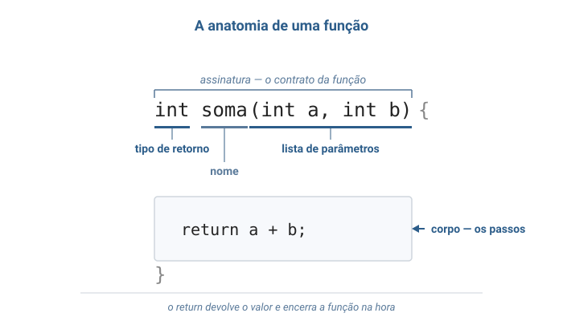
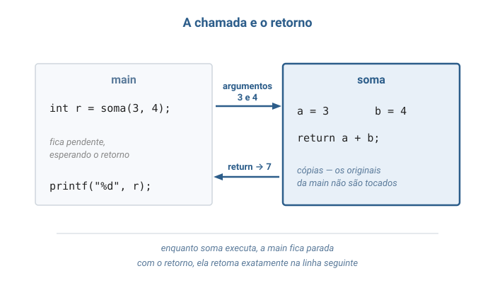
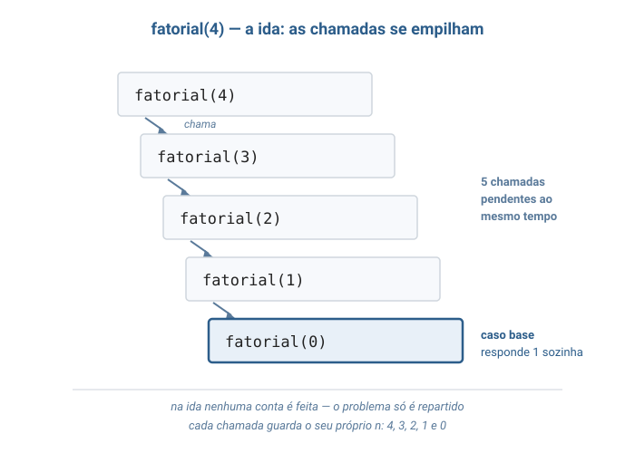
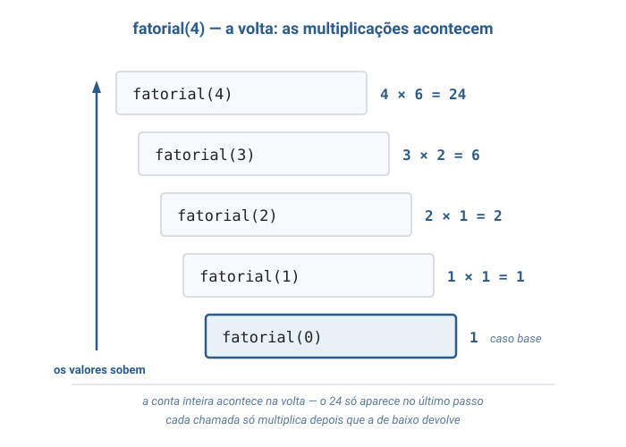
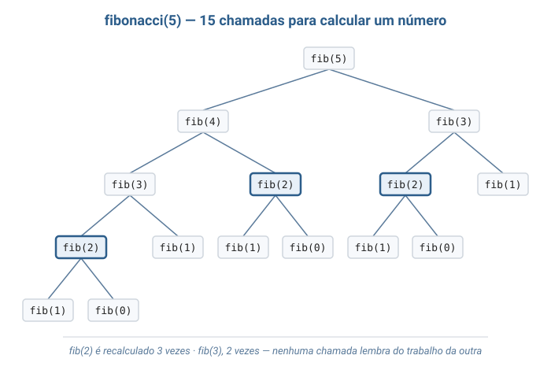

# Aula 03 — Funções e Recursão

> **Tipo desta aula**: conceitual. As Aulas 01 e 02 já **usaram** funções — `soma`, `busca_linear`, `busca_binaria` — sem nunca explicar o que acontece no instante em que uma função é chamada. Esta aula abre essa caixa: por que decompor um algoritmo em funções, como uma função é construída por dentro e o que acontece quando uma função chama **a si mesma**. Não há programa completo em C aqui — apenas trechos curtos; a aula é teórica de propósito, porque o mecanismo que ela descreve é pré-requisito das árvores e dos algoritmos de ordenação eficientes que vêm adiante.

---

## 1. Conceito — Aprofundamento Progressivo

### Camada 1 — Introdução

Imagine que você está organizando uma festa para quarenta pessoas. Você não faz tudo sozinho: pede a uma pessoa que cuide da comida, a outra que cuide do som. Para cada pedido, você diz apenas **o que precisa** ("um jantar para quarenta") e recebe de volta **o que pediu** (o jantar pronto) — sem acompanhar como a comida foi comprada, temperada ou servida. Enquanto o pedido está sendo executado, você fica esperando; quando o resultado chega, você retoma exatamente de onde parou. E pode acontecer uma coisa curiosa: a pessoa encarregada da comida acha a tarefa grande demais e reparte, pedindo a alguém que prepare o jantar de vinte, que reparte de novo, e de novo, até que o pedaço fique tão pequeno que se resolve na hora, sem repartir mais nada. Essas duas ideias — **delegar e receber de volta**, e **delegar a si mesmo uma versão menor do mesmo problema** — são o assunto inteiro desta aula.

### Camada 2 — Definição informal com vocabulário básico

A primeira ideia tem nome: **função** (em inglês, *function*) — um bloco de código com **nome próprio** que recebe valores de entrada, executa uma sequência de passos e devolve um valor de saída. A literatura também usa **sub-rotina**, **subprograma** e **procedimento** para a mesma noção; em C, tudo é função, inclusive a `main` (Backes, capítulo de funções; Schildt, capítulo de funções).

Quatro termos dão conta de descrever qualquer função. A **assinatura** (*signature*) é a primeira linha: o **tipo de retorno**, o **nome** e a lista de **parâmetros** (*parameters*) — as variáveis que receberão os valores de entrada. O **corpo** (*body*) é o bloco entre chaves, onde os passos acontecem. A **chamada** (*call*) é o ponto do programa em que a função é acionada, e os valores concretos entregues na chamada são os **argumentos** (*arguments*). O **retorno** (*return*) é o valor devolvido a quem chamou, produzido pelo comando `return`. Quando uma função não tem valor a devolver, o tipo de retorno é `void` — a palavra da linguagem C para "nada".

A segunda ideia da Camada 1 também tem nome: **função recursiva** (*recursive function*) — uma função que, dentro do próprio corpo, **chama a si mesma**, aplicada a uma entrada menor. Toda função recursiva se organiza em dois tipos de caso: o **caso base** (*base case*), uma entrada tão pequena que a resposta é dada diretamente, sem nova chamada; e o **caso recursivo** (*recursive case*), em que a função reduz o problema e delega o resto a si mesma (Backes, capítulo de recursividade; Veloso & Pereira tratam recursividade no mesmo espírito didático).

Note o que uma função **não** é:

- **Não é um atalho de escrita.** Escrever uma função não é dar nome a um trecho copiado. Uma função estabelece um **contrato**: dados estes parâmetros, este resultado. Quem chama depende do contrato, não do corpo.
- **Não guarda estado entre chamadas.** Cada chamada nasce com seus próprios parâmetros e morre ao retornar. Chamar `soma(3, 4)` duas vezes produz 7 nas duas, sem memória de que já foi chamada antes.
- **Não enxerga as variáveis de quem a chamou.** O `i` de dentro de uma função não é o `i` da `main`, ainda que tenham o mesmo nome. A separação é deliberada, e a Camada 3 mostra o que ela custa e o que ela compra.

### Camada 3 — Propriedades e comportamento

#### Ponte com as Aulas 01 e 02

A Aula 01 apresentou a função como uma das quatro peças da linguagem C, em quatro linhas:

```c
int soma(int a, int b) {
    return a + b;
}
```

A Aula 02 foi além e escreveu quatro delas — `busca_linear`, `busca_binaria`, `montar_tabela` e `busca_por_tabela` —, mas deixou uma pergunta sem resposta: por que aqueles algoritmos viraram funções separadas em vez de morarem todos dentro da `main`? O programa teria funcionado igual. A resposta é o assunto da próxima seção, e ela vale para todas as aulas seguintes: a partir daqui, cada estrutura de dados da disciplina será apresentada como **um conjunto de funções**.

#### Por que funções existem

Três razões, em ordem de importância:

- **Nomear uma ideia.** A linha `busca_binaria(vetor, 8, 55)` diz o que está acontecendo. As quinze linhas de laço que fazem esse trabalho não dizem — é preciso lê-las e reconstruir a intenção. Dar nome a um trecho de algoritmo é transformar código em vocabulário, e é a razão de a Aula 02 poder discutir "o custo da busca binária" sem repetir o algoritmo a cada frase. Esse mecanismo tem nome próprio: **abstração** (*abstraction*) — usar uma coisa pelo que ela faz, ignorando como ela faz.
- **Reusar sem repetir.** A `main` da Aula 02 chamou `busca_linear` duas vezes e `busca_binaria` duas vezes. Sem funções, seriam quatro cópias do mesmo laço. Cópias divergem: corrige-se um defeito em uma e esquece-se das outras três.
- **Isolar o erro.** Se a busca binária está devolvendo resultado errado, o defeito está nas doze linhas da função — não nas trezentas do programa. Uma função é uma fronteira: o que acontece dentro dela não vaza para fora, e o que acontece fora não interfere no que ela faz.

Há uma quarta razão, mais profunda, que a Aula 01 já anunciou ao dizer que uma inteligência artificial **não é um algoritmo, e sim uma composição de muitos**: funções são o mecanismo com que um algoritmo grande é construído a partir de algoritmos menores. Essa estratégia chama-se **decomposição** (*decomposition*), e é o que torna possível escrever programas maiores do que caberia na cabeça de uma pessoa de uma só vez.

#### Anatomia de uma função

Toda função em C tem a mesma forma. Tomando a `busca_linear` da Aula 02, sem o corpo:

```c
int busca_linear(int vetor[], int tamanho, int procurado)
/*  ↑        ↑              ↑                              */
/*  |        |              +-- lista de parametros         */
/*  |        +-- nome                                       */
/*  +-- tipo de retorno                                     */
{
    /* corpo: os passos do algoritmo */
    return -1;   /* devolve um valor e encerra a funcao */
}
```

O **tipo de retorno** (`int`) declara que espécie de valor a função devolve — e o compilador cobra: uma função declarada `int` precisa terminar com um `return` de inteiro em todos os caminhos possíveis. O **nome** é o identificador pelo qual a função é chamada. A **lista de parâmetros** declara, entre parênteses, cada valor que a função recebe, com seu tipo e seu nome; uma função sem parâmetros escreve `void` no lugar da lista, como em `int main(void)`. As três coisas juntas formam a **assinatura**, e é ela — não o corpo — que quem chama precisa conhecer.

Duas observações sobre o `return`. Primeira: ele devolve **um único valor**. Devolver dois resultados de uma vez exige recursos que ainda não vimos, e é assunto de aula futura. Segunda: ele **encerra a função imediatamente**. É por isso que a `busca_linear` da Aula 02 pode dar `return i` de dentro do `for` — encontrado o valor, a função acaba ali, sem terminar o laço.

Um detalhe da linguagem C que aparece assim que um programa cresce: uma função só pode ser chamada em um trecho de código escrito **depois** dela no arquivo. Quando isso incomoda, declara-se antes o **protótipo** (*prototype*) — a assinatura sozinha, terminada em ponto e vírgula, sem corpo:

```c
int busca_linear(int vetor[], int tamanho, int procurado);   /* prototipo */
```

O protótipo é a promessa de que a função existe e tem essa assinatura; o corpo pode vir mais abaixo no arquivo. É também a peça que, em programas grandes, mora num arquivo separado — o assunto da aula futura sobre organização de projetos em C.

#### Parâmetro e argumento não são a mesma coisa

**Parâmetro** é o nome declarado na assinatura; **argumento** é o valor concreto entregue na chamada. Em `soma(3, 4)`, os argumentos são `3` e `4`; os parâmetros são `a` e `b`. A distinção parece formalidade até se perguntar **o que exatamente viaja** de um para o outro — e aí ela decide o comportamento do programa.

Em C, a resposta é: viaja uma **cópia**. Esse mecanismo chama-se **passagem por valor** (*pass by value*): o parâmetro é uma variável nova, inicializada com o valor do argumento, e alterá-la não toca no original.

```c
void dobrar(int x) {
    x = x * 2;      /* altera a copia local, e so ela */
}

int main(void) {
    int n = 10;
    dobrar(n);
    printf("%d", n);   /* imprime 10, nao 20 */
    return 0;
}
```

Cada função tem, portanto, seu próprio conjunto de variáveis — os parâmetros e as declaradas no corpo, chamadas **variáveis locais** (*local variables*). O trecho de programa em que um nome existe e pode ser usado é o seu **escopo** (*scope*); o escopo de uma variável local é a função em que ela foi declarada, e nada além. É por isso que o `i` de `busca_linear` e o `i` de `montar_tabela`, na Aula 02, são variáveis diferentes apesar do mesmo nome.

Há uma exceção aparente, e ela já apareceu na Aula 02: `montar_tabela` recebe `int tabela[]`, escreve nas posições desse vetor, e a `main` **enxerga** as alterações. A regra não foi quebrada. O que a função recebeu por cópia não foi o vetor inteiro: foi o **endereço-base** dele — aquele número que a Aula 01 usou na conta `endereço-base + i × tamanho do tipo`. A cópia é do endereço; a fileira de posições é uma só, e as duas funções trabalham sobre ela. Guardar e manipular endereços explicitamente é o tema dos **ponteiros**, de aula futura; por ora, basta a regra prática: **valores simples são copiados; vetores, não**.

#### Recursão: caso base e caso recursivo

Nada na definição de função proíbe que ela chame a si mesma. Uma função recursiva explora essa possibilidade para resolver problemas que se definem em termos de si próprios. O exemplo canônico é o **fatorial**: o fatorial de um número inteiro não negativo `n`, escrito `n!`, é o produto de todos os inteiros de 1 até `n`. Ou seja, `4! = 4 × 3 × 2 × 1 = 24`. Repare que `3 × 2 × 1` é exatamente `3!` — de modo que `4! = 4 × 3!`. O problema contém uma versão menor de si mesmo, e é isso que a recursão explora:

```c
int fatorial(int n) {
    if (n == 0) {
        return 1;               /* caso base: 0! vale 1, por definicao */
    }
    return n * fatorial(n - 1); /* caso recursivo: n! = n x (n-1)! */
}
```

Duas obrigações tornam uma função recursiva legítima, e nenhuma delas é opcional:

- **Existir ao menos um caso base.** Alguma entrada precisa ser respondida **sem** nova chamada. No fatorial, é `n == 0`.
- **Progredir em direção ao caso base.** Cada chamada recursiva precisa receber uma entrada estritamente mais próxima do caso base. No fatorial, `n - 1` garante isso: partindo de qualquer `n` positivo, a sequência `n, n−1, n−2, …` alcança 0.

Falhar em qualquer das duas produz **recursão infinita**. Ela não se parece com um laço infinito: em vez de girar para sempre consumindo nada, ela acumula chamadas que nunca terminam, cada uma ocupando memória com seus próprios parâmetros, até que a memória disponível se esgote e o programa seja interrompido com erro. Escrever `fatorial(n - 1)` como `fatorial(n)`, ou esquecer o `if` do caso base e chamar `fatorial(-1)`, produz exatamente isso.

#### As chamadas pendentes

Falta explicar o mecanismo que torna a recursão possível — e ele vale para funções em geral, recursivas ou não. Quando uma função chama outra, a primeira **não desaparece**: ela fica **pendente**, guardando seus parâmetros, suas variáveis locais e o ponto exato em que parou, à espera do valor de retorno. Só quando a chamada interna retorna é que a externa retoma a execução na linha seguinte.

A cadeia dessas chamadas à espera chama-se **pilha de chamadas** (*call stack*), e o número de chamadas simultaneamente pendentes é a **profundidade** da recursão. (O nome "pilha" antecipa uma estrutura de dados que terá aula própria; por enquanto, basta a imagem de chamadas empilhadas, a última a chegar sendo a primeira a resolver.) Executar `fatorial(4)` produz cinco chamadas pendentes:

```
fatorial(4)  precisa de  fatorial(3)
fatorial(3)  precisa de  fatorial(2)
fatorial(2)  precisa de  fatorial(1)
fatorial(1)  precisa de  fatorial(0)
fatorial(0)  ->  1                      caso base: responde sozinho
```

E então os valores sobem, um a um, na ordem inversa: `fatorial(1)` recebe 1 e devolve `1 × 1 = 1`; `fatorial(2)` recebe 1 e devolve `2 × 1 = 2`; `fatorial(3)` devolve `3 × 2 = 6`; `fatorial(4)` devolve `4 × 6 = 24`. Repare no que isso revela: **as multiplicações acontecem na volta**, não na ida. Na ida, o algoritmo só reparte o problema; a conta só começa quando o caso base é alcançado. Repare também que existem cinco variáveis `n` vivas ao mesmo tempo, valendo 4, 3, 2, 1 e 0 — cada chamada tem a sua, e é a regra de escopo da seção anterior que garante que uma não atropele a outra.

#### Fibonacci: quando a recursão sai cara

O segundo exemplo clássico é a **sequência de Fibonacci**, descrita por Leonardo de Pisa em 1202: começa com 0 e 1, e cada termo seguinte é a soma dos dois anteriores — 0, 1, 1, 2, 3, 5, 8, 13, 21, 34… A definição é recursiva por natureza, com **dois** casos base e **duas** chamadas no caso recursivo:

```c
int fibonacci(int n) {
    if (n == 0) {
        return 0;                                   /* casos base */
    }
    if (n == 1) {
        return 1;
    }
    return fibonacci(n - 1) + fibonacci(n - 2);     /* caso recursivo */
}
```

A função está **correta** — devolve o termo certo para qualquer `n`. Mas as duas chamadas por nível mudam tudo em relação ao fatorial. Lá, cada chamada gerava exatamente uma outra, formando uma **corrente**; aqui, cada chamada gera duas, formando uma **árvore** que dobra de largura a cada nível. E, pior, uma árvore que **recalcula o que já calculou**: para obter `fibonacci(5)` são feitas 15 chamadas, e nelas `fibonacci(2)` é calculado do zero **três vezes**, `fibonacci(1)` cinco vezes. Nenhuma chamada se lembra do trabalho das outras — é a segunda propriedade da Camada 2 cobrando seu preço.

O mesmo cálculo escrito com um laço não tem esse desperdício: basta guardar os dois últimos termos e caminhar para frente.

```c
int fibonacci_iterativo(int n) {
    int anterior = 0;
    int atual = 1;
    int i;

    if (n == 0) {
        return 0;
    }
    for (i = 2; i <= n; i++) {
        int proximo = anterior + atual;   /* cada termo e usado uma vez so */
        anterior = atual;
        atual = proximo;
    }
    return atual;
}
```

As duas funções resolvem o mesmo problema e devolvem a mesma resposta. A Camada 5 mede a distância entre elas, e ela é maior do que qualquer diferença que a Aula 02 tenha mostrado.

#### Propriedades que sempre valem

- ✅ Toda função recursiva que termina tem ao menos um caso base, e todo caminho de chamadas leva a ele.
- ✅ Cada chamada tem seu próprio conjunto de parâmetros e variáveis locais. O `n` de `fatorial(3)` não é o `n` de `fatorial(4)`, mesmo estando os dois vivos ao mesmo tempo.
- ✅ Uma chamada pendente só retoma depois que a chamada interna retorna — e sempre na ordem inversa da ida.
- ✅ Todo algoritmo recursivo pode ser reescrito de forma iterativa, e todo algoritmo iterativo pode ser reescrito de forma recursiva. A escolha entre os dois é de **clareza e custo**, nunca de possibilidade.

### Camada 4 — Definição formal e notação

#### A função da matemática e a função da programação

Em matemática, uma **função** $f: A \rightarrow B$ associa a cada elemento do conjunto $A$ (o **domínio**) exatamente um elemento do conjunto $B$ (o **contradomínio**). A função da programação foi batizada por analogia: os parâmetros descrevem o domínio, o tipo de retorno descreve o contradomínio, e `fatorial(4) = 24` tem exatamente o sentido que teria num livro de matemática.

A analogia não é perfeita, e a diferença tem nome. Uma função em C pode fazer coisas **além** de calcular seu valor de retorno — imprimir na tela, alterar um vetor recebido, ler um dado do teclado. Qualquer efeito observável fora do valor devolvido chama-se **efeito colateral** (*side effect*). Quando uma função não tem efeito colateral algum e, além disso, devolve sempre o mesmo resultado para os mesmos argumentos, ela é uma **função pura** (*pure function*) — o caso mais próximo da função matemática. `fatorial` e `soma` são puras; a `busca_linear` da Aula 02 não é, porque imprime cada comparação. A distinção importa por uma razão prática: uma função pura pode ser testada isoladamente e raciocinada como uma fórmula, enquanto uma função com efeito colateral só pode ser entendida no contexto em que é chamada.

#### As definições recursivas

Os dois exemplos da Camada 3 são, antes de tudo, **definições matemáticas recursivas** — o código é uma transcrição direta:

```
Definicao (fatorial)

  0! = 1                             (caso base)
  n! = n x (n - 1)!    para n >= 1   (caso recursivo)
```

```
Definicao (Fibonacci)

  F(0) = 0                                   (casos base)
  F(1) = 1
  F(n) = F(n - 1) + F(n - 2)   para n >= 2   (caso recursivo)
```

Uma definição em que o termo definido reaparece do lado direito parece circular, e seria — não fosse por duas exigências que a tornam **bem fundada**: existe pelo menos um caso resolvido diretamente, e todo caso recursivo se reduz a um caso **estritamente menor**. São as mesmas duas obrigações da Camada 3, agora com estatuto matemático. Elas são exatamente as hipóteses do **princípio da indução matemática**, e é dele que vem a garantia de correção: se `fatorial(k)` está correto para todo `k` menor que `n`, então `fatorial(n) = n × fatorial(n − 1)` também está — e como `fatorial(0)` está correto por definição, a função está correta para todo `n` não negativo. Definir por recursão e provar por indução são o mesmo movimento, escrito de duas maneiras (Toscani & Veloso, capítulo de recorrências e indução).

#### A recorrência do custo

A Aula 02 já usou a ferramenta que mede o custo de um algoritmo que se reduz a si mesmo: a **relação de recorrência**, uma equação que define o custo de uma entrada de tamanho $n$ em termos do custo de entradas menores. Lá, a busca binária deu $T(n) = T(n/2) + 1$. Os dois algoritmos desta aula dão recorrências diferentes — e as duas se resolvem contando chamadas.

Para o fatorial, cada chamada faz uma multiplicação e gera **uma** chamada com entrada uma unidade menor:

```
T(0) = 1
T(n) = T(n - 1) + 1
```

Desdobrando, o custo percorre $n \rightarrow n-1 \rightarrow n-2 \rightarrow \cdots \rightarrow 0$: são $n + 1$ chamadas, logo $T(n) = n + 1$ e portanto $T(n) = \Theta(n)$ — o mesmo ritmo linear de um laço de `n` voltas, o que é esperado, já que o fatorial iterativo é justamente esse laço.

Para o Fibonacci recursivo, cada chamada gera **duas**, com entradas $n-1$ e $n-2$:

```
T(0) = T(1) = 1
T(n) = T(n - 1) + T(n - 2) + 1
```

Esta recorrência é a própria sequência de Fibonacci disfarçada — o número de chamadas para calcular $F(n)$ é exatamente $2 \cdot F(n+1) - 1$. E a sequência de Fibonacci cresce **exponencialmente**: $F(n)$ é aproximadamente $\varphi^n / \sqrt{5}$, onde $\varphi \approx 1{,}618$ é a razão áurea. O custo é, portanto, $\Theta(\varphi^n)$, que é da família das exponenciais — a última linha da tabela de classes da Aula 01, aquela cujo exemplo era "testar todos os subconjuntos". Escrever $O(2^n)$ é um teto correto, ainda que folgado, e é a forma como esse custo costuma ser citado.

### Camada 5 — Análise de complexidade

Duas grandezas, medidas para os quatro algoritmos das camadas anteriores. A coluna de espaço é a novidade desta aula:

| Algoritmo               | Tempo             | Espaço adicional | Chamadas para n = 30 |
|-------------------------|-------------------|------------------|----------------------|
| `fatorial` recursivo    | **Θ(n)**          | **Θ(n)**         | 31                   |
| fatorial iterativo      | Θ(n)              | Θ(1)             | 1                    |
| `fibonacci` recursivo   | **Θ(φⁿ)** ⊂ O(2ⁿ) | **Θ(n)**         | 2.692.537            |
| `fibonacci_iterativo`   | Θ(n)              | Θ(1)             | 1                    |

*A coluna de espaço conta a memória ocupada pelas chamadas pendentes, no critério de espaço **adicional** da Aula 02: memória usada pelo algoritmo além da entrada. No Fibonacci recursivo, o espaço é Θ(n) — e não exponencial — porque a árvore de chamadas não fica inteira na memória: os ramos são percorridos um de cada vez, e em qualquer instante só existe uma cadeia de chamadas pendentes, cuja altura máxima é n.*

Duas conclusões saem da tabela, e nenhuma delas é sobre "recursão ser lenta".

**A primeira é sobre espaço, e é a diferença de natureza entre recursão e iteração.** Todos os algoritmos da Aula 02 gastavam O(1) de memória adicional — três índices, qualquer que fosse o tamanho do vetor. O fatorial recursivo gasta Θ(n) sem alocar nada explicitamente: as `n + 1` chamadas pendentes ocupam memória enquanto esperam. O fatorial iterativo calcula o mesmo valor com uma variável só. A recursão, portanto, **troca memória por clareza de escrita** — e essa troca tem um limite duro: uma recursão de profundidade muito grande esgota a memória disponível e derruba o programa, ao passo que um laço de um milhão de voltas não custa memória alguma.

**A segunda é sobre tempo, e não é culpa da recursão.** O Fibonacci recursivo é catastrófico não por ser recursivo, mas por **recalcular** — a árvore de chamadas repete os mesmos subproblemas incontáveis vezes. O fatorial recursivo, que não repete nada, tem exatamente o mesmo Θ(n) da versão iterativa. Escrito de outra forma: a recursão do fatorial é uma corrente de `n` elos; a do Fibonacci é uma árvore com um número exponencial de nós, e os nós se repetem.

O que essa diferença significa em tempo de execução, na mesma máquina hipotética da Aula 01 — cem milhões de passos por segundo:

| n  | Chamadas do Fibonacci recursivo | Tempo estimado    | Passos do iterativo |
|----|----------------------------------|-------------------|---------------------|
| 30 | 2.692.537                        | instantâneo       | 30                  |
| 40 | 331.160.281                      | ~3 segundos       | 40                  |
| 50 | 40.730.022.147                   | ~7 minutos        | 50                  |
| 60 | 5.009.461.563.921                | ~14 horas         | 60                  |

Dez unidades a mais em `n` multiplicam o trabalho por cerca de **123**, enquanto a versão iterativa ganha dez passos. É a mesma lição da Aula 02 — a classe de complexidade domina qualquer diferença de máquina — agora em sua forma mais brutal, porque a classe é exponencial: nenhum computador existente calcula `fibonacci(100)` por esse algoritmo, hoje ou daqui a mil anos.

Vale registrar o desfecho: o defeito é reparável **sem** abandonar a recursão. Basta a função anotar cada resultado já calculado e consultar a anotação antes de recalcular — técnica chamada **memoização** (*memoization*), que derruba o custo do Fibonacci recursivo de Θ(φⁿ) para Θ(n). Ela depende de uma estrutura auxiliar para guardar as anotações e reaparece em aula futura; aqui, importa apenas saber que a recursão não é o problema.

### Camada 6 — Conexões e variantes

Funções são o alicerce de tudo o que vem adiante nesta disciplina: cada estrutura de dados das próximas aulas será apresentada como um **conjunto de funções** com contrato definido — criar, inserir, remover, consultar, destruir —, e essa lista de assinaturas será a única coisa que o programa usuário precisará conhecer. A recursão, por sua vez, aparece nos lugares mais importantes do curso:

- **Busca binária** (Aula 02) — escrita lá como laço, ela é divisão e conquista pura e admite forma recursiva direta, com o trecho `[inicio, fim]` encolhendo a cada chamada.
- **Algoritmos de ordenação eficientes** — merge sort e quicksort são recursivos por construção: ordenam um vetor ordenando duas partes menores dele. É o assunto da próxima aula.
- **Árvores** — uma árvore é uma estrutura **definida recursivamente** (uma raiz e duas árvores menores penduradas nela), e por isso quase todo algoritmo sobre árvores é recursivo, das travessias à busca.
- **Listas encadeadas** — também admitem definição recursiva: uma lista é um nó seguido de uma lista.
- **Algoritmo de Euclides** — o algoritmo de 2.300 anos citado na Aula 01 é recursivo em sua forma mais limpa: o máximo divisor comum de `a` e `b` é o máximo divisor comum de `b` e do resto de `a` por `b`, com caso base em resto zero.
- **Torre de Hanói e labirintos** — problemas cuja solução iterativa é tortuosa e cuja solução recursiva cabe em poucas linhas.

A própria recursão tem variantes que apenas sinalizamos aqui. A **recursão direta** é a desta aula — a função chama a si mesma; na **recursão indireta**, uma função A chama B, que chama A de volta. A **recursão de cauda** (*tail recursion*) é o caso em que a chamada recursiva é a **última** operação da função, sem nenhuma conta pendente na volta — o fatorial desta aula **não** é de cauda, porque a multiplicação por `n` espera o retorno. E a **memoização** da Camada 5, que troca espaço por tempo para eliminar recálculos, é o primeiro passo em direção à **programação dinâmica**, uma família inteira de algoritmos construída sobre essa ideia.

---

## 2. Visualização Gráfica

Cinco diagramas: a anatomia de uma função, o ciclo de uma chamada, a ida e a volta da recursão do fatorial, e a árvore de chamadas que explica o custo do Fibonacci.

### Passo 1: A anatomia de uma função



As três partes da assinatura — tipo de retorno, nome e lista de parâmetros — destacadas sobre uma função real, com o corpo abaixo e o `return` marcado como ponto de saída. É o vocabulário da Camada 2 aplicado a um exemplo concreto.

### Passo 2: A chamada e o retorno



O ciclo completo de uma chamada: os argumentos `3` e `4` viajam como cópia para os parâmetros `a` e `b`, a função executa enquanto a `main` fica pendente, e o valor `7` volta pelo `return` — momento em que a `main` retoma na linha seguinte.

### Passo 3: A ida — as chamadas se empilham



`fatorial(4)` não consegue responder sem `fatorial(3)`, que não consegue sem `fatorial(2)`, e assim por diante. Cinco chamadas ficam pendentes ao mesmo tempo, cada uma com seu próprio `n` — até que `fatorial(0)` alcança o caso base e responde sozinha, sem delegar.

### Passo 4: A volta — as multiplicações acontecem



Alcançado o caso base, os valores sobem na ordem inversa e cada chamada pendente finalmente executa sua multiplicação: 1, depois 1, 2, 6 e 24. A conta inteira acontece na volta — na ida, o algoritmo só repartiu o problema.

### Passo 5: A árvore de chamadas do Fibonacci



Aqui cada chamada gera **duas**, e o resultado não é uma corrente, é uma árvore: 15 chamadas para calcular `fibonacci(5)`. Os nós destacados mostram o desperdício — `fibonacci(3)` é calculado do zero duas vezes e `fibonacci(2)`, três. É esta figura que explica o Θ(φⁿ) da Camada 5.

---

## 3. Problema Motivador

> *"Como um programa consegue listar todos os arquivos de uma pasta, incluindo os que estão dentro de outras pastas, sem saber de antemão quantos níveis de pastas existem?"*

Pense na estrutura de pastas do seu computador. Uma pasta contém arquivos e outras pastas; cada uma dessas outras pastas contém arquivos e mais pastas; e não há limite anunciado para essa aninhagem — você pode criar uma pasta dentro de uma pasta dentro de uma pasta quantas vezes quiser. A estrutura é, literalmente, **definida em termos de si mesma**, exatamente como o fatorial da Camada 3.

Tente resolver isso com laços. Um `for` percorre os itens da pasta principal. Para entrar nas subpastas, é preciso um segundo `for` aninhado; para entrar nas subpastas das subpastas, um terceiro. Cada nível de profundidade exige um laço a mais **escrito no código** — e como o número de níveis só é conhecido quando o programa roda, não existe número de laços que baste. Um programa com sete `for` aninhados funciona para sete níveis e falha silenciosamente no oitavo.

A versão recursiva não tem esse problema porque não conta níveis:

```c
void listar(Pasta p) {
    para cada item dentro de p:
        se o item e um arquivo:
            imprime o nome do arquivo;
        senao:                    /* o item e uma pasta */
            listar(item);         /* mesma tarefa, sobre uma parte menor */
}
```

São seis linhas, e elas funcionam para qualquer profundidade. O caso base não precisa nem de `if` próprio: uma pasta que só contém arquivos não gera chamada nenhuma, e é ali que a recursão para. A profundidade que o programa não conhecia vira, em tempo de execução, a profundidade da pilha de chamadas — o mecanismo da Camada 3 assumindo o trabalho que o programador não tinha como escrever à mão. É por isso que comandos de busca em disco, cópia de diretórios e cálculo de tamanho de pastas são recursivos em qualquer sistema.

O mesmo raciocínio explica algo que acontece toda vez que você compila um programa. Considere a expressão `2 * (3 + 4 * (5 - 1))`: para calculá-la, é preciso primeiro resolver o parêntese mais interno, e parênteses podem estar aninhados sem limite. O compilador de C — ele próprio um programa — lê expressões assim com funções recursivas: para avaliar uma expressão, avalie as subexpressões dentro dos parênteses, que são expressões menores do mesmo tipo. A ferramenta que você usa para escrever os algoritmos desta disciplina foi construída com o conceito desta aula.

---

## 4. Analogias

**1. A empresa e a delegação.** Uma função é um funcionário com uma tarefa bem definida. Você entrega o que ele precisa, ele devolve o resultado, e você não pergunta como foi feito — o que existe entre vocês é um **combinado**: "me dê dois números, eu devolvo a soma". Esse combinado é a assinatura, e é ele que permite trocar o funcionário por outro mais eficiente sem que nada mude para quem pede. A passagem por valor aparece na analogia com naturalidade: você não entrega o documento original, entrega uma **fotocópia** — quem recebeu pode rabiscar à vontade que o seu original continua intacto. E o detalhe que mais importa: enquanto o funcionário trabalha, **você fica parado esperando**, com sua mesa do jeito que estava; quando a resposta chega, você retoma exatamente do ponto em que havia parado. É a chamada pendente da Camada 3.

**2. A fila e a pergunta que se propaga.** Você está numa fila comprida, sem enxergar o começo, e quer saber sua posição. Não dá para contar sozinho — mas dá para perguntar à pessoa da frente: "qual é a sua posição?". Ela não sabe, e faz a mesma pergunta a quem está na frente dela, que repassa adiante, até a pergunta chegar à primeira pessoa da fila, que responde sem perguntar a ninguém: "sou a primeira". A resposta então volta pelo mesmo caminho, e cada pessoa faz uma única conta antes de repassar: soma 1 ao que ouviu. A analogia contém a recursão inteira — a pergunta é o caso recursivo, a primeira pessoa é o caso base, a soma de 1 é a operação que espera pendente, e o "volta pelo mesmo caminho" é o retorno. E ela também mostra o custo em espaço: enquanto a pergunta viaja, **todas** as pessoas da fila estão paradas, esperando, ocupando lugar — não sobra uma só que já possa ir embora.

---

## 5. Referências

- **Backes, A. R.** — *Algoritmos e Estruturas de Dados em Linguagem C*. Rio de Janeiro: LTC, 2023. Capítulo de funções — parâmetros, retorno e passagem por valor; e capítulo de recursividade, com fatorial e Fibonacci na mesma linha didática desta aula.
- **Schildt, H.** — *C Completo e Total*. São Paulo: Makron Books, 1997. Capítulo de funções — assinatura, protótipos, escopo de variáveis e regras de retorno da linguagem C usadas nas Camadas 2 e 3.
- **Veloso, P.; Pereira, S. do L.** — *Estruturas de Dados em C — Uma Abordagem Didática*. São Paulo: Saraiva, 2016. Capítulo de recursividade — a decomposição de um problema em versões menores de si mesmo, com a ênfase em definição bem fundada da Camada 4.
- **Toscani, L. V.; Veloso, P. A. S.** — *Complexidade de Algoritmos*. Porto Alegre: Bookman, 2012. Capítulos de recorrências e de indução — a fonte de rigor para as relações de recorrência da Camada 4 e para a prova de correção de algoritmos recursivos.

**Leituras complementares**:

- **Wirth, N.** — *Algoritmos e Estruturas de Dados*. Rio de Janeiro: LTC, 1999. Capítulo de algoritmos recursivos — a apresentação clássica, incluindo a discussão de quando a recursão **não** compensa.
- **Damas, L.** — *Linguagem C*. 10ª ed. Rio de Janeiro: LTC, 2023. Aprofundamento em funções, escopo e organização de programas em C.
- **Jamsa, K.; Klander, L.** — *Programando em C/C++: a bíblia*. São Paulo: Pearson, 1999. Referência adicional para funções e recursividade, com grande número de exemplos curtos.
