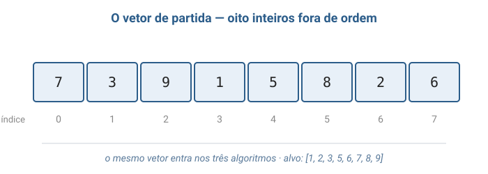
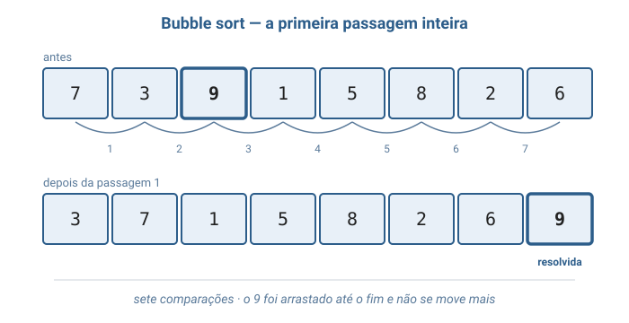
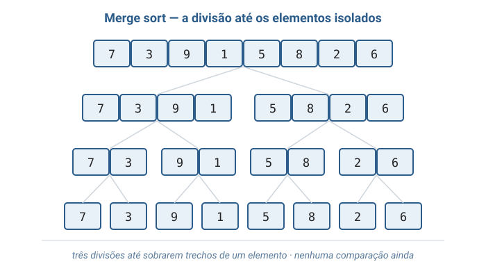
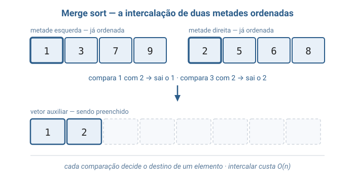
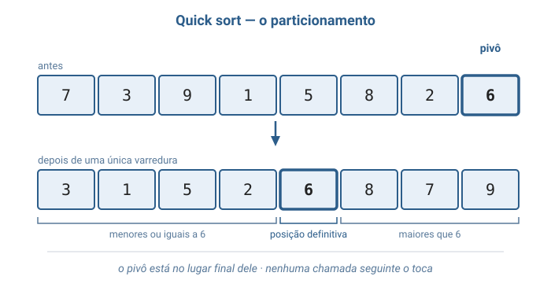
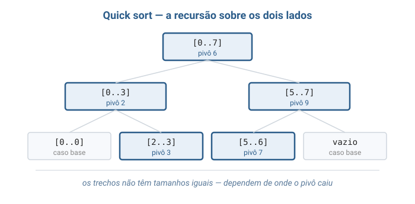
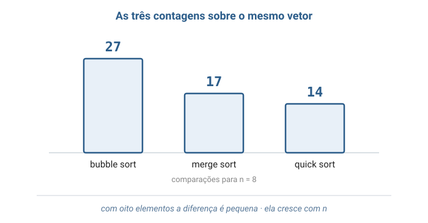

# Aula 04 — Ordenação: Bubble Sort, Merge Sort e Quick Sort

> **Tipo desta aula**: implementação.
> Três algoritmos resolvem o mesmo problema — deixar um vetor de inteiros em ordem crescente — com estratégias diferentes e custos que diferem por fatores de milhares.
> A representação escolhida é a mais simples possível: **vetor de inteiros**, com os elementos comparados diretamente pelo próprio valor.

---

## 1. Conceito — Aprofundamento Progressivo

### Camada 1 — Introdução

Você recebe seis cartas de baralho, todas de uma vez, e quer segurá-las na mão em ordem crescente.
Ninguém precisa ensinar como fazer isso: você olha as cartas, vê que uma está fora de lugar, tira ela de onde está e encaixa onde deveria estar.
Repete até que nenhuma carta esteja fora de lugar, e pronto.
O interessante é que existe mais de um jeito de conseguir o mesmo resultado — dá para ir comparando as cartas duas a duas da esquerda para a direita, dá para dividir a mão em dois montes menores e juntar os montes já arrumados, dá para escolher uma carta qualquer e separar as menores das maiores antes de continuar.
Todos os caminhos terminam com a mão ordenada; o que muda é **quanto trabalho** cada caminho custa.
Com seis cartas a diferença é imperceptível; com seis milhões, é a diferença entre um segundo e uma semana.

### Camada 2 — Definição informal com vocabulário básico

**Ordenar** (em inglês, *sort*) é rearranjar os elementos de uma coleção de modo que fiquem em uma ordem determinada.
Nesta aula a coleção é um **vetor de inteiros** e a ordem é a **crescente**: ao final, cada elemento deve ser menor ou igual ao que está imediatamente à sua direita.
O valor usado para decidir a ordem chama-se **chave** (*key*); em um vetor de inteiros a chave é o próprio número, mas ela poderia ser a nota de um aluno, o preço de um produto ou a data de um pedido (Backes, capítulo de métodos de ordenação; Veloso & Pereira, capítulo de ordenação).

Todo algoritmo desta aula é construído com apenas duas ações elementares:

- **comparar** — perguntar qual de dois elementos é o menor;
- **movimentar** — colocar um elemento em outra posição, seja **trocando** dois elementos de lugar (*swap*), seja **copiando** um elemento para outro lugar.

Contar essas duas ações é a maneira canônica de medir o custo de um algoritmo de ordenação, porque elas são o que ele realmente faz, independentemente da máquina em que rode.

Os três algoritmos desta aula são:

- **Bubble sort** (*ordenação por flutuação*, também chamada de *ordenação bolha*) — percorre o vetor comparando **elementos vizinhos** e trocando os que estão fora de ordem, repetidas vezes, até que nenhuma troca seja mais necessária.
- **Merge sort** (*ordenação por intercalação*) — divide o vetor em duas metades, ordena cada metade e depois **intercala** as duas metades já ordenadas em um único trecho ordenado.
- **Quick sort** (*ordenação rápida*) — escolhe um elemento chamado **pivô** (*pivot*), rearranja o vetor de modo que os menores fiquem à esquerda do pivô e os maiores à direita, e repete o processo em cada um dos dois lados.

Merge sort e quick sort pertencem à mesma família de estratégia, chamada **divisão e conquista** (*divide and conquer*): resolver um problema quebrando-o em problemas menores do mesmo tipo, resolvendo cada pedaço e combinando os resultados.
O bubble sort não pertence a essa família — ele ataca o vetor inteiro de uma vez, repetidamente.

Note o que um algoritmo de ordenação **não** promete.
Ele não promete que elementos com chaves iguais mantenham a ordem em que estavam (só os algoritmos ditos **estáveis** prometem isso, e a Camada 4 define o termo).
Ele não promete devolver um vetor novo: os três desta aula reescrevem o vetor que receberam.
E ordenar não é procurar — ordenar rearranja **todos** os elementos, procurar apenas localiza um deles.

### Camada 3 — Propriedades e comportamento

#### Os fundamentos que esta aula usa

Um **vetor** (*array*) é uma sequência de elementos do mesmo tipo guardados um ao lado do outro, acessíveis por um número inteiro chamado **índice**.
Em C, o primeiro elemento de um vetor `v` é `v[0]`, e um vetor de oito elementos vai de `v[0]` a `v[7]`.
A propriedade que importa aqui é que ler ou escrever `v[i]` custa o mesmo para qualquer `i`: o vetor não obriga ninguém a percorrer os elementos anteriores para chegar ao elemento desejado.

A operação de **troca** entre duas posições precisa de uma variável temporária, e o motivo é fácil de perder de vista:

```c
int guardado = vetor[i];   /* sem esta linha, o valor de vetor[i] se perde */
vetor[i] = vetor[j];
vetor[j] = guardado;
```

Se a primeira atribuição fosse `vetor[i] = vetor[j]`, o valor antigo de `vetor[i]` seria sobrescrito antes de ser copiado para `vetor[j]`, e o vetor terminaria com o mesmo elemento em duas posições.
Uma troca custa três atribuições — vale lembrar disso quando compararmos algoritmos que trocam muito com algoritmos que trocam pouco.

Dois dos três algoritmos desta aula chamam a si mesmos, e isso pede uma definição.
Uma função **recursiva** é uma função que, dentro do próprio corpo, chama a si mesma para resolver uma versão **menor** do mesmo problema.
Para que isso não se repita para sempre, toda função recursiva precisa de um **caso base**: uma situação em que ela responde diretamente, sem chamar a si mesma de novo.
Nos algoritmos desta aula o caso base é sempre o mesmo e é quase óbvio quando enunciado: **um trecho com zero ou um elemento já está ordenado** e não exige trabalho nenhum.
Cada chamada recursiva recebe um trecho estritamente menor que o trecho que a originou, e é isso que garante que a cadeia de chamadas chegue ao caso base e termine.

#### Bubble sort: comparar vizinhos até parar de trocar

O bubble sort faz **passagens** pelo vetor.
Em cada passagem ele caminha da primeira posição em direção à última, comparando cada elemento com o vizinho da direita e trocando os dois quando o da esquerda for maior.

O efeito de uma passagem completa é sempre o mesmo, e é a propriedade que dá nome ao algoritmo: **o maior elemento ainda solto termina a passagem na última posição do trecho percorrido**.
Ele "borbulha" até o fim porque, uma vez encontrado, ele vence todas as comparações seguintes e é arrastado troca após troca até a borda.
Como consequência, depois da primeira passagem a última posição está definitivamente resolvida; depois da segunda, as duas últimas; depois da passagem número `i`, as `i` últimas.
Por isso a passagem seguinte pode parar mais cedo — reexaminar o que já está no lugar é trabalho jogado fora.

Existe uma segunda observação, essa capaz de mudar a classe de complexidade em certos casos: se uma passagem inteira terminar **sem nenhuma troca**, então não existe nenhum par de vizinhos fora de ordem, e um vetor sem nenhum par de vizinhos fora de ordem está ordenado.
Nesse instante o algoritmo pode parar imediatamente.
É uma linha de código a mais que faz o bubble sort custar apenas `n - 1` comparações quando o vetor já chega ordenado.

Custo de uma passagem: **O(n)**.
Número de passagens no pior caso: **n - 1**.
Custo total no pior caso: **O(n²)**.

#### Merge sort: dividir, ordenar as metades e intercalar

O merge sort nasce de uma pergunta diferente: em vez de "como conserto este vetor?", ele pergunta "como junto duas partes que já estão certas?".

A operação central chama-se **intercalação** (*merge*).
Dados dois trechos vizinhos e **já ordenados** do mesmo vetor, a intercalação produz um único trecho ordenado com todos os elementos dos dois.
O procedimento é o de quem junta dois montes de cartas já arrumados sobre a mesa: olha-se a carta de cima de cada monte, pega-se a menor das duas, e repete-se.
Quando um dos montes acaba, o que restou no outro vai direto para o final, sem mais comparação nenhuma — porque o que restou já está ordenado e é maior que tudo o que já saiu.

A intercalação tem duas propriedades importantes.
A primeira é o custo: cada comparação decide o destino de exatamente um elemento, então intercalar dois trechos que somam `n` elementos custa **no máximo `n - 1` comparações** e exatamente `n` movimentações — é **O(n)**, linear.
A segunda é que a intercalação **não trabalha no lugar**: como ela lê dos dois trechos em paralelo e escreve em ordem, o destino precisa ser um **vetor auxiliar**, que depois é copiado de volta.
Essa memória extra é o preço do merge sort.

Com a intercalação disponível, o algoritmo inteiro cabe em três linhas de raciocínio: para ordenar um trecho, ordene a metade esquerda, ordene a metade direita e intercale as duas.
Ordenar cada metade é o mesmo problema em tamanho menor, portanto resolve-se com uma chamada recursiva, até o caso base do trecho de um elemento.
Repare em **onde mora o trabalho**: a ida apenas divide, sem comparar nada; toda a ordenação acontece na volta, dentro das intercalações.

A divisão sucessiva pela metade cria uma estrutura de **níveis**.
No topo, um trecho de `n` elementos; abaixo, dois de `n/2`; abaixo, quatro de `n/4`; e assim até os trechos de um elemento.
Em cada nível, as intercalações juntas percorrem os `n` elementos uma vez — custo O(n) por nível.
Quantos níveis existem? Tantos quantos forem as divisões de `n` por 2 até chegar a 1, que é exatamente **log₂ n**.
Daí o custo total: **O(n log n)**, e é o mesmo no melhor e no pior caso, porque a divisão pela metade não depende dos valores.

#### Quick sort: colocar um elemento no lugar definitivo dele

O quick sort também divide, mas divide **pelo valor**, não pela posição.

Ele escolhe um elemento do trecho para servir de **pivô** e executa o **particionamento**: rearranjar o trecho de modo que todos os elementos menores ou iguais ao pivô fiquem à esquerda dele e todos os maiores fiquem à direita.
Ao final do particionamento, o pivô está na **posição definitiva** que ele ocupará no vetor ordenado — e essa é a afirmação mais forte de todo o algoritmo.
Ela é verdadeira porque a posição final de um elemento em um vetor ordenado é determinada apenas por quantos elementos são menores que ele, e é exatamente isso que o particionamento conta.
Nenhuma chamada seguinte precisa tocar nessa posição.

O particionamento usado nesta aula escolhe o **último elemento do trecho** como pivô — a escolha mais simples que existe — e percorre o trecho uma única vez mantendo uma fronteira: à esquerda da fronteira ficam os elementos já reconhecidos como menores ou iguais ao pivô.
Cada elemento visitado é comparado com o pivô; se for menor ou igual, a fronteira avança uma posição e o elemento é trocado para dentro da região dos menores.
No fim, o pivô é trocado com a primeira posição depois da fronteira, e a função devolve essa posição.
Custo do particionamento de um trecho de `m` elementos: `m - 1` comparações, isto é, **O(m)**.

Feito isso, o algoritmo se aplica ao trecho da esquerda e ao trecho da direita, sem incluir o pivô.
Repare que aqui **o trabalho mora na ida**: quando as chamadas recursivas retornam, não há nada a combinar — o vetor já está ordenado.
É a imagem espelhada do merge sort.

O ponto delicado do quick sort é que a qualidade da divisão depende do valor do pivô.
Se o pivô cair perto do meio dos valores, os dois lados ficam com cerca de `n/2` elementos cada, a estrutura de níveis é a mesma do merge sort e o custo é **O(n log n)**.
Mas se o pivô for sempre o **menor** ou o **maior** elemento do trecho, um dos lados fica vazio e o outro fica com `n - 1` elementos: em vez de log₂ n níveis, são `n` níveis, e o custo despenca para **O(n²)**.
E há uma ironia importante nessa escolha de pivô: com o pivô fixo no último elemento, o pior caso acontece justamente quando o vetor **já está ordenado** — a situação que, intuitivamente, deveria ser a mais fácil.

#### Invariantes (propriedades que devem sempre valer)

Algumas afirmações precisam continuar verdadeiras em todo momento da execução; elas são o que garante que o algoritmo está correto:

- **No bubble sort**, depois da passagem número `i`, as `i` últimas posições do vetor contêm os `i` maiores elementos, já em ordem crescente e em suas posições definitivas.
- **No merge sort**, sempre que a intercalação é chamada, os dois trechos que ela recebe já estão ordenados individualmente — é essa condição que torna correto olhar apenas o primeiro elemento ainda não consumido de cada trecho.
- **No quick sort**, depois de um particionamento, nenhum elemento à esquerda do pivô é maior que ele e nenhum elemento à direita é menor que ele; por isso os dois lados podem ser ordenados de forma independente, sem nunca mais se comparar entre si.
- **Nos três**, o vetor ao final contém exatamente os mesmos elementos do vetor inicial, nem um a mais, nem um a menos — comparar e trocar não cria nem destrói elementos.

### Camada 4 — Definição formal e notação

#### O problema da ordenação

Formalmente, o problema resolvido pelos três algoritmos é o seguinte:

```
Problema da Ordenacao

  Entrada: uma sequencia de n numeros  A = (a1, a2, ..., an)

  Saida:   uma reordenacao  A' = (a'1, a'2, ..., a'n)  da mesma sequencia,
           tal que  a'1 <= a'2 <= ... <= a'n
```

A palavra **reordenação** faz trabalho pesado nessa definição.
Ela exige que a saída seja uma **permutação** da entrada: os mesmos elementos, com as mesmas repetições, apenas em outra ordem.
Um algoritmo que devolvesse `(1, 2, 3)` para a entrada `(3, 3, 1)` produziria uma sequência ordenada e ainda assim estaria errado, porque perdeu um `3` e inventou um `2`.
Ordenação correta, portanto, são duas condições simultâneas: **estar em ordem** e **ser uma permutação da entrada**.

#### Estabilidade e ordenação in-place

Duas propriedades classificam algoritmos de ordenação, e as duas aparecem nos três algoritmos desta aula.

Um algoritmo é **estável** (*stable*) quando elementos de chaves iguais terminam na mesma ordem relativa em que estavam na entrada.
Em um vetor de inteiros a diferença é invisível — dois valores `5` são indistinguíveis.
Ela aparece quando a chave é apenas parte do dado: se uma lista de alunos já está em ordem alfabética e é reordenada por nota, um algoritmo estável entrega os alunos de mesma nota ainda em ordem alfabética, enquanto um algoritmo instável os embaralha.
Bubble sort e merge sort são estáveis, desde que troquem ou escolham apenas em caso de diferença estrita — é por isso que a comparação da intercalação no código desta aula é `vetor[i] <= vetor[j]` e não `vetor[i] < vetor[j]`: o `<=` faz o empate ser resolvido em favor do elemento da esquerda, que é o que estava antes.
O quick sort com particionamento por trocas **não** é estável, porque uma troca pode arremessar um elemento para longe, saltando por cima de outros de chave igual.

Um algoritmo é **in-place** (*no lugar*) quando ordena usando apenas uma quantidade constante de memória adicional, ou seja, **O(1)** além do próprio vetor de entrada.
Bubble sort é in-place: gasta dois índices e uma variável de troca, independentemente de `n`.
O merge sort **não** é in-place: precisa do vetor auxiliar da intercalação, que é **O(n)**.
O quick sort é in-place quanto a vetores auxiliares — ele só troca elementos dentro do próprio vetor —, mas as chamadas recursivas pendentes ocupam memória enquanto esperam; essa memória é **O(log n)** quando as divisões são equilibradas e **O(n)** no pior caso.

#### As três notações assintóticas

O custo de um algoritmo é uma função `T(n)` que diz quantas operações ele executa para uma entrada de tamanho `n`.
Comparar essas funções termo a termo seria impraticável, e por isso a análise usa notações que descrevem apenas o **ritmo de crescimento**, ignorando constantes multiplicativas e termos de ordem inferior (Toscani & Veloso, capítulo de notação assintótica):

```
Sejam f e g funcoes de n em numeros nao negativos.

  f(n) = O(g(n))     <=>  existem c > 0 e n0 >= 1 tais que
                          f(n) <= c * g(n)   para todo n >= n0
                          "f cresce no maximo tao rapido quanto g"   (teto)

  f(n) = Omega(g(n)) <=>  existem c > 0 e n0 >= 1 tais que
                          f(n) >= c * g(n)   para todo n >= n0
                          "f cresce no minimo tao rapido quanto g"   (piso)

  f(n) = Theta(g(n)) <=>  f(n) = O(g(n))  E  f(n) = Omega(g(n))
                          "f cresce exatamente no ritmo de g"        (teto = piso)
```

Na prática da engenharia, dizer "este algoritmo é O(n²)" é dizer "no pior caso ele custa da ordem de n² operações", e é assim que a notação será lida no restante desta aula.
O Θ aparece quando teto e piso coincidem e cabe uma afirmação mais forte: o merge sort é **Θ(n log n)** porque esse é o custo dele em **qualquer** entrada, e não apenas no pior caso.
Dentro de um O ou de um Θ, a **base do logaritmo não importa** e por isso costuma ser omitida — trocar de base multiplica o resultado por uma constante, e constantes são justamente o que a notação descarta.

#### As recorrências

O custo do bubble sort sai de uma soma direta.
A primeira passagem faz `n - 1` comparações, a segunda faz `n - 2`, e assim por diante, até a última, que faz 1:

$$T_{pior}(n) = (n-1) + (n-2) + \cdots + 2 + 1 = \frac{n(n-1)}{2} = \Theta(n^2)$$

O custo dos algoritmos recursivos, por sua vez, não sai de contagem direta, e sim de uma **relação de recorrência** (*recurrence relation*) — uma equação que define o custo de uma entrada de tamanho `n` em termos do custo de entradas menores.
Para o merge sort, cada chamada resolve duas metades e paga uma intercalação linear:

```
T(1) = 1                        um elemento ja esta ordenado
T(n) = 2 * T(n / 2) + n         duas metades, mais a intercalacao
```

Desdobrando: o nível do topo custa `n`; os dois trechos do nível seguinte custam `n/2` cada, somando `n`; os quatro do nível abaixo custam `n/4` cada, somando `n` de novo.
Cada nível custa `n`, e o número de níveis é o número de divisões de `n` por 2 até chegar a 1, ou seja, `log₂ n`.
Logo:

$$T(n) = n \cdot \log_2 n \implies T(n) = \Theta(n \log n)$$

Para o quick sort há duas recorrências, e a distância entre elas é o assunto inteiro do algoritmo.
Quando o pivô divide o trecho ao meio, a recorrência é a mesma do merge sort e o resultado também:

$$T(n) = 2\,T(n/2) + n \implies T(n) = \Theta(n \log n)$$

Quando o pivô é sempre o extremo, um lado fica vazio e o outro fica com `n - 1` elementos:

$$T(n) = T(n-1) + n \implies T(n) = n + (n-1) + \cdots + 1 = \Theta(n^2)$$

A mesma soma do bubble sort, chegando pelo caminho oposto.

#### O limite inferior da ordenação por comparação

Uma pergunta natural fecha o formalismo: existe algo melhor que `n log n`?

Para algoritmos que ordenam **comparando elementos** — os três desta aula —, a resposta é não, e isso é um teorema, não uma observação empírica (Toscani & Veloso, capítulo de limites inferiores).
O argumento é de contagem: uma sequência de `n` elementos admite `n!` ordens possíveis, cada comparação tem apenas dois resultados possíveis e portanto separa os casos restantes em dois grupos, e são necessárias pelo menos `log₂(n!)` comparações para isolar uma ordem entre `n!` candidatas.
Como `log₂(n!)` é da ordem de `n log n`, todo algoritmo de ordenação por comparação é **Ω(n log n)** no pior caso.

O resultado tem uma consequência prática direta: o merge sort não é apenas bom, ele é **assintoticamente ótimo** para essa classe de algoritmos.
Nenhum algoritmo de comparação vai vencê-lo por uma classe inteira de complexidade — no máximo por uma constante.

### Camada 5 — Análise de complexidade

O quadro completo dos três algoritmos, com `n` = número de elementos do vetor:

| Algoritmo   | Melhor caso     | Caso médio      | Pior caso       | Espaço adicional | Estável | Trabalha no lugar |
|-------------|-----------------|-----------------|-----------------|------------------|---------|-------------------|
| Bubble sort | **O(n)**        | O(n²)           | **O(n²)**       | **O(1)**         | Sim     | Sim               |
| Merge sort  | O(n log n)      | O(n log n)      | **O(n log n)**  | **O(n)**         | Sim     | Não               |
| Quick sort  | O(n log n)      | O(n log n)      | **O(n²)**       | **O(log n)**\*   | Não     | Sim               |

\* *O espaço do quick sort não é um vetor auxiliar: é a memória ocupada pelas chamadas recursivas que ainda não retornaram. Ela é O(log n) quando as partições são equilibradas e chega a O(n) no pior caso, o mesmo em que o tempo vira O(n²).*

O melhor caso do bubble sort merece um comentário, porque é o único lugar em que ele vence os outros dois: em um vetor **já ordenado**, a primeira passagem não faz troca nenhuma, a otimização da Camada 3 encerra o algoritmo ali, e o custo total é `n - 1` comparações, isto é, **O(n)**.
Nenhum dos outros dois consegue isso — merge sort divide e intercala do mesmo jeito, ordenado ou não.

O que essas classes significam em número de comparações no pior caso, para tamanhos concretos, e em tempo numa máquina hipotética capaz de cem milhões de comparações por segundo:

| n         | Bubble sort — n(n-1)/2 | Merge sort — n log₂ n | Tempo do bubble | Tempo do merge |
|-----------|------------------------|-----------------------|-----------------|----------------|
| 8         | 28                     | 24                    | instantâneo     | instantâneo    |
| 1.000     | 499.500                | 9.966                 | 0,005 s         | 0,0001 s       |
| 100.000   | 4.999.950.000          | 1.660.964             | ~50 segundos    | ~0,02 segundo  |
| 1.000.000 | 499.999.500.000        | 19.931.569            | ~1h23min        | ~0,2 segundo   |

A tabela contém a lição central da aula.
Para oito elementos, os dois algoritmos são equivalentes — 28 contra 24 comparações, uma diferença sem qualquer importância.
Multiplicar o vetor por mil **multiplica por um milhão** o trabalho do bubble sort e multiplica por cerca de dois mil o do merge sort.
Não é uma diferença de velocidade: é uma diferença de natureza, e nenhum computador mais rápido faz o bubble sort de um milhão de elementos alcançar os vinte milhões de comparações do merge sort.

Isso não significa que o quick sort, com seu pior caso O(n²), seja uma escolha ruim — e aqui a análise fica interessante, porque a prática contradiz a tabela.
O quick sort é, na média, o mais **rápido** dos três em vetores grandes, e é ele que costuma estar por trás das funções de ordenação das bibliotecas.
A razão é que a notação assintótica descarta constantes, e as constantes do quick sort são pequenas: ele trabalha diretamente sobre o vetor, sem alocar memória, sem copiar para lugar nenhum, e o particionamento é um laço simples.
O merge sort paga, a cada nível, uma alocação e uma cópia de ida e volta pelo vetor auxiliar — trabalho que a classe O(n log n) esconde, mas o relógio não.
Além disso, o pior caso do quick sort é evitável: basta não escolher o pivô de forma previsível, e a Camada 6 lista como.

Resta o custo de espaço, que decide sozinho alguns casos.
Ordenar um vetor de um milhão de inteiros com merge sort exige um vetor auxiliar de um milhão de inteiros — memória que pode simplesmente não existir em um dispositivo pequeno.
Bubble sort e quick sort não têm esse problema.
A escolha, portanto, nunca é "qual é o melhor algoritmo", e sim "qual restrição pesa mais aqui": tempo garantido no pior caso favorece o merge sort; memória apertada favorece o quick sort; vetores pequenos ou quase ordenados favorecem o bubble sort e seus parentes simples.

### Camada 6 — Conexões e variantes

Ordenação é, junto com busca, a operação mais executada em computação, e aparece em lugares que raramente se anunciam como ordenação:

- **`ORDER BY` em bancos de dados** — toda consulta que devolve resultados em ordem executa um algoritmo de ordenação, e quando os dados não cabem na memória o banco usa uma variante que ordena pedaços separadamente e os intercala.
- **Listas de produtos ordenadas por preço** em lojas virtuais, e qualquer ranking de placar, popularidade ou relevância.
- **Ordenar para depois procurar rápido** — em um vetor ordenado é possível localizar um elemento descartando metade dos candidatos a cada comparação, o que não é possível em um vetor desordenado.
- **Detecção de duplicatas** — depois de ordenar, elementos repetidos ficam vizinhos, e uma única passagem os encontra.
- **Cálculo de mediana e percentis** — a mediana é o elemento do meio do vetor ordenado.
- **Compressão de dados e montagem de índices** — vários formatos exigem os símbolos ou as chaves em ordem antes de qualquer outro processamento.
- **A função `qsort` da biblioteca padrão de C** — disponível em `<stdlib.h>`, ordena vetores de qualquer tipo recebendo uma função de comparação escrita pelo programador. O nome vem do quick sort, embora as implementações modernas combinem mais de um algoritmo.

A família dos algoritmos de ordenação é grande, e vale saber que os três desta aula têm vizinhos próximos.
O **selection sort** (*ordenação por seleção*) procura o menor elemento e o coloca na primeira posição, depois o menor do que sobrou na segunda, e assim por diante: também O(n²), mas com o mínimo possível de trocas.
O **insertion sort** (*ordenação por inserção*) constrói o trecho ordenado da esquerda para a direita, inserindo cada novo elemento na posição correta entre os já arrumados — é o método com que a maioria das pessoas ordena cartas na mão, é O(n²) no pior caso e é excelente em vetores pequenos ou quase ordenados.
O **heapsort** ordena mantendo uma estrutura auxiliar que entrega sempre o maior elemento restante, alcançando O(n log n) garantido **sem** vetor auxiliar.

Os algoritmos desta aula também admitem variantes que corrigem seus defeitos.
Para o quick sort, a escolha do pivô pela **mediana de três** — comparar o primeiro, o do meio e o último elemento do trecho e usar o valor intermediário — elimina o pior caso do vetor já ordenado a um custo de duas comparações por chamada.
A partição em **três vias**, que separa os menores, os iguais e os maiores, resolve o caso de vetores com muitos elementos repetidos.
Para o merge sort, a versão **iterativa** intercala pares de trechos de tamanho 1, depois de tamanho 2, depois 4, sem recursão nenhuma; e a versão **externa** ordena arquivos maiores que a memória disponível, intercalando pedaços lidos do disco.
Fora da família da comparação — e portanto fora do limite Ω(n log n) da Camada 4 — existe ainda o **counting sort**, que ordena inteiros de faixa conhecida contando ocorrências, em tempo linear, ao custo de memória proporcional à faixa de valores.

---

## 2. Visualização Gráfica

Oito diagramas: o vetor de partida, o mecanismo e uma passagem completa do bubble sort, a divisão e a intercalação do merge sort, o particionamento e a recursão do quick sort, e a contagem final dos três lado a lado.
O vetor é sempre o mesmo — `[7, 3, 9, 1, 5, 8, 2, 6]` —, para que os três algoritmos possam ser comparados sobre a mesma entrada.

### Passo 1: o vetor de partida



Oito inteiros fora de ordem, com os índices marcados: `vetor[0]` vale 7 e `vetor[7]` vale 6.
Este é o estado inicial dos três algoritmos, e o alvo é `[1, 2, 3, 5, 6, 7, 8, 9]`.

### Passo 2: bubble sort — comparar dois vizinhos e trocar

![Comparação entre vetor[0] = 7 e vetor[1] = 3, com seta indicando a troca e o resultado 3, 7 nas duas primeiras posições](img/02_bubble_comparacao.svg)

A operação elementar do bubble sort, isolada: comparam-se duas posições **vizinhas** e, como a da esquerda é maior, os dois valores trocam de lugar.
Todo o algoritmo é esta figura repetida.

### Passo 3: bubble sort — a primeira passagem inteira



Sete comparações, uma para cada par de vizinhos, e o resultado `[3, 7, 1, 5, 8, 2, 6, 9]`.
O 9 foi encontrado na terceira posição e arrastado até o fim, uma troca de cada vez — a passagem sempre termina com o maior elemento na última posição, que a partir de agora está resolvida.

### Passo 4: merge sort — a divisão até os elementos isolados



O vetor é partido ao meio, cada metade é partida ao meio de novo, até sobrarem trechos de um único elemento — que já estão ordenados por definição e encerram a recursão.
São três níveis de divisão para oito elementos, porque 8 dividido por 2 três vezes chega a 1: é o `log₂ n` da Camada 3.
Nenhuma comparação aconteceu ainda; a ida apenas divide.

### Passo 5: merge sort — a intercalação de duas metades ordenadas



A intercalação final: os dois trechos já estão ordenados, e cada comparação entre os primeiros elementos ainda não consumidos decide quem sai primeiro.
Compara-se 1 com 2, sai o 1; compara-se 3 com 2, sai o 2; e assim por diante — cada comparação resolve o destino de exatamente um elemento, o que faz a intercalação inteira custar O(n).

### Passo 6: quick sort — o particionamento



O último elemento, 6, é escolhido como pivô.
Após uma única varredura do vetor, tudo o que é menor ou igual a 6 está à esquerda dele e tudo o que é maior está à direita — e o 6 ocupa agora a **posição definitiva** que terá no vetor ordenado, sem que nenhuma chamada seguinte precise tocá-lo.

### Passo 7: quick sort — a recursão sobre os dois lados



Cada lado do pivô vira um problema menor do mesmo tipo, resolvido pelo mesmo método.
Diferente do merge sort, aqui os trechos **não** têm tamanhos iguais: eles dependem de onde o pivô caiu.
Quando os pivôs caem perto do meio, a árvore tem log₂ n níveis; quando caem sempre no extremo, ela vira uma corrente de `n` níveis — e é essa diferença que separa o O(n log n) do O(n²).

### Passo 8: as três contagens lado a lado



O mesmo vetor, o mesmo resultado final, três custos: 27 comparações no bubble sort, 17 no merge sort e 14 no quick sort.
Com oito elementos a diferença é pequena e quase decorativa — é ao multiplicar `n` que ela se transforma na diferença entre segundos e horas mostrada na Camada 5.

---

## 3. Problema Motivador

> *"Como uma loja virtual com quarenta mil produtos consegue mostrar a lista inteira do mais barato para o mais caro em menos de um segundo?"*

Quarenta mil produtos parecem poucos até que se pense no que "ordenar por preço" exige.
Alguém precisa comparar preços entre si, repetidamente, até que a lista esteja em ordem — e o número de comparações necessárias depende inteiramente do método escolhido.

Com o bubble sort, ordenar quarenta mil produtos custa cerca de `40.000 × 39.999 / 2`, ou aproximadamente **800 milhões de comparações**.
Na máquina hipotética da Camada 5, que faz cem milhões de comparações por segundo, isso são oito segundos de espera — e um usuário não espera oito segundos para reordenar uma lista.
Com o merge sort ou com o quick sort, o mesmo trabalho custa cerca de `40.000 × 15,3`, ou aproximadamente **610 mil comparações**: seis milésimos de segundo.
A diferença entre a página que responde e a página que trava não está no servidor, está na escolha do algoritmo.

Esse mesmo raciocínio explica uma decisão de projeto que aparece em quase todo sistema real: **ordenar uma vez para consultar muitas**.
Em um vetor desordenado, encontrar um elemento exige olhar os elementos um a um, o que custa da ordem de `n` comparações por consulta.
Em um vetor ordenado, é possível comparar o elemento do meio com o que se procura e descartar metade dos candidatos de uma vez, repetindo o corte até sobrar um só — cerca de `log₂ n` comparações, ou 16 comparações para os mesmos quarenta mil produtos.
A ordenação custa caro uma vez; a busca fica barata para sempre.
É por isso que bancos de dados mantêm índices ordenados e que sistemas de arquivos guardam nomes em ordem.

Há ainda um terceiro caso, mais silencioso e muito comum: a ordenação **como etapa intermediária** de outro problema.
Descobrir se existem produtos duplicados no catálogo parece exigir comparar cada produto com todos os outros — quarenta mil ao quadrado, oitocentos milhões de pares.
Mas se a lista for ordenada primeiro, os duplicados ficam necessariamente vizinhos, e uma única passagem de quarenta mil comparações resolve.
Ordenar transformou um problema quadrático em um problema `n log n`, e é essa a razão pela qual algoritmos de ordenação aparecem no meio de tantos outros algoritmos que, à primeira vista, não têm nada a ver com ordem.

---

## 4. Analogias

**1. As cartas na mão.**
Você recebe seis cartas de uma vez e as segura em leque.
A primeira estratégia é a mais mecânica possível: olhe o primeiro par de cartas vizinhas, e se a da esquerda for maior que a da direita, troque as duas de lugar; passe para o par seguinte e repita até o fim do leque.
Uma varredura completa dessas nunca deixa a mão ordenada de primeira, mas ela sempre empurra a maior carta para a ponta direita — e a varredura seguinte pode ignorar essa ponta.
Repetindo, a mão fica ordenada, e a última varredura em que nenhuma troca acontece é o sinal de que acabou.
É o bubble sort inteiro, com a otimização da parada antecipada incluída.
A analogia também deixa ver o defeito: uma carta pequena que esteja na ponta direita do leque precisa de uma varredura completa para andar uma única posição à esquerda.

**2. A correção de provas em dupla.**
Duas pessoas precisam entregar uma pilha de cem provas em ordem de nota, e dividem o trabalho.
Na primeira estratégia, cada uma leva cinquenta provas, ordena as suas por conta própria e, no final, as duas juntam os dois montes: olham a prova de cima de cada monte, colocam a de menor nota sobre a mesa, e repetem até acabar.
Como os dois montes já estão em ordem, essa junção é rápida e olha cada prova uma única vez.
É o merge sort — inclusive o detalhe de que as provas precisam ir para um espaço livre da mesa enquanto são juntadas, e não podem ser combinadas dentro dos próprios montes: é o vetor auxiliar.
Na segunda estratégia, elas nem dividem em quantidades iguais: pegam uma prova qualquer, digamos de nota 6, e separam a pilha inteira em "abaixo de 6" e "acima de 6".
A prova de nota 6 já pode ser posta no lugar exato dela, e nunca mais será tocada; cada uma das pessoas leva um dos montes e repete o processo lá dentro.
É o quick sort — e a analogia mostra também o risco: se a prova escolhida for a de maior nota da pilha, o monte "abaixo" fica com tudo e o "acima" fica vazio, a divisão não aliviou nada e o trabalho não foi repartido.

---

## 5. Código em C

O programa a seguir implementa os três algoritmos e os executa sobre cópias do mesmo vetor, imprimindo os passos intermediários de cada um e a contagem final de comparações.

> **Sobre a organização do arquivo.**
> Tudo o que vem a seguir vive em **um único arquivo** chamado `ordenacao.c`: os `#include`s, os contadores, as funções auxiliares, os três algoritmos e a `main()` demonstrativa.
> Ler o programa de cima a baixo, sem saltar entre arquivos, é o que se espera aqui.

### `ordenacao.c` — arquivo único

```c
#include <stdio.h>
#include <stdlib.h>

/*
 * Aula 04 - Ordenacao: bubble sort, merge sort e quick sort.
 *
 * Os tres algoritmos resolvem exatamente o mesmo problema: rearranjar um
 * vetor de inteiros em ordem crescente. O que muda de um para o outro e a
 * ESTRATEGIA - e, por causa dela, o CUSTO: quantas comparacoes entre
 * elementos cada um faz e quantos elementos cada um movimenta.
 *
 * Os printf de dentro dos algoritmos existem so para esta aula: eles tornam
 * visivel cada passagem, cada intercalacao e cada particao. Um algoritmo de
 * ordenacao de verdade nao imprime nada - apenas deixa o vetor ordenado.
 */

/*
 * Contadores de instrumentacao. Sao variaveis globais (declaradas fora de
 * qualquer funcao, visiveis para todas elas) porque merge sort e quick sort
 * chamam a si mesmos varias vezes: carregar a contagem como parametro
 * obrigaria a passa-la para dentro e traze-la de volta em cada chamada, o
 * que so atrapalharia a leitura do algoritmo. Fora da aula, esses contadores
 * nao existiriam.
 */
int comparacoes = 0;
int trocas = 0;
int copias = 0;

/* Imprime as posicoes de inicio ate fim no formato [7, 3, 9], seguidas de
   quebra de linha. Serve para mostrar tanto o vetor inteiro quanto um pedaco
   dele, que e o que os algoritmos recursivos desta aula manipulam. */
void imprimir_trecho(int vetor[], int inicio, int fim) {
    int i;

    printf("[");
    for (i = inicio; i <= fim; i++) {
        printf("%d", vetor[i]);
        if (i < fim) {
            printf(", ");
        }
    }
    printf("]\n");
}

/* Imprime o vetor inteiro: o trecho que vai da primeira a ultima posicao. */
void imprimir_vetor(int vetor[], int tamanho) {
    imprimir_trecho(vetor, 0, tamanho - 1);
}

/* Copia todos os elementos de origem para destino. Cada algoritmo trabalha
   sobre uma copia do vetor original, para que os tres recebam a mesma
   entrada e as contagens sejam comparaveis. */
void copiar_vetor(int origem[], int destino[], int tamanho) {
    int i;

    for (i = 0; i < tamanho; i++) {
        destino[i] = origem[i];
    }
}

/*
 * Troca de lugar os elementos das posicoes i e j.
 *
 * A variavel guardado e indispensavel: sem ela, a primeira atribuicao
 * sobrescreveria vetor[i] e o valor antigo estaria perdido antes de ser
 * copiado para vetor[j].
 */
void trocar(int vetor[], int i, int j) {
    int guardado = vetor[i];

    vetor[i] = vetor[j];
    vetor[j] = guardado;
    trocas++;
}

/* ------------------------------------------------------------------ */
/* Bubble sort                                                         */
/* ------------------------------------------------------------------ */

/*
 * Bubble sort: compara elementos VIZINHOS e troca os que estao fora de
 * ordem. Cada passagem completa pelo vetor arrasta o maior elemento ainda
 * solto ate o fim do trecho nao ordenado - dai o nome (o maior "borbulha"
 * para cima).
 *
 * Depois da passagem numero i, as i ultimas posicoes ja guardam os maiores
 * elementos em ordem definitiva. Por isso o laco interno para em
 * tamanho - 1 - i: reexaminar o que ja esta no lugar seria trabalho jogado
 * fora.
 */
void bubble_sort(int vetor[], int tamanho) {
    int i, j;
    int houve_troca;

    for (i = 0; i < tamanho - 1; i++) {
        houve_troca = 0;

        for (j = 0; j < tamanho - 1 - i; j++) {
            comparacoes++;
            if (vetor[j] > vetor[j + 1]) {
                trocar(vetor, j, j + 1);
                houve_troca = 1;
            }
        }

        printf("  passagem %d: ", i + 1);
        imprimir_vetor(vetor, tamanho);

        /* Uma passagem inteira sem nenhuma troca significa que nao existe
           mais nenhum par vizinho fora de ordem - ou seja, o vetor ja esta
           ordenado e continuar seria desperdicio. */
        if (houve_troca == 0) {
            printf("  nenhuma troca nesta passagem: o vetor ja esta ordenado\n");
            return;
        }
    }
}

/* ------------------------------------------------------------------ */
/* Merge sort                                                          */
/* ------------------------------------------------------------------ */

/*
 * Intercala dois trechos VIZINHOS e ja ordenados do mesmo vetor -
 * [inicio..meio] e [meio+1..fim] - produzindo um unico trecho ordenado.
 *
 * A intercalacao nao troca elementos de lugar: ela le os dois trechos em
 * paralelo, sempre copiando o menor dos dois valores da frente para um vetor
 * auxiliar, e no final devolve o auxiliar ja ordenado para o vetor original.
 * Esse vetor auxiliar e a memoria extra que o merge sort cobra.
 */
void intercalar(int vetor[], int inicio, int meio, int fim) {
    int tamanho = fim - inicio + 1;
    int i = inicio;    /* proxima posicao a ser lida na metade esquerda */
    int j = meio + 1;  /* proxima posicao a ser lida na metade direita */
    int k = 0;         /* proxima posicao a ser escrita no auxiliar */
    int* auxiliar = malloc(tamanho * sizeof(int));

    if (auxiliar == NULL) {
        printf("erro: memoria insuficiente\n");
        exit(1);
    }

    /* Enquanto as duas metades ainda tem elementos, a comparacao decide de
       qual delas sai o proximo menor valor. */
    while (i <= meio && j <= fim) {
        comparacoes++;
        if (vetor[i] <= vetor[j]) {
            auxiliar[k] = vetor[i];
            i++;
        } else {
            auxiliar[k] = vetor[j];
            j++;
        }
        k++;
    }

    /* Uma das metades acabou antes da outra. O que sobrou na outra ja esta
       ordenado e e maior que tudo o que ja foi copiado, entao vai direto,
       sem comparacao nenhuma. */
    while (i <= meio) {
        auxiliar[k] = vetor[i];
        i++;
        k++;
    }
    while (j <= fim) {
        auxiliar[k] = vetor[j];
        j++;
        k++;
    }

    for (k = 0; k < tamanho; k++) {
        vetor[inicio + k] = auxiliar[k];
        copias++;
    }

    printf("  intercalando [%d..%d] com [%d..%d]: ", inicio, meio, meio + 1, fim);
    imprimir_vetor(auxiliar, tamanho);

    free(auxiliar);
}

/*
 * Merge sort: ordena o trecho [inicio..fim] ordenando cada metade dele e
 * intercalando as duas metades ja ordenadas.
 *
 * A funcao chama a si mesma - e uma funcao recursiva. Toda funcao recursiva
 * precisa de um caso base, uma situacao em que ela responde sem chamar a si
 * mesma de novo; aqui, um trecho de zero ou um elemento ja esta ordenado por
 * definicao e nada precisa ser feito.
 */
void merge_sort(int vetor[], int inicio, int fim) {
    int meio;

    if (inicio >= fim) {
        return;
    }

    meio = (inicio + fim) / 2;
    merge_sort(vetor, inicio, meio);
    merge_sort(vetor, meio + 1, fim);
    intercalar(vetor, inicio, meio, fim);
}

/* ------------------------------------------------------------------ */
/* Quick sort                                                          */
/* ------------------------------------------------------------------ */

/*
 * Particiona o trecho [inicio..fim] em torno de um pivo, aqui escolhido como
 * o ultimo elemento do trecho. Ao terminar, todos os elementos menores ou
 * iguais ao pivo estao a esquerda dele e todos os maiores estao a direita, e
 * a funcao devolve a posicao final do pivo.
 *
 * A variavel menor marca a fronteira: ate ela, ja se sabe que todos os
 * elementos sao menores ou iguais ao pivo. Ela comeca em inicio - 1 porque a
 * regiao dos menores nasce vazia.
 */
int particionar(int vetor[], int inicio, int fim) {
    int pivo = vetor[fim];
    int menor = inicio - 1;
    int j;

    for (j = inicio; j < fim; j++) {
        comparacoes++;
        if (vetor[j] <= pivo) {
            menor++;
            /* Quando menor e j sao a mesma posicao, esta troca e do elemento
               com ele mesmo: nao muda nada e so acontece porque o elemento ja
               estava no lado certo. */
            trocar(vetor, menor, j);
        }
    }

    /* O pivo estava guardado no fim do trecho. Agora ele vai para a primeira
       posicao depois da regiao dos menores - a sua posicao DEFINITIVA no
       vetor ordenado, que nenhuma chamada seguinte vai mexer. */
    trocar(vetor, menor + 1, fim);

    printf("  pivo %d no trecho [%d..%d]: ", pivo, inicio, fim);
    imprimir_trecho(vetor, inicio, fim);

    return menor + 1;
}

/*
 * Quick sort: coloca um elemento na posicao definitiva dele e ordena, com o
 * mesmo metodo, o que ficou de cada lado.
 *
 * Tambem e recursiva, e o caso base tambem e o trecho de zero ou um
 * elemento. A diferenca para o merge sort esta em ONDE mora o trabalho: aqui
 * ele acontece na ida, dentro de particionar, e a volta nao faz nada.
 */
void quick_sort(int vetor[], int inicio, int fim) {
    int posicao_pivo;

    if (inicio >= fim) {
        return;
    }

    posicao_pivo = particionar(vetor, inicio, fim);
    quick_sort(vetor, inicio, posicao_pivo - 1);
    quick_sort(vetor, posicao_pivo + 1, fim);
}

/* ------------------------------------------------------------------ */
/* Programa demonstrativo                                              */
/* ------------------------------------------------------------------ */

/* Zera os contadores antes de cada algoritmo, para que as contagens dos tres
   se refiram a mesma entrada e possam ser comparadas. */
void zerar_contadores(void) {
    comparacoes = 0;
    trocas = 0;
    copias = 0;
}

int main(void) {
    int original[] = {7, 3, 9, 1, 5, 8, 2, 6};
    int tamanho = 8;  /* o vetor declarado acima tem 8 elementos */
    int vetor[8];

    int comparacoes_bubble, trocas_bubble;
    int comparacoes_merge, copias_merge;
    int comparacoes_quick, trocas_quick;

    printf("Vetor original: ");
    imprimir_vetor(original, tamanho);
    printf("\n");

    printf("[1] Bubble sort\n");
    copiar_vetor(original, vetor, tamanho);
    zerar_contadores();
    bubble_sort(vetor, tamanho);
    comparacoes_bubble = comparacoes;
    trocas_bubble = trocas;
    printf("  resultado: ");
    imprimir_vetor(vetor, tamanho);
    printf("  %d comparacoes, %d trocas\n\n", comparacoes_bubble, trocas_bubble);

    printf("[2] Merge sort\n");
    copiar_vetor(original, vetor, tamanho);
    zerar_contadores();
    merge_sort(vetor, 0, tamanho - 1);
    comparacoes_merge = comparacoes;
    copias_merge = copias;
    printf("  resultado: ");
    imprimir_vetor(vetor, tamanho);
    printf("  %d comparacoes, %d copias de volta do auxiliar para o vetor\n\n",
           comparacoes_merge, copias_merge);

    printf("[3] Quick sort\n");
    copiar_vetor(original, vetor, tamanho);
    zerar_contadores();
    quick_sort(vetor, 0, tamanho - 1);
    comparacoes_quick = comparacoes;
    trocas_quick = trocas;
    printf("  resultado: ");
    imprimir_vetor(vetor, tamanho);
    printf("  %d comparacoes, %d trocas\n\n", comparacoes_quick, trocas_quick);

    printf("Resumo para n = %d\n", tamanho);
    printf("  bubble sort: %2d comparacoes\n", comparacoes_bubble);
    printf("  merge sort:  %2d comparacoes\n", comparacoes_merge);
    printf("  quick sort:  %2d comparacoes\n", comparacoes_quick);

    return 0;
}
```

### Compilando e rodando

```sh
gcc -Wall -Wextra -o ordenacao_demo ordenacao.c
./ordenacao_demo
```

Saída esperada:

```
Vetor original: [7, 3, 9, 1, 5, 8, 2, 6]

[1] Bubble sort
  passagem 1: [3, 7, 1, 5, 8, 2, 6, 9]
  passagem 2: [3, 1, 5, 7, 2, 6, 8, 9]
  passagem 3: [1, 3, 5, 2, 6, 7, 8, 9]
  passagem 4: [1, 3, 2, 5, 6, 7, 8, 9]
  passagem 5: [1, 2, 3, 5, 6, 7, 8, 9]
  passagem 6: [1, 2, 3, 5, 6, 7, 8, 9]
  nenhuma troca nesta passagem: o vetor ja esta ordenado
  resultado: [1, 2, 3, 5, 6, 7, 8, 9]
  27 comparacoes, 15 trocas

[2] Merge sort
  intercalando [0..0] com [1..1]: [3, 7]
  intercalando [2..2] com [3..3]: [1, 9]
  intercalando [0..1] com [2..3]: [1, 3, 7, 9]
  intercalando [4..4] com [5..5]: [5, 8]
  intercalando [6..6] com [7..7]: [2, 6]
  intercalando [4..5] com [6..7]: [2, 5, 6, 8]
  intercalando [0..3] com [4..7]: [1, 2, 3, 5, 6, 7, 8, 9]
  resultado: [1, 2, 3, 5, 6, 7, 8, 9]
  17 comparacoes, 24 copias de volta do auxiliar para o vetor

[3] Quick sort
  pivo 6 no trecho [0..7]: [3, 1, 5, 2, 6, 8, 7, 9]
  pivo 2 no trecho [0..3]: [1, 2, 5, 3]
  pivo 3 no trecho [2..3]: [3, 5]
  pivo 9 no trecho [5..7]: [8, 7, 9]
  pivo 7 no trecho [5..6]: [7, 8]
  resultado: [1, 2, 3, 5, 6, 7, 8, 9]
  14 comparacoes, 12 trocas

Resumo para n = 8
  bubble sort: 27 comparacoes
  merge sort:  17 comparacoes
  quick sort:  14 comparacoes
```

Vale ler a saída com atenção, porque cada bloco é a teoria da Camada 3 acontecendo.

No bubble sort, o 9 aparece na última posição já ao fim da primeira passagem, e nunca mais se move: é o "maior elemento borbulha até o fim" em ação.
A passagem 6 termina sem nenhuma troca, e o algoritmo para ali — sem a otimização, faria a sétima passagem inutilmente.

No merge sort, a ordem das linhas revela a recursão: as duas primeiras intercalações são de trechos de um elemento, a terceira já junta os resultados delas, e só a última linha vê o vetor inteiro.
Nada foi comparado durante a descida; toda comparação aconteceu na subida.
As 24 cópias contam apenas a volta do auxiliar para o vetor — cada elemento também é escrito no auxiliar na ida, e é essa ida e volta em todos os níveis que o merge sort cobra em memória e em tempo.

No quick sort, o pivô 6 da primeira linha está na posição 4 do resultado final e permanece lá até o fim do programa, exatamente como prometido pela propriedade da posição definitiva.
Repare também que bastaram **cinco** particionamentos para ordenar oito elementos: três dos trechos gerados tinham um único elemento e foram resolvidos pelo caso base, sem custo algum.

---

## 6. Exercícios Práticos

**Exercício 1 — Trace do bubble sort na mão.**
Considere o vetor `[4, 1, 3, 2]` e execute o bubble sort no papel.
Para cada passagem, escreva as comparações realizadas na ordem em que acontecem, indique quais delas resultaram em troca e escreva o estado do vetor ao final da passagem.
Considere a otimização da parada antecipada: pare assim que uma passagem inteira terminar sem trocas.

*Critério de aceitação*: o estado final é `[1, 2, 3, 4]`, e a resposta indica em qual passagem o algoritmo parou e quantas comparações foram feitas ao todo.

> **Resposta mínima aceitável**
>
> | Passagem | Comparações (vizinhos) | Trocas | Estado ao final |
> |----------|------------------------|--------|-----------------|
> | 1        | 4>1, 4>3, 4>2          | 3      | `[1, 3, 2, 4]`  |
> | 2        | 1>3, 3>2               | 1      | `[1, 2, 3, 4]`  |
> | 3        | 1>2                    | 0      | `[1, 2, 3, 4]`  |
>
> Total: **6 comparações**.
> O algoritmo para na passagem 3, porque ela terminou sem nenhuma troca — sinal de que não existe mais nenhum par de vizinhos fora de ordem.

**Exercício 2 — Verificar o resultado.**
Adicione ao `ordenacao.c` uma função `int esta_ordenado(int vetor[], int tamanho)` que devolve `1` se o vetor estiver em ordem crescente e `0` caso contrário, percorrendo o vetor uma única vez.
Chame essa função na `main()` depois de cada um dos três algoritmos e imprima `ordenado: sim` ou `ordenado: nao`.

*Critério de aceitação*: a função faz no máximo `tamanho - 1` comparações; a saída do programa mostra `ordenado: sim` nas três chamadas; a compilação com `gcc -Wall -Wextra` continua sem avisos.

> **Resposta mínima aceitável**
>
> ```c
> int esta_ordenado(int vetor[], int tamanho) {
>     int i;
>
>     /* Basta um unico par de vizinhos fora de ordem para o vetor
>        inteiro nao estar ordenado. */
>     for (i = 0; i < tamanho - 1; i++) {
>         if (vetor[i] > vetor[i + 1]) {
>             return 0;
>         }
>     }
>     return 1;
> }
> ```
>
> Na `main()`, depois de cada algoritmo:
>
> ```c
> printf("  ordenado: %s\n", esta_ordenado(vetor, tamanho) ? "sim" : "nao");
> ```

**Exercício 3 — Ordem decrescente.**
Modifique os três algoritmos para que ordenem em ordem **decrescente** — do maior para o menor —, produzindo `[9, 8, 7, 6, 5, 3, 2, 1]` a partir do vetor da aula.
Faça a menor mudança possível em cada algoritmo e escreva, em uma frase para cada um, qual comparação foi invertida e por quê.

*Critério de aceitação*: os três algoritmos produzem o mesmo vetor decrescente; nenhuma outra parte do código muda; a contagem de comparações permanece igual à do programa original.

> **Resposta mínima aceitável**
>
> Um operador de comparação por algoritmo:
>
> ```c
> /* bubble_sort: trocar quando o da esquerda for MENOR que o da direita */
> if (vetor[j] < vetor[j + 1]) {
>
> /* intercalar: sai primeiro o MAIOR dos dois valores da frente */
> if (vetor[i] >= vetor[j]) {
>
> /* particionar: para a esquerda vao os MAIORES ou iguais ao pivo */
> if (vetor[j] >= pivo) {
> ```
>
> A lógica dos três algoritmos não muda em nada — só muda o critério do que significa "estar na ordem certa".
> É por isso que a contagem de comparações continua idêntica: o número de comparações não depende do sentido da ordem.

**Exercício 4 — O pior caso do quick sort.**
Troque o vetor da `main()` pelo vetor **já ordenado** `{1, 2, 3, 5, 6, 7, 8, 9}` e rode o programa.
Anote as três contagens de comparações e explique, em um parágrafo, por que o quick sort — que era o mais econômico dos três — passa a ser o mais caro, enquanto o bubble sort passa a ser o mais barato.

*Critério de aceitação*: as contagens observadas são bubble sort 7, merge sort 12 e quick sort 28; a explicação menciona a escolha do pivô como último elemento e o fato de uma das partições ficar sempre vazia.

> **Resposta mínima aceitável**
>
> | Algoritmo   | Comparações | Motivo                                                                |
> |-------------|-------------|-----------------------------------------------------------------------|
> | Bubble sort | 7           | A primeira passagem não faz nenhuma troca e a parada antecipada encerra o algoritmo: melhor caso, O(n). |
> | Merge sort  | 12          | Contra 17 no vetor desordenado. Toda vez que uma das metades se esgota, o resto da outra é copiado sem comparação nenhuma — e num vetor já ordenado a metade esquerda vence sempre e se esgota primeiro. A estrutura de divisões, porém, é exatamente a mesma: são 3 níveis nos dois casos, e o custo continua Θ(n log n). |
> | Quick sort  | 28          | Pior caso, O(n²).                                                     |
>
> O pivô é sempre o último elemento do trecho e, num vetor crescente, o último elemento é o **maior** de todos.
> Assim, todos os demais elementos vão para a partição da esquerda e a partição da direita fica vazia: em vez de dividir o problema pela metade, cada chamada apenas o encolhe em uma unidade.
> São 8 níveis de recursão em vez de 3, com `7 + 6 + 5 + 4 + 3 + 2 + 1 = 28` comparações — exatamente a soma `n(n-1)/2` do bubble sort no pior caso.

**Exercício 5 — Pivô pela mediana de três.**
Escreva uma função `int escolher_pivo(int vetor[], int inicio, int fim)` que compare os elementos das posições `inicio`, do meio do trecho e `fim`, e devolva a **posição** daquele cujo valor é o intermediário dos três.
Altere `particionar` para trocar esse elemento com o da posição `fim` antes de começar a varredura — assim o restante do código continua funcionando sem nenhuma outra mudança, porque o pivô continua sendo o último elemento do trecho.
Rode o programa novamente sobre o vetor já ordenado do exercício anterior e compare a contagem de comparações do quick sort com as 28 medidas lá.

*Critério de aceitação*: o programa continua ordenando corretamente os dois vetores (o desordenado da aula e o já ordenado); no vetor já ordenado, a contagem de comparações do quick sort cai de 28 para 13; a compilação continua sem avisos.
Observação: as comparações feitas dentro de `escolher_pivo` não passam pelo contador, que só conta as comparações da varredura — some até quatro por chamada se quiser a conta completa.

> **Resposta mínima aceitável**
>
> ```c
> /* Devolve a posicao do valor intermediario entre vetor[inicio],
>    vetor[meio] e vetor[fim]. Nao ordena nada: so escolhe. */
> int escolher_pivo(int vetor[], int inicio, int fim) {
>     int meio = (inicio + fim) / 2;
>
>     if (vetor[inicio] <= vetor[meio] && vetor[meio] <= vetor[fim]) {
>         return meio;
>     }
>     if (vetor[meio] <= vetor[inicio] && vetor[inicio] <= vetor[fim]) {
>         return inicio;
>     }
>     return fim;
> }
> ```
>
> E as duas primeiras linhas de `particionar` passam a ser:
>
> ```c
> int escolhido = escolher_pivo(vetor, inicio, fim);
> trocar(vetor, escolhido, fim);   /* o pivo volta a ser o ultimo elemento */
> pivo = vetor[fim];
> ```
>
> Num vetor já ordenado, o valor intermediário dos três é justamente o elemento do meio do trecho — que divide o trecho em duas metades de tamanhos iguais.
> O pior caso deixa de ser alcançado por esse tipo de entrada: a contagem cai de 28 para 13 comparações, de volta à ordem de `n log n`.
> A garantia, porém, não é absoluta: continua existindo alguma entrada capaz de enganar a mediana de três, e é por isso que implementações profissionais trocam de algoritmo quando a recursão fica funda demais.

---

## 7. Referências

- **Backes, A. R.** — *Algoritmos e Estruturas de Dados em Linguagem C*. Rio de Janeiro: LTC, 2023. Capítulo de métodos de ordenação — bubble sort, merge sort e quick sort implementados em C na mesma linha didática desta aula, com a discussão do particionamento e da escolha do pivô.
- **Veloso, P.; Pereira, S. do L.** — *Estruturas de Dados em C — Uma Abordagem Didática*. São Paulo: Saraiva, 2016. Capítulo de ordenação — a apresentação dos métodos elementares e dos métodos por divisão e conquista, com ênfase no raciocínio antes do código.
- **Toscani, L. V.; Veloso, P. A. S.** — *Complexidade de Algoritmos*. Porto Alegre: Bookman, 2012. Capítulos de notação assintótica, de recorrências e de limites inferiores — a fonte de rigor para as recorrências da Camada 4 e para o resultado Ω(n log n) da ordenação por comparação.
- **Schildt, H.** — *C Completo e Total*. São Paulo: Makron Books, 1997. Capítulos de vetores e de alocação dinâmica de memória — o `malloc` e o `free` usados pelo vetor auxiliar da intercalação, e a função `qsort` da biblioteca padrão.

**Leituras complementares**:

- **Wirth, N.** — *Algoritmos e Estruturas de Dados*. Rio de Janeiro: LTC, 1999. Capítulo de ordenação — a apresentação clássica dos métodos, com a análise comparativa que popularizou a distinção entre métodos elementares e métodos eficientes.
- **Damas, L.** — *Linguagem C*. 10ª ed. Rio de Janeiro: LTC, 2023. Aprofundamento em vetores, ponteiros e organização de programas em C.
- **Forouzan, B. A.; Gilbert, R. F.** — *Data Structures: a pseudocode approach with C++*. 2001. Capítulo de ordenação — os mesmos algoritmos em pseudocódigo, útil como segunda leitura de contraste.
- **Ford, W.; Topp, W.** — *Data Structures with C++ using STL*. 2002. Discussão dos algoritmos de ordenação disponíveis em biblioteca e de quando cada um é escolhido.
- **Jamsa, K.; Klander, L.** — *Programando em C/C++: a bíblia*. São Paulo: Pearson, 1999. Referência adicional com grande número de exemplos curtos de ordenação e busca em vetores.
