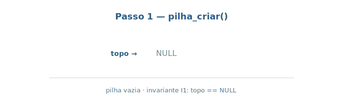
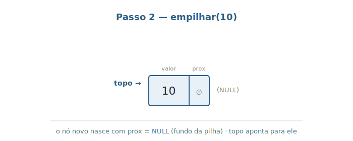
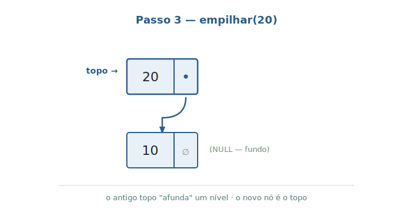
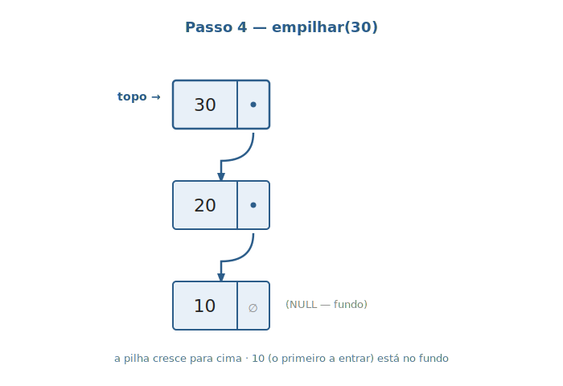
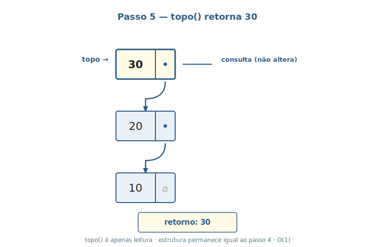
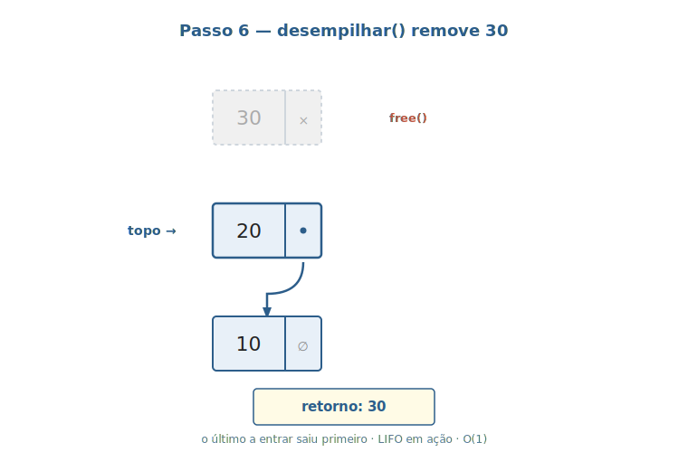
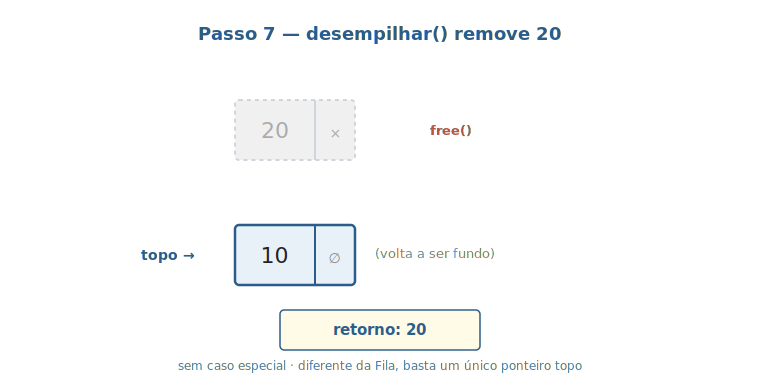

# Aula 04 — Pilha (Stack)

> **Tipo desta aula**: implementação. A Pilha é o gêmeo conceitual da Fila — mesma família (estrutura linear), política de acesso oposta (LIFO em vez de FIFO). A representação interna escolhida aqui é **lista simplesmente encadeada com um único ponteiro `topo`** — ainda mais simples que a da Fila.

---

## 1. Conceito — Nível Profundo

### Pilha, em uma frase

Uma **Pilha** é o TAD que representa uma sequência de elementos com **inserção e remoção em uma única extremidade**, chamada **topo**, governada pela política **LIFO** (*Last-In, First-Out*) — o último elemento que entrou é o primeiro a sair (Tenenbaum, cap. 2 — *"Pilhas"*; Sedgewick, *Algoritmos em C*, Parte 1, cap. 4 — seção sobre **pushdown stacks**; referência histórica em Knuth, *TAOCP* vol. 1, §2.2.1).

Onde a Fila tem duas pontas distintas (`inicio` e `fim`), a Pilha tem **uma só** ponta operacional. Isso a torna a estrutura mais simples possível em que a ordem temporal de chegada importa: ela só preserva a **ordem inversa**, descartando tudo que não esteja no topo.

A Pilha é onipresente em computação:

- **Pilha de chamadas** que toda linguagem de programação mantém durante a execução — cada chamada de função empilha um *frame* com variáveis locais e endereço de retorno; o `return` desempilha.
- **Histórico de "desfazer"** (Ctrl+Z) em editores, IDEs, ferramentas gráficas — cada ação executada vira uma entrada empilhada; cada desfazer desempilha.
- **Histórico de navegação** ("voltar") em browsers e em apps mobile — cada página/tela visitada vai para a pilha; "voltar" desempilha.
- **Avaliação de expressões** com parênteses — ao percorrer a expressão, parênteses de abertura são empilhados e os de fechamento desempilham, validando o pareamento.
- **Algoritmos recursivos transformados em iterativos** — a recursão usa a pilha implícita do programa; a versão iterativa usa uma pilha explícita.

### Especificação formal — TAD Pilha

```
TAD Pilha de Inteiros

  Tipos:
    Pilha                                       (a estrutura)
    Inteiro
    Booleano

  Operações:
    criar()                       -> Pilha
    empilhar(Pilha, Inteiro)      -> Pilha
    desempilhar(Pilha)            -> Pilha       [erro se vazia]
    topo(Pilha)                   -> Inteiro     [erro se vazia]
    vazia(Pilha)                  -> Booleano

  Axiomas (para qualquer pilha P, inteiro x):
    A1. vazia(criar())                                = verdadeiro
    A2. vazia(empilhar(P, x))                         = falso
    A3. topo(empilhar(P, x))                          = x
    A4. desempilhar(empilhar(P, x))                   = P
    A5. topo(criar())                                 = erro
    A6. desempilhar(criar())                          = erro
```

O **axioma A4** é o **coração do LIFO**: ele diz que "empilhar `x` e em seguida desempilhar **devolve a pilha original**". Em palavras: o último elemento a entrar é exatamente o primeiro a sair, sem afetar nada do que estava embaixo. Compare com o axioma análogo da Fila (`desenfileirar(enfileirar(F, x)) = enfileirar(desenfileirar(F), x)`) — lá o `x` "passa por dentro" da remoção; aqui, ele simplesmente sai. Tenenbaum (cap. 2) apresenta exatamente esse contraste de axiomas como definição operacional de Pilha vs. Fila.

### Representação interna escolhida

> A representação interna desta aula é construída sobre o **nó** apresentado na sub-seção *"O nó — unidade de construção das estruturas encadeadas"* da Aula 02. O nó da Pilha é exatamente o nó da lista simplesmente encadeada — um campo de valor (a carga útil) e um campo `proximo` (o ponteiro de ligação). O que muda não é o nó: é a **política de acesso** (LIFO em vez de FIFO) e, em comparação com a Fila, o **estado externo enxuto** (apenas o ponteiro `topo`, sem `fim`).

Como na Fila, há mais de uma forma de implementar. CLRS (cap. 10, seção 10.1) cobre as duas opções com pseudocódigo claro; Tenenbaum (cap. 2) traz a implementação em C de cada uma:

| Representação | Vantagem | Custo |
|---|---|---|
| Vetor com `topo` como índice | Memória contígua; uma única alocação no início | Capacidade fixa (ou *realloc* eventual) |
| **Lista simplesmente encadeada com `topo`** | Tudo em O(1); tamanho dinâmico; código simplíssimo | Ponteiro extra por nó (8 bytes); cada nó é uma alocação individual com `malloc` |

A escolha desta aula é a **lista simplesmente encadeada com um único ponteiro `topo`**. A grande simplicidade vem do fato de que **toda operação acontece no início da lista**: empilhar é "inserir no início", desempilhar é "remover do início". Não é preciso ter `fim` — ninguém nunca acessa o fim da pilha.

Sob essa representação:

- `empilhar(x)` cria um nó com valor `x`, faz seu `proximo` apontar para o `topo` antigo e atualiza `topo`. **O(1).**
- `desempilhar()` lê o valor do nó apontado por `topo`, salva o `proximo` dele em `topo`, libera o nó antigo. **O(1).**
- `topo()` retorna o valor do nó apontado por `topo` sem alterar nada. **O(1).**
- `vazia()` testa se `topo == NULL`. **O(1).**

Toda operação em O(1) e o código tem **menos casos especiais** que a Fila (não há o caso "primeiro/último elemento" que na Fila exige cuidar dos dois ponteiros).

### Propriedades que devem sempre valer

Algumas propriedades têm de continuar verdadeiras antes e depois de cada operação — chamamos isso de **invariantes** da estrutura. Para esta Pilha são duas:

- **Quando a pilha está vazia**, o ponteiro `topo` é `NULL`.
- **Quando a pilha tem ao menos um elemento**, `topo` é diferente de `NULL` e, seguindo os ponteiros `proximo` a partir do nó apontado por `topo`, chega-se a um nó cujo `proximo` é `NULL` — o fundo da pilha.

Cada operação tem de **terminar deixando essas duas propriedades válidas**. Comparada à Fila, a Pilha tem menos propriedades a manter porque tem menos estado interno (um único ponteiro em vez de dois). É realmente uma das estruturas de dados mais simples que existe — e é também uma das mais usadas.

---

## 2. Conceito — Nível Simplificado

Pense na **pilha de bandejas de um restaurante self-service**.

- Bandeja nova: vai **em cima** da última. Esse é o `empilhar`.
- Bandeja para usar: você pega **a do topo** (não vai cavar embaixo). Esse é o `desempilhar`.
- Para saber qual é a próxima sem pegar ainda, basta olhar o topo. Esse é o `topo`.
- Para saber se há bandejas, olha-se a pilha. Esse é o `vazia`.

A regra central: **só se mexe no topo**. A do meio e a do fundo são inacessíveis enquanto não se desempilhar tudo o que está em cima delas.

Essa restrição parece dura, mas é exatamente isso que faz a Pilha ser **simples e veloz**. E, surpreendentemente, é a estrutura natural para qualquer situação que precisa **desfazer na ordem inversa** — Ctrl+Z, voltar no navegador, retornar de funções aninhadas.

---

## 3. Visualização Gráfica

Ciclo de vida completo: criação, três `empilhar`, uma consulta `topo`, dois `desempilhar` até esvaziar.

### Passo 1: pilha_criar()



A pilha começa vazia: `topo = NULL`. Não há nó algum sendo apontado.

### Passo 2: empilhar(10)



Cria-se um nó `[10|NULL]`. Como a pilha estava vazia, o `proximo` do nó novo já nasce como `NULL` (a pilha é o "fundo da pilha"). `topo` passa a apontar para o nó novo.

### Passo 3: empilhar(20)



Cria-se um nó `[20|*]` cujo `proximo` aponta para o **antigo topo** (`[10]`). Em seguida, `topo` passa a apontar para o nó novo. **O antigo topo "afunda" um nível**.

### Passo 4: empilhar(30)



Mesma lógica: cria nó, liga ao topo antigo, atualiza topo. A pilha cresce **para cima**.

### Passo 5: topo() retorna 30



`topo()` apenas **lê** o valor do nó apontado por `topo`. **Não altera** a estrutura. Retorna `30` (o último a entrar).

### Passo 6: desempilhar() remove 30



O nó do topo é "destacado": `topo` passa a apontar para o `proximo` dele (`[20]`), e o nó antigo `[30]` é **liberado** com `free`. **O elemento mais recente foi o primeiro a sair** — LIFO em ação.

### Passo 7: desempilhar() remove 20



Mesma lógica. Resta o nó `[10]`, com `proximo == NULL` (volta a ser o fundo da pilha). Note como o código da operação **não muda** entre o caso "havia 3 elementos" e "havia 2 elementos" — diferentemente da Fila, **não há caso especial** para o último elemento, porque a Pilha não mantém um ponteiro `fim`.

---

## 4. Problema Motivador

> *"Como o botão Ctrl+Z funciona?"*

Quando você está editando um documento e aperta Ctrl+Z, o editor desfaz a **última** ação. Aperta de novo, desfaz a **penúltima**. Aperta uma terceira vez, desfaz a **antepenúltima**. As ações são desfeitas exatamente **na ordem inversa** de execução.

Como o editor sabe qual é a "última ação"? Ele mantém uma **Pilha de ações**:

- Cada vez que o usuário faz alguma coisa (digita uma letra, deleta uma palavra, cola um trecho), o editor cria uma representação dessa ação e a **empilha**.
- Cada Ctrl+Z **desempilha** a ação do topo e a reverte.
- Cada Ctrl+Y (refazer) costuma usar uma **segunda pilha**, que recebe o que foi desfeito.

A Pilha é a estrutura natural porque LIFO **é exatamente o comportamento** de "desfazer na ordem inversa de execução". Tentar usar uma Fila aqui seria desastroso — Ctrl+Z começaria desfazendo a **primeira** ação que você fez no documento (provavelmente "abrir o arquivo"), não a mais recente.

Outro caso clássico: a **pilha de chamadas** que toda linguagem mantém em execução. Quando uma função `A` chama `B`, que chama `C`, o sistema operacional / runtime da linguagem mantém uma pilha:

```
[ frame de C ]   ← topo (executando)
[ frame de B ]
[ frame de A ]
[ ... main ... ]
```

Cada `return` **desempilha** o frame do topo e devolve o controle para quem chamou (o frame que ficou exposto). É **literalmente uma Pilha** — e o nome não é coincidência.

A Pilha aparece em qualquer situação que pede *"o mais recente é o mais relevante"* ou *"desfaça na ordem inversa"*.

---

## 5. Analogias

**1. Pilha de bandejas no balcão de um restaurante self-service.**
As bandejas chegam limpas e são colocadas **em cima** da pilha existente. Quando você precisa de uma, pega a **do topo** — não a do meio, não a do fundo. A pilha cresce para cima quando vêm bandejas novas; encolhe pelo topo quando os clientes as retiram. Você nunca vê a do meio. Esse é o **LIFO** literal.

**2. Pilha de pratos sujos na pia.**
Você termina uma refeição: o prato vai **em cima** da pilha de pratos sujos. Quando vai lavar, **começa pelo do topo** — o último que foi colocado, que é o que está exposto. O do fundo é o que **sujou primeiro** e será o **último a ser lavado**. (Engraçado: "última coisa suja, primeira coisa limpa".)

---

## 6. Código em C

Note como o código é **mais curto** que o da Fila — menos casos especiais, menos invariantes, mesma legibilidade.

> **Sobre a organização do arquivo.** Tudo o que vem a seguir vive em **um único arquivo** chamado `pilha.c`: `#include`s, struct do nó, struct da pilha, todas as funções da TAD e a `main()` demonstrativa. A separação em arquivo de cabeçalho (`pilha.h`) e arquivo de implementação (`pilha.c`) — ou seja, o uso de *interface* explícita imposta pelo compilador — é assunto da aula futura sobre **organização de projetos em C**. Por enquanto, manter tudo num lugar só facilita ler de cima a baixo.

### `pilha.c` — arquivo único

```c
#include <stdio.h>
#include <stdlib.h>

// Cada elemento da pilha vira um No com o valor e um
// ponteiro para o proximo No (o que esta logo abaixo).
typedef struct No {
    int valor;
    struct No* proximo;
} No;

// A pilha guarda apenas o topo. O fundo e' alcancado seguindo
// os ponteiros proximo ate chegar em NULL.
typedef struct Pilha {
    No* topo;
} Pilha;

// Cria uma pilha vazia.
Pilha* pilha_criar(void) {
    Pilha* p = malloc(sizeof(Pilha));
    if (p == NULL) {
        printf("erro: memoria insuficiente\n");
        exit(1);
    }
    p->topo = NULL;
    return p;
}

// Verdadeiro (1) se a pilha nao tem nenhum elemento.
int pilha_vazia(Pilha* p) {
    return p->topo == NULL;
}

// Coloca um valor no topo da pilha.
void pilha_empilhar(Pilha* p, int valor) {
    No* novo = malloc(sizeof(No));
    if (novo == NULL) {
        printf("erro: memoria insuficiente\n");
        exit(1);
    }
    novo->valor = valor;

    // O proximo do novo no e' o antigo topo (que pode ser NULL
    // se a pilha estava vazia). O novo no passa a ser o topo.
    novo->proximo = p->topo;
    p->topo = novo;
}

// Remove e devolve o valor do topo.
// Pre-requisito: a pilha nao pode estar vazia.
int pilha_desempilhar(Pilha* p) {
    if (pilha_vazia(p)) {
        printf("erro: pilha vazia\n");
        exit(1);
    }
    No* removido = p->topo;
    int valor = removido->valor;

    // O topo "afunda" um nivel: passa a apontar para o que estava
    // logo abaixo. Se o no removido era o ultimo, removido->proximo
    // era NULL e o topo vira NULL — sem caso especial.
    p->topo = removido->proximo;
    free(removido);
    return valor;
}

// Devolve o valor do topo sem remover.
int pilha_topo(Pilha* p) {
    if (pilha_vazia(p)) {
        printf("erro: pilha vazia\n");
        exit(1);
    }
    return p->topo->valor;
}

// Libera toda a memoria usada pela pilha.
void pilha_destruir(Pilha* p) {
    No* atual = p->topo;
    while (atual != NULL) {
        No* proximo = atual->proximo;
        free(atual);
        atual = proximo;
    }
    free(p);
}

// Programa demonstrativo.
int main(void) {
    Pilha* p = pilha_criar();

    pilha_empilhar(p, 10);
    pilha_empilhar(p, 20);
    pilha_empilhar(p, 30);
    printf("Topo da pilha: %d\n", pilha_topo(p));

    printf("Desempilhando: ");
    while (!pilha_vazia(p)) {
        printf("%d ", pilha_desempilhar(p));
    }
    printf("\n");

    pilha_destruir(p);
    return 0;
}
```

### Compilando e rodando

Como tudo está em um só arquivo, a linha de compilação é direta:

```sh
gcc -Wall -Wextra -o pilha_demo pilha.c
./pilha_demo
```

Saída esperada:

```
Topo da pilha: 30
Desempilhando: 30 20 10
```

A linha `Desempilhando: 30 20 10` é a **prova empírica do LIFO** — exatamente a **ordem inversa** da entrada. Compare com a Fila, em que a saída foi `10 20 30` (mesma ordem da entrada).

Esse contraste é didaticamente precioso: **mesma representação interna** (lista encadeada), **resultados opostos** — porque o **contrato** (TAD) é diferente. É o que o TAD promete: o comportamento observável é definido pelo contrato, não pela estrutura escolhida para implementá-lo.

---

## 7. Exercícios Práticos

**Exercício 1 — Trace na mão.**
Considere uma pilha vazia e a sequência: `empilhar(7)`, `empilhar(3)`, `empilhar(11)`, `desempilhar`, `empilhar(5)`, `topo`, `desempilhar`, `desempilhar`. Para cada operação, escreva o estado da pilha (do topo para a base) e o valor retornado quando aplicável.

*Critério de aceitação*: 8 estados + retornos. Estado final esperado: `[7]` no topo (pilha de um único elemento).

> **Resposta mínima aceitável**
>
> | Operação           | Estado (topo → base) | Retorno |
> |--------------------|---------------------|---------|
> | `empilhar(7)`      | `[7]`               | —       |
> | `empilhar(3)`      | `[3, 7]`            | —       |
> | `empilhar(11)`     | `[11, 3, 7]`        | —       |
> | `desempilhar`      | `[3, 7]`            | `11`    |
> | `empilhar(5)`      | `[5, 3, 7]`         | —       |
> | `topo`             | `[5, 3, 7]`         | `5`     |
> | `desempilhar`      | `[3, 7]`            | `5`     |
> | `desempilhar`      | `[7]`               | `3`     |

**Exercício 2 — Função `pilha_imprimir`.**
Adicione ao `pilha.c` uma função `void pilha_imprimir(Pilha* p)` que imprime os valores **do topo para a base** no formato `[30, 20, 10]`, ou `[]` se vazia. Não pode usar `desempilhar` (a função imprime sem alterar a pilha). Acrescente chamadas a essa função na `main()` antes e depois das operações.

*Critério de aceitação*: a função fica no mesmo `pilha.c`, junto às outras operações; a `main()` chama antes e depois; saída coincide com o estado esperado.

> **Resposta mínima aceitável**
>
> ```c
> void pilha_imprimir(Pilha* p) {
>     printf("[");
>     No* atual = p->topo;
>     while (atual != NULL) {
>         printf("%d", atual->valor);
>         if (atual->proximo != NULL) printf(", ");
>         atual = atual->proximo;
>     }
>     printf("]\n");
> }
> ```
>
> O percurso é a partir de `topo`, na direção do `proximo` — exatamente a ordem topo → base.

**Exercício 3 — Verificador de parênteses balanceados.**
Escreva uma função `bool parenteses_balanceados(const char* s)` que retorna `true` se a string `s` tem todos os parênteses `(`, `[`, `{` corretamente pareados e aninhados, e `false` caso contrário. Use uma `Pilha` de caracteres como auxiliar (adapte o tipo se preferir, ou mapeie cada abertura para um inteiro).

Exemplos: `"(a+b)*[c-d]"` → `true`; `"({a)})"` → `false` (fecha `)` quando o topo era `{`); `"(("` → `false` (sobra abertura no fim).

*Critério de aceitação*: programa compila e classifica corretamente os 3 exemplos acima e mais 2 casos seus de teste.

> **Resposta mínima aceitável**
>
> ```c
> // Mapeamento simples: '(' → 1, '[' → 2, '{' → 3.
> static int abre_para_codigo(char c) {
>     if (c == '(') return 1;
>     if (c == '[') return 2;
>     if (c == '{') return 3;
>     return 0;
> }
> static int fecha_para_codigo(char c) {
>     if (c == ')') return 1;
>     if (c == ']') return 2;
>     if (c == '}') return 3;
>     return 0;
> }
>
> bool parenteses_balanceados(const char* s) {
>     Pilha* p = pilha_criar();
>     for (int i = 0; s[i] != '\0'; i++) {
>         int abre = abre_para_codigo(s[i]);
>         int fecha = fecha_para_codigo(s[i]);
>         if (abre) {
>             pilha_empilhar(p, abre);
>         } else if (fecha) {
>             if (pilha_vazia(p) || pilha_desempilhar(p) != fecha) {
>                 pilha_destruir(p);
>                 return false;
>             }
>         }
>     }
>     bool ok = pilha_vazia(p);
>     pilha_destruir(p);
>     return ok;
> }
> ```
>
> **Por que funciona**: cada abertura empilha; cada fechamento desempilha e confere se bate. Pilha vazia ao fim → tudo fechado. Sobrar coisa → abertura sem fechamento.

**Exercício 4 — Inverter uma string com pilha.**
Escreva `void inverter_string(char* s)` que recebe uma string e a modifica **in-place** para a versão invertida (`"abcd"` → `"dcba"`), usando uma `Pilha` auxiliar. Discuta em uma linha qual o custo de tempo e espaço comparado a inverter trocando as pontas com dois índices.

*Critério de aceitação*: a função funciona para entradas vazias, de 1 caractere e maiores; comparação de custo com a versão "dois índices".

> **Resposta mínima aceitável**
>
> ```c
> void inverter_string(char* s) {
>     Pilha* p = pilha_criar();
>     int n = 0;
>     while (s[n] != '\0') {
>         pilha_empilhar(p, (int) s[n]);
>         n++;
>     }
>     for (int i = 0; i < n; i++) {
>         s[i] = (char) pilha_desempilhar(p);
>     }
>     pilha_destruir(p);
> }
> ```
>
> **Custo**: tempo O(n) (uma passada para empilhar, outra para desempilhar). **Espaço**: O(n) extra (a pilha). A versão "dois índices" trocando `s[i]` com `s[n-1-i]` faz a mesma coisa em O(n) tempo mas com **O(1)** de espaço extra. A versão com pilha é mais didática (mostra LIFO), mas pior em espaço — preferir os dois índices em produção.

**Exercício 5 — Fila usando duas pilhas (desafio).**
Implemente uma `Fila` (com `enfileirar`, `desenfileirar`, `frente`, `vazia`) usando **apenas duas pilhas** (`P_in` e `P_out`) como armazenamento interno — **nenhum nó, nenhuma lista** seu. Estratégia clássica:

- `enfileirar(x)` empilha em `P_in`.
- `desenfileirar()` se `P_out` está vazia, **transfere** todos os elementos de `P_in` para `P_out` (desempilhando de um, empilhando no outro). Em seguida, desempilha `P_out` e retorna.
- `frente()` mesma lógica de `desenfileirar`, mas usa `topo` no fim.

Analise o custo amortizado de `desenfileirar`: aparentemente é O(n) no pior caso, mas **cada elemento atravessa de `P_in` para `P_out` no máximo uma vez ao longo de sua vida** — então a soma do trabalho de `n` operações é O(n), o que dá custo amortizado **O(1)** por operação.

*Critério de aceitação*: implementação que compila e roda; saída de FIFO correta para uma sequência de teste; explicação escrita do raciocínio amortizado.

> **Resposta mínima aceitável**
>
> ```c
> typedef struct {
>     Pilha* in;
>     Pilha* out;
> } Fila2P;
>
> Fila2P* fila2p_criar(void) {
>     Fila2P* f = malloc(sizeof(Fila2P));
>     f->in = pilha_criar();
>     f->out = pilha_criar();
>     return f;
> }
>
> void fila2p_enfileirar(Fila2P* f, int x) {
>     pilha_empilhar(f->in, x);
> }
>
> static void transferir_se_preciso(Fila2P* f) {
>     if (pilha_vazia(f->out)) {
>         while (!pilha_vazia(f->in)) {
>             pilha_empilhar(f->out, pilha_desempilhar(f->in));
>         }
>     }
> }
>
> int fila2p_desenfileirar(Fila2P* f) {
>     transferir_se_preciso(f);
>     return pilha_desempilhar(f->out);   // erro se ambas vazias
> }
>
> int fila2p_frente(Fila2P* f) {
>     transferir_se_preciso(f);
>     return pilha_topo(f->out);
> }
>
> bool fila2p_vazia(const Fila2P* f) {
>     return pilha_vazia(f->in) && pilha_vazia(f->out);
> }
> ```
>
> **Análise amortizada**: cada elemento `x` enfileirado entra em `P_in` (1 operação), eventualmente é transferido para `P_out` (1 desempilhar + 1 empilhar = 2 operações) e por fim é desempilhado de `P_out` (1 operação). Total no ciclo de vida de `x`: **4 operações de pilha O(1)**. Em uma sequência de `n` enfileiramentos seguida por `n` desenfileiramentos, o total é **O(n)** — daí o custo amortizado **O(1)** por operação, mesmo com o "pior caso" pontual de O(n). É um raciocínio que volta na disciplina sempre que se fala em vetor dinâmico (cap. de tabelas dinâmicas, Sedgewick).

---

## 8. Referências

- **Tenenbaum, A. M.; Langsam, Y.; Augenstein, M. J.** — *Estruturas de Dados Usando C*. Capítulo 2, *"Pilhas"*, com a discussão de implementação por vetor e por lista encadeada, e o exemplo clássico do verificador de parênteses balanceados.

- **Sedgewick, R.** — *Algoritmos em C*, Parte 1, capítulo 4, *"Abstract Data Types"*, seção sobre **pushdown stacks**. Discussão sucinta com diagramas excelentes e o paralelo entre pilha e recursão.

**Leituras complementares**:
- **CLRS** — *Algoritmos: Teoria e Prática*. Capítulo 10, seção 10.1 — *"Pilhas e filas"*. Implementação por vetor com pseudocódigo claro.
- **Ziviani, N.** — *Projeto de Algoritmos com Implementações em Pascal e C*. Capítulo de pilhas — útil para contraste em Pascal.
- **Knuth, D.** — *The Art of Computer Programming*, vol. 1, seção 2.2.1 — referência histórica sobre pilhas e filas como conceitos fundamentais.
