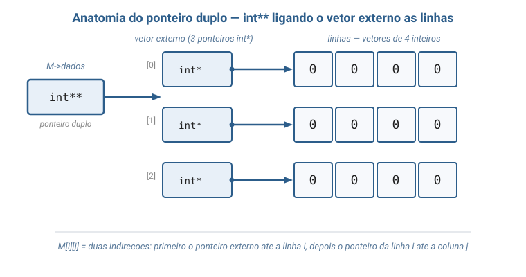
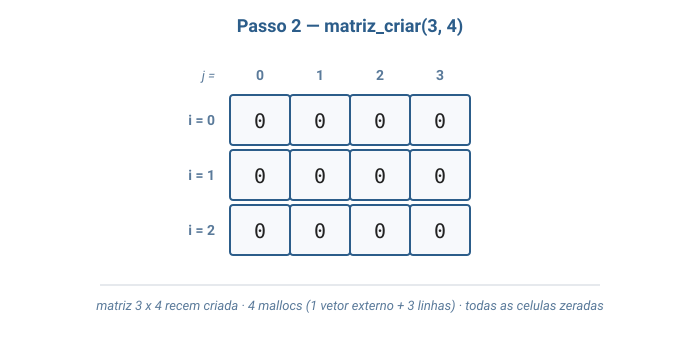
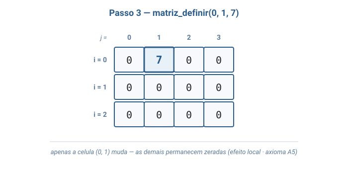
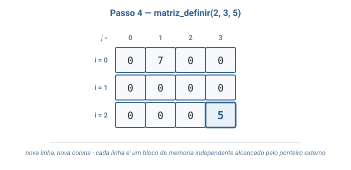
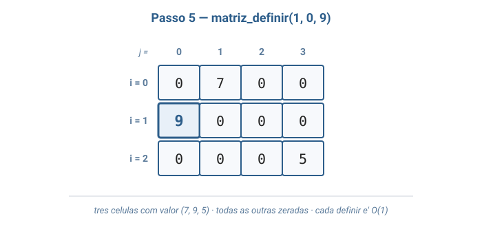
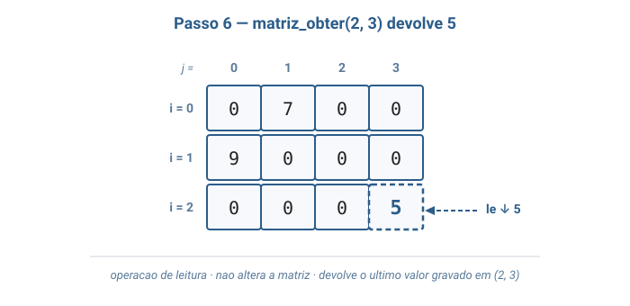
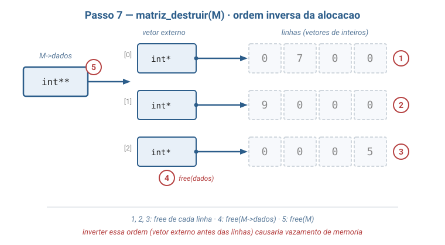

# Aula 06 — Matriz (Matrix)

> **Tipo desta aula**: implementação. A **matriz** é a primeira estrutura desta disciplina baseada em **alocação dinâmica bidimensional**. A representação escolhida é a mais transparente para quem está aprendendo a lidar com **ponteiros duplos** em C: a matriz vive em memória como um **vetor de ponteiros para vetores de inteiros** — isto é, um `int**`. O objetivo pedagógico central da aula é fazer o ponteiro duplo deixar de ser misterioso, mostrando, passo a passo, como `M[i][j]` é só uma forma elegante de escrever "siga o ponteiro externo até a linha *i*, depois siga o ponteiro daquela linha até a coluna *j*".

---

## 1. Conceito — Aprofundamento Progressivo

### Camada 1 — Introdução

Pense numa **planilha do Excel**. Ela tem linhas numeradas verticalmente (1, 2, 3, ...) e colunas identificadas por letras (A, B, C, ...). Para falar de uma célula específica, você combina os dois: "C7", "A1", "F12". A célula está sempre no cruzamento de uma linha com uma coluna — duas coordenadas, nunca uma só. Pense também num **tabuleiro de xadrez**: oito linhas, oito colunas, cada casa identificada por uma letra (coluna) e um número (linha): "e4", "a1", "h8". Em ambos os casos, a estrutura é a mesma: uma **grade retangular** em que cada célula carrega um valor e é acessada por **dois índices**. Essa imagem — algo organizado em **linhas e colunas**, com acesso por par de coordenadas — é exatamente a ideia central da estrutura de dados chamada **matriz**.

### Camada 2 — Definição informal com vocabulário básico

Uma **matriz** (em inglês, *matrix*) é uma estrutura de dados **bidimensional** que armazena valores numa **grade retangular** de **L linhas** e **C colunas**. Cada **célula** é identificada por um par de **índices** `(i, j)`, onde `i` é o número da linha (variando de `0` a `L−1`) e `j` é o número da coluna (variando de `0` a `C−1`). O par `(i, j)` é o **endereço lógico** da célula — análogo ao "C7" da planilha, só que numérico e começando do zero (Tenenbaum, cap. 1 — *Vetores e Arrays*; Sedgewick, *Algoritmos em C*, Parte 1, capítulo sobre arrays e estruturas elementares).

Para que essa grade seja útil em prática, a matriz oferece um conjunto pequeno de operações:

- **criar** (*create*) — produz uma matriz com `L` linhas e `C` colunas, com todas as células zeradas.
- **definir** (*set*) — atribui um valor a uma célula identificada por `(i, j)`.
- **obter** (*get*) — devolve o valor armazenado na célula `(i, j)`.
- **linhas** e **colunas** — informam as dimensões da matriz.
- **destruir** (*destroy*) — libera toda a memória associada à matriz.

Note o que a matriz **não** oferece — em contraste com filas, pilhas e listas encadeadas: **não há noção de "primeiro" ou "último"** (a célula `(0,0)` não é mais especial que a célula `(2,3)`); **não há crescimento dinâmico transparente** (uma vez criada com `L × C`, suas dimensões ficam fixas — adicionar uma linha exige realocação); e **não há ordem de inserção preservada** (definir a célula `(1,1)` antes ou depois da `(0,0)` é indiferente para o estado final). Em compensação, a matriz oferece algo que nenhuma das estruturas anteriores oferecia: **acesso direto por par de coordenadas em tempo constante** — `M[i][j]` não precisa percorrer nada para chegar à célula desejada.

### Camada 3 — Propriedades e comportamento

Diferente das estruturas estudadas até aqui (lista encadeada, fila, pilha, árvore), a matriz **não é construída sobre o nó da Aula 02**. Não há nós encadeados nem ponteiros entre células. A matriz é uma **estrutura de acesso direto**: a partir do par de índices `(i, j)`, chegamos à célula em uma operação de tempo constante, sem percorrer nada. O que organiza a estrutura é a **alocação em duas camadas** — primeiro um vetor de ponteiros, depois as linhas em si — e é aqui que entra o ponteiro duplo.

#### O ponteiro duplo: o que é e por que precisamos dele

Esta é a parte mais importante da aula. Vamos construir a ideia em camadas — começando pela representação mais simples (matriz estática) e seguindo até o ponteiro duplo, que é a forma mais transparente de **ver** uma matriz na memória do computador.

**Camada 0 — `int*`, lembrando o vetor de uma dimensão.** Em C, uma variável `int` guarda um inteiro. Uma variável `int*` (lê-se *ponteiro para inteiro*) guarda o **endereço de memória** onde um inteiro está armazenado. Quando usamos `malloc` para criar um vetor de inteiros, recebemos um `int*` — endereço do **primeiro** inteiro do bloco. A partir dele, `vetor[2]` significa "o terceiro inteiro contado a partir desse endereço".

**Como o C guarda uma matriz estática na memória.** Considere a declaração `int m[3][4]`. À primeira vista parece uma "grade", mas na memória **não existe grade** — existe um único **bloco contíguo** de 12 inteiros enfileirados, um endereço atrás do outro. O C usa a convenção *row-major* (linha por linha): primeiro os 4 inteiros da linha 0, depois os 4 da linha 1, depois os 4 da linha 2. Em endereços crescentes:

```
posição na memória:  0    1    2    3    4    5    6    7    8    9   10   11
conteúdo:           m[0][0] m[0][1] m[0][2] m[0][3] m[1][0] ... m[2][2] m[2][3]
                    └─── linha 0 ────────┘ └─── linha 1 ───┘ └─── linha 2 ───┘
```

A "linha" e a "coluna" são abstrações que o compilador faz por cima. Quando escrevemos `m[i][j]`, o que o compilador faz é caminhar pela fila de inteiros até a célula certa — sem precisar de nenhum ponteiro extra, porque sabe que cada linha tem exatamente `C` inteiros e que tudo está enfileirado. Não existe vetor de ponteiros aqui — só inteiros, um atrás do outro. Repare no diagrama: as células `m[0][3]` e `m[1][0]` são literalmente **vizinhas** em memória (posições 3 e 4), mesmo estando em linhas diferentes na "grade" lógica.

**O problema das dimensões dinâmicas.** A matriz estática `int m[L][C]` é simples e contígua, mas tem uma restrição séria: `L` e `C` precisam ser conhecidos **no momento em que o código é compilado** (literalmente escritos como números no código-fonte). Se queremos uma matriz cujas dimensões só são decididas em tempo de execução — porque o usuário digita, porque vêm de um arquivo, porque dependem da resolução de uma imagem que vai ser carregada — o compilador não tem como reservar memória antes de saber esses números. Para resolver, usamos `malloc`, que pede memória **durante a execução** do programa, já com as dimensões em mãos.

**Alternativa 1 — um único bloco enfileirado (matriz linearizada).** Uma primeira ideia é manter a contiguidade da versão estática: pedir um `malloc` que devolva **um único bloco** com todos os inteiros enfileirados, exatamente como no caso estático. Funciona, e em desempenho é a melhor opção — uma única chamada a `malloc` e um único `free`. Mas perdemos a sintaxe natural `m[i][j]`: o que recebemos é um vetor de **uma dimensão só**, e quem chama precisa calcular manualmente em que posição da fila mora cada célula. A estrutura bidimensional fica **escondida dentro do cálculo de posição**, em vez de aparecer no código.

**Alternativa 2 — vetor de ponteiros para linhas (a escolha desta aula).** Para reaver a sintaxe `m[i][j]` num cenário dinâmico, mudamos a representação: em vez de um único bloco contíguo, alocamos **L blocos separados** (um por linha) **e mais um vetor extra** com `L` ponteiros — cada ponteiro guardando o endereço de uma linha. O nome técnico desse vetor de ponteiros é `int**`: um ponteiro que aponta para o início de um vetor cujos elementos são `int*`, e cada `int*` aponta para uma linha de inteiros.

Visualizando a memória:

```
   M->dados                      vetor externo (L ponteiros)
   ┌──────┐                  ┌─────────┬─────────┬─────────┐
   │ int**│─────────────────▶│  int*   │  int*   │  int*   │
   └──────┘                  └────┬────┴────┬────┴────┬────┘
                                  │         │         │
              ┌───────────────────┘         │         └──────────────────┐
              ▼                             ▼                            ▼
      ┌──┬──┬──┬──┐               ┌──┬──┬──┬──┐              ┌──┬──┬──┬──┐
      │ 0│ 7│ 0│ 0│  linha 0      │ 9│ 0│ 0│ 0│  linha 1     │ 0│ 0│ 0│ 5│ linha 2
      └──┴──┴──┴──┘               └──┴──┴──┴──┘              └──┴──┴──┴──┘
       (alocada em um             (alocada em outro          (alocada em outro
        lugar da memória)           lugar da memória)          lugar da memória)
```

Cada componente da indireção tem **forma e nome próprios na memória**: existe o ponteiro `M->dados`, existe o vetor externo de `L` ponteiros, e existem as `L` linhas, cada uma como um bloquinho independente. Agora `M[i][j]` em C significa duas coisas em sequência:

1. `M[i]` — vá ao **i-ésimo ponteiro** do vetor externo (`M[i]` tem tipo `int*`: é o endereço de início da linha `i`).
2. `M[i][j]` — a partir desse endereço, pegue o **j-ésimo inteiro** da linha (`M[i][j]` tem tipo `int`: é o valor da célula).

Em notação de ponteiros, `M[i][j]` é a mesma coisa que `*(*(M + i) + j)` — duas operações de **indireção**, duas vezes "siga o endereço".

**A consequência visual da escolha.** Na versão estática (e na linearizada), as células `m[0][3]` e `m[1][0]` são **vizinhas** em memória — endereços consecutivos. Já com `int**`, as linhas podem estar **em lugares totalmente diferentes da memória** — não há garantia nenhuma de que a linha 0 e a linha 1 sejam vizinhas; cada uma foi pedida ao `malloc` em separado, e o sistema decide onde colocar. Cada linha é um bloquinho independente, e o vetor de ponteiros é quem **reconstrói** a estrutura bidimensional logicamente, ligando o ponteiro `i` ao endereço da linha `i`.

**Por que esta representação resolve o problema de visualizar a memória.** A versão `int**` é mais cara em mallocs (`L + 1` em vez de `1`) e gasta `L` ponteiros extras de memória. Em troca, ela é **didaticamente transparente**: o aluno consegue apontar o dedo para cada componente do diagrama — o ponteiro externo, o vetor de ponteiros, cada linha — e dizer "isto mora aqui na memória, e este endereço veio daqui". Na versão linearizada, a estrutura bidimensional **desaparece** dentro de um cálculo que quem chama precisa fazer mentalmente a cada acesso; na versão estática, ela existe mas só funciona com dimensões fixas em compilação. O ponteiro duplo é o caminho do meio: paga um pequeno preço em memória extra para que cada indireção seja explícita, nomeada e visível.

#### As operações em detalhe

- **Criar (`matriz_criar`)** aloca em duas camadas, casadas com a estrutura do ponteiro duplo. Primeiro pedimos o **vetor externo** com `L` ponteiros (`malloc(L * sizeof(int*))`); depois, num laço, pedimos cada **linha** com `C` inteiros (`malloc(C * sizeof(int))`) e zeramos. Total: **L + 1 chamadas a `malloc`** e custo O(L · C) — domina o laço de zeragem, que toca cada uma das `L*C` células.

- **Obter (`matriz_obter`)** devolve `M->dados[i][j]`. As duas indireções do ponteiro duplo acontecem aqui, sem nenhum laço: ler o ponteiro da linha no vetor externo, ler o inteiro dentro da linha. Custo **O(1)**.

- **Definir (`matriz_definir`)** atribui `M->dados[i][j] = valor`. Mesmas duas indireções, agora terminando em escrita em vez de leitura. Custo **O(1)**.

- **Destruir (`matriz_destruir`)** desfaz a alocação **na ordem inversa**: primeiro `free(M->dados[i])` para cada linha, depois `free(M->dados)` para o vetor externo, por fim `free(M)` para a struct. O detalhamento de *por que* essa ordem é importante está na seção de invariantes logo abaixo. Custo: **L + 1 frees** mais a struct.

#### Propriedades que devem sempre valer

As propriedades abaixo são **invariantes** — afirmações sobre a matriz que precisam ser verdadeiras o tempo inteiro, do `criar` ao `destruir`. Cada operação implementada tem o dever de mantê-las.

- **Dimensões fixas.** A matriz sempre tem `L ≥ 1` e `C ≥ 1`, e esses valores **não mudam** durante o ciclo de vida. Não há operação de "redimensionar" — quem precisar de uma matriz maior tem que criar uma nova e copiar os dados, porque mudar `L` ou `C` exigiria realocar o vetor externo e algumas linhas; é mais simples deixar isso fora do TAD.
- **Cobertura válida.** Para todo índice `(i, j)` com `0 ≤ i < L` e `0 ≤ j < C`, a célula `M[i][j]` aponta para memória válida. Isso é garantido pela criação em duas camadas: o vetor externo tem exatamente `L` posições, e cada uma aponta para uma linha de exatamente `C` inteiros.
- **Limites são responsabilidade de quem chama.** Acessar `M[L][0]` ou `M[i][C]` é **comportamento indefinido** em C — o compilador não verifica nada, e o programa pode ler lixo, sobrescrever outra variável, ou até crashar. A pré-condição "índice está dentro dos limites" precisa ser garantida antes de chamar `definir` e `obter`.
- **Ordem na destruição.** Cada linha precisa ser liberada **antes** do vetor externo, e o vetor externo antes da struct. Isso vale porque, depois de `free(M->dados)`, os endereços armazenados naquele vetor (que apontam para as linhas) ficam inválidos — perderíamos o "mapa" para chegar até as linhas e elas vazariam para sempre.

### Camada 4 — Definição formal e notação

Um **TAD** (Tipo Abstrato de Dados) define uma estrutura pelo seu **contrato observável** — os valores que armazena, as operações que oferece e os axiomas que essas operações satisfazem — sem comprometer-se com nenhuma representação interna específica. Para a matriz de inteiros desta aula, o TAD é (Tenenbaum, cap. 1):

```
TAD Matriz de Inteiros

  Tipos:
    Matriz
    Inteiro

  Operacoes:
    criar(Inteiro L, Inteiro C)               -> Matriz
    linhas(Matriz)                            -> Inteiro
    colunas(Matriz)                           -> Inteiro
    definir(Matriz, Inteiro i, Inteiro j, Inteiro v) -> Matriz   [pre: 0 <= i < L, 0 <= j < C]
    obter(Matriz, Inteiro i, Inteiro j)       -> Inteiro          [mesma pre-condicao]

  Axiomas (para qualquer matriz M = criar(L, C), indices validos i, j, i', j' e inteiro v):
    A1. linhas(criar(L, C))                                        = L
    A2. colunas(criar(L, C))                                       = C
    A3. obter(criar(L, C), i, j)                                   = 0
    A4. obter(definir(M, i, j, v), i, j)                           = v
    A5. obter(definir(M, i, j, v), i', j')  =  obter(M, i', j')    se (i, j) != (i', j')
```

O **axioma A4** é o coração do TAD Matriz: *"o valor que acabei de gravar numa célula é o que vou ler de volta"* — é a garantia mínima de qualquer estrutura de armazenamento por chave. O **axioma A5** é a garantia de **efeito local**: definir a célula `(i, j)` **não afeta** o valor de nenhuma outra célula. Juntos, A4 e A5 definem o comportamento de uma matriz como uma coleção de células **independentes**, cada uma acessada por seu próprio par de índices. O **axioma A3** estabelece o **valor inicial** das células — toda matriz recém-criada por `criar` está **zerada**, o que dá um estado inicial previsível e dispensa o aluno de "lembrar" de zerar antes de usar.

#### A representação interna como tupla

Para a versão dinâmica com ponteiro duplo, a matriz pode ser descrita pela tupla:

`M = (L, C, dados)`

onde:

- **L ∈ ℕ⁺** é o número de linhas.
- **C ∈ ℕ⁺** é o número de colunas.
- **dados: {0, ..., L−1} × {0, ..., C−1} → ℤ** é a função que associa cada par de índices ao inteiro armazenado naquela célula.

Concretamente em C, **dados** é implementada como um `int**` — ou seja, um **vetor de L ponteiros** (cada um do tipo `int*`), onde o i-ésimo ponteiro aponta para uma **linha** de **C inteiros** alocada dinamicamente. A invariante "`dados[i][j]` é uma posição de memória válida para todo `0 ≤ i < L` e `0 ≤ j < C`" liga formalmente o estado lógico da matriz ao estado físico do ponteiro duplo.

### Camada 5 — Análise de complexidade

A análise se faz em termos de **L** (linhas) e **C** (colunas), e compara as três representações canônicas que apresentamos na camada anterior (Tenenbaum, cap. 1; Sedgewick, capítulo sobre arrays).

| Operação                       | Matriz estática `int m[L][C]` | Matriz dinâmica `int**` *(esta aula)* | Matriz linearizada `int* m` (tamanho L·C) |
|--------------------------------|-------------------------------|----------------------------------------|--------------------------------------------|
| `criar`                        | O(1) (pilha)                  | **O(L · C)** + `L + 1` mallocs         | O(L · C) + 1 malloc                        |
| `obter(i, j)`                  | O(1)                          | **O(1)**                               | O(1)                                       |
| `definir(i, j, v)`             | O(1)                          | **O(1)**                               | O(1)                                       |
| `destruir`                     | O(1) (automático)             | **O(L)** + `L + 1` frees               | 1 free                                     |
| Espaço total                   | O(L · C) inteiros             | O(L · C) inteiros + `L` ponteiros      | O(L · C) inteiros                          |

O ponto importante de ler dessa tabela é que **`obter` e `definir` são O(1) nas três representações**, mas pelo mesmo motivo apenas em aparência: em todos os casos, chegar à célula `(i, j)` exige apenas algumas somas e leituras em memória, sem laço. O que muda é o que acontece "por trás":

- Na **estática**, o compilador caminha direto até a célula na fila de inteiros — um único acesso à memória.
- Na **linearizada**, é o mesmo caminhar, mas quem precisa "saber o caminho" é o cliente do código, não o compilador.
- Na **dinâmica `int**`**, são **duas leituras de memória**: primeiro lemos o endereço da linha no vetor externo, depois lemos o inteiro dentro da linha. Continua sendo um número fixo de passos, independente de `L` e `C` — por isso O(1) — mas o trabalho concreto é maior que nas outras duas.

O **custo de `criar`** é O(L·C) nas duas versões dinâmicas porque o laço zera todas as células — a diferença está no **número de mallocs**: a versão `int**` faz `L + 1` chamadas (uma para o vetor externo e uma por linha), enquanto a linearizada faz **uma só**. Em matrizes grandes, isso conta: cada chamada a `malloc` pede memória ao sistema, e fazer mil chamadas em vez de uma cobra um preço perceptível na prática. A versão `int**` paga esse preço em troca da sintaxe natural.

O **espaço extra** da versão `int**` é exatamente `L` ponteiros (o vetor externo). Em máquinas modernas (64 bits), um ponteiro ocupa 8 bytes — então uma matriz `1000 × 1000` paga 8 KB extras de overhead, sobre os ~4 MB dos inteiros. Pequeno em proporção, mas é o tipo de detalhe que faz diferença quando há **muitas** matrizes pequenas.

A escolha desta aula pela versão `int**` é pedagógica, não de desempenho: queremos que o aluno veja **cada parte da indireção** com nome próprio em memória. Para uso real, a linearizada costuma ganhar quando há matrizes grandes; a estática serve para matrizes pequenas e de tamanho fixo conhecido em compilação.

### Camada 6 — Conexões e variantes

A matriz é uma das estruturas mais usadas em toda a computação — aparece em praticamente toda subárea:

- **Imagens digitais** — cada pixel é uma célula. Uma foto em tons de cinza é uma matriz `altura × largura` de inteiros (intensidade de 0 a 255). Uma foto colorida costuma ser três matrizes (canais R, G, B) ou uma matriz cujas células são triplas.
- **Planilhas eletrônicas** (Excel, Google Sheets, Numbers) — linhas e colunas de valores, fórmulas ou texto. Cada célula é endereçada por par de coordenadas.
- **Tabuleiros de jogos** — xadrez (8×8), damas (8×8), sudoku (9×9), jogo da velha (3×3), batalha naval, *Minesweeper*. O estado do jogo vive em uma matriz.
- **Matriz de adjacência** de grafos — célula `(i, j)` vale `1` se existe aresta entre os vértices `i` e `j`, e `0` caso contrário. Tema central da aula futura de grafos.
- **Álgebra linear e machine learning** — vetores e matrizes são a representação universal de dados em IA (entradas de redes neurais, pesos, transformações). Bibliotecas como **NumPy** (Python), **Eigen** (C++) e **BLAS/LAPACK** (Fortran/C) existem exatamente para acelerar operações com matrizes.
- **Processamento de sinais e computação gráfica** — transformações geométricas (rotação, escala, translação) são multiplicações de matrizes.
- **Mapas de calor e dados tabulares multidimensionais** — séries temporais com várias variáveis, tabelas de correlação, matrizes de confusão em estatística.

Variantes principais da própria estrutura, além das três representações da Camada 5. Cada uma surge porque a matriz "cheia" desperdiça memória num cenário específico:

- **Matriz esparsa** (*sparse matrix*) — quando a esmagadora maioria das células vale zero, guardar todas elas é desperdício. Pense numa matriz de adjacência de um grafo com 10 000 vértices e apenas 50 000 arestas: das 100 milhões de células possíveis, só 50 mil têm valor diferente de zero. Estruturas como **CSR** (*Compressed Sparse Row*) e **lista de listas** armazenam **somente as células não-nulas**, junto com seus índices. Trocam tempo de acesso constante por economia drástica de memória — tema de aula avançada.
- **Matriz triangular** — quando a matriz é simétrica por natureza (por exemplo, a matriz de distâncias entre cidades: a distância de A para B é igual à de B para A), os valores acima da diagonal repetem os de baixo. Guardar apenas o triângulo inferior corta o uso de memória pela metade — o acesso `(i, j)` simplesmente troca os índices quando `j > i`.
- **Matriz com células de tamanho variável** (*jagged array*) — quando cada linha tem um número diferente de colunas, como uma planilha em que cada aluno tem uma quantidade diferente de notas. A representação `int**` desta aula **suporta isso naturalmente**: como cada linha é alocada separadamente, basta passar um `colunas[i]` diferente em cada `malloc` da camada interna. Na versão estática e na linearizada isso não funciona — ambas pressupõem o mesmo `C` para todas as linhas.

A matriz reaparece em quase todas as aulas seguintes — em particular, na aula de **grafos** (como matriz de adjacência) e nas aulas de **algoritmos de ordenação** (quando ordenamos linhas de uma tabela por uma chave).

---

## 2. Visualização Gráfica

Vamos acompanhar o **ciclo de vida completo** de uma matriz pequena (3 linhas × 4 colunas): criação, três operações `definir`, uma operação `obter` (que não altera o estado) e a destruição. Antes, um diagrama dedicado mostra a **anatomia do ponteiro duplo** — como o `int**` se conecta aos vetores de linha em memória.

### Passo 1: anatomia do ponteiro duplo



O ponteiro `dados` (tipo `int**`) é o **endereço do vetor externo**. Esse vetor externo tem `L = 3` ponteiros (tipo `int*`), cada um apontando para uma linha. Cada linha é um vetor de `C = 4` inteiros. Para chegar à célula `(i, j)`, o computador segue **duas indireções**: primeiro o ponteiro externo até a linha `i`, depois o ponteiro da linha `i` até o inteiro na coluna `j`.

### Passo 2: matriz_criar(3, 4)



A função `matriz_criar` faz duas alocações em camadas: primeiro o vetor externo com 3 ponteiros, depois cada uma das 3 linhas com 4 inteiros zerados. **Total de mallocs**: 4 (1 vetor externo + 3 linhas). Todas as 12 células iniciam com valor 0 — o axioma A3 do TAD em ação.

### Passo 3: matriz_definir(0, 1, 7)



Atribuição direta: `M->dados[0][1] = 7`. O ponteiro externo nos leva à linha 0, e dentro dela escrevemos `7` na posição 1. Apenas uma célula muda; as demais permanecem zeradas (axioma A5 — efeito local).

### Passo 4: matriz_definir(2, 3, 5)



`M->dados[2][3] = 5`. Note que essa célula está na linha **diferente** da anterior — o ponteiro externo nos leva à linha 2, completamente separada da linha 0 em memória. Não há "deslocamento" como em vetor linear: cada linha é um bloco independente.

### Passo 5: matriz_definir(1, 0, 9)



`M->dados[1][0] = 9`. Linha do meio, primeira coluna. Mesmo padrão: duas indireções, atribuição O(1).

### Passo 6: matriz_obter(2, 3)



Devolve `5`. **Esta operação não altera a matriz** — só lê. A célula `(2,3)` continua com o valor `5` após o `obter`.

### Passo 7: matriz_destruir(M)



A liberação acontece **na ordem inversa** da alocação: primeiro cada uma das 3 linhas (`free(dados[0])`, `free(dados[1])`, `free(dados[2])`), depois o vetor externo (`free(dados)`), e por fim a própria struct (`free(M)`). O motivo dessa ordem foi discutido na Camada 3 (invariantes): se o vetor externo for liberado antes das linhas, perdemos os endereços para chegar até elas.

---

## 3. Problema Motivador

> *"Como o Instagram aplica um filtro 'preto e branco' em uma foto?"*

Uma fotografia digital é uma **matriz de pixels**. Numa foto colorida em alta resolução (digamos, 1920 × 1080), são mais de **2 milhões de células**, cada uma carregando os componentes vermelho, verde e azul da cor naquele ponto. O nome técnico dessa estrutura, em qualquer linguagem ou *framework*, é o mesmo: **matriz**.

Para aplicar um filtro de "tons de cinza", o procedimento é direto: o aplicativo percorre cada célula `(i, j)` da matriz, calcula uma única intensidade de cinza a partir das três componentes RGB (uma média ponderada, tipicamente `0.299 · R + 0.587 · G + 0.114 · B`) e grava esse valor em uma nova matriz de saída. São cerca de **4 milhões de operações** `obter` e `definir` para uma imagem dessa resolução, cada uma O(1). Sem a estrutura de matriz — com seu acesso direto por par de índices — o filtro seria penoso de escrever e ainda mais penoso de rodar.

O mesmo padrão aparece em vários outros lugares do dia a dia. **Planilhas do Excel** são literalmente matrizes em que cada célula pode ter um número, um texto ou uma fórmula. **Jogos de tabuleiro** computadorizados — xadrez, damas, sudoku, jogo da velha — guardam o estado num tabuleiro `N × N`. **Mapas de calor** (visualizações em que cada célula tem uma cor proporcional a um valor) são matrizes desenhadas na tela. **Sistemas de recomendação** modelam usuários e itens numa matriz `usuários × itens` em que cada célula guarda a nota (ou a ausência dela) que o usuário deu ao item.

Em todos esses casos, a estrutura subjacente é a mesma: uma **grade retangular** com acesso por par de coordenadas. É por isso que a matriz é uma das primeiras estruturas que aparecem em qualquer livro-texto de computação — junto com vetores e listas, ela forma o **vocabulário básico** com o qual programadores descrevem dados organizados.

---

## 4. Analogias

**1. Tabuleiro de xadrez.** Um tabuleiro de xadrez é uma matriz `8 × 8` na qual cada casa tem uma coordenada — em notação algébrica, letras de `a` a `h` para as colunas e números de `1` a `8` para as linhas (`e4`, `a1`, `h8`). Cada casa pode estar vazia ou conter uma peça. Quando o jogador anuncia "Cavalo para f3", ele está definindo a célula `(linha 3, coluna f)` com a peça "cavalo" — exatamente uma operação `definir`. Quando o computador desenha o tabuleiro na tela, percorre as 64 casas em laço duplo, lendo cada uma com `obter`. O tabuleiro **não cresce** durante a partida (sempre 8×8), **não há ordem implícita** entre as casas (a casa `a1` não é "anterior" à `h8` em nenhum sentido estrutural), e o acesso é **direto** — sem caminhar peça por peça.

**2. Mapa de poltronas de um cinema.** Quando você compra ingresso para um filme, o sistema mostra um diagrama da sala: fileiras (linhas) identificadas por letras (`A`, `B`, `C`, ...) e poltronas (colunas) identificadas por números (`1`, `2`, `3`, ...). Sua poltrona "fileira G, poltrona 12" é exatamente um par de índices `(6, 11)` em uma matriz que representa o estado da sala. Cada célula pode estar `0` (livre), `1` (ocupada) ou `2` (sua reserva). Quando outro espectador compra uma poltrona, o sistema faz `matriz_definir(sala, fileira, poltrona, 1)`. Quando você consulta a disponibilidade da poltrona, o sistema faz `matriz_obter`. As dimensões da sala não mudam durante a sessão, e o acesso é direto por par de coordenadas — exatamente o comportamento da matriz.

---

## 5. Código em C

A implementação a seguir traz o TAD Matriz completo com todas as operações declaradas no bloco 1. O ponto crucial está nas funções `matriz_criar` e `matriz_destruir`, que mostram **explicitamente** as duas camadas de alocação e a ordem correta de liberação. Acompanhe os comentários — eles falam sobre o "porquê" de cada decisão de alocação.

> **Sobre a organização do arquivo.** Tudo o que vem a seguir vive em **um único arquivo** chamado `matriz.c`: `#include`s, struct, funções da TAD e a `main()` demonstrativa. A separação em arquivo de cabeçalho (`matriz.h`) e arquivo de implementação (`matriz.c`) é assunto da aula futura sobre **organização de projetos em C**. Por enquanto, manter tudo num lugar só facilita ler de cima a baixo.

### `matriz.c` — arquivo único

```c
#include <stdio.h>
#include <stdlib.h>

// A matriz guarda suas dimensoes e um ponteiro duplo "dados".
// O ponteiro duplo aponta para um vetor de ponteiros — cada
// posicao desse vetor aponta para uma linha (vetor de inteiros).
typedef struct Matriz {
    int linhas;
    int colunas;
    int** dados;
} Matriz;

// Cria uma matriz com "linhas" x "colunas" inteiros, todos zerados.
// A alocacao acontece em duas camadas:
//   1) o vetor externo, com um ponteiro por linha;
//   2) cada linha, com um vetor de inteiros.
Matriz* matriz_criar(int linhas, int colunas) {
    Matriz* m = malloc(sizeof(Matriz));
    if (m == NULL) {
        printf("erro: memoria insuficiente\n");
        exit(1);
    }
    m->linhas = linhas;
    m->colunas = colunas;

    // Camada 1: vetor externo com "linhas" ponteiros para int.
    // Cada ponteiro desse vetor vai apontar para uma linha
    // alocada na camada 2.
    m->dados = malloc(linhas * sizeof(int*));
    if (m->dados == NULL) {
        printf("erro: memoria insuficiente\n");
        exit(1);
    }

    // Camada 2: para cada linha, alocamos um vetor de "colunas"
    // inteiros e zeramos as celulas. Sao "linhas" mallocs aqui,
    // mais o malloc do vetor externo, totalizando linhas + 1.
    for (int i = 0; i < linhas; i++) {
        m->dados[i] = malloc(colunas * sizeof(int));
        if (m->dados[i] == NULL) {
            printf("erro: memoria insuficiente\n");
            exit(1);
        }
        for (int j = 0; j < colunas; j++) {
            m->dados[i][j] = 0;
        }
    }
    return m;
}

// Devolve o numero de linhas da matriz.
int matriz_linhas(Matriz* m) {
    return m->linhas;
}

// Devolve o numero de colunas da matriz.
int matriz_colunas(Matriz* m) {
    return m->colunas;
}

// Atribui "valor" a celula (i, j) da matriz.
// Pre-condicao: 0 <= i < linhas e 0 <= j < colunas.
// A expressao m->dados[i][j] e' equivalente a *(*(m->dados + i) + j):
// duas indirecoes — primeiro pegamos a linha i, depois a coluna j.
void matriz_definir(Matriz* m, int i, int j, int valor) {
    m->dados[i][j] = valor;
}

// Devolve o inteiro armazenado em (i, j).
// Pre-condicao: 0 <= i < linhas e 0 <= j < colunas.
int matriz_obter(Matriz* m, int i, int j) {
    return m->dados[i][j];
}

// Imprime a matriz no formato "[ v00 v01 ... ]" linha por linha,
// alinhando cada celula em 3 colunas de largura.
void matriz_imprimir(Matriz* m) {
    for (int i = 0; i < m->linhas; i++) {
        printf("[ ");
        for (int j = 0; j < m->colunas; j++) {
            printf("%3d ", m->dados[i][j]);
        }
        printf("]\n");
    }
}

// Libera TODA a memoria da matriz, na ordem inversa da alocacao:
//   1) cada linha (free de cada vetor de inteiros);
//   2) o vetor externo de ponteiros;
//   3) a propria struct Matriz.
// Inverter essa ordem — liberar o vetor externo antes das linhas —
// causaria vazamento de memoria, porque perderiamos os enderecos
// das linhas antes de libera-las.
void matriz_destruir(Matriz* m) {
    for (int i = 0; i < m->linhas; i++) {
        free(m->dados[i]);
    }
    free(m->dados);
    free(m);
}

// Programa demonstrativo: cria uma matriz 3x4, define algumas
// celulas, le uma celula sem alterar, imprime estados intermediarios
// e libera tudo no final.
int main(void) {
    Matriz* m = matriz_criar(3, 4);

    printf("Matriz recem criada (3x4, zerada):\n");
    matriz_imprimir(m);

    matriz_definir(m, 0, 1, 7);
    matriz_definir(m, 2, 3, 5);
    matriz_definir(m, 1, 0, 9);

    printf("\nApos definir (0,1)=7, (2,3)=5 e (1,0)=9:\n");
    matriz_imprimir(m);

    printf("\nObter (2,3) = %d (a matriz nao muda)\n",
           matriz_obter(m, 2, 3));

    printf("\nDimensoes: %d linhas x %d colunas\n",
           matriz_linhas(m), matriz_colunas(m));

    matriz_destruir(m);
    return 0;
}
```

### Compilando e rodando

Como tudo está em um só arquivo, a linha de compilação é direta:

```sh
gcc -Wall -Wextra -o matriz_demo matriz.c
./matriz_demo
```

Saída esperada:

```
Matriz recem criada (3x4, zerada):
[   0   0   0   0 ]
[   0   0   0   0 ]
[   0   0   0   0 ]

Apos definir (0,1)=7, (2,3)=5 e (1,0)=9:
[   0   7   0   0 ]
[   9   0   0   0 ]
[   0   0   0   5 ]

Obter (2,3) = 5 (a matriz nao muda)

Dimensoes: 3 linhas x 4 colunas
```

A saída é a **prova empírica** dos axiomas do TAD: a matriz recém-criada vem zerada (A3), o valor lido de uma célula é o último valor gravado nela (A4), e gravar numa célula não alterou as demais (A5 — note que o `Obter (2,3) = 5` confirma que a operação anterior `definir(1, 0, 9)` não bagunçou a célula `(2, 3)`).

---

## 6. Exercícios Práticos

**Exercício 1 — Trace na mão.**
Considere uma matriz `3 × 3` recém-criada por `matriz_criar(3, 3)` (todas as células iguais a `0`). Execute, em ordem, a sequência abaixo. Para cada operação, escreva o **estado da matriz após a operação** e, quando a operação devolver valor, o **retorno**.

1. `matriz_definir(m, 0, 0, 1)`
2. `matriz_definir(m, 1, 1, 2)`
3. `matriz_definir(m, 2, 2, 3)`
4. `matriz_obter(m, 1, 1)`
5. `matriz_definir(m, 0, 2, 4)`

*Critério de aceitação*: 5 estados + 1 retorno. Estado final esperado: linha 0 = `[1, 0, 4]`, linha 1 = `[0, 2, 0]`, linha 2 = `[0, 0, 3]`.

> **Resposta mínima aceitável**
>
> | Operação                         | Estado da matriz (linha 0 / linha 1 / linha 2) | Retorno |
> |----------------------------------|------------------------------------------------|---------|
> | `matriz_definir(m, 0, 0, 1)`     | `[1,0,0] / [0,0,0] / [0,0,0]`                  | —       |
> | `matriz_definir(m, 1, 1, 2)`     | `[1,0,0] / [0,2,0] / [0,0,0]`                  | —       |
> | `matriz_definir(m, 2, 2, 3)`     | `[1,0,0] / [0,2,0] / [0,0,3]`                  | —       |
> | `matriz_obter(m, 1, 1)`          | `[1,0,0] / [0,2,0] / [0,0,3]` (inalterado)     | `2`     |
> | `matriz_definir(m, 0, 2, 4)`     | `[1,0,4] / [0,2,0] / [0,0,3]`                  | —       |
>
> Aplicação direta dos axiomas A3 (matriz nasce zerada), A4 (cada `obter` devolve o último valor gravado naquela célula) e A5 (cada `definir` afeta apenas a própria célula).

**Exercício 2 — Identidade.**
Adicione ao `matriz.c` uma função `matriz_preencher_identidade(Matriz* m)` que transforma `m` na **matriz identidade**: a célula `(i, j)` recebe `1` se `i == j` e `0` caso contrário. Assuma que a matriz já existe e é quadrada (`linhas == colunas`).

*Critério de aceitação*: após `matriz_criar(4, 4)` seguido de `matriz_preencher_identidade(m)`, a impressão deve mostrar `1` nas células `(0,0), (1,1), (2,2), (3,3)` e `0` em todas as outras.

> **Resposta mínima aceitável**
>
> ```c
> void matriz_preencher_identidade(Matriz* m) {
>     for (int i = 0; i < m->linhas; i++) {
>         for (int j = 0; j < m->colunas; j++) {
>             m->dados[i][j] = (i == j) ? 1 : 0;
>         }
>     }
> }
> ```
>
> Laço duplo padrão sobre a matriz, com a célula `(i, j)` recebendo `1` apenas quando `i == j` (a **diagonal principal**).

**Exercício 3 — Soma de matrizes.**
Implemente uma função `Matriz* matriz_somar(Matriz* a, Matriz* b)` que devolve uma **nova matriz** `c` em que `c[i][j] = a[i][j] + b[i][j]` para todo `(i, j)`. Assuma que `a` e `b` têm as **mesmas dimensões**.

*Critério de aceitação*: dados `a = [[1, 2], [3, 4]]` e `b = [[10, 20], [30, 40]]`, a função deve devolver `c = [[11, 22], [33, 44]]`. A nova matriz deve ser **independente** de `a` e `b` — destruir `a` ou `b` não pode afetar `c`.

> **Resposta mínima aceitável**
>
> ```c
> Matriz* matriz_somar(Matriz* a, Matriz* b) {
>     Matriz* c = matriz_criar(a->linhas, a->colunas);
>     for (int i = 0; i < a->linhas; i++) {
>         for (int j = 0; j < a->colunas; j++) {
>             c->dados[i][j] = a->dados[i][j] + b->dados[i][j];
>         }
>     }
>     return c;
> }
> ```
>
> Como `matriz_criar` faz suas próprias alocações, `c` tem `dados` totalmente independentes — destruir `a` ou `b` posteriormente não toca `c`.

**Exercício 4 — Transposta.**
Implemente uma função `Matriz* matriz_transposta(Matriz* m)` que devolve uma **nova matriz** `t` com as linhas e colunas trocadas: `t[j][i] = m[i][j]`. Note que se `m` tem dimensões `L × C`, então `t` tem dimensões `C × L`.

*Critério de aceitação*: dado `m = [[1, 2, 3], [4, 5, 6]]` (2×3), a transposta deve ser `t = [[1, 4], [2, 5], [3, 6]]` (3×2).

> **Resposta mínima aceitável**
>
> ```c
> Matriz* matriz_transposta(Matriz* m) {
>     Matriz* t = matriz_criar(m->colunas, m->linhas);
>     for (int i = 0; i < m->linhas; i++) {
>         for (int j = 0; j < m->colunas; j++) {
>             t->dados[j][i] = m->dados[i][j];
>         }
>     }
>     return t;
> }
> ```
>
> A nova matriz é criada com dimensões trocadas (`m->colunas × m->linhas`) e cada célula `(i, j)` da original vai para `(j, i)` da transposta — atenção à ordem dos índices na atribuição.

**Exercício 5 — Desafio: rotação 90° no sentido horário.**
Implemente uma função `Matriz* matriz_rotacionar_90(Matriz* m)` que devolve uma **nova matriz** `r` correspondente a `m` rotacionada 90° no **sentido horário**. Para uma matriz quadrada `N × N`, isso significa: a linha 0 da original vira a última coluna da nova; a linha 1 vira a penúltima coluna; e assim por diante. Mais geralmente, a célula `m[i][j]` vai para `r[j][L - 1 - i]`, onde `L` é o número de linhas da original.

Exemplo: dado
```
m = [[1, 2, 3],
     [4, 5, 6],
     [7, 8, 9]]
```
o resultado deve ser
```
r = [[7, 4, 1],
     [8, 5, 2],
     [9, 6, 3]]
```

*Dica*: existem duas formas de pensar a rotação. (a) Aplicar a fórmula `r[j][L - 1 - i] = m[i][j]` diretamente no laço duplo. (b) Combinar duas operações já conhecidas: **transpor** a matriz e depois **inverter a ordem das colunas** (ou, equivalentemente, inverter as linhas e depois transpor). Qualquer uma das duas resolve.

*Critério de aceitação*: a função devolve uma matriz nova com as dimensões corretas (`colunas × linhas` da original — mesma fórmula da transposta), e os valores rotacionados como no exemplo. Verifique com uma matriz 3×3 e com uma matriz 2×3 (não-quadrada — neste caso, a rotação produz uma matriz 3×2).

> **Resposta mínima aceitável**
>
> ```c
> Matriz* matriz_rotacionar_90(Matriz* m) {
>     int L = m->linhas;
>     int C = m->colunas;
>     // A matriz rotacionada tem dimensoes C x L
>     // (mesmas dimensoes da transposta).
>     Matriz* r = matriz_criar(C, L);
>     for (int i = 0; i < L; i++) {
>         for (int j = 0; j < C; j++) {
>             // (i, j) na original vai para (j, L - 1 - i) na rotacionada.
>             r->dados[j][L - 1 - i] = m->dados[i][j];
>         }
>     }
>     return r;
> }
> ```
>
> A fórmula `r[j][L - 1 - i] = m[i][j]` codifica a rotação direta. Forma equivalente: `matriz_transposta(m)` seguida de inversão das colunas — útil para entender por que a rotação é "transposta + reflexo".

---

## 7. Referências

- **Tenenbaum, A. M.; Langsam, Y.; Augenstein, M. J.** — *Estruturas de Dados Usando C*. Capítulo 1, *"Introdução às Estruturas de Dados"*, seções sobre arrays e arrays multidimensionais — base para representação de matrizes estáticas e dinâmicas, com ênfase em alocação em camadas usando `malloc`.
- **Sedgewick, R.** — *Algoritmos em C*, Parte 1, capítulo inicial sobre estruturas elementares de dados — apresenta arrays bidimensionais e operações básicas com exemplos claros em C.

**Leituras complementares**:
- **CLRS** — *Algoritmos: Teoria e Prática*. Apêndice sobre notação matricial, e capítulos sobre algoritmos matriciais (multiplicação de Strassen, sistemas lineares) para quem quiser aprofundar o uso de matrizes em algoritmos clássicos.
- **Ziviani, N.** — *Projeto de Algoritmos com Implementações em Pascal e C*. Capítulo introdutório sobre vetores e matrizes — útil para contraste em PT-BR e visão complementar do tema.
- **Kernighan, B.; Ritchie, D.** — *The C Programming Language* (K&R). Capítulo 5 — *Pointers and Arrays* — referência canônica sobre ponteiros, aritmética de ponteiros e a relação entre `int**` e arrays bidimensionais em C.
