# Aula 11 — Árvores e Árvores Binárias

> **Tipo desta aula**: implementação. Esta é a aula introdutória sobre **árvores** — a primeira estrutura **não-linear** da disciplina. Fazemos uma visão panorâmica das variantes mais usadas (BST, AVL, rubro-negra, B-tree, Trie, Heap) e nos aprofundamos em **árvore binária de busca**, em **árvore binária balanceada** (sem implementar rebalanceamento, mas explicando por que ele importa) e nas **três travessias clássicas** (pré-ordem, in-ordem, pós-ordem). A representação escolhida é a **encadeada por ponteiros**, com cada nó guardando dois ponteiros — `esq` e `dir`.

---

## 1. Conceito — Aprofundamento Progressivo

### Camada 1 — Introdução

Pense numa **árvore genealógica**. Lá em cima está um casal de bisavós; logo abaixo, os filhos; mais abaixo, os netos; e por aí vai. Cada pessoa aparece **uma única vez**, está **ligada à sua mãe ou pai** por uma linha, e pode ter **vários filhos abaixo de si** (ou nenhum, se for o caso). Olhando esse desenho, três coisas são óbvias: começa por um topo, ramifica para baixo e nunca "fecha" um ciclo voltando para alguém de cima. Essa imagem — algo que **começa num ponto único, ramifica e nunca volta** — é exatamente a ideia central da estrutura de dados chamada **árvore**.

### Camada 2 — Definição informal com vocabulário básico

Uma **árvore** (em inglês, *tree*) é uma estrutura **hierárquica** formada por **nós** (em inglês, *nodes*) ligados por **arestas** (em inglês, *edges* ou *links*), com uma propriedade central: há um nó especial chamado **raiz** (*root*) e, a partir dele, qualquer outro nó é alcançado por um **único caminho** descendo pelas arestas. Diferente das estruturas estudadas até aqui — listas, filas e pilhas, todas **lineares** (um nó tem no máximo um sucessor) —, na árvore um nó pode ter **vários sucessores**, chamados **filhos** (*children*). A árvore é, portanto, a **primeira estrutura não-linear** da disciplina (Tenenbaum, cap. 5 — *Árvores*; Sedgewick, *Algoritmos em C*, Parte 3, capítulo introdutório sobre árvores; CLRS, cap. 10.4 — *Representação de árvores enraizadas*).

Um pequeno vocabulário acompanha a estrutura e será usado durante a aula inteira:

- **Raiz**: o único nó sem pai. Toda árvore não-vazia tem **exatamente uma** raiz.
- **Filho** e **pai**: se o nó *A* aponta diretamente para *B*, dizemos que *B* é filho de *A* e *A* é pai de *B*.
- **Folha** (*leaf*): nó que não tem filhos.
- **Nó interno**: nó que tem ao menos um filho — todo nó que não é folha.
- **Subárvore**: qualquer nó, junto com tudo que está abaixo dele, **também é** uma árvore por si só. Essa propriedade é a fonte da elegância recursiva das árvores.
- **Altura** (*height*): comprimento (em arestas) do caminho mais longo da raiz até uma folha. Uma árvore com só a raiz tem altura 0; uma árvore vazia tem altura −1 por convenção.
- **Profundidade** (*depth*) de um nó: número de arestas da raiz até esse nó.

Quando cada nó tem **no máximo dois filhos**, distinguidos como **filho esquerdo** e **filho direito**, a árvore se chama **árvore binária** (*binary tree*) — e é nela que vamos nos aprofundar nesta aula. A restrição "no máximo dois" parece arbitrária, mas é o que torna a estrutura **simples de codificar** (cada nó tem dois ponteiros fixos, `esq` e `dir`) e **rica o bastante** para suportar buscas, ordenações e tomadas de decisão. Sobre a árvore binária constrói-se uma camada de uso muito comum: a **árvore binária de busca** (*Binary Search Tree*, ou **BST**), em que os valores são organizados segundo uma regra de ordenação que veremos na próxima camada.

Note o que a árvore **não** oferece, em contraste com as estruturas lineares já vistas: não há "próximo elemento" único — há **dois caminhos** a escolher em cada nó, esquerdo e direito; não há acesso por índice como num vetor — o acesso se dá por **navegação a partir da raiz**; e não há, sem mais, uma "ordem de inserção" preservada — a ordem em que os elementos foram inseridos é apagada pela regra de organização da BST. **A restrição é, mais uma vez, a feature**: trocamos a sequencialidade linear pela ramificação hierárquica em troca de buscas muito mais rápidas.

### Camada 3 — Propriedades e comportamento

> A representação interna desta aula é construída sobre o **nó** apresentado na sub-seção *"O nó — unidade de construção das estruturas encadeadas"* da Aula 02. Agora o nó tem **dois ponteiros de ligação** em vez de um: `esq` (filho esquerdo) e `dir` (filho direito), além do campo de valor. O que muda em relação às listas/pilhas/filas não é a ideia do nó — é o **fator de ramificação**: cada nó passa a apontar para dois sucessores possíveis, e o estado externo da estrutura se resume a **um único ponteiro** `raiz`.

#### Um único ponteiro de raiz

A árvore inteira é alcançada a partir de **um ponteiro só** — `raiz` — que aponta para o nó do topo. Se `raiz` é `NULL`, a árvore está vazia. Caso contrário, descendo pelos ponteiros `esq` e `dir` de cada nó, qualquer outro nó é alcançado em **um único caminho**. Diferente da fila (que tinha `inicio` e `fim`) ou da pilha (que tinha `topo`), aqui basta um ponteiro porque os filhos guardam, eles próprios, a referência para a próxima camada da estrutura. **O estado externo permanece enxuto**; toda a complexidade real fica distribuída ao longo dos nós.

#### A propriedade da árvore binária de busca

Uma árvore binária qualquer pode armazenar valores em qualquer arrumação. A **árvore binária de busca** acrescenta uma única regra — e essa regra é o que torna a estrutura útil em prática:

> Para **todo** nó *x* da árvore, **todos** os valores armazenados na subárvore esquerda de *x* são **menores** que o valor de *x*, e **todos** os valores na subárvore direita são **maiores** que o valor de *x* (Tenenbaum, cap. 5, seção *Árvores de busca binária*; CLRS, cap. 12 — *Árvores de busca binária*).

Essa regra é **recursiva**: vale para o nó raiz, mas também para a raiz de cada subárvore, e para a raiz de cada subárvore dessas, até chegar nas folhas. A consequência operacional é poderosa: para buscar um valor *v* na árvore, comparamos *v* com o valor do nó atual; se *v* é menor, descemos à esquerda; se é maior, descemos à direita; se é igual, encontramos. **Cada comparação descarta metade da árvore** — e essa é a fonte do tempo logarítmico que veremos na Camada 5.

Esta aula assume, por simplicidade, que **não existem chaves duplicadas** na BST. É a convenção mais comum em textos didáticos e simplifica tanto inserção quanto busca. Variantes que permitem duplicatas (acumulando contagem no nó, ou definindo "menor ou igual à esquerda") são extensões diretas.

#### As operações em detalhe

- **Inserção (`inserir`)**. Começa-se na raiz; compara-se o valor a inserir com o do nó atual. Se for menor, segue-se para o filho esquerdo; se for maior, para o direito; se for igual, retorna-se sem fazer nada (chave já presente). Quando se chega a um ponteiro `NULL`, aloca-se um novo nó com `esq = dir = NULL` e prende-se ele ali. Custo: **O(h)**, onde *h* é a altura da árvore.

- **Busca (`buscar`)**. Mesma descida da inserção, mas sem alocar nada. Quando o valor é encontrado, retorna-se o nó (ou apenas "verdadeiro"); quando se chega a `NULL`, retorna-se "não encontrado". Custo: **O(h)**.

- **Remoção (`remover`)**. É a operação mais delicada de uma BST porque o nó removido pode ter zero, um ou dois filhos. Os três casos têm tratamentos distintos: folha (basta liberar e ajustar o ponteiro do pai para `NULL`); um filho (o filho "sobe" no lugar do removido); dois filhos (substitui-se o valor do removido pelo **sucessor em ordem** — o menor da subárvore direita — e remove-se aquele do seu lugar original). O código de remoção é tratado em aula futura específica sobre BST; nesta aula introdutória focamos em criar, inserir, buscar e percorrer. Custo: **O(h)**.

- **Travessias (`pre_ordem`, `in_ordem`, `pos_ordem`)**. Percorrem **todos** os nós da árvore em uma ordem bem definida. As três são **recursivas** e diferem apenas no momento em que o nó **atual** é visitado em relação à descida pelos filhos. Custo: **O(n)** para cada uma — cada nó é visitado exatamente uma vez.

#### As três travessias clássicas

As três travessias têm a mesma estrutura recursiva — "se o nó for `NULL`, não faça nada; caso contrário, faça três coisas" — e diferem apenas na **ordem** dessas três coisas (Tenenbaum, cap. 5, seção *Percursos em árvores binárias*; Sedgewick, capítulo sobre travessias).

- **Pré-ordem** (em inglês, *pre-order*): visita o **nó atual**, depois a **subárvore esquerda**, depois a **subárvore direita**. A raiz aparece **antes** dos descendentes em qualquer trecho da saída. Útil quando queremos uma cópia ou serialização da árvore que preserve a estrutura: lendo a saída em pré-ordem dá para reconstruir a árvore original.

- **In-ordem** (em inglês, *in-order*): visita a **subárvore esquerda**, depois o **nó atual**, depois a **subárvore direita**. Em uma BST, in-ordem produz os valores **em ordem crescente** — uma demonstração direta da propriedade de organização da BST. É a travessia mais usada para "imprimir os elementos ordenados" sem precisar ordenar nada.

- **Pós-ordem** (em inglês, *pos-order*): visita a **subárvore esquerda**, depois a **subárvore direita**, depois o **nó atual**. As folhas aparecem **antes** de seus ancestrais. É a travessia natural para **liberar memória** (o `free` da raiz só pode acontecer depois que os filhos foram liberados) e para avaliar expressões aritméticas representadas como árvore.

Existe uma quarta travessia também muito usada, a **em nível** (*level-order*, ou *BFS na árvore*), que visita todos os nós da profundidade 0, depois todos os da profundidade 1, e assim por diante. Ela **não é recursiva** — usa uma fila — e fica de fora desta aula introdutória; volta no estudo de grafos.

#### Propriedades que devem sempre valer

- Se a árvore é vazia, `raiz` é `NULL`. Caso contrário, `raiz` aponta para um nó válido alocado em memória dinâmica.
- Em uma BST, para qualquer nó *x*, todos os valores na subárvore esquerda são estritamente menores que o valor de *x*, e todos os valores na subárvore direita são estritamente maiores.
- Toda folha tem `esq == NULL` e `dir == NULL`. Um nó com apenas um filho tem o outro ponteiro `NULL`.
- A árvore é **acíclica**: seguindo os ponteiros `esq` e `dir` a partir da raiz, nunca se chega de volta a um nó já visitado. Em particular, nenhum ponteiro `esq` ou `dir` aponta para um ancestral.

### Camada 4 — Definição formal e notação

Um **TAD** (Tipo Abstrato de Dados) define uma estrutura pelo seu **contrato observável** — os valores que armazena, as operações que oferece e os axiomas que essas operações satisfazem — sem comprometer-se com nenhuma representação interna específica. Para a árvore binária de busca de inteiros, o TAD desta aula é (Tenenbaum, cap. 5; CLRS, cap. 12):

```
TAD Arvore Binaria de Busca de Inteiros

  Tipos:
    Arvore
    Inteiro
    Booleano

  Operacoes:
    criar()                          -> Arvore
    vazia(Arvore)                    -> Booleano
    inserir(Arvore, Inteiro)         -> Arvore
    buscar(Arvore, Inteiro)          -> Booleano
    pre_ordem(Arvore)                -> sequencia de Inteiros
    in_ordem(Arvore)                 -> sequencia de Inteiros
    pos_ordem(Arvore)                -> sequencia de Inteiros

  Axiomas (para qualquer arvore A, inteiros x e y):
    A1. vazia(criar())                                   = verdadeiro
    A2. vazia(inserir(A, x))                             = falso
    A3. buscar(criar(), x)                               = falso
    A4. buscar(inserir(A, x), x)                         = verdadeiro
    A5. buscar(inserir(A, x), y)                         = buscar(A, y)        se x != y
    A6. in_ordem(criar())                                = sequencia vazia
    A7. in_ordem(inserir(A, x))  contem todos os elementos de in_ordem(A) mais o valor x,
                                 dispostos em ordem crescente sem duplicatas.
```

O **axioma A4** é o coração da BST: *"o que acabei de inserir, posso encontrar"*. Combinado com **A5** — *"inserir x não muda o status de busca de nenhum outro y"* — eles garantem que a árvore é uma **coleção de chaves consultáveis** em que cada inserção tem efeito local. O **axioma A7** captura a propriedade mais célebre da BST, mencionada na Camada 3: percorrer em in-ordem produz os valores **ordenados**, e essa propriedade vale após qualquer sequência de inserções, sem ordenação explícita. Tenenbaum (cap. 5) usa exatamente essa caracterização para definir a BST como "a estrutura que dá ordenação implícita".

#### A representação interna como tupla

Para a versão encadeada por ponteiros, a árvore pode ser descrita pela tupla:

`A = (N, valor, esq, dir, raiz)`

onde:

- **N** é o conjunto (possivelmente vazio) dos nós da árvore.
- **valor: N → Z** associa cada nó a um inteiro.
- **esq: N → N ∪ {NULL}** associa cada nó ao seu filho esquerdo, ou `NULL` se não houver.
- **dir: N → N ∪ {NULL}** associa cada nó ao seu filho direito, ou `NULL` se não houver.
- **raiz ∈ N ∪ {NULL}** é o ponteiro externo para o nó do topo (`NULL` se a árvore estiver vazia).

Sobre essa tupla impõem-se duas restrições estruturais. A primeira, da **acliclicidade da árvore**: não existe sequência de nós *n₁, n₂, …, nₖ* tal que cada *nᵢ₊₁* seja `esq(nᵢ)` ou `dir(nᵢ)`, e ao mesmo tempo *nₖ = n₁* — em outras palavras, descendo pelos filhos, nunca se volta ao ponto de partida. A segunda, da **propriedade de busca**: para cada nó *x*, qualquer nó *y* na subárvore esquerda de *x* satisfaz `valor(y) < valor(x)`, e qualquer *y* na subárvore direita satisfaz `valor(y) > valor(x)`.

A invariante "vazia ⇔ raiz = NULL" liga formalmente o estado lógico da árvore ao estado físico do ponteiro.

### Camada 5 — Análise de complexidade

A análise das operações de uma BST se faz em duas grandezas: **n**, o número de nós da árvore, e **h**, a altura da árvore. Toda operação de busca/inserção/remoção segue um **caminho da raiz até algum nó** (folha, no pior caso) — então o tempo é proporcional ao comprimento desse caminho, ou seja, **O(h)** (CLRS, cap. 12).

A pergunta interessante é: **quanto vale h em termos de n**? Aí mora a diferença entre uma BST "boa" e uma "ruim", e o motivo pelo qual existe toda uma família de variantes balanceadas.

| Operação        | BST equilibrada (h ≈ log₂ n) | BST degenerada (h = n − 1) |
|-----------------|------------------------------|-----------------------------|
| `buscar`        | **O(log n)**                 | **O(n)**                    |
| `inserir`       | **O(log n)**                 | **O(n)**                    |
| `remover`       | **O(log n)**                 | **O(n)**                    |
| Travessia (`pre`, `in`, `pos`) | **O(n)**     | **O(n)**                    |
| Espaço          | **O(n)**                     | **O(n)**                    |

A travessia é **sempre** O(n) — independente da forma da árvore, cada nó é visitado uma vez. As demais operações dependem da altura. **Em uma árvore com n nós, a altura mínima possível é ⌊log₂ n⌋** — alcançada quando cada nível, exceto possivelmente o último, está completamente preenchido. Já a **altura máxima é n − 1** — quando a árvore degenera em uma "lista encadeada disfarçada", com cada nó tendo apenas um filho.

#### Por que árvore binária balanceada importa

Uma BST construída por **inserções aleatórias** tende, na média, a ter altura O(log n) — é o resultado clássico de análise probabilística (Sedgewick, capítulo de BSTs, seção sobre análise; CLRS, cap. 12.4). Mas se as inserções são feitas em **ordem crescente** (1, 2, 3, 4, 5, …), a BST degenera completamente: cada inserção vai para a direita do nó anterior, formando uma cadeia linear. A altura passa a ser n − 1 e o tempo de busca passa a ser O(n) — exatamente igual ao de uma busca linear. Toda a vantagem da estrutura é perdida.

A solução é a **árvore binária balanceada** (*balanced binary tree*) — qualquer variante da BST que **garante**, por construção, que a altura permanece O(log n) **independentemente da ordem das inserções**. As variantes mais conhecidas — **AVL** (Adelson-Velsky e Landis, 1962) e **rubro-negra** (*red-black tree*, Bayer 1972 / Guibas-Sedgewick 1978) — fazem isso executando, ao final de cada inserção/remoção, uma sequência curta de operações locais chamadas **rotações** que reorganizam ponteiros e mantêm a árvore "achatada". O custo extra por operação é O(log n) também, então o desempenho assintótico das três operações continua sendo O(log n) — agora **garantido**, não apenas "esperado em média".

Esta aula **não implementa rotações nem rebalanceamento**: a `inserir` que veremos é a inserção ingênua da BST, e é responsabilidade de quem usa a estrutura ou bem fornecer dados em ordem razoável, ou bem aceitar o risco de degeneração. A implementação balanceada (AVL, especificamente) é tema de uma aula futura dedicada, onde as rotações são apresentadas em detalhe.

### Camada 6 — Conexões e variantes

As árvores são uma das famílias mais ricas em estruturas de dados — em qualquer livro de referência, o capítulo de árvores é também o capítulo com **mais variantes**. As principais usadas na prática:

- **Árvore binária de busca (BST)** — esta aula. Base conceitual para tudo que vem em seguida.
- **Árvore AVL** — BST balanceada por **fator de balanceamento** (diferença de altura entre subárvore esquerda e direita ≤ 1). Mantém altura O(log n) por meio de rotações simples e duplas a cada inserção/remoção. Aula futura dedicada (Tenenbaum, cap. 5, seção sobre árvores AVL; Sedgewick, Parte 4, capítulo sobre BSTs balanceadas).
- **Árvore rubro-negra** (*red-black tree*) — BST balanceada com regras de cor (cada nó é vermelho ou preto, com restrições sobre como cores podem se distribuir nos caminhos). Mantém altura O(log n) com menos rotações que a AVL na média, e é a escolha usada nas bibliotecas-padrão de C++ (`std::map`/`std::set`) e Java (`TreeMap`/`TreeSet`). CLRS dedica o cap. 13 inteiro a ela.
- **B-tree** — generalização da BST em que cada nó pode ter **muitos filhos** (não apenas dois). Projetada para minimizar leituras de disco — é a estrutura por trás dos **índices de bancos de dados** (PostgreSQL, MySQL, SQLite) e dos sistemas de arquivos (NTFS, ext4, APFS). CLRS, cap. 18.
- **Trie** (*prefix tree*) — árvore especializada em **strings**, em que o caminho da raiz a uma folha soletra uma palavra. Cada nó representa um prefixo. É a estrutura por trás de **autocomplete**, **correção ortográfica** e roteamento de IP. Sedgewick, capítulo sobre tries.
- **Heap binária** — árvore binária com restrição diferente: o valor de cada nó é menor (em min-heap) ou maior (em max-heap) que os valores de seus filhos. Não serve para busca por chave, mas é a base da **fila de prioridade** e do algoritmo **heapsort**. Tenenbaum, cap. 7; CLRS, cap. 6.
- **Segment tree** e **Fenwick tree** (*Binary Indexed Tree*) — árvores especializadas em consultas de intervalos sobre arrays (somas, máximos, mínimos). Comuns em programação competitiva e em sistemas de séries temporais.

Toda essa diversidade nasce da mesma ideia central — **estrutura hierárquica acessada por ponteiros a partir de uma raiz** — variando o **fator de ramificação** (2, 3, 4 ou mais filhos), a **restrição sobre os valores** (ordenação, prioridade, prefixo) e a **disciplina de balanceamento** (nenhuma, fator de altura, cores, fan-out grande). Nesta aula introdutória ficamos com a versão mais simples — BST encadeada por ponteiros, sem balanceamento — para fixar a mecânica básica (estrutura recursiva, dois ponteiros por nó, navegação a partir da raiz, três travessias). As variantes citadas aparecem em aulas futuras conforme forem motivadas por problemas concretos.

---

## 2. Visualização Gráfica

Duas partes. **Parte A** mostra **onde a BST se encaixa** na família das árvores, indo do tipo mais geral ao mais especializado — cada tipo acrescenta uma restrição ao anterior. **Parte B** mostra o **ciclo de vida** de uma BST passo a passo: criação, cinco `inserir`, uma `buscar` e as três travessias percorrendo a árvore inteira.

### Parte A — Tipos de árvore

Quatro tipos, organizados como refinamentos sucessivos:

1. **Árvore geral** — qualquer fator de ramificação.
2. **Árvore binária** — no máximo 2 filhos por nó, sem ordenação.
3. **Árvore binária de busca (BST)** — binária + regra de ordenação (`menor à esquerda, maior à direita`).
4. **Árvore rubro-negra** — BST + cores que garantem altura O(log n).

Esta aula se aprofunda no **Tipo 3** (BST). O Tipo 4 é mencionado para que o aluno saiba que existe e em que ele se diferencia; rotações e regras de rebalanceamento ficam para aula futura dedicada.

#### Tipo 1 — Árvore geral

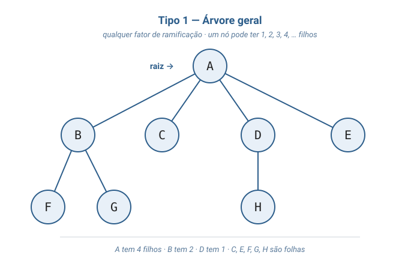

Cada nó pode ter **quantos filhos forem necessários** — 1, 2, 3, 4 ou mais. É a forma mais permissiva da estrutura. Aparece naturalmente em hierarquias do mundo real: o **sumário de um livro** (um capítulo tem várias seções; uma seção tem várias sub-seções), um **sistema de arquivos** (uma pasta tem vários arquivos e subpastas), uma **árvore genealógica** (uma pessoa pode ter vários filhos).

#### Tipo 2 — Árvore binária

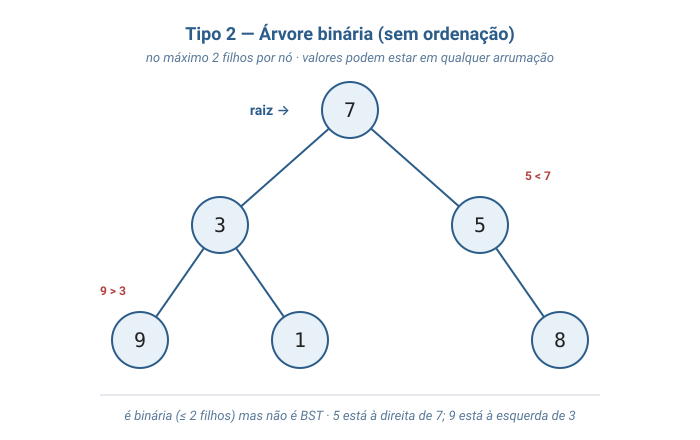

Acrescenta a restrição: **no máximo 2 filhos** por nó, distinguidos como **filho esquerdo** e **filho direito**. Note no diagrama que **ainda não é BST**: o valor `5` está à direita de `7` (deveria ser maior, mas é menor), e o valor `9` está à esquerda de `3` (deveria ser menor, mas é maior). É uma árvore binária válida, mas sem a regra de ordenação que torna a busca rápida.

#### Tipo 3 — Árvore binária de busca (BST)

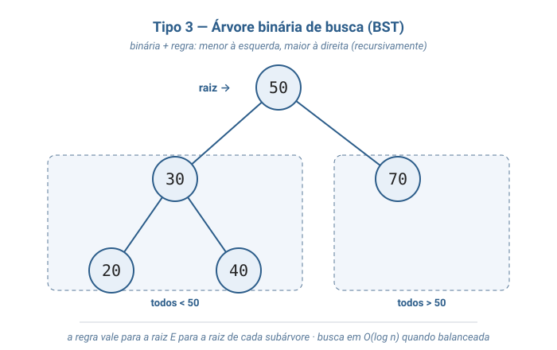

Acrescenta a regra de ordenação: para **todo** nó *x*, **todos** os valores na subárvore esquerda são menores que *x*, e **todos** na subárvore direita são maiores. A regra vale **recursivamente** — para a raiz, e para a raiz de cada subárvore. É essa regra que permite descartar metade da árvore a cada comparação durante a busca, resultando em tempo **O(log n)** quando a árvore está balanceada.

#### Tipo 4 — Árvore rubro-negra

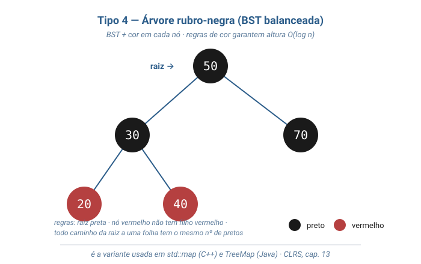

Acrescenta a cada nó uma **cor** — vermelho ou preto — com regras (raiz preta; nenhum nó vermelho tem filho vermelho; todo caminho da raiz a uma folha tem o mesmo número de nós pretos) que **garantem** altura O(log n) mesmo após inserções adversárias. Sempre que uma inserção quebra alguma regra, **rotações** locais restauram o balanceamento. É a variante usada em bibliotecas-padrão de C++ (`std::map`/`std::set`) e Java (`TreeMap`/`TreeSet`), e foi tratada formalmente no capítulo 13 do CLRS. Esta aula não implementa a rubro-negra — fica só a sinalização de que ela existe e o que ela acrescenta.

### Parte B — Ciclo de vida de uma BST

Daqui em diante, todos os passos referem-se ao **Tipo 3 (BST)**, com a representação encadeada por ponteiros que o `arvore.c` desta aula implementa.

### Passo 1: arvore_criar()

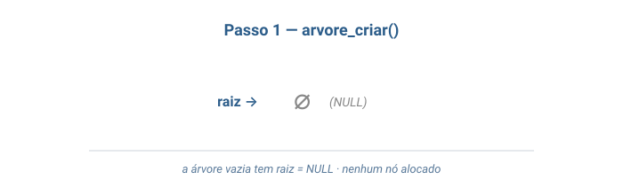

A árvore começa vazia: `raiz = NULL`. Não há nó algum sendo apontado.

### Passo 2: inserir(50)

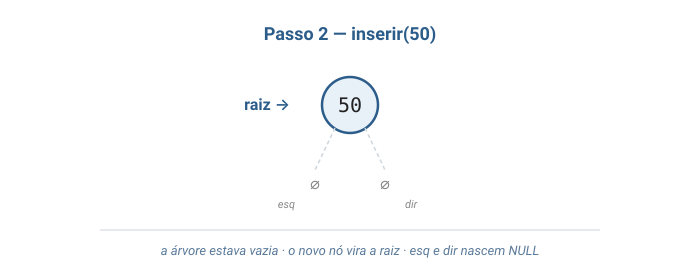

Como a árvore estava vazia, o nó novo `[50]` torna-se a raiz. Os ponteiros `esq` e `dir` do nó novo já nascem como `NULL`: o nó é folha.

### Passo 3: inserir(30)

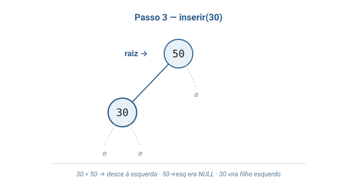

Começa-se na raiz. Como `30 < 50`, desce-se à esquerda — mas `50->esq` é `NULL`. Aloca-se o nó `[30]` e prende-se em `50->esq`. **A propriedade da BST é preservada**: o valor à esquerda é menor.

### Passo 4: inserir(70)

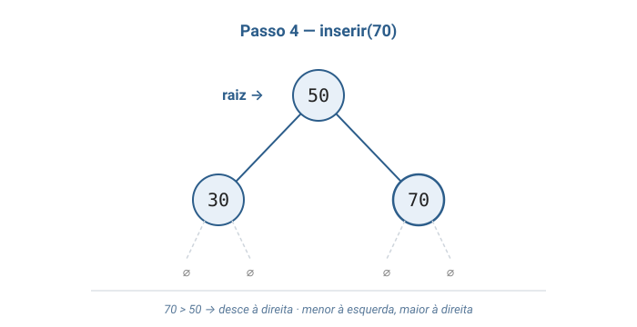

Começa-se na raiz. Como `70 > 50`, desce-se à direita — mas `50->dir` é `NULL`. Aloca-se o nó `[70]` e prende-se em `50->dir`. Agora `50` tem dois filhos e a propriedade da BST continua valendo: menor à esquerda, maior à direita.

### Passo 5: inserir(20)

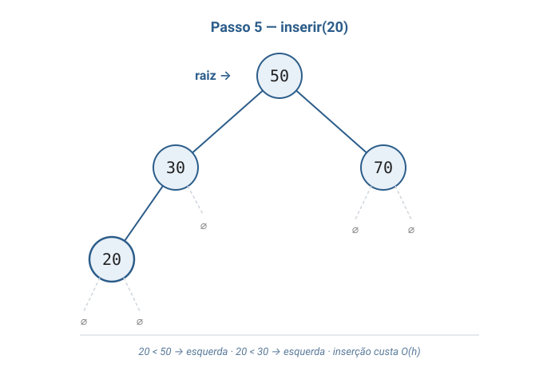

Começa-se na raiz. `20 < 50` → desce à esquerda, chega em `30`. `20 < 30` → desce de novo à esquerda, mas `30->esq` é `NULL`. Aloca-se `[20]` e prende-se ali. **A inserção custa proporcional à altura** — aqui dois passos descendo.

### Passo 6: inserir(40)

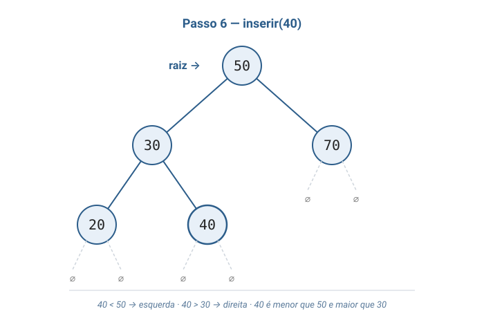

Começa-se na raiz. `40 < 50` → esquerda, chega em `30`. `40 > 30` → direita, mas `30->dir` é `NULL`. Aloca-se `[40]` e prende-se ali. Note: `40` é menor que `50` (raiz) **e** maior que `30` (pai imediato) — exatamente onde precisa estar.

### Passo 7: buscar(40)

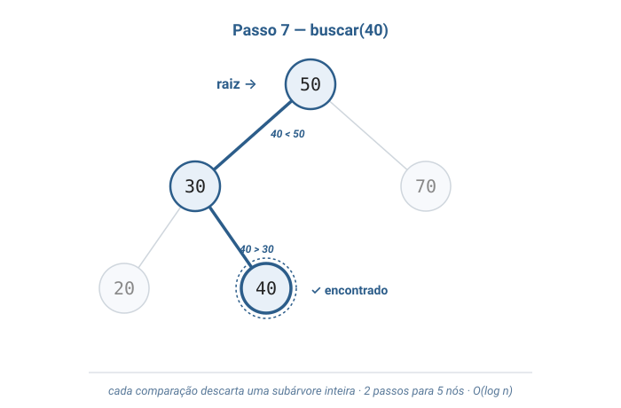

Começa-se na raiz. `40 < 50` → esquerda. `40 > 30` → direita. **Encontrado**. O caminho de busca tem comprimento 2 — cada comparação descartou uma subárvore inteira. Numa árvore com 5 nós a economia parece pequena; com milhares de nós, é a diferença entre `log₂(n)` e `n` passos.

### Passo 8: pre_ordem() → 50, 30, 20, 40, 70

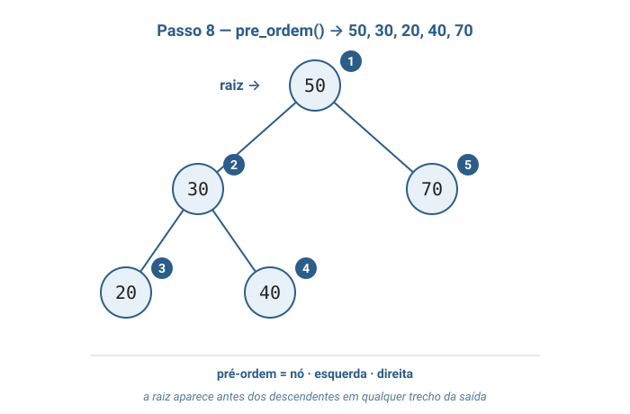

Pré-ordem: **nó, esquerda, direita**. Visita a raiz `50` primeiro, depois mergulha na subárvore esquerda (vendo `30`, depois `20`, depois `40` — também em pré-ordem) e por fim na subárvore direita (`70`). A raiz aparece sempre **antes** de seus descendentes.

### Passo 9: in_ordem() → 20, 30, 40, 50, 70

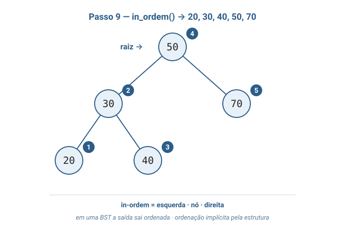

In-ordem: **esquerda, nó, direita**. Mergulha na subárvore esquerda inteira antes de visitar o nó, depois visita, depois a subárvore direita. **A saída sai ordenada** — `20, 30, 40, 50, 70`. Esse é o teorema mais célebre da BST em ação: percorrer em in-ordem é equivalente a iterar sobre os valores em ordem crescente.

### Passo 10: pos_ordem() → 20, 40, 30, 70, 50

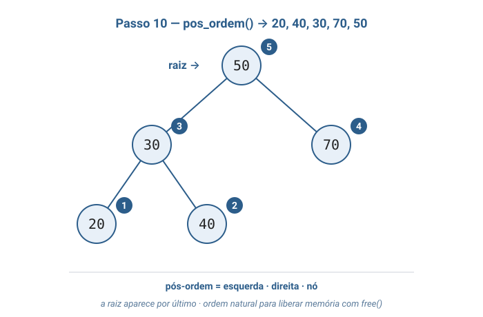

Pós-ordem: **esquerda, direita, nó**. Visita as duas subárvores antes do nó. A raiz `50` aparece **por último**, e cada nó interno (`30`) aparece depois de seus dois filhos (`20` e `40`). É a ordem natural para liberar memória: ao chegar em um nó, **seus dois filhos já foram processados**, então o `free` é seguro.

---

## 3. Problema Motivador

> *"Como o autocomplete do Google sugere palavras à medida que você digita?"*

Quando você digita "alg" na barra de pesquisa, em poucos milissegundos o Google sugere "algoritmo", "algoritmos", "algoritmos de ordenação", e assim por diante. Por trás disso está uma estrutura que precisa responder a duas perguntas com extrema rapidez: *"existem palavras que começam com o prefixo digitado?"* e *"quais são as mais relevantes?"*. Se essa busca demorasse mais que uma fração de segundo, a interface ficaria lenta a ponto de inutilizável — então a estrutura **não pode** ser uma lista que percorre tudo a cada nova letra.

A solução envolve árvores. A versão mais simples — e a que motiva esta aula — é manter o dicionário em uma **árvore binária de busca**, em que cada nó armazena uma palavra. Para checar se uma palavra está no dicionário, descemos da raiz comparando: se a palavra vem antes do nó atual no dicionário, vai-se à esquerda; se vem depois, à direita. Em uma BST com **um milhão de palavras balanceada**, a busca termina em **cerca de 20 passos** (log₂ de 1.000.000 ≈ 20). A mesma busca em uma lista percorreria, em média, 500 mil itens.

A versão real do autocomplete usa uma variante mais sofisticada — a **Trie** (mencionada na Camada 6) — porque ela é especializada em buscar por **prefixo**, não apenas por palavra exata. Mas a Trie é uma árvore. Como o **B-tree** que indexa as tabelas dos bancos de dados, e como a **rubro-negra** que ordena os contatos no seu celular. Praticamente toda busca rápida sobre dados ordenados em sistemas reais é, por baixo do capô, **alguma variante de árvore**. Entender a árvore binária de busca é entender o tijolo fundamental sobre o qual essas estruturas mais sofisticadas são construídas.

---

## 4. Analogias

**1. Árvore genealógica.**
Toda família tem um casal de bisavós no topo; eles tiveram filhos; os filhos tiveram netos; os netos tiveram bisnetos. Cada pessoa aparece uma única vez, tem **um pai** (na estrutura simplificada) e pode ter **vários filhos**. Para encontrar alguém, você desce da raiz seguindo ramos, sem nunca voltar. A árvore de dados é exatamente isso, com um detalhe: cada nó tem **no máximo dois filhos**, distinguidos como "filho esquerdo" e "filho direito".

**2. Sumário de um livro técnico.**
A capa de um livro de algoritmos lista os capítulos: 1, 2, 3, 4. Cada capítulo se divide em seções: 1.1, 1.2, 1.3. Cada seção em sub-seções: 1.1.1, 1.1.2. Essa hierarquia é uma árvore — não binária, porque um capítulo pode ter mais de duas seções, mas a ideia é a mesma. Para chegar à seção 1.1.2, você desce: livro → capítulo 1 → seção 1.1 → sub-seção 1.1.2. Nunca precisa folhear o capítulo 3 para chegar à seção 1.1.2. **A organização hierárquica torna o acesso eficiente** — é exatamente o que a BST faz com números em vez de seções.

---

## 5. Código em C

A implementação abaixo é a mais simples possível de uma BST com as operações que estudamos. Não há remoção (tema de aula futura) nem rebalanceamento — apenas criar, inserir, buscar, as três travessias e destruir.

> **Sobre a organização do arquivo.** Tudo o que vem a seguir vive em **um único arquivo** chamado `arvore.c`: `#include`s, struct do nó, struct da árvore, todas as funções da TAD e a `main()` demonstrativa. A separação em arquivo de cabeçalho (`arvore.h`) e arquivo de implementação (`arvore.c`) — isto é, o uso de *interface* explícita imposta pelo compilador — é assunto da aula futura sobre **organização de projetos em C**. Por enquanto, manter tudo num lugar só facilita ler de cima a baixo.

### `arvore.c` — arquivo único

```c
#include <stdio.h>
#include <stdlib.h>

// Cada no da arvore tem um valor e dois ponteiros para os filhos.
// Quando um filho nao existe, o ponteiro correspondente e' NULL.
typedef struct No {
    int valor;
    struct No* esq;
    struct No* dir;
} No;

// A arvore guarda apenas o ponteiro para a raiz. Toda a estrutura
// e' alcancada descendo pelos campos esq e dir a partir dela.
typedef struct Arvore {
    No* raiz;
} Arvore;

// Cria uma arvore vazia.
Arvore* arvore_criar(void) {
    Arvore* a = malloc(sizeof(Arvore));
    if (a == NULL) {
        printf("erro: memoria insuficiente\n");
        exit(1);
    }
    a->raiz = NULL;
    return a;
}

// Verdadeiro (1) se a arvore nao tem nenhum no.
int arvore_vazia(Arvore* a) {
    return a->raiz == NULL;
}

// Funcao auxiliar recursiva da insercao. Recebe a raiz de uma
// subarvore (que pode ser NULL) e o valor a inserir. Devolve a
// raiz da subarvore — possivelmente um no recem-criado.
static No* inserir_no(No* raiz, int valor) {
    // Caso base: subarvore vazia. Aloca o no novo aqui.
    if (raiz == NULL) {
        No* novo = malloc(sizeof(No));
        if (novo == NULL) {
            printf("erro: memoria insuficiente\n");
            exit(1);
        }
        novo->valor = valor;
        novo->esq = NULL;
        novo->dir = NULL;
        return novo;
    }
    // Chave ja existe — ignoramos duplicatas nesta versao.
    if (valor == raiz->valor) {
        return raiz;
    }
    // Decide o lado da descida segundo a propriedade da BST:
    // menor vai para a esquerda, maior vai para a direita.
    if (valor < raiz->valor) {
        raiz->esq = inserir_no(raiz->esq, valor);
    } else {
        raiz->dir = inserir_no(raiz->dir, valor);
    }
    return raiz;
}

// Insere um valor na arvore mantendo a propriedade da BST.
// Duplicatas sao ignoradas silenciosamente.
void arvore_inserir(Arvore* a, int valor) {
    a->raiz = inserir_no(a->raiz, valor);
}

// Funcao auxiliar recursiva da busca.
static int buscar_no(No* raiz, int valor) {
    // Caso base: chegamos a um ponteiro NULL sem encontrar.
    if (raiz == NULL) {
        return 0;
    }
    if (valor == raiz->valor) {
        return 1;
    }
    // Cada comparacao descarta metade da arvore.
    if (valor < raiz->valor) {
        return buscar_no(raiz->esq, valor);
    } else {
        return buscar_no(raiz->dir, valor);
    }
}

// Verdadeiro (1) se o valor esta na arvore.
int arvore_buscar(Arvore* a, int valor) {
    return buscar_no(a->raiz, valor);
}

// As tres travessias seguem o mesmo esqueleto recursivo
// e diferem apenas na ordem das tres linhas internas.

// Pre-ordem: no, esquerda, direita.
static void pre_ordem_no(No* raiz) {
    if (raiz == NULL) return;
    printf("%d ", raiz->valor);
    pre_ordem_no(raiz->esq);
    pre_ordem_no(raiz->dir);
}

// In-ordem: esquerda, no, direita.
// Em uma BST, esta travessia imprime os valores em ordem crescente.
static void in_ordem_no(No* raiz) {
    if (raiz == NULL) return;
    in_ordem_no(raiz->esq);
    printf("%d ", raiz->valor);
    in_ordem_no(raiz->dir);
}

// Pos-ordem: esquerda, direita, no.
// E' a ordem natural para liberar memoria — quando o no e' visitado,
// seus dois filhos ja foram visitados.
static void pos_ordem_no(No* raiz) {
    if (raiz == NULL) return;
    pos_ordem_no(raiz->esq);
    pos_ordem_no(raiz->dir);
    printf("%d ", raiz->valor);
}

void arvore_pre_ordem(Arvore* a) {
    pre_ordem_no(a->raiz);
    printf("\n");
}

void arvore_in_ordem(Arvore* a) {
    in_ordem_no(a->raiz);
    printf("\n");
}

void arvore_pos_ordem(Arvore* a) {
    pos_ordem_no(a->raiz);
    printf("\n");
}

// Funcao auxiliar recursiva que libera todos os nos da subarvore.
// Usa pos-ordem porque os filhos precisam ser liberados ANTES do pai —
// se libertarmos o pai primeiro, perdemos o caminho para os filhos.
static void destruir_no(No* raiz) {
    if (raiz == NULL) return;
    destruir_no(raiz->esq);
    destruir_no(raiz->dir);
    free(raiz);
}

// Libera toda a memoria usada pela arvore.
void arvore_destruir(Arvore* a) {
    destruir_no(a->raiz);
    free(a);
}

// Programa demonstrativo.
int main(void) {
    Arvore* a = arvore_criar();

    // Insercoes: a raiz vira 50; 30 e 70 viram filhos; 20 e 40
    // viram netos pela esquerda. A arvore final tem altura 2.
    arvore_inserir(a, 50);
    arvore_inserir(a, 30);
    arvore_inserir(a, 70);
    arvore_inserir(a, 20);
    arvore_inserir(a, 40);

    printf("Buscar 40: %s\n", arvore_buscar(a, 40) ? "encontrado" : "nao encontrado");
    printf("Buscar 99: %s\n", arvore_buscar(a, 99) ? "encontrado" : "nao encontrado");

    printf("Pre-ordem: ");
    arvore_pre_ordem(a);

    printf("In-ordem:  ");
    arvore_in_ordem(a);

    printf("Pos-ordem: ");
    arvore_pos_ordem(a);

    arvore_destruir(a);
    return 0;
}
```

### Compilando e rodando

Como tudo está em um só arquivo, a linha de compilação é direta:

```sh
gcc -Wall -Wextra -o arvore_demo arvore.c
./arvore_demo
```

Saída esperada:

```
Buscar 40: encontrado
Buscar 99: nao encontrado
Pre-ordem: 50 30 20 40 70 
In-ordem:  20 30 40 50 70 
Pos-ordem: 20 40 30 70 50 
```

A linha `In-ordem: 20 30 40 50 70` é a **prova empírica** da propriedade mais célebre da BST: os valores saem ordenados, mesmo que tenham sido inseridos numa ordem qualquer (`50, 30, 70, 20, 40`). Essa é a "ordenação implícita" que mencionamos na Camada 4 — não houve nenhuma chamada a função de ordenação; a ordem emergiu da própria estrutura da árvore mais a regra simples de descer "menor à esquerda, maior à direita" a cada inserção.

---

## 6. Exercícios Práticos

**Exercício 1 — Construa a árvore na mão.**
Considere uma árvore binária de busca vazia. Insira nesta ordem: `8, 3, 10, 1, 6, 14, 4, 7`. Desenhe a árvore resultante, indicando claramente quem é filho esquerdo e quem é filho direito de cada nó. Em seguida, escreva a saída esperada das três travessias: pré-ordem, in-ordem e pós-ordem.

*Critério de aceitação*: o desenho deve preservar a propriedade da BST (todo valor na subárvore esquerda é menor que a raiz local; todo valor na subárvore direita é maior). A in-ordem deve sair em ordem crescente.

> **Resposta mínima aceitável**
>
> ```
>          8
>        /   \
>       3    10
>      / \     \
>     1   6    14
>        / \
>       4   7
> ```
>
> - Pré-ordem: `8 3 1 6 4 7 10 14`
> - In-ordem:  `1 3 4 6 7 8 10 14`  ← ordem crescente
> - Pós-ordem: `1 4 7 6 3 14 10 8`
>
> Aplicação direta da regra "menor à esquerda, maior à direita" a cada inserção; in-ordem ordenada confirma a propriedade A7 do TAD.

**Exercício 2 — Função `arvore_contar`.**
Adicione ao `arvore.c` uma função `int arvore_contar(Arvore* a)` que devolve o número total de nós da árvore. Use uma função auxiliar recursiva no estilo das travessias. Chame a função na `main()` antes e depois das inserções e imprima o resultado.

*Critério de aceitação*: a função fica no mesmo `arvore.c`; chamada após as 5 inserções da `main()` original, deve imprimir `5`; em árvore vazia, deve imprimir `0`.

> **Resposta mínima aceitável**
>
> ```c
> static int contar_no(No* raiz) {
>     if (raiz == NULL) return 0;
>     return 1 + contar_no(raiz->esq) + contar_no(raiz->dir);
> }
>
> int arvore_contar(Arvore* a) {
>     return contar_no(a->raiz);
> }
> ```
>
> O esqueleto recursivo é o mesmo das travessias: caso base em `NULL` retorna 0; caso geral combina 1 (o próprio nó) com os resultados das duas subárvores.

**Exercício 3 — Altura da árvore.**
Adicione ao `arvore.c` uma função `int arvore_altura(Arvore* a)` que devolve a altura da árvore — comprimento, em arestas, do caminho mais longo da raiz até uma folha. Convenções: árvore vazia tem altura `-1`; árvore com só a raiz tem altura `0`. Imprima a altura na `main()` após as inserções.

*Critério de aceitação*: para a árvore do Exercício 1 (`8, 3, 10, 1, 6, 14, 4, 7`), a altura deve ser `3` (caminho `8 → 3 → 6 → 4`, com 3 arestas). Para a árvore da `main()` original (`50, 30, 70, 20, 40`), a altura deve ser `2`.

*Dica*: a altura de um nó é `1 + max(altura(esq), altura(dir))`. O caso base é o `NULL` retornando `-1`.

> **Resposta mínima aceitável**
>
> ```c
> static int max_int(int a, int b) { return a > b ? a : b; }
>
> static int altura_no(No* raiz) {
>     if (raiz == NULL) return -1;
>     return 1 + max_int(altura_no(raiz->esq), altura_no(raiz->dir));
> }
>
> int arvore_altura(Arvore* a) {
>     return altura_no(a->raiz);
> }
> ```
>
> A convenção `altura(NULL) = -1` faz com que uma folha (cujos dois filhos são `NULL`) tenha altura `1 + max(-1, -1) = 0`, como esperado.

**Exercício 4 — Demonstrando a degeneração.**
Crie no mesmo `arvore.c` uma segunda demonstração na `main()`: uma árvore vazia em que se inserem os valores **em ordem crescente** `1, 2, 3, 4, 5, 6, 7`. Imprima as três travessias dessa árvore e use a função `arvore_altura` do Exercício 3 para imprimir a altura resultante. Explique em comentário no código por que a árvore degenerou.

*Critério de aceitação*: a altura impressa deve ser `6` (sete nós em cadeia linear pela direita: `1 → 2 → 3 → 4 → 5 → 6 → 7`, com 6 arestas). A pré-ordem e a in-ordem devem coincidir (`1 2 3 4 5 6 7`); a pós-ordem deve ser o inverso (`7 6 5 4 3 2 1`).

> **Resposta mínima aceitável**
>
> ```c
> // Demonstracao 2: insercoes em ordem crescente degeneram a BST
> // em uma "lista encadeada disfarcada" pelos ponteiros direitos.
> // Cada inserir(x) compara com a raiz, vai para a direita, compara
> // com o no seguinte, vai para a direita de novo, etc.
> Arvore* b = arvore_criar();
> for (int x = 1; x <= 7; x++) arvore_inserir(b, x);
> printf("Altura (degenerada): %d\n", arvore_altura(b));  // 6
> printf("Pre-ordem: "); arvore_pre_ordem(b);  // 1 2 3 4 5 6 7
> printf("In-ordem:  "); arvore_in_ordem(b);   // 1 2 3 4 5 6 7
> printf("Pos-ordem: "); arvore_pos_ordem(b);  // 7 6 5 4 3 2 1
> arvore_destruir(b);
> ```
>
> A degeneração ilustra por que árvores **balanceadas** (AVL, rubro-negra) existem: com a inserção ingênua da BST, dados ordenados levam a `h = n − 1` e a busca volta a ser O(n).

**Exercício 5 — Verificador da propriedade da BST.**
Implemente no `arvore.c` uma função `int arvore_eh_bst(Arvore* a)` que retorna `1` se a árvore satisfaz a propriedade da BST (para todo nó, todos os valores à esquerda são menores e todos à direita são maiores) e `0` caso contrário. A função deve funcionar **mesmo se alguém tiver construído a árvore manualmente** mexendo nos ponteiros — não pode confiar que ela foi construída só por `arvore_inserir`. Para testar, monte na `main()` uma árvore manualmente inválida (ex.: um nó `5` com filho esquerdo `8`) e mostre que sua função detecta a violação.

*Dica*: a abordagem ingênua — "para cada nó, comparar com `esq->valor` e `dir->valor`" — está **errada**. A regra é *todos* os valores da subárvore esquerda, não apenas o filho imediato. A solução elegante usa uma função auxiliar que carrega, para cada subárvore, o **intervalo válido `[min, max]`** dentro do qual o valor da raiz precisa estar, restringindo o intervalo conforme desce.

> **Resposta mínima aceitável**
>
> ```c
> #include <limits.h>
>
> // A subarvore enraizada em "raiz" e' uma BST valida sse:
> //  - "raiz" e' NULL (sempre valido), OU
> //  - valor(raiz) esta em (min, max), E
> //  - a subarvore esquerda e' valida no intervalo (min, valor(raiz)), E
> //  - a subarvore direita  e' valida no intervalo (valor(raiz), max).
> static int eh_bst_no(No* raiz, int min, int max) {
>     if (raiz == NULL) return 1;
>     if (raiz->valor <= min || raiz->valor >= max) return 0;
>     return eh_bst_no(raiz->esq, min, raiz->valor)
>         && eh_bst_no(raiz->dir, raiz->valor, max);
> }
>
> int arvore_eh_bst(Arvore* a) {
>     return eh_bst_no(a->raiz, INT_MIN, INT_MAX);
> }
> ```
>
> A chave do desafio é entender que a propriedade da BST é **global**, não local: um nó `5` com filho esquerdo `4` parece ok localmente, mas se esse `5` estiver na subárvore direita de um nó `6`, a propriedade é violada pelo `4` que ficou "do lado errado" do `6`. O intervalo `[min, max]` propagado recursivamente captura exatamente essa restrição global.

---

## 7. Referências

- **Tenenbaum, A. M.; Langsam, Y.; Augenstein, M. J.** — *Estruturas de Dados Usando C*. Capítulo 5, *"Árvores"*. Apresentação completa de árvores gerais e binárias, percursos, árvores de busca binária e AVL, com código em C didático e diagramas claros. **Capítulo de cabeceira desta aula.**

- **Sedgewick, R.** — *Algoritmos em C*, Parte 3 (capítulos introdutórios sobre árvores) e Parte 4 (BSTs e BSTs balanceadas). Tratamento elegante das travessias e análise probabilística da altura média de BSTs construídas por inserções aleatórias.

**Leituras complementares**:

- **Cormen, Leiserson, Rivest, Stein (CLRS)** — *Algoritmos: Teoria e Prática*. Capítulo 12, *"Árvores de busca binária"* — rigor formal sobre BSTs, demonstração da altura esperada O(log n) para inserções aleatórias. Capítulo 13, *"Árvores rubro-negras"* — tratamento canônico da variante balanceada usada em bibliotecas-padrão. Capítulo 18, *"B-trees"* — generalização para muitos filhos por nó, usada em bancos de dados.

- **Ziviani, N.** — *Projeto de Algoritmos com Implementações em Pascal e C*. Capítulo de árvores — útil para contraste e exemplos adicionais em PT-BR.

- **Knuth, D.** — *The Art of Computer Programming*, vol. 1, seção 2.3 — *"Trees"*. Referência histórica abrangente sobre árvores em geral, incluindo a notação formal e os primeiros usos das travessias.

- **Adelson-Velsky, G.; Landis, E.** (1962) — *"An algorithm for the organization of information"*. Artigo original da árvore AVL — primeira BST com balanceamento garantido. Citado em todos os livros acima.
